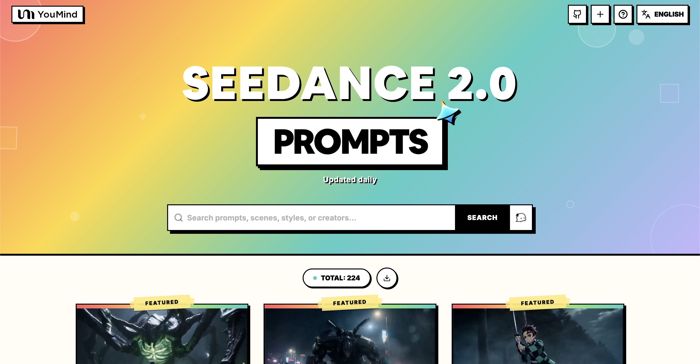

[](README.md) [](README_zh.md) [](README_zh-TW.md) [](README_ja-JP.md) [](README_ko-KR.md) [](README_th-TH.md) [](README_vi-VN.md) [](README_hi-IN.md) [](README_es-ES.md) [-Click%20to%20View-lightgrey)](README_es-419.md) [](README_de-DE.md) [](README_fr-FR.md) [](README_it-IT.md) [-Click%20to%20View-lightgrey)](README_pt-BR.md) [](README_pt-PT.md) [](README_tr-TR.md)

---

# 🎬 Prompts de Vídeo Seedance 2.0 Incríveis

[](https://awesome.re)
[](https://github.com/YouMind-OpenLab/awesome-seedance-2-prompts)
[](https://creativecommons.org/licenses/by/4.0/)
[](https://github.com/YouMind-OpenLab/awesome-seedance-2-prompts/pulls)

Uma coleção curada de prompts de geração de vídeo de alta qualidade para o Seedance 2.0 da ByteDance

> ⚠️ **Aviso de Direitos Autorais**: Todos os prompts são coletados da comunidade para fins educacionais. Se você acredita que algum conteúdo infringe seus direitos, por favor [abra uma issue](https://github.com/YouMind-OpenLab/awesome-seedance-2-prompts/issues/new) e nós o removeremos prontamente.

---

## 📖 Índice

- [🌐 Ver na galeria web](#-ver-na-galeria-web)
- [🤔 O que é Seedance 2.0?](#-o-que-seedance-20)
- [📊 Estatísticas](#-estatsticas)
- [⭐ Prompts em destaque](#-prompts-em-destaque)
- [🎬 Todos os prompts](#-todos-os-prompts)
- [🤝 Como contribuir](#-como-contribuir)
- [📄 Licença](#-licena)
- [🙏 Agradecimentos](#-agradecimentos)
- [⭐ Histórico de estrelas](#-histrico-de-estrelas)

---

## 🌐 Ver na galeria web

<div align="center">



</div>

**[👉 Navegar por todos os prompts Seedance 2.0 no YouMind](https://youmind.com/pt-PT/seedance-2-0-prompts)**

Por que usar nossa galeria?

| Feature | GitHub README | Galeria youmind.com |
|---------|--------------|---------------------|
| 🎬 Reprodução de vídeo | ❌ Apenas miniaturas estáticas | ✅ Reprodução completa com streaming |
| 🔍 Buscar | Apenas Ctrl+F | Busca fuzzy multicampo |
| 🤖 Recomendação IA | - | Recomendações de prompts com IA |
| 📱 Móvel | Básico | Totalmente responsivo |

---

## 🤔 O que é Seedance 2.0?

**Seedance 2.0** é um modelo de geração de vídeo desenvolvido pela **ByteDance**. É o primeiro modelo da indústria que suporta **entrada quádrupla modal simultânea** — imagem, vídeo, áudio e texto.

**Key Features:**
- 🎥 **Texto para Vídeo** — Gerar vídeos a partir de descrições de texto
- 🖼️ **Imagem para Vídeo** — Animar imagens estáticas em vídeos dinâmicos
- 📹 **Vídeo para Vídeo** — Transformar e estender vídeos existentes
- 🎵 **Dirigido por Áudio** — Gerar vídeos dirigidos por entrada de áudio
- 📐 **Até resolução 1080p**, duração de 4-15 segundos
- 🔊 **Dublagem e pontuação automáticas** — Narração automática e música de fundo

---

## 📊 Estatísticas

| Métrica | Contagem |
|--------|-------|
| 📝 Total de prompts | **3817** |
| ⭐ Prompts em destaque | **6** |
| 🔄 Última atualização | **2026-06-10** |

---

## 🔥 Prompts em destaque

> ⭐ Prompts selecionados com resultados excepcionais

### No. 1: Seedance 2.0: Curta-metragem Cinematográfica de Romance Japonês de 15 Segundos


#### 📖 Descrição

Um prompt altamente detalhado e multiscenas de 15 segundos para o Seedance 2.0, projetado para gerar um curta-metragem cinematográfico e ultrarrealista de amor puro em uma escola japonesa. O prompt especifica o cenário da cena (sala de aula vazia, luz solar dourada e quente, partículas de poeira), movimentos de câmera, consistência dos personagens (sem deformação/desvio), microexpressões sutis, movimentos sincronizados de respiração/lábios, diálogo e efeitos sonoros (cigarras, caneta arranhando, batimento cardíaco de baixa frequência, piano suave). A narrativa foca na tensão emocional intensa, desajeitada e íntima entre uma garota escrevendo e um garoto observando-a secretamente, culminando em um confronto tímido.

#### 📝 Prompt

```
Curta-metragem de 15 segundos, drama japonês cinematográfico, puro amor ambíguo, qualidade ultrarrealista, luz solar dourada e quente em uma sala de aula vazia à tarde, derramando-se pelas persianas sobre as carteiras lado a lado, finas partículas de poeira flutuando lentamente nos feixes de luz, carteiras de madeira antigas, movimentos sutis extremamente naturais, respiração e tensão ocular, personagens mantêm rostos, roupas e penteados consistentes sem deformação, desvio ou artefatos, leve subida e descida do peito sincronizada com a respiração, profundidade de campo rasa, fundo cremoso e desfocado, granulação de filme quente, 8K nítido, atmosfera sufocante de palpitações cardíacas contidas da juventude japonesa.
0-4 segundos: Movimento de câmera extremamente lento, de um plano médio da carteira para um close-up dos perfis das duas pessoas sentadas lado a lado. Uma garota pura em uniforme escolar de verão está concentrada em escrever anotações com a cabeça baixa, cabelos pretos longos e fios soltos perto das orelhas são suavemente levantados por uma leve brisa, cílios longos projetam sombras sutis, a pele é naturalmente rosada e macia, um leve e involuntário levantar do canto da boca em concentração, respiração leve e uniforme.
4-9 segundos: Muda para um close-up do garoto. A gola de seu uniforme escolar está ligeiramente solta, ele apoia o cotovelo na carteira e secretamente vira a cabeça para olhá-la, seus olhos cheios de afeto e ternura gentis e contidos, pupilas ligeiramente dilatadas, seu pomo de Adão rola suavemente. De repente, percebendo a caneta dela parar, ele rapidamente e de forma atrapalhada vira a cabeça para fingir que está olhando suas próprias anotações, seus lóbulos das orelhas rapidamente ficam ligeiramente vermelhos, as pontas dos dedos tremem ligeiramente enquanto ele segura a caneta, ocasionalmente olhando para ela por baixo de sua franja, sua respiração está ligeiramente desordenada, e seus lábios estão firmemente apertados em um esforço para permanecer calmo.
9-15 segundos: Close-up extremo de ambos os rostos no mesmo quadro, olhos em câmera lenta se encontram de repente: a garota vira lentamente a cabeça, primeiro mostrando uma surpresa atordoada, depois rapidamente e timidamente abaixa a cabeça por 0,3 segundos, mordendo suavemente o lábio inferior, suas bochechas e lóbulos das orelhas instantaneamente florescem com um rosa cerejeira, seus cílios úmidos olham timidamente para cima para encontrar o olhar dele novamente, enquanto sussurra suavemente e timidamente, "...O que você está olhando?"; o garoto congela completamente, suas pupilas dilatam, e ele fica atordoado por 0,4 segundos, então atrapalhadamente e silenciosamente gagueja em resposta, "N-nada...". A garota sussurra ainda mais baixo, mordendo o lábio e espiando-o novamente, continuando a sussurrar, "...Mentiroso.". O garoto pausa, então suspira suavemente e sussurra, "...Só estou olhando para você.", o canto de sua boca se curva lentamente em um sorriso tímido, gentil e torto, linhas finas aparecem nos cantos de seus olhos, e sua respiração se aprofunda visivelmente. Uma corrente invisível parece puxar a tensão ambígua entre seus rostos, compartilhando a temperatura da respiração um do outro, o fundo se dissolve completamente em camadas de manchas de luz cremosas e sonhadoras, halos quentes e finas partículas de ar.
A sincronização labial é natural e precisa, microtremores emocionais e respiração são sincronizados, o diálogo é um sussurro de baixa energia com um tom tímido, pausas curtas naturais entre 200-400 milissegundos, a boca se move apenas ligeiramente ao falar, sem exagero ou sensação robótica, perfeita sincronização labial natural e autenticidade emocional.
Efeitos Sonoros Gerais: Chirrido fraco de cigarras de verão distantes, o som suave do arranhar da caneta no papel, o pulso de baixa frequência quase inaudível de seus batimentos cardíacos, finalmente desaparecendo em um piano muito leve e etéreo. O diálogo é completamente integrado naturalmente na cena como sussurros, a voz da garota é suave e tímida, o garoto transita de gagueira atrapalhada para gentil.
A identidade dos personagens é mantida em todo o filme, inclinações sutis da cabeça, movimentos dos olhos e sincronização da respiração, sem texto, marcas d'água ou legendas, puro estilo japonês de paixão secreta juvenil com suspense e palpitações.
```

#### 🎬 Vídeo

<div align="center">

<a href="https://github.com/YouMind-OpenLab/awesome-seedance-2-prompts/releases/download/videos/1402.mp4">

</a>

📥 *Clique na imagem para baixar o vídeo* | **[🎬 Assistir vídeo →](https://youmind.com/pt-PT/seedance-2-0-prompts?id=1402)**

</div>

#### 📌 Detalhes

- **Autor:** [AIGC｜阳家豪](https://x.com/JiahaoYang_art)
- **Fonte:** [Twitter Post](https://x.com/JiahaoYang_art/status/2033119940216344616)
- **Publicado:** March 15, 2026

**[👉 Experimente agora →](https://youmind.com/pt-PT/seedance-2-0-prompts?id=1402)**

---

### No. 2: Hollywood Alta Costura Fantasia Vídeo Prompt


#### 📖 Descrição

Um prompt detalhado de geração de vídeo com múltiplas cenas para o Seedance 2.0, projetado para criar um filme de fantasia de alta costura de Hollywood. O prompt especifica o estilo, a resolução (8K), o motor de renderização (Unreal Engine 5), a duração (15 segundos) e três sequências distintas de câmera/ação envolvendo uma modelo em porcelana líquida azul e branca que se estilhaça em andorinhas de tinta aguada, culminando em um vórtice de tinta fluida 3D.

#### 📝 Prompt

```
[Estilo] Superprodução de fantasia de alta costura de Hollywood, 8K ultra nítido, fotorrealista, estilo editorial de alta moda, renderização fluida Unreal Engine 5, ilusão visual. [Duração] 15 segundos. [Cena] Uma planície de sal infinita e real de Salar de Uyuni (Espelho do Céu). O céu está repleto de nuvens escuras opressivas, e o chão reflete perfeitamente tudo como um espelho, com a imagem geral apresentando um tom minimalista e frio. [00:00-00:05] Cena 1: Entrada de Alta Costura e Pele de Porcelana. Posição da câmera: Tomada de ângulo extremamente baixo para cima, zoom de lente ultratelefoto. Ação: Uma modelo asiática com um rosto de alta moda altamente reconhecível caminha friamente sobre a superfície da água. Efeito: Ela não está vestindo tecido, mas um vestido longo feito de porcelana fluida e real Azul e Branca. Enquanto ela caminha, a saia emite um som de colisão nítido como cerâmica real, com um brilho fluido na superfície. Os padrões tradicionais azuis e brancos movem-se pela saia com textura de porcelana branca como se estivessem vivos. [00:05-00:10] Cena 2: Estilhaçamento Físico e Descida de Tinta. Posição da câmera: Close-up extremo do rosto, foco recua rapidamente. Ação: A modelo para de repente, olha friamente para a câmera e estala os dedos nitidamente. Efeito: No momento em que os dedos estalam, seu vestido de porcelana azul e branca não cai, mas explode instantaneamente em milhares de Andorinhas de Tinta extremamente fotorrealistas. Essas andorinhas carregam gotas de água reais e marcas de tinta, arrastando rastros fluidos pretos no ar, girando freneticamente ao redor dela. [00:10-00:15] Cena 3: Dissolução Dimensional e Reflexo do Abismo. Posição da câmera: Tomada aérea de alta altitude, a câmera gira e desce rapidamente. Ação: O enxame de andorinhas de tinta mergulha na água espelhada do lago sob os pés da modelo. Efeito: A tensão superficial do lago de sal originalmente sólido desaparece instantaneamente. O mundo extremamente realista inteiro começa a sangrar e se dissolver violentamente como tinta concentrada caindo em água limpa. As nuvens escuras reais e a figura da modelo se transformam inteiramente em um Vórtice de Tinta Fluida 3D extremamente grandioso, engolindo completamente a câmera em um abismo entrelaçado em preto e branco.
```

#### 🎬 Vídeo

<div align="center">

<a href="https://github.com/YouMind-OpenLab/awesome-seedance-2-prompts/releases/download/videos/594.mp4">

</a>

📥 *Clique na imagem para baixar o vídeo* | **[🎬 Assistir vídeo →](https://youmind.com/pt-PT/seedance-2-0-prompts?id=594)**

</div>

#### 📌 Detalhes

- **Autor:** [John](https://x.com/johnAGI168)
- **Fonte:** [Twitter Post](https://x.com/johnAGI168/status/2025849650654122348)
- **Publicado:** February 23, 2026

**[👉 Experimente agora →](https://youmind.com/pt-PT/seedance-2-0-prompts?id=594)**

---

### No. 3: Prompt de vídeo de curta-metragem de estética rural moderna e curativa


#### 📖 Descrição

Um prompt detalhado de três tomadas para o Seedance 2.0 gerar um curta-metragem cinematográfico e curativo no estilo Estética Rural Moderna. Ele especifica o estilo (Comercial Cinematográfico, 4K/8K, Macro Extremo, luz natural, ASMR), o cenário (uma cozinha moderna e aberta com vista para o jardim), o personagem (um criador focado em linho) e ações específicas para três cenas: colher um tomate, corte preciso e um momento tranquilo de refeição.

#### 📝 Prompt

```
[Estilo]
Estética rural moderna, qualidade de comercial cinematográfico, filmado com Sony A7S3/câmera de cinema, 4K/8K ultra nítido, Extreme Macro, iluminação natural transparente, ASMR curativo, sem sensação de drama de época.

[Cena]
Uma cozinha moderna de fazenda bem cuidada e aberta, o fundo é uma horta exuberante, sol brilhante.

[Personagem]
Criadora Rural Moderna, cabelo preto comprido preso casualmente com um grampo de madeira, vestindo uma roupa de linho azul escuro confortável, maquiagem leve, olhos focados e serenos.

[Detalhes da Cena]
[00:00-00:05] Cena 1: Colheita Matinal (O Frescor)
Visuais: Close-up de alta definição. A luz do sol da manhã atinge as plantas com contraluz lateral.
Ação: As mãos nuas da Criadora (dedos longos e limpos) colhem um tomate vermelho brilhante com gotas de orvalho cintilantes da videira.
Detalhes: Foco extremamente nítido, mostrando claramente a penugem na superfície do tomate e a trajetória das gotas de água escorregando. O fundo é um verde de alta qualidade desfocado.

[00:05-00:10] Cena 2: Artesanato Extremo (A Arte)
Visuais: Área do fogão interna, cheia de vida, mas impecável.
Ação: A Criadora está cortando vegetais, os movimentos são habilidosos e precisos (natureza não performática).
Detalhes: Lente macro captura o momento em que a lâmina da faca corta os ingredientes, o suco espirrando. Em seguida, muda para a chama laranja tremeluzindo no fogão de barro, luz e sombra são quentes e reais.

[00:10-00:15] Cena 3: Tempo Tranquilo (O Momento)
Visuais: Plano geral/Plano médio.
Ação: Um delicado prato caseiro é colocado na longa mesa de madeira no quintal. A Criadora senta-se tranquilamente, ajeita suavemente um fio de cabelo solto e pega um pedaço de comida.
Atmosfera: O vapor sobe lentamente contra a contraluz, a cena é tão silenciosa que quase se pode ouvir o vento, mostrando a sensação máxima de relaxamento que as pessoas modernas anseiam.
```

#### 🎬 Vídeo

<div align="center">

<a href="https://github.com/YouMind-OpenLab/awesome-seedance-2-prompts/releases/download/videos/288.mp4">

</a>

📥 *Clique na imagem para baixar o vídeo* | **[🎬 Assistir vídeo →](https://youmind.com/pt-PT/seedance-2-0-prompts?id=288)**

</div>

#### 📌 Detalhes

- **Autor:** [John](https://x.com/johnAGI168)
- **Fonte:** [Twitter Post](https://x.com/johnAGI168/status/2021818021354848258)
- **Publicado:** February 12, 2026

**[👉 Experimente agora →](https://youmind.com/pt-PT/seedance-2-0-prompts?id=288)**

---

### No. 4: Prompt de Batalha Live-Action de Demon Slayer para Seedance 2.0


#### 📖 Descrição

Um prompt de vídeo detalhado e de alta energia para o Seedance 2.0, gerando uma adaptação live-action de 15 segundos de uma batalha no estilo Demon Slayer (Respiração da Água vs. Respiração do Trovão). O prompt especifica o estilo (adaptação live-action de mangá de Hollywood, samurai sombrio, 4K, cortes rápidos extremos, efeitos de luz de partículas), o cenário (floresta nebulosa à noite) e três tomadas distintas detalhando as ações dos personagens, sequências de power-up e o confronto final.

#### 📝 Prompt

```
Adaptação Live-Action de Mangá · Batalha Decisiva de Estilo de Respiração (15 segundos · Versão de Efeitos Especiais Ultra-Incandescentes)
【Foco Principal】: Respiração da Água (Dragão de Água Azul) VS Respiração do Trovão (Relâmpago Dourado), duelo live-action de velocidade extrema.
【Estilo】: Qualidade de filme de adaptação live-action de mangá de Hollywood, estilo samurai sombrio, 4K ultra-nítido, cortes rápidos extremos, explosão de efeitos de luz de partículas, sem sangue.
【Duração】: 15 segundos
【Cena】: Floresta nebulosa sob o luar, chão lamacento, folhas caindo.
[00:00-00:05] Cena 1: Prelúdio da Melodia da Água · Forma Inicial (Sensação de Carregamento)
Visuais: Um jovem samurai vestindo um haori (jaqueta) xadrez verde e preto, abaixa seu centro de gravidade sob o luar, segurando sua espada com as duas mãos.
Ação: Ele respira fundo, e o ar ao redor solidifica instantaneamente. Ao desembainhar sua espada, um dragão de água azul gigante, condensado de um fluxo de água de alta pressão, aparece do nada, girando rapidamente em torno de seu corpo e lâmina, emitindo o rugido da água corrente.
Detalhes dos Efeitos Especiais: O fluxo de água tem uma sensação realista de respingo, iluminando a floresta escura.
[00:05-00:10] Cena 2: Flash do Trovão · Avanço (Sensação de Velocidade Extrema)
Visuais: O oponente à sua frente, um espadachim loiro vestindo um haori com padrão triangular amarelo, abaixa seu corpo extremamente, assumindo a postura de um Iaijutsu (técnica de desembainhar a espada).
Ação: O chão explode de repente. Seu corpo inteiro se transforma instantaneamente em um rastro de relâmpago dourado deslumbrante, refratando e avançando rapidamente em forma de 'Z' através das árvores a uma velocidade invisível a olho nu.
Detalhes dos Efeitos Especiais: Arcos elétricos dourados e folhas caídas queimadas permanecem nos lugares por onde ele passa.
[00:10-00:15] Cena 3: Colisão Água-Trovão · Som Final (Confronto de Golpes Finais)
Visuais: Colisão frontal de velocidade extrema. O jovem samurai balança o dragão de água azul gigante para encontrar o ataque, e o espadachim loiro, transformado em relâmpago, colide com ele.
Ação: As duas espadas colidem violentamente no centro do quadro.
Espetáculo de Efeitos Especiais: O dragão de água azul e o relâmpago dourado explodem instantaneamente, formando uma enorme tempestade de energia de água-trovão que se espalha para fora. As grandes árvores ao redor são partidas ao meio pela onda de energia, e lama, água e luz obscurecem a câmera. A cena termina em uma luz azul, amarela e branca extremamente deslumbrante.
```

#### 🎬 Vídeo

<div align="center">

<a href="https://github.com/YouMind-OpenLab/awesome-seedance-2-prompts/releases/download/videos/189.mp4">

</a>

📥 *Clique na imagem para baixar o vídeo* | **[🎬 Assistir vídeo →](https://youmind.com/pt-PT/seedance-2-0-prompts?id=189)**

</div>

#### 📌 Detalhes

- **Autor:** [John](https://x.com/johnAGI168)
- **Fonte:** [Twitter Post](https://x.com/johnAGI168/status/2021610292979876208)
- **Publicado:** February 11, 2026

**[👉 Experimente agora →](https://youmind.com/pt-PT/seedance-2-0-prompts?id=189)**

---

### No. 5: Seedance 2.0: MV de Rapper de 80 Anos


#### 📖 Descrição

Um prompt detalhado de 15 segundos para o Seedance 2.0 gerar um videoclipe (MV) de rap de rua horizontal em 16:9, apresentando uma senhora de 80 anos. O prompt especifica o estilo (tons frios de azul/roxo neon, atmosfera explosiva), a aparência da personagem (cabelo prateado, jaqueta de couro, acessórios de hip-hop), a divisão da cena (0-3s introdução, 3-7s rap, 7-11s dança, 11-15s clímax/conclusão), letras de rap específicas, técnicas de câmera (ângulo baixo, rotação de 360 graus, cortes rápidos) e design de som (música eletrônica Trap, bateria 808 pesada).

#### 📝 Prompt

```
Tela horizontal 16:9, estilo MV de rap de rua, tons frios de néon roxo e azul, atmosfera explosiva, legal e feroz. 0-3 segundos: Plano médio com aproximação, cena noturna de rua da cidade com luzes de néon piscando, uma mulher de 80 anos com cabelos prateados está em frente a uma parede de grafite, cabelo curto prateado-branco penteado para trás de forma elegante, contorno facial quadrado distinto, sobrancelhas em forma de espada inclinadas em direção às têmporas, olhos afiados como eletricidade, rugas nos cantos dos olhos como distintivos do tempo, um sorriso confiante no canto da boca, vestindo uma jaqueta de couro preta sobre uma camiseta branca estampada (grandes letras pretas "YOLO" no peito) + calças cargo pretas + tênis brancos de cano alto, um colar de corrente de ouro grosso em volta do pescoço, pulseira de prata no pulso, segurando um microfone com as duas mãos, batidas fortes de bateria da BGM começam, os olhos da velha se aguçam e seus lábios se abrem para começar a fazer Rap. 3-7 segundos: Plano médio + troca para close-up, a velha começa a fazer rap, com um senso de ritmo extremamente forte, seus cabelos prateados voando com os movimentos de balançar a cabeça, uma mão segurando o microfone, a outra mão fazendo gestos para acompanhar o ritmo — dedo indicador apontando para a câmera, palma cortando o ritmo para cima e para baixo, fazendo gestos de hip-hop, movimentos suaves e fluidos, olhos afiados e olhando diretamente para a câmera, rugas saltando vividamente com sua expressão, lábios abrindo e fechando rapidamente para soltar as letras: [Letras de Rap] "Pernas de oitenta anos, podem pular melhor que você! Cabelos prateados fluindo, este é o meu orgulho! Não me chame de velha, meu Flow é melhor que o seu, quando você estava brincando de rap, eu estava ouvindo disco!" (Velocidade rápida, ritmo forte, atitude feroz) Cortes rápidos: close-ups faciais, movimentos das mãos, balançar do corpo inteiro, silhuetas laterais, sincronizados com a batida da BGM. 7-11 segundos: Segmento de dança, a câmera se afasta para mostrar o corpo inteiro, a velha começa a dançar — primeiro o clássico bounce de hip-hop, depois um freeze de street dance elegante, seguido por uma onda corporal transmitindo dos ombros aos dedos dos pés, e então um rápido trabalho de pés, movimentos limpos e nítidos, cabelos prateados voam sob as luzes de néon, a jaqueta de couro flutua no ar, ela continua a fazer Rap enquanto dança: [Letras de Rap] "Pernas e pés ágeis, a velocidade não é lenta, minhas letras são esculpidas no tempo! Você brinca com telefones, eu brinco com batidas, oitenta anos de vida, escritos neste verso!" (Ritmo mais rápido, tom mais forte) Plano ascendente de baixo ângulo + tomada de 360 graus, capturando os movimentos de dança legais e ferozes da velha. 11-15 segundos: Final do clímax, a velha faz uma virada legal, seus cabelos prateados formam um arco no ar, ela encara a câmera e faz um gesto de "shhh" com o dedo, então seus lábios se aproximam do microfone, cantando a última linha com uma voz baixa e magnética: [Letras da Realidade] "O tempo nunca derrota uma beleza, eu apenas mudei a forma como experimento a juventude..." (Ritmo lento, emoção profunda, final persistente) A câmera se aproxima lentamente para um close-up dos olhos da velha, as rugas nos cantos dos olhos são todas histórias, seu olhar ainda é afiado, mas com um toque de gentileza, a BGM para abruptamente no clímax, o quadro congela no sorriso legal, mas ligeiramente gentil da velha, vinheta + halo de luz néon roxa.
```

#### 🎬 Vídeo

<div align="center">

<a href="https://github.com/YouMind-OpenLab/awesome-seedance-2-prompts/releases/download/videos/1403.mp4">

</a>

📥 *Clique na imagem para baixar o vídeo* | **[🎬 Assistir vídeo →](https://youmind.com/pt-PT/seedance-2-0-prompts?id=1403)**

</div>

#### 📌 Detalhes

- **Autor:** [松果先森](https://x.com/songguoxiansen)
- **Fonte:** [Twitter Post](https://x.com/songguoxiansen/status/2033175478765289598)
- **Publicado:** March 15, 2026

**[👉 Experimente agora →](https://youmind.com/pt-PT/seedance-2-0-prompts?id=1403)**

---

### No. 6: Prompt para Sequência Cinematográfica de Corrida de Rua


#### 📖 Descrição

Um prompt detalhado para gerar uma sequência cinematográfica de corrida de rua à noite usando o Seedance 2.0, especificando movimentos de câmera, tempo das cenas (0-12s), detalhes do ambiente e o estilo visual desejado (inspirado em Velozes e Furiosos).

#### 📝 Prompt

```
sequência cinematográfica de corrida de rua à noite, um motorista focado dentro de um carro de alta performance segura o volante, olhar intenso, luzes da cidade refletindo no para-brisa, tensão aumentando antes da aceleração repentina

câmera: sistema rápido de múltiplos ângulos com transições fluidas, close-up interno → sobre o ombro → rastreamento externo → tomadas baixas no solo, movimento de câmera ultra dinâmico, whip pans + transições de speed ramp + cortes com máscara de desfoque de movimento, ilusão de fluxo contínuo

(0-2s) close-up interno no motorista, mão aperta a alavanca de câmbio, respiração sutil, luzes do painel brilhando
(2-4s) tomada sobre o ombro, estrada à frente se estendendo para a cidade iluminada por neon, vibração do motor aumentando
(4-6s) close-up extremo no dedo pressionando o botão de NOS, reação de ignição instantânea
(6-8s) aceleração explosiva, a câmera muda para uma tomada de rastreamento lateral externa, o carro dispara para frente com um aumento violento de velocidade
(8-10s) tomada ultra baixa no solo próximo ao asfalto, rodas girando em velocidade extrema, ambiente passando como um borrão
(10-12s) perseguição em alta velocidade por ruas estreitas, curvas fechadas, a câmera faz whip pans entre os ângulos, reflexos e rastros de luz realçando a velocidade

Ambiente urbano noturno denso, asfalto molhado refletindo luzes neon, passagens em túneis, postes de luz criando rastros, atmosfera de cidade em alta velocidade
Ultra realista, energia inspirada em Velozes e Furiosos, iluminação fotorrealista, desfoque de movimento intenso, reflexos neon de alto contraste, profundidade de campo cinematográfica, sensação extrema de velocidade, transições fluidas, sem distorção, sem estiramento
```

#### 🎬 Vídeo

<div align="center">


**[🎬 Assistir vídeo →](https://youmind.com/pt-PT/seedance-2-0-prompts?id=2530)**

</div>

#### 📌 Detalhes

- **Autor:** [Pierrick Chevallier | IA](https://x.com/CharaspowerAI)
- **Fonte:** [Twitter Post](https://x.com/CharaspowerAI/status/2039651574297792688)
- **Publicado:** April 2, 2026

**[👉 Experimente agora →](https://youmind.com/pt-PT/seedance-2-0-prompts?id=2530)**

---

---

## 🎬 Todos os prompts

> 📝 Ordenado por data de publicação (mais recente primeiro)

### Samurai quebrando moldura de quadro


> Um prompt de geração de vídeo otimizado para o Seedance que retrata um samurai japonês quebrando uma moldura de quadro com um golpe de espada e efeitos de fumaça.

#### 📝 Prompt

```
Um samurai japonês balança uma espada e o lado direito da moldura do quadro quebra. O samurai sai de dentro enquanto emite fumaça preta. Um samurai japonês balança uma espada. A moldura direita do quadro quebra. Além da moldura, o samurai sai para a direita enquanto emite fumaça preta. sem texto, sem mudança de corte, sem mudança de personagem.
```


**[🎬 Assistir vídeo →](https://youmind.com/pt-PT/seedance-2-0-prompts?id=5879)**

**Autor:** [돈미새](https://x.com/cso6709) | **Fonte:** [Link](https://x.com/cso6709/status/2064557266066649169) | **Publicado:** Jun 10, 2026

---
### Transição de Cidade Subaquática em Estilo Anime


> Um prompt dinâmico em estilo anime japonês apresentando uma cidade subaquática de criaturas marinhas antropomórficas em transição para uma praia havaiana com gatos.

#### 📝 Prompt

```
Animação japonesa colorida. Vídeo cinematográfico de alta velocidade ambientado em uma cidade subaquática grandiosa e fantástica. Arranha-céus de coral coloridos, postes de luz em formato de águas-vivas bioluminescentes e estradas subaquáticas transparentes. Inúmeros peixes, camarões, caranguejos e cavalos-marinhos caminham vestidos como humanos, pilotando barcos voadores subaquáticos retrô-futuristas e scooters de mergulho. A câmera percorre a cidade subaquática com planos de movimento ultra-rápidos (whip pan), capturando a vida vibrante de seus habitantes.

Eventualmente, chega a uma área cercada por enormes muralhas de castelo antigas. No centro de uma parede de pedra coberta de musgo e suja, há um portão de madeira gigante. Em frente ao portão, um polvo porteiro e cobrador de ingressos permanece sem expressão. O polvo usa um uniforme antiquado de condutor/cobrador e empurra silenciosamente o portão de madeira gigante. A câmera entra na abertura em velocidade vertiginosa.

No momento em que atravessa o portão, o mundo se transforma completamente. A água do mar recua instantaneamente em uma grande transição. Sol deslumbrante, céu azul e palmeiras balançando. É um animado bar de praia havaiano. Na areia branca banhada pelo sol, gatos de sunga aproveitam um vôlei de praia com gritos animados. Coquetéis coloridos, pranchas de surfe, decorações tropicais, ukuleles alegres e apresentações de jazz de verão.

Então, um gato laranja gigante e gordinho entra no quadro pelo lado direito. O gato laranja usa um colar de conchas e segura um coquetel tropical azul em uma das patas. Ele se aproxima da câmera com uma carranca e uma expressão de raiva. Close-up extremo. O gato laranja encara o público e grita em inglês: "Bro, where is your ticket?"

Imediatamente depois, o gato laranja levanta o punho e desfere um soco poderoso em direção à câmera. A tela treme violentamente com o impacto. Ruído digital, falhas e sons de interferência de sinal como se o vídeo estivesse corrompido. Com um intenso ruído eletrônico, a tela fica completamente preta. Aventura cinematográfica, bem-humorada e imprevisível, movimento de câmera dinâmico, qualidade de animação de nível de filme, detalhes ambientais ricos, cores vivas e uma sensação avassaladora de velocidade.
```


**[🎬 Assistir vídeo →](https://youmind.com/pt-PT/seedance-2-0-prompts?id=5855)**

**Autor:** [The Anxious Mind](https://x.com/drjoetw) | **Fonte:** [Link](https://x.com/drjoetw/status/2064518761659638091) | **Publicado:** Jun 10, 2026

---
### Cena de comédia absurda sobre fúria no trânsito


> Um prompt de vídeo abrangente de duas tomadas para um curta de comédia realista envolvendo um incidente de fúria no trânsito que transita para uma sequência surreal em um quarto com adereços cômicos.

#### 📝 Prompt

```
Curta-metragem de comédia realista com câmera fixa, duas cenas, todos os personagens são adultos e totalmente vestidos. Os adereços são todos brinquedos de plástico ou itens cômicos seguros. Comédia de reversão absurda, sem violência real, sem sangue, sem ambiguidade, sem conteúdo sugestivo. [00:00-00:07] Tomada 1 - Câmera fixa dentro do carro: Interior de um carro à noite, câmera fixa no console central, completamente estática: sem zoom, sem trepidação, sem movimento panorâmico. No quadro, um homem adulto desleixado (hf_20260506_032645_e6665446-0056-40fc-b99f-8d85619f8789) vestindo uma regata branca suja está dirigindo, com uma mulher adulta no banco do passageiro. De repente, alguém corta a frente, o homem freia bruscamente, projeta-se para frente e bate no volante com raiva. Ele saca uma faca de brinquedo de plástico exagerada e barata, abre a porta furiosamente. A mulher insiste: 'Não vá! Eu te avisei que é perigoso!' Ele a ignora, resmungando: 'Eu só quero fazer algumas perguntas a ele!' e sai do quadro. A porta bate, a mulher permanece, parecendo desolada e impotente. [00:07-00:15] Tomada 2 - Câmera fixa invertida: Corte para um quarto normal, plano médio, completamente estático. O homem desleixado está deitado na cama, com o rosto no travesseiro, parecendo sofrido como se a realidade tivesse lhe dado uma lição. A mulher senta-se atrás dele (ref hf_20260609_173858_0a2ea93a-89fc-4376-a250-0d2e8ea60474 (1)), parecendo irritada, porém impotente. [00:07-00:09] A mulher dá um tapa no quadril/parte inferior das costas do homem por cima da roupa com um som exagerado de 'smack', dizendo: 'Viu, eu te avisei, não vá, é perigoso demais!' [00:09-00:12] Ela tira a faca de plástico de um bolso escondido (ref hf_20260609_173858_0a2ea93a-89fc-4376-a250-0d2e8ea60474 (1)) e depois uma raquete de badminton. O homem faz uma careta de arrependimento engraçada, som de fundo de bebê chorando. [00:12-00:15] Ela continua puxando uma longa tira de tecido colorido, como um truque de mágica que deu errado. O homem esconde o rosto, a mulher olha para a câmera com um olhar de 'eu te avisei'. Som: Freios, atrito de pneus, batida no volante, sons de porta, resmungos, conselhos ansiosos. A segunda cena tem som de 'smack', atrito de brinquedo de plástico, som de raquete, farfalhar de tecido, rangido de colchão, choro de bebê. Sem música, sem gritos reais. Estilo: Comédia realista de baixo orçamento. Primeira cena com luz fria noturna, segunda cena com luz quente de quarto. Movimentos naturais, porém exagerados, adereços de plástico baratos, ritmo de reversão absurda. Evitar: Facas reais, danos reais, sangue, abuso, nudez, insinuações sexuais, menores de idade, personagens extras, legendas, marcas d'água, movimento de câmera, trepidação, distorção.
```


**[🎬 Assistir vídeo →](https://youmind.com/pt-PT/seedance-2-0-prompts?id=5872)**

**Autor:** [John](https://x.com/john87445528) | **Fonte:** [Link](https://x.com/john87445528/status/2064488513966346289) | **Publicado:** Jun 9, 2026

---
### Metamorfose de Traje Biológico Alienígena


> Um prompt cinematográfico detalhado de transformação, onde a roupa de um personagem se converte organicamente em um traje de armadura alienígena biológico e vivo, com linhas vermelhas brilhantes.

#### 📝 Prompt

```
Um plano médio cinematográfico, realista e visceral, de uma personagem feminina humana com cabelos escuros de textura natural e franja pesada e baixa cobrindo a testa, criando uma silhueta introspectiva, composta e melancólica. Ela está em um ambiente externo vasto e opressor, sob um céu cinza-azulado constantemente nublado. O vento forte é claramente visível, movendo as abas de seu pesado sobretudo de couro preto, usado sobre uma camisa preta. Ao redor de sua cintura, há um equipamento utilitário minimalista de metal com acabamento fosco de alta qualidade, que abriga um "núcleo de energia alienígena" que parece um espécime científico capturado, em vez de um produto comercial.
A cena começa com uma rotação de câmera lenta e hipnótica, partindo de um perfil lateral fixo de 30 graus em direção ao centro, enquanto avança suavemente (dolly-in). Não há cortes. A personagem começa com a cabeça baixa, levantando-a lentamente para encarar a câmera de forma solene enquanto sua mão direita agarra o artefato em seu cinto.
Os efeitos visuais entram em ação (A Metamorfose): À medida que a transformação começa, zumbidos mecânicos graves e de baixa frequência e uma trilha sonora atmosférica tensa aumentam. Uma luz vermelha escura intensa vaza, entrelaçada com névoa negra rodopiante e partículas negras irregulares que irrompem do cinto e a cercam. Conforme a energia a envolve, seu corpo realiza uma rotação leve e rígida e, então, congela. A transformação é orgânica e crua; o traje se manifesta através da névoa e das partículas como uma mudança biológica, evitando qualquer montagem mecânica ou peças de encaixe que pareçam "brinquedos".
A forma final revela um traje composto por uma fusão de tecido biológico negro e ligas alienígenas, parecendo "vivo" e "em crescimento", com texturas pulsantes. Linhas vasculares vermelhas levemente brilhantes ou circuitos intrincados traçam os contornos do traje, culminando em olhos vermelhos profundos e ameaçadores brilhando na placa facial ou no capacete.
```


**[🎬 Assistir vídeo →](https://youmind.com/pt-PT/seedance-2-0-prompts?id=5862)**

**Autor:** [Iqra Saifi](https://x.com/IqraSaifiii) | **Fonte:** [Link](https://x.com/IqraSaifiii/status/2064470733934448698) | **Publicado:** Jun 9, 2026

---
### Polvo ataca mergulhador


> Um prompt realista em estilo documentário para um vídeo de um polvo grande atacando um mergulhador em um barco.

#### 📝 Prompt

```
Filmagem realista feita com celular de um grande polvo marrom atacando um mergulhador na lateral de um barco branco em alto-mar. Um mergulhador com roupa de neoprene azul e cilindro de oxigênio amarelo está deitado no convés do barco enquanto um polvo enorme salta sobre ele e se agarra ao casco, com seus tentáculos grossos enrolados nas pernas e no corpo do mergulhador. O polvo puxa o mergulhador com força em direção à água, causando respingos e luta. O mergulhador resiste, mas é arrastado para fora da borda. Câmera dinâmica acompanha a ação com leve tremor de mão, ondas oceânicas realistas, luz natural do dia e texturas detalhadas na pele do polvo, na roupa de neoprene e no barco. Fotorrealista, alto detalhe, tensão dramática, estilo documentário.
```


**[🎬 Assistir vídeo →](https://youmind.com/pt-PT/seedance-2-0-prompts?id=5857)**

**Autor:** [Rahul Nanda](https://x.com/rahulnanda86) | **Fonte:** [Link](https://x.com/rahulnanda86/status/2064464010611953957) | **Publicado:** Jun 9, 2026

---
### Ataque de Kaiju na Bandra-Worli Sea Link


> Uma sequência cinematográfica detalhada retratando um monstro marinho massivo atacando a Bandra-Worli Sea Link durante uma monção, apresentando múltiplos ângulos, desde o nível da ponte até vistas aéreas.

#### 📝 Prompt

```
VEJA: A Bandra-Worli Sea Link à noite durante uma monção furiosa, cabos brancos iluminados contra um mar negro e agitado, tráfego parado na pista; gradação de cor em azul-aço frio cortada por luz âmbar de sódio, chuva martelando a lente. 35mm anamórfico, reflexos intensos, simulação de água em escala IMAX, 4K.

Tomada 1 — Um colossal leviatã das profundezas, coberto de cracas e vasto como uma baleia, emerge ao lado da ponte e atravessa os cabos externos durante o bote; os cabos se tensionam ao redor de seu corpo como uma rede e toda a estrutura estremece, carros derrapando lateralmente pelo convés molhado. Ângulo baixo a partir do convés, subindo em direção à massa que emerge, com aceleração no impacto.

Tomada 2 — Dentro de um ônibus pendurado pela metade na borda, uma mulher em um traje de escritório encharcado tenta subir pelo corredor inclinado enquanto o olho da criatura — maior que o ônibus — desliza pela janela rachada, a pupila se contraindo ao vê-la. Câmera na mão, ângulo holandês, o olho preenchendo o vidro.

Tomada 3 — O leviatã se debate para se soltar e acaba se enrolando ainda mais; cabos se rompem dos pilones e chicoteiam o convés, cortando um caminhão ao meio, enquanto passageiros correm entre os impactos. Acompanhamento de solo com os corredores, movimento rápido de câmera (whip-pan) para cada impacto de cabo.

Tomada 4 — A criatura projeta todo o seu peso em direção ao mar; o pilone principal range, dobra-se — e todo o vão suspenso desaba sobre as costas da criatura, com os cabos se apertando à medida que a ponte colapsa sobre ela como uma armadilha se fechando. Vista aérea diretamente acima do vão que se dobra, a geometria se fechando como um punho.

Tomada 5 — Os destroços arrastam o leviatã que grita para o fundo, uma nadadeira caudal golpeia a superfície antes que os cabos o puxem para baixo; a mulher se segura na porta do ônibus por um cabo rompido, balançando sobre a água fervilhante. A ponte que ele atacou foi o que o afundou. Afastamento aéreo lento: a Sea Link destruída, o brilho submerso, as luzes da cidade indiferentes atrás da chuva.
```


**[🎬 Assistir vídeo →](https://youmind.com/pt-PT/seedance-2-0-prompts?id=5847)**

**Autor:** [Rahul Nanda](https://x.com/rahulnanda86) | **Fonte:** [Link](https://x.com/rahulnanda86/status/2064441907925909739) | **Publicado:** Jun 9, 2026

---
### Cena de Beijo Cinematográfico Retrô dos Anos 60


> Um prompt cinematográfico detalhado para uma sequência de fantasia em live-action de 14 segundos com estética de filme dos anos 60, apresentando luz de tochas, armaduras reais e encenação teatral.

#### 📝 Prompt

```
Estética de filmagem prática vintage dos anos 60. Use a imagem enviada como o quadro inicial exato para uma filmagem em live-action de 14 segundos: a heroína loira de armadura e o ator baixo e robusto permanecem juntos no quadro dentro de uma câmara de pedra iluminada por tochas, com cabelos molhados brilhando à luz do fogo, armaduras práticas de couro e metal mostrando desgaste e pátina, fumaça vagando pelo espaço, brasas brilhantes flutuando para cima, luz de fogo âmbar e laranja quente projetando sombras tremeluzentes nas paredes de pedra bruta.

Câmera anamórfica de 35mm na mão, com balanço natural de película e granulação sutil, aproxima-se lentamente da dupla. Ela se inclina com um sorriso astuto e afetuoso se espalhando pelo rosto, seus olhos fixos nos dele. Ele olha para cima, com uma expressão atônita, energia nervosa, completamente encantado e paralisado pelo momento.

Ela lhe dá um beijo breve e brincalhão — um momento rápido e terno. Imediatamente depois, ele desmaia comicamente para trás, saindo do quadro em segurança. Ela se endireita, mantendo um pequeno sorriso vitorioso, com os olhos seguindo-o para baixo com satisfação divertida.

Capturado como filmagem prática bruta de um filme de fantasia medieval — visual autêntico de película dos anos 60 com tons quentes e ricos, imperfeições naturais, leves reflexos de lente das tochas, vibração orgânica da câmera. Toda a sequência se desenrola em tempo real com encenação e timing teatrais que remetem ao cinema de aventura clássico.
```


**[🎬 Assistir vídeo →](https://youmind.com/pt-PT/seedance-2-0-prompts?id=5863)**

**Autor:** [Brent Lynch](https://x.com/BrentLynch) | **Fonte:** [Link](https://x.com/BrentLynch/status/2064437767963332901) | **Publicado:** Jun 9, 2026

---
### Transformação Cinematográfica de Lobisomem


> Um prompt cinematográfico complexo de 15 segundos descrevendo uma transformação realista de humano para lobo em um cenário de floresta chuvosa.

#### 📝 Prompt

```
Sequência de transformação ultra-cinematográfica e realista de 15 segundos em uma floresta densa durante uma noite fria e chuvosa.

Um homem solitário está entre pinheiros molhados enquanto uma chuva leve cai através da copa das árvores. A névoa flutua entre os troncos. A atmosfera é realista e fundamentada.

O homem congela subitamente. Sua respiração torna-se mais pesada. Os músculos tensionam-se sob as roupas encharcadas.

A câmera circula lentamente ao redor dele enquanto mudanças anatômicas sutis começam. Os dedos se alongam. As mãos se alargam. As unhas tornam-se gradualmente garras escuras e espessas. Veias e tendões tornam-se mais pronunciados sob a pele.

A transformação se intensifica. Os ombros se alargam dramaticamente. A coluna se alonga. A caixa torácica se expande. As pernas se reestruturam para o movimento quadrúpede. As roupas esticam-se naturalmente sob o corpo em transformação.

Pelos escuros começam a surgir pelos braços, pescoço, ombros e rosto. A água da chuva escorre pela pelagem em crescimento. As orelhas migram para cima e se tornam pontiagudas. A mandíbula se estende lentamente em um focinho de lobo realista.

A câmera permanece próxima durante a transformação anatômica, enfatizando o movimento muscular realista, a mudança de postura e a locomoção animal emergindo da forma humana.

O lobo recém-transformado desce para as quatro patas. Patas enormes afundam na terra molhada. A respiração forma um vapor denso no ar frio.

Momento cinematográfico final: o enorme lobo levanta a cabeça e observa a floresta. A chuva cai sobre a pelagem detalhada enquanto olhos amarelos refletem o luar através das árvores. A câmera se aproxima lentamente enquanto o animal desaparece na névoa.

Estilo: transformação VFX ultra-realista, anatomia fundamentada, comportamento de lobo fotorrealista, simulação de pelos realista, atmosfera de floresta cinematográfica, interação com a chuva, realismo de documentário de natureza, efeitos de criatura AAA, sem energia mágica, sem texto, sem sobreposições.

Áudio: ambiente de floresta realista, chuva, respiração pesada, sons de deslocamento muscular, movimento de pelos, trovões distantes, rosnados animais, design de som atmosférico de natureza selvagem.
```


**[🎬 Assistir vídeo →](https://youmind.com/pt-PT/seedance-2-0-prompts?id=5851)**

**Autor:** [LudovicCreator](https://x.com/LudovicCreator) | **Fonte:** [Link](https://x.com/LudovicCreator/status/2064407255756271903) | **Publicado:** Jun 9, 2026

---
### Selfie em Hyper-lapse de Viagem pelo Mundo


> Um hyper-lapse cinematográfico em estilo vlog de viagem acelerado, mostrando um sujeito consistente em 30 marcos famosos ao redor do mundo com cortes rápidos.

#### 📝 Prompt

```
Crie um vídeo de viagem de 15 segundos em estilo selfie com hyper-lapse cinematográfico do Sujeito em 30 destinos mundialmente famosos em 2026. Cortes secos a cada 0,5 segundos sincronizados com a batida. Câmera com bastão de selfie, lente grande-angular, enquadramento de selfie próximo, estilo energético de vlogger de viagem, cores cinematográficas vibrantes, iluminação realista, desfoque de movimento dinâmico, multidões naturais e marcos nítidos em cada cena.

Consistência de identidade rigorosa em todas as cenas: mesmo rosto, mesma idade, mesmo penteado, mesmas proporções corporais, mesma personalidade alegre. Sem deformação facial, mudanças de gênero, mudanças de penteado, troca de pulso do relógio ou mistura de roupas.

Locais: Torre Eiffel em Paris, Shibuya em Tóquio, Times Square em Nova York, Coliseu em Roma, Pirâmides no Egito, Cristo Redentor no Rio, Big Ben em Londres, Ópera de Sydney, Grand Palace em Bangkok, Taj Mahal na Índia, Grande Muralha na China, Burj Khalifa em Dubai, Hagia Sophia em Istambul, Grande Canal de Veneza, Machu Picchu no Peru, Acrópole em Atenas, Sagrada Família em Barcelona, Moinhos de Vento em Amsterdã, Palácio Gyeongbokgung em Seul, Marina Bay Sands em Singapura, Santorini na Grécia, Petra na Jordânia, Castelo de Neuschwanstein na Alemanha, Golden Gate Bridge em São Francisco, Cataratas do Niágara no Canadá, Monte Fuji no Japão, Angkor Wat no Camboja, Alpes Suíços na Suíça, Capadócia na Turquia e as Maldivas.

Cada local apresenta um traje elegante e único que combina com a vibe local e uma pose expressiva e divertida, como acenar, sinal de paz, namastê, coração com os dedos, rindo, apontando para os marcos, polegar para cima, reações de surpresa, dançando ou de forma descontraída.
```


**[🎬 Assistir vídeo →](https://youmind.com/pt-PT/seedance-2-0-prompts?id=5848)**

**Autor:** [Calira](https://x.com/CaliraVal) | **Fonte:** [Link](https://x.com/CaliraVal/status/2064401619157217761) | **Publicado:** Jun 9, 2026

---
### Apresentação de Personagem de Fantasia Celestial


> Um prompt de vídeo cinematográfico para uma apresentação de personagem celestial, orientando o modelo a manter uma consistência rigorosa a partir de um storyboard e referência de personagem fornecidos.

#### 📝 Prompt

```
“ASTRIELLE — A ORÁCULO CÓSMICA” (15 SEGUNDOS)

Gere uma sequência cinematográfica de 15 segundos de apresentação de personagem de fantasia celestial usando a imagem de referência do storyboard fornecida Imagem 2 . Mantenha a consistência rigorosa de Astrielle Imagem 1 em todas as cenas —
```


**[🎬 Assistir vídeo →](https://youmind.com/pt-PT/seedance-2-0-prompts?id=5868)**

**Autor:** [PixieVerse](https://x.com/itsPixieVerse) | **Fonte:** [Link](https://x.com/itsPixieVerse/status/2064396372779147681) | **Publicado:** Jun 9, 2026

---
### Estilo Documentário de Fitness Premium


> Um prompt de vídeo cinematográfico projetado para o Seedance 2.0, imitando o visual de alta qualidade de um documentário da Netflix com tons dourados quentes e texturas de pele realistas.

#### 📝 Prompt

```
Documentário cinematográfico estilo Netflix, sequência de 16 segundos, 16:9, ultra-fotorrealista 8K, ARRI Alexa Mini LF, lentes anamórficas, reflexos de lente sutis, granulação de filme orgânica. Tratamento de cor de documentário de fitness premium com tons dourados quentes, sombras profundas, pele realista
```


**[🎬 Assistir vídeo →](https://youmind.com/pt-PT/seedance-2-0-prompts?id=5867)**

**Autor:** [ᴍᴜʀᴘʜʏ](https://x.com/Diplomeme) | **Fonte:** [Link](https://x.com/Diplomeme/status/2064388273234129204) | **Publicado:** Jun 9, 2026

---
### Imagens virais de construção


> Um prompt realista para um vídeo de celular no estilo viral de trabalhadores da construção civil na Índia em pé sobre pilhas de bancos de plástico bem acima do solo.

#### 📝 Prompt

```
Vídeo vertical de smartphone, filmado por um espectador chocado de um prédio comercial próximo na Índia. Imagens de celular ultrarrealistas com trepidação natural das mãos, instabilidade do zoom digital, respiração do foco automático, leves artefatos de compressão e ambiente urbano autêntico. Sem música.

A câmera aponta para um arranha-céu envidraçado a aproximadamente 30 andares acima do solo. Vários trabalhadores da construção civil indianos vestindo coletes sujos, calças desbotadas, roupas manchadas de tinta e sandálias de trabalho realizam a manutenção do exterior do edifício.

O detalhe chocante é revelado lentamente: os trabalhadores estão em pé sobre pilhas impossivelmente altas de bancos de plástico coloridos equilibrados do lado de fora da fachada do prédio. Alguns estão pintando caixilhos de janelas, outros estão raspando material antigo dos painéis de vidro. Eles agem casualmente como se este fosse um dia de trabalho completamente normal.

Quem filma afasta o zoom levemente, revelando a altura aterrorizante. Carros minúsculos, ônibus, árvores e ruas indianas lotadas são visíveis lá embaixo. O vento sopra folhas de plástico soltas penduradas no prédio. Tinta escorre pelo vidro do exterior.

Um trabalhador alcança casualmente o lado para continuar pintando enquanto está em pé no banco do topo. Outro ajusta sua posição e continua trabalhando sem preocupação.

Imagens autênticas de celular viral, realismo documental, comportamento humano crível, descoberta acidental, energia de "como isso é possível?", sem movimentos de câmera cinematográficos, sem cintos de segurança visíveis, digno de meme, mas completamente realista.
```


**[🎬 Assistir vídeo →](https://youmind.com/pt-PT/seedance-2-0-prompts?id=5854)**

**Autor:** [Rahul Nanda](https://x.com/rahulnanda86) | **Fonte:** [Link](https://x.com/rahulnanda86/status/2064385031087468935) | **Publicado:** Jun 9, 2026

---
### Onda de Choque de Gelo da Feiticeira


> Um prompt de vídeo de fantasia de uma feiticeira liberando uma explosão circular de gelo para congelar um exército que a ataca, capturado com uma tomada aérea de drone.

#### 📝 Prompt

```
Vídeo cinematográfico em 8k. Uma cena de fantasia épica. Uma feiticeira poderosa com olhos azul-neon brilhantes e penetrantes, longos cabelos escuros soprando ao vento e armadura de couro preto adornada com runas brilhantes e cristais de gelo afiados nos ombros. Ela está em uma passagem de montanha rochosa e sombria. Um exército de cavaleiros das trevas avança em sua direção. Ela levanta uma varinha mágica brilhante, canalizando uma enorme energia congelante. Uma poderosa onda de choque de geada e gelo irrompe de sua posição, expandindo-se rapidamente em um círculo perfeito, congelando instantaneamente o exército que avança em estátuas de gelo detalhadas. Tomada aérea dramática de drone mostrando a enorme onda de choque circular de gelo. Câmera lenta, atmosfera de música cinematográfica intensa, CGI de alta qualidade, gradação de cores escura e realista, fotorrealista, bokeh profissional, detalhes intrincados.
```


**[🎬 Assistir vídeo →](https://youmind.com/pt-PT/seedance-2-0-prompts?id=5860)**

**Autor:** [Avelyrah](https://x.com/AvelyrahnAI) | **Fonte:** [Link](https://x.com/AvelyrahnAI/status/2064382970463662171) | **Publicado:** Jun 9, 2026

---
### Batalha no Templo do Monge Anime


> Um prompt de batalha intenso em estilo anime apresentando um monge com tatuagens brilhantes lutando contra guardiões de pedra colossais em um templo na montanha em colapso.

#### 📝 Prompt

```
Um destemido monge guerreiro em estilo anime com longos cabelos escuros trançados, tatuagens douradas brilhantes pelo corpo e um cajado gigante irradiando energia ancestral
Luta contra guardiões de pedra gigantes dentro de um templo na montanha em colapso, correndo sobre escombros em queda, redirecionando ataques massivos com artes marciais fluidas e liberando ondas de choque poderosas o suficiente para rachar o solo
Templo antigo no alto das montanhas durante o dia claro com cachoeiras, estátuas despedaçadas, nuvens de poeira e luz solar atravessando estruturas em colapso

Começa com uma tomada ampla dramática acima das montanhas, zoom rápido para o combate, movimentos de câmera acompanhando acrobacias impossíveis e ataques giratórios com o cajado, tomadas orbitais ao redor de impactos de ondas de choque gigantes, quadros de impacto épicos em estilo anime e distorção de perspectiva dinâmica, detritos e luz solar inundando o quadro, o monge saltando entre pilares em colapso e correndo sobre rochas suspensas enquanto troca golpes devastadores com múltiplos guardiões colossais, cada golpe gerando anéis de energia em expansão e rachando a própria montanha, terminando com o monge ascendendo alto acima do campo de batalha em uma explosão de luz dourada antes de descer seu cajado em um golpe final divino que envia uma onda de choque colossal por todo o complexo do templo, vaporizando os guardiões de pedra restantes instantaneamente, despedaçando encostas de montanhas e congelando o mundo em um momento de silêncio, nuvens de poeira se dissipando para revelar o monge sozinho no centro de uma cratera massiva enquanto os restos despedaçados de cada guardião colapsam ao seu redor, a luz do sol rompendo as nuvens enquanto a câmera se afasta lentamente para revelar sua vitória absoluta e o templo restaurado à calma sob as montanhas
```


**[🎬 Assistir vídeo →](https://youmind.com/pt-PT/seedance-2-0-prompts?id=5861)**

**Autor:** [Pierrick Chevallier | IA](https://x.com/CharaspowerAI) | **Fonte:** [Link](https://x.com/CharaspowerAI/status/2064373226742878491) | **Publicado:** Jun 9, 2026

---
### Reggie no Passeio pelos Canais de Veneza


> Um prompt narrativo detalhado para um personagem chamado Reggie explorando Veneza de gôndola, com reações cômicas e gestos dramáticos.

#### 📝 Prompt

```
Reggie desembarca de um vaporetto ou chega à beira de um canal, ajusta o monóculo e profere uma frase de "Bem-vindo a Veneza". Zoom lento enquanto ele se maravilha com os canais, descrevendo-os como "Londres, se alguém tivesse esquecido as estradas". Ele avista uma gôndola e insiste que precisa de "uma entrada cinematográfica". Plano aberto: ele sobe na gôndola, quase a virando, e tenta manter a dignidade. Corte para ele sentado, posando para a câmera e fazendo "gestos dramáticos de influenciador". O gondoleiro começa a cantar; Reggie reage com uma sofisticação fingida, seguida de um deslumbramento genuíno. Pombos voam sobre sua cabeça; corte rápido de Reggie se abaixando e depois fingindo que foi planejado. Ao passar sob uma ponte, ele tenta citar um fato histórico sério, mas claramente se engana. Plano em POV olhando para os prédios antigos; Reggie chama o local de "o labirinto aquático mais chique do mundo". A gôndola esbarra em outra; um breve momento de desconforto, e Reggie solta um elogio atrevido ou um sarcasmo britânico. Corte seco para Reggie em um pequeno café/bar flutuante, equilibrando um expresso na borda. Close extremo: Reggie toma um gole do expresso, seus olhos se arregalam com a intensidade, mas ele finge que está "absolutamente delicioso". Montagem rápida: pequenas mordidas de cicchetti, acenos de aprovação e, em seguida, uma reação exagerada e dramática a um sabor forte. Plano do pôr do sol em uma pequena ponte; Reggie se apoia no parapeito, com o chapéu coco levemente torto. Frase final para a câmera, algo como "Dez de dez, mas ainda não faço ideia de para onde foram as estradas", seguida de uma caminhada saltitante para longe.
```


**[🎬 Assistir vídeo →](https://youmind.com/pt-PT/seedance-2-0-prompts?id=5871)**

**Autor:** [Pan](https://x.com/sebatheepan) | **Fonte:** [Link](https://x.com/sebatheepan/status/2064361798124400917) | **Publicado:** Jun 9, 2026

---
### Vlog Matinal: Setup de Mesa


> Um prompt estético de vlog cinematográfico à luz do dia, apresentando um jovem em uma mesa de madeira minimalista durante uma manhã tranquila.

#### 📝 Prompt

```
Cena: Jovem, na casa dos 20 anos, cabelo bagunçado, camiseta branca básica, sentado em uma mesa de madeira minimalista perto de uma janela iluminada. Smartphone na mão, caneca de café de cerâmica ao lado de um caderno aberto. Estante de livros suavemente fora de foco ao fundo.
Estilo: Estética de vlog à luz do dia, sensação natural e quente de manhã, tons suaves de bege e creme, ritmo suave de câmera na mão.
Iluminação: Luz suave e difusa da janela pela manhã vinda da esquerda, uniforme e quente, sombra sutil no lado direito do rosto.
Áudio: Sons ambientes suaves de uma manhã na cidade, chiado de café expresso, leve farfalhar de papel.

[0-3s]
Câmera: Plano aberto com câmera na mão estabelecendo o setup da mesa, estabilização suave.
Ação: Ele pega seu café com uma mão enquanto navega no celular com a outra, relaxado e sem pressa.
Iluminação: Luz limpa da janela inunda a mesa.

[3-7s]
Câmera: Aproximação lenta (push-in) para plano médio na altura do peito.
Ação: Ele para de rolar a tela, dá um toque duplo na tela e os cantos de sua boca se elevam em um sorriso pequeno e silencioso.
Iluminação: Luz lateral suave da janela, modelagem de sombra delicada.

[7-11s]
Câmera: Corte seco para close-up da tela do celular brilhando, mão inclinando levemente.
Ação: Seu polegar rola lentamente pelo feed social, então para em um vídeo. A luz da tela muda levemente.
Iluminação: Brilho da tela frio contra o ambiente quente da mesa.

[11-15s]
Câmera: Afastamento para plano médio, ele coloca o celular na mesa e pega a caneta para escrever no caderno.
Ação: Ele escreve uma nota rápida, olha de volta para o celular, então solta o ar e se inclina para continuar seu trabalho.
Iluminação: Luz quente da janela, suave e limpa.
Evitar: Tremidos, mudança de identidade, sensação de anúncio encenado, janela superexposta.
```


**[🎬 Assistir vídeo →](https://youmind.com/pt-PT/seedance-2-0-prompts?id=5858)**

**Autor:** [NUSRAT](https://x.com/nxnusratul) | **Fonte:** [Link](https://x.com/nxnusratul/status/2064350011488665771) | **Publicado:** Jun 9, 2026

---
### Animação de um fazedor de crepes francês no estilo Pixar


> Um prompt de geração de vídeo para uma sequência 3D de 12 segundos no estilo da Pixar, baseado em uma referência de storyboard específica apresentando um charmoso chef francês.

#### 📝 Prompt

```
Use o storyboard THE CRÊPE MAKER em anexo como referência visual exata. Crie uma sequência de animação 3D da Pixar de 12 segundos em 16:9 seguindo exatamente todas as 8 cenas. O mesmo homem francês estereotipado — boina preta, camisa listrada azul-marinho e branca, avental branco, charmoso
```


**[🎬 Assistir vídeo →](https://youmind.com/pt-PT/seedance-2-0-prompts?id=5869)**

**Autor:** [TechieSA](https://x.com/TechieBySA) | **Fonte:** [Link](https://x.com/TechieBySA/status/2064342587951943991) | **Publicado:** Jun 9, 2026

---
### Fusão de Anime Chibi em Tóquio


> Um prompt abrangente para criar um vídeo de fusão cinematográfica onde personagens de anime chibi em 2D interagem naturalmente com paisagens urbanas reais de Tóquio e efeitos mágicos.

#### 📝 Prompt

```
Um mundo onde personagens chibi existem nas ruas reais de Tóquio, com efeitos 2D fortemente fundidos à realidade. Os efeitos não parecem colados na tela, mas se misturam perfeitamente ao espaço, à luz e à perspectiva da filmagem real, surgindo e mudando naturalmente em resposta aos movimentos e emoções do personagem. Um vídeo de fusão refrescante, leve e levemente mágico, onde a realidade, os efeitos e os personagens chibi se tornam um só.

A quantidade de efeitos é significativamente aumentada e em camadas:
- Trilhas de fitas coloridas (rosa, azul claro, amarelo, branco, etc.)
- Linhas brancas estilo desenho à mão, linhas pontilhadas, arcos, setas e linhas orbitais
- Sobreposições estilo esboço leve e formas geométricas
- Confetes, partículas e grãos de luz
Estes existem na profundidade da cena real, aparecendo e mudando em reação aos movimentos do personagem.

Composição dos cortes:
Corte 1: Ela pisa na calçada enquanto esfrega os olhos sonolentos. Trilhas de fitas coloridas e linhas brancas desenhadas à mão dançam suavemente ao redor dela, e partículas sobem levemente de seus pés. A câmera avança lentamente.
Corte 2: Enquanto ela caminha tranquilamente, várias trilhas de fitas se estendem naturalmente de seu corpo e fluem ao seu redor. Confetes e linhas orbitais brancas a envolvem suavemente. Câmera com acompanhamento lateral.
Corte 3: No momento em que ela boceja, partículas de luz suave e arcos brancos se espalham gentilmente de sua boca. Símbolos estilo desenho à mão e pequenas formas flutuam levemente ao redor de seu rosto. Zoom lento da câmera.
Corte 4: Ao passar por lojas ou carros, trilhas de fitas passam por placas e veículos como se os contornassem suavemente. Linhas pontilhadas brancas e setas aparecem para enfatizar seu caminho. Movimento lateral de câmera.
Corte 5: Quando ela estende a mão diante das flores de cerejeira em um parque, as pétalas e as trilhas de fitas coloridas se fundem e sobem alto. Grãos de luz e arcos desenhados à mão giram suavemente ao seu redor. Leve zoom da câmera.
Corte 6: Caminhando enquanto olha para os prédios. Longas trilhas de fitas se estendem em direção ao céu ao longo da altura dos edifícios, e linhas orbitais brancas e formas geométricas flutuam no céu azul. Partículas de luz suave dançam a partir de seu corpo. Câmera em ângulo baixo.
Corte 7: No momento em que ela pula suavemente sobre uma poça, respingos + trilhas de fitas coloridas + linhas brancas desenhadas à mão se espalham amplamente. Partículas e grãos de luz saltam e dançam lindamente. A câmera se afasta levemente.
Corte 8: Sentada em um banco ao pôr do sol. Trilhas de fitas e linhas desenhadas à mão a envolvem suavemente, e partículas dançam lentamente como se estivessem derretendo na luz do pôr do sol. A câmera se move horizontalmente de forma lenta para um encerramento suave.

No geral, um mundo onde o cenário real de Tóquio, personagens chibi e efeitos estão fortemente fundidos. Os efeitos não são excessivamente de ficção científica, mas refrescantes, leves e levemente poéticos. O volume e o movimento dos efeitos são significativamente aumentados para serem densos em cada corte, reagindo firmemente aos movimentos e emoções do personagem. A câmera se move consistentemente em cada corte.
```


**[🎬 Assistir vídeo →](https://youmind.com/pt-PT/seedance-2-0-prompts?id=5876)**

**Autor:** [あいきみ](https://x.com/AiWithYou1) | **Fonte:** [Link](https://x.com/AiWithYou1/status/2064335689102356631) | **Publicado:** Jun 9, 2026

---
### Comercial de Estilo de Vida para Fones de Ouvido


> Um prompt de comercial de estilo de vida de alto padrão para fones de ouvido premium, apresentando uma cena urbana e um momento de dança espontâneo.

#### 📝 Prompt

```
Uma jovem estilosa de cabelos ruivos caminha com confiança por uma rua urbana vibrante usando fones de ouvido premium pretos e vermelhos. Comercial de estilo de vida cinematográfico, iluminação quente de 'golden hour', profundidade de campo rasa, atmosfera urbana realista, moda streetwear. Ela para, coloca os fones de ouvido, fecha os olhos e se imerge na música. Close-ups dos fones de ouvido, sorriso sutil, cabelo movendo-se suavemente com a brisa, sincronizado com a batida.

Conforme a música cresce, ela começa a se mover naturalmente no ritmo enquanto caminha pela cidade. Movimentos de câmera fluidos e orbitais capturam sua energia e confiança. Pedestres próximos notam sua vibe e começam a sorrir. Um por um, as pessoas se juntam a ela, criando um momento de dança de rua espontâneo. A multidão cresce, dançando pelas ruas da cidade e praças abertas, celebrando a música, a conexão e a alegria.

Movimentos de câmera dinâmicos, transições perfeitas, destaques em câmera lenta, reações expressivas, coreografia energética, emoções autênticas, estética de publicidade premium. Alternância entre close-ups da mulher, planos abertos da multidão crescente e closes detalhados do produto. Edição guiada pela música, cortes rítmicos, reflexos de lente cinematográficos, iluminação natural, cores urbanas vibrantes, texturas ultrarrealistas.

Finalize com um plano heroico dramático dos fones de ouvido girando contra um cenário urbano cinematográfico, efeitos visuais sutis de ondas sonoras, reflexos premium, estilo de comercial de produto de luxo, profundidade de campo rasa, visual de campanha de marca de alto padrão, cinematografia comercial impecável, proporção 16:9, fotorrealista, visualmente deslumbrante.
```


**[🎬 Assistir vídeo →](https://youmind.com/pt-PT/seedance-2-0-prompts?id=5853)**

**Autor:** [Smiling Khan](https://x.com/AIwithkhan) | **Fonte:** [Link](https://x.com/AIwithkhan/status/2064322295221682302) | **Publicado:** Jun 9, 2026

---
### Campeonato de Skate na Ilha Vulcânica


> Um prompt cinematográfico de alta octanagem para uma corrida de esportes radicais, apresentando skatistas realizando manobras sobre lava derretida com ângulos de câmera FPV dramáticos.

#### 📝 Prompt

```
Uma arena de tirar o fôlego em uma ilha vulcânica, cercada por vários vulcões ativos sob um dramático céu alaranjado e avermelhado. Milhares de espectadores assistem de plataformas flutuantes futuristas suspensas sobre rios de lava derretida. Os skatistas mais ousados do mundo se preparam para o primeiro Campeonato de Skate Vulcânico da história.

A corrida começa. A câmera segue de perto o skatista líder enquanto os atletas aceleram por pistas estreitas esculpidas nas encostas de vulcões em erupção. Fontes de lava explodem no ar, lançando faíscas incandescentes e rochas derretidas por todo o percurso. Os competidores realizam manobras impossíveis sobre rios de lava, incluindo kickflips massivos, giros e rotações aéreas, enquanto evitam por pouco as erupções vulcânicas.

A ação se intensifica à medida que os competidores saltam de rampas gigantes construídas em penhascos vulcânicos. Os skatistas voam centenas de metros pelo ar acima de lagos de lava brilhantes, executando manobras que desafiam a gravidade enquanto fumaça e fogo preenchem o cenário. A câmera captura momentos dramáticos em câmera lenta enquanto a lava entra em erupção abaixo deles.

Para o final, o skatista líder se aproxima de um vulcânico ativo gigantesco. Uma erupção colossal cria uma rampa de lançamento natural impulsionada pela lava. O skatista realiza uma manobra aérea impossível com múltiplas rotações bem acima da cratera antes de descer diretamente para dentro do vulcão. A linha de chegada brilha profundamente no interior da cratera. O atleta aterrissa perfeitamente em uma plataforma estreita no centro do vulcão enquanto a lava entra em erupção ao seu redor. Final cinematográfico épico, energia intensa, física realista, visuais vulcânicos impressionantes, ambiente ultra detalhado, sem texto, sem marca d'água, sem legendas, ação com qualidade de filme.
```


**[🎬 Assistir vídeo →](https://youmind.com/pt-PT/seedance-2-0-prompts?id=5870)**

**Autor:** [Ai Doctor](https://x.com/DoctorAmna11) | **Fonte:** [Link](https://x.com/DoctorAmna11/status/2064288365298450738) | **Publicado:** Jun 9, 2026

---
### Prompt de animação do deus egípcio Anúbis


> Um prompt detalhado de 6 cenas para uma animação 3D chinesa apresentando uma interação divertida e bem-humorada entre Anúbis e um rei humano.

#### 📝 Prompt

```
Estilo de animação 3D chinesa moderna. Cena 1: Em um palácio egípcio, a cena começa dentro da sala do trono. Vemos o majestoso deus chacal Anúbis em pé, com os braços em posição de T. Ao lado dele está um jovem rei humano, dizendo com uma expressão séria: "Meu caro Anúbis, você não deve se distrair." Anúbis responde firme e seriamente: "Como desejar, mestre." Cena 2: O rei humano sorri maliciosamente e estende a mão em direção à axila de Anúbis, fazendo cócegas nele de forma suave e delicada. A expressão de Anúbis muda rapidamente para algo radiante; ele tenta ao máximo ignorar a sensação de cócegas, mas é muito sensível. Cena 3: O rei humano continua a fazer cócegas nas axilas de Anúbis. Anúbis fecha os olhos e abre um sorriso largo, soltando risadinhas abafadas. O rei humano diz "coceguinhas" enquanto faz as cócegas. Cena 4: O rei humano continua as cócegas. Anúbis logo começa a rir alto, seus braços saem da posição de T, mas suas axilas permanecem expostas. Cena 5: O rei humano continua fazendo cócegas; Anúbis ri com vontade e então cruza os braços sobre o corpo para proteger as axilas, finalmente interrompendo as cócegas. Cena 6: Anúbis cruza os braços, solta algumas risadas residuais e então sua expressão torna-se séria novamente. Ele coloca as mãos na cintura, parecendo levemente irritado com seu mestre, dizendo: "Mestre, combinamos que não haveria cócegas." O rei humano dá de ombros inocentemente e responde de forma brincalhona: "Ops." Anúbis é musculoso, com anéis nos braços e no pescoço. Sua voz é profunda e magnética. O idioma é inglês.
```


**[🎬 Assistir vídeo →](https://youmind.com/pt-PT/seedance-2-0-prompts?id=5873)**

**Autor:** [migrok](https://x.com/migrok293703) | **Fonte:** [Link](https://x.com/migrok293703/status/2064287039441240575) | **Publicado:** Jun 9, 2026

---
### Cinema Abandonado Surreal


> Um prompt de vídeo surreal e experimental onde objetos de um filme emergem da tela para dentro de um cinema abandonado, criando uma realidade cinematográfica em colapso.

#### 📝 Prompt

```
Um gigantesco cinema abandonado iluminado apenas por um único projetor analógico antigo no fundo da sala. Poeira flutua através do feixe de luz que corta a escuridão.

A câmera se aproxima lentamente da tela.

No marco de 2 segundos, a projeção começa a afetar a própria realidade.

Objetos do filme emergem fisicamente da tela:

- chuva cai dentro do cinema
- fumaça rola sobre os assentos
- atores projetados caminham para o ambiente real

Os mundos projetados tornam-se instáveis e se fundem:

- desertos sangrando em cidades
- oceanos inundando os corredores
- estrelas aparecendo dentro do teto do cinema

A câmera passa por múltiplos gêneros cinematográficos colapsando uns nos outros.

Velocity ramp: rolos de filme queimando se desenrolam em movimento suspenso enquanto a luz projetada se fragmenta através da poeira flutuante.

O projetor torna-se mais alto e mais instável à medida que a realidade se torna inteiramente cinematográfica.

Momento final: o feixe do projetor vira em direção à câmera, engolindo completamente o quadro em luz branca e estática analógica.

Surrealismo cinematográfico experimental, estética de projeção analógica, transições oníricas, interação de luz prática, 4K.
```


**[🎬 Assistir vídeo →](https://youmind.com/pt-PT/seedance-2-0-prompts?id=5859)**

**Autor:** [LudovicCreator](https://x.com/LudovicCreator) | **Fonte:** [Link](https://x.com/LudovicCreator/status/2064286406164291834) | **Publicado:** Jun 9, 2026

---
### Transformação de Anime para Fotorrealista


> Um prompt de transformação cinematográfica altamente detalhado onde uma personagem de anime 2D fofa evolui para uma heroína fotorrealista da vida real em meio a fitas mágicas e partículas.

#### 📝 Prompt

```
Imagem 1 = Folha de personagem da protagonista em estilo anime.
Imagem 2 = Folha de personagem da protagonista fotorrealista.
Imagem 3 = Referência de storyboard para a cena de transformação.

Com base no storyboard em anexo, crie um vídeo de cena de transformação horizontal de 15 segundos na proporção 16:9.

Tema:
Uma cena de transformação de altíssima qualidade focada em fofura, onde uma personagem de anime é envolvida por magia arco-íris e uma grande quantidade de decorações de fitas enquanto se transforma em uma heroína fotorrealista estilo vida real.

Fluxo:
No início, a protagonista estilo anime está em um espaço fantástico de arco-íris rosa e pastel. A protagonista tem olhos grandes, longos cabelos castanhos escuros ondulados, franja volumosa, um pequeno acessório de cabelo de fita rosa, um suéter de tricô branco oversized, uma saia rodada rosa claro, meias brancas e tênis plataforma brancos.
Nos quadros 1-2, mostre closes super detalhados do rosto e dos olhos fofos do anime.
No quadro 3, ela estende a mão, e partículas de arco-íris, corações, gemas, fitas e decorações brilhantes começam a fluir das pontas dos dedos.
Nos quadros 4-6, faixas de fita rosa, luzes de arco-íris, efeitos em formato de coração, joias e círculos mágicos semelhantes a rendas giram em alta velocidade ao redor da protagonista.
No quadro 5, um motivo de fita gigante brilhante aparece no peito como um motivo central de fofura.
No quadro 6, uma tomada de cima mostra a protagonista flutuando no centro da espiral de fitas.
A partir do quadro 7, as texturas do rosto, cabelo e mãos começam a se tornar gradualmente realistas.
No quadro 8, use um corte em close do rosto mais fotorrealista para mostrar os reflexos nos olhos e a textura do cabelo.
Nos quadros 9-10, a energia da transformação explode e a protagonista se transforma completamente enquanto gira dentro de partículas de arco-íris e fitas.
No quadro 11, ela aterrissa ou faz uma pose serena no espaço fantástico.
No quadro 12, termine com um super close da pose fofa da protagonista fotorrealista. Mantenha a consistência no penteado, traços e traje em todas as imagens.

Estilo:
Um vídeo de transformação cinematográfica começando com um estilo de filme de anime teatral e fazendo a transição para visuais fotorrealistas de alta definição. O esquema de cores é baseado em rosa, branco, lavanda, azul pastel e polarização arco-íris. Use uma grande quantidade de fitas, cristais, pérolas, círculos mágicos, estrelas e glitter.

Edição:
Use cortes rápidos rítmicos, closes, ângulos baixos, tomadas de cima, panorâmicas rápidas e cortes de correspondência suaves. Garanta que a transformação seja um movimento contínuo, não uma apresentação de slides. A personagem deve se mover naturalmente através de rotação, flutuação e aterrissagem.
```


**[🎬 Assistir vídeo →](https://youmind.com/pt-PT/seedance-2-0-prompts?id=5878)**

**Autor:** [ヤノ(Ryuki_Yano)](https://x.com/Ryuki_Yano) | **Fonte:** [Link](https://x.com/Ryuki_Yano/status/2064277853865496871) | **Publicado:** Jun 9, 2026

---
### Sequência Cinematográfica de Chef de Pizza Animado


> Um prompt de animação dinâmica para um chef de desenho animado cheio de energia fazendo pizza, apresentando movimentos de câmera rápidos e movimentos de personagem confiantes.

#### 📝 Prompt

```
Quadro 1: Lente grande angular de 28mm com zoom rápido e agressivo ao nível do solo, chef de desenho animado enérgico de uniforme branco e chapéu alto girando dramaticamente em direção à câmera, chef apontando dedos em formato de arma para a mesa de preparo com um jeito confiante, mesa deslizando para a posição perfeita
```


**[🎬 Assistir vídeo →](https://youmind.com/pt-PT/seedance-2-0-prompts?id=5866)**

**Autor:** [Shara | AI Video Creator](https://x.com/itsshara_ai) | **Fonte:** [Link](https://x.com/itsshara_ai/status/2064256013344338058) | **Publicado:** Jun 9, 2026

---
### Prompt para Vídeo Comercial Cinematográfico de Bebidas


> Uma estratégia detalhada para criar um comercial de refrigerante cinematográfico de 15 segundos, incluindo manipulação de keyframes, especificidade de objetos e instruções de movimento dinâmico de câmera.

#### 📝 Prompt

```
Use as 9 imagens de referência fornecidas como keyframes de vídeo real em 16:9 ordenadas por tempo, e não como uma folha de storyboard. Cada imagem de referência representa a composição pretendida em tela cheia para aquele momento. Não mostre bordas de painel, números de painel, legendas, layout de grade ou interface de usuário. Close-up de um copo alto e transparente de cola / copo highball cheio de refrigerante escuro e gaseificado com gelo. O copo deve ser fino e mais alto que um copo de uísque. O copo não deve ter nenhum logotipo ou texto impresso. Apenas a lata pode conter o logotipo BAD SIP. Cada seção deve ter uma linguagem de movimento distinta. Varie entre impacto macro explosivo, deriva suave de bolhas, deslize lateral, aproximação do produto, rastreamento de prateleira, órbita ao redor do copo, movimento manual de comida, foco seletivo (rack focus), arranjo estático do produto principal e um pulso de energia sutil final.
```


**[🎬 Assistir vídeo →](https://youmind.com/pt-PT/seedance-2-0-prompts?id=5875)**

**Autor:** [フッキー / 世界観ビジネス × AI自動化](https://x.com/fukky_v) | **Fonte:** [Link](https://x.com/fukky_v/status/2064247814369276055) | **Publicado:** Jun 9, 2026

---
### Experiência do Torcedor na Copa do Mundo 2026


> Um storyboard de vídeo cinematográfico detalhado para um comercial da Copa do Mundo, apresentando cenas dinâmicas de produtos de futebol, momentos de celebração no estádio e integração de produtos.

#### 📝 Prompt

```
Cena 1 (0-3s): Corte rápido — jovem entusiasmado (porte atlético) navegando por camisas de futebol em uma loja vibrante de produtos esportivos.
Cena 2 (3-6s): Close-up: Ele pega uma camisa vermelha e branca do Arsenal, segura-a sorrindo. Diálogo: "Esta parece perfeita."
Cena 3 (6-9s): Corte rápido — ele experimenta a camisa do Arsenal na frente do espelho, ajustando-a com confiança.
Cena 4 (9-13s): Ele paga no caixa e, em seguida, come lays. Brilho instantâneo de confiança. Zoom rápido na garrafa brilhante. Diálogo: "Agora pronto para o grande jogo."
Cena 5 (13-20s): Montagem rápida de cortes: ele saindo apressado da loja, chegando ao estádio, entrando em um luxuoso camarote VIP à noite.
Cena 6 (20-27s): Cortes dinâmicos: plano de acompanhamento até a borda do camarote com vista para o campo, movimento rápido de câmera (whip pan) para uma celebração de gol épica em câmera lenta, fogos de artifício e confetes explodindo. Os gritos da multidão se intensificam.
Cena 7 (27-35s): Clímax — ele sorri com energia de campeão, levantando os braços em celebração. A câmera circula para um close-up satisfatório de lays sob as luzes do estádio com a multidão vibrante ao fundo.
Estilo cinematográfico ultra realista, granulação de filme, flares anamórficos, 4K nítido, vertical 9:16. Atmosfera triunfante, luxuosa e empoderadora. Color grading em veludo vermelho intenso, verdes e dourados vibrantes. Embalagem 100% precisa conforme a imagem de referência. Sincronia labial natural, cortes rápidos e enérgicos. Sem sobreposição de texto.
```


**[🎬 Assistir vídeo →](https://youmind.com/pt-PT/seedance-2-0-prompts?id=5865)**

**Autor:** [Sharon Riley](https://x.com/Just_sharon7) | **Fonte:** [Link](https://x.com/Just_sharon7/status/2064246320655901015) | **Publicado:** Jun 9, 2026

---
### Sequência de Preparo de Tonkatsu em Estilo Anime


> Um prompt de alta qualidade com várias cenas para criar um vídeo de culinária no estilo anime japonês, focando no preparo e fritura de uma costeleta de tonkatsu com iluminação cinematográfica.

#### 📝 Prompt

```
INSTRUÇÃO CRÍTICA: NÃO exiba, referencie ou reproduza qualquer imagem de storyboard, layout de painel, foto de referência ou esboço na saída de vídeo. Todas as cenas devem ser animações originais em estilo anime geradas apenas a partir das descrições de texto. Ignore completamente qualquer quadro de referência visual. Por favor, transforme a sequência do storyboard em um vídeo de culinária de ritmo acelerado, seguindo a ordem das cenas. ## Estilo: Estilo de filme de anime japonês de alta qualidade, iluminação cinematográfica, animação de comida ultra detalhada, profundidade de campo rasa, iluminação natural suave de verão, closes macro, movimento de câmera cinematográfico lento, atmosfera de verão refrescante e brilhante, estilo de animação de culinária gourmet com forte ênfase em textura e umidade. ## Edição: Use cortes rápidos e ritmados como base, garantindo que o processo de cozimento seja intuitivamente fácil de entender. Aplique cortes de correspondência (combinando forma, movimento, composição e textura) para transicionar suavemente entre as cenas. O vídeo geral deve parecer um filme de anime enérgico e estiloso, com um forte foco no chiado, frescor e apelo visual. ### Cena 1 — Batendo e preparando o lombo de porco Close-up de mãos em estilo anime segurando um martelo de carne de madeira, batendo firmemente em uma costeleta de lombo de porco grossa e rosada sobre uma tábua de corte de madeira. A carne achata levemente a cada golpe, com as fibras visivelmente se soltando. Sal e pimenta são polvilhados uniformemente sobre a superfície. Uma vibração sutil percorre a carne com o impacto. Estilo anime hiper-realista, iluminação de cozinha nítida, profundidade de campo cinematográfica rasa. ### Cena 2 — Empanando com farinha de rosca Mãos em estilo anime empanando metodicamente uma costeleta de porco crua: primeiro pressionando-a em uma bandeja de farinha de trigo, depois mergulhando-a em ovos batidos com gotas douradas caindo, e finalmente pressionando-a firmemente em uma bandeja de farinha de rosca panko branca e grossa. Cada camada adere visivelmente. Estilo anime hiper-realista, iluminação dramática vinda de cima, detalhe de comida em close-up. ### Cena 3 — Fritando Uma costeleta de porco empanada submersa em óleo dourado cintilante em uma frigideira funda. Bolhas vigorosas surgem nas bordas, diminuindo gradualmente à medida que a crosta se torna âmbar profundo e crocante. A luz refrata através da superfície do óleo quente. O vapor sobe suavemente. Estilo anime hiper-realista, iluminação dourada quente, cinematográfico. ### Cena 4 — Fatiando a costeleta frita Um tonkatsu dourado perfeitamente frito repousa sobre uma tábua de corte de madeira. Mãos em estilo anime guiam uma faca grande e afiada, fatiando a costeleta em tiras uniformes. A crosta crocante quebra de forma limpa a cada corte, revelando a carne branca e macia por dentro. Um vapor sutil escapa dos cortes. Estilo anime hiper-realista, iluminação dramática de cozinha em ângulo superior. ### Cena 5 — Cozinhando dashi e cebolas Dentro de uma panela larga e rasa no fogão a gás, rodelas finas de cebola cozinham lentamente no caldo dashi. As cebolas amolecem gradualmente e tornam-se translúcidas, balançando suavemente no líquido âmbar. Bolhas sobem constantemente do fundo. Hashis mexem as cebolas ocasionalmente. Vapor quente sobe. Estilo anime hiper-realista, brilho quente do fogão, close-up cinematográfico. ### Cena 6 — Colocando a costeleta sobre o dashi Mãos em estilo anime usam hashis para colocar cuidadosamente as tiras de tonkatsu fatiadas lado a lado sobre a cebola e o caldo dashi que cozinham suavemente na panela rasa. A costeleta chia suavemente ao entrar em contato com o líquido. A farinha de rosca dourada começa a absorver o caldo levemente nas bordas. Estilo anime hiper-realista, iluminação de cozinha âmbar quente, enquadramento cinematográfico em close-up. ### Cena 7 — Despejando o ovo batido Um despejo lento e constante de ovo dourado batido de uma tigela pequena, espiralando suavemente sobre o tonkatsu e as cebolas que cozinham na panela. O ovo cai em um fio fino, espalhando-se naturalmente pela superfície, começando a ficar opaco nas bordas onde encontra o calor. Estilo anime hiper-realista, luz quente do fogão, detalhe macro cinematográfico. ### Cena 8 — Ovo cozinhando lentamente Dentro da panela rasa em fogo baixo, o ovo despejado coagula lentamente sobre a superfície do tonkatsu e das cebolas. As bordas firmam em um creme dourado macio enquanto o centro permanece levemente líquido e trêmulo. Vapor suave sobe. Sem mexer — o ovo endurece naturalmente através do calor residual. Estilo anime hiper-realista, brilho quente suave, enquadramento íntimo em close-up. ### Cena 9 — Servindo arroz em uma tigela Uma tigela donburi de cerâmica branca imaculada colocada em uma bancada de aço inoxidável. Uma espátula de arroz coloca uma porção generosa de arroz japonês de grão curto fumegante, posicionando-o cuidadosamente na tigela. Os grãos de arroz brilham levemente, compactos, porém fofos. Vapor leve sobe da superfície. Estilo anime hiper-realista, iluminação de cozinha limpa e suave, close-up cinematográfico. ### Cena 10 — Colocando a costeleta e o ovo sobre o arroz Mãos em estilo anime usam hashis para deslizar cuidadosamente a mistura de ovo e tonkatsu da panela diretamente sobre o monte de arroz branco na tigela donburi. O ovo se acomoda sobre o arroz em uma onda suave. O caldo penetra levemente no arroz nas bordas. Vapor sobe de ambas as camadas. Estilo anime hiper-realista, iluminação quente vinda de cima, detalhe cinematográfico em close-up. ### Cena 11 — Glacê de ovo assentando naturalmente A tigela de katsudon finalizada repousa sobre a bancada. O glacê de ovo dourado macio assenta lentamente e se espalha naturalmente sobre as tiras de tonkatsu e o arroz, acumulando-se suavemente nas laterais. A superfície treme levemente, semi-cozida, brilhante com o caldo. Nenhuma mão visível — pura natureza morta em movimento. Estilo anime hiper-realista, iluminação quente difusa, movimento lento de câmera (push-in) cinematográfico. ### Cena 12 — Apresentando o katsudon finalizado Um katsudon lindamente finalizado é apresentado em uma tigela donburi tradicional de cerâmica azul e branca sobre uma superfície de madeira. O ovo dourado macio cobre as tiras de tonkatsu crocantes sobre o arroz branco brilhante. Um pequeno ramo de mitsuba verde é colocado delicadamente por cima. Fios de vapor sobem graciosamente. A câmera orbita lentamente a tigela em um arco cinematográfico. Estilo anime hiper-realista, iluminação dramática de fotografia de comida quente, cinematográfico. ## Áudio: Melodia de city pop japonês animada (inspirada nos anos 80, brilhante e alegre) com camadas de dedilhado leve de Koto e percussão estilo sino, evocando uma atmosfera alegre de almoço de verão. Ritmo em torno de 110–120 BPM para combinar com o ritmo enérgico da culinária. Efeitos sonoros de culinária ASMR nítidos e satisfatórios por toda parte: - Corte de faca nítido e rítmico em uma tábua de madeira - Borbulhar rápido e fervura intensa da água do macarrão - Tilintar nítido de cubos de gelo caindo em uma tigela de vidro - Água corrente enquanto o macarrão é enxaguado sob água fria - Tilintar suave de cerâmica quando a tigela finalizada é colocada na bancada - Som final: um único tom leve de sino de vento quando o Hiyashi Chuka concluído é revelado, evocando uma brisa refrescante de verão. ## EVITE: - NÃO mostre painéis de storyboard, bordas de painel, números de painel, setas, notas de câmera, notas de ação, legendas, legendas ocultas, sobreposições de interface ou quaisquer anotações no vídeo final. - NÃO replique ou exiba qualquer imagem de referência ou esboço fornecido como entrada. - NÃO mostre nenhum material de origem, wireframe ou ilustração usada como referência.
```


**[🎬 Assistir vídeo →](https://youmind.com/pt-PT/seedance-2-0-prompts?id=5877)**

**Autor:** [タナベ | 動画・音声生成AI解説](https://x.com/tanabe_fragm) | **Fonte:** [Link](https://x.com/tanabe_fragm/status/2064240994070213001) | **Publicado:** Jun 9, 2026

---
### Jantar Romântico em um Café


> Um prompt de storyboard cinematográfico e ultrarrealista para um vídeo de 15 segundos de um jantar romântico à luz de velas em um café aconchegante.

#### 📝 Prompt

```
Estilo: cinematográfico, ultrarrealista, tom romântico suave, iluminação quente, profundidade de campo reduzida, 4K, movimento fluido
Um café esteticamente aconchegante à noite com luz de velas dourada e luzes de fada suaves. Mesa de madeira elegante com velas, copos e decoração sutil. Um jovem casal sentado um de frente para o outro, vestindo roupas casuais elegantes. A atmosfera é íntima, calma e romântica com uma suave trilha sonora instrumental ao fundo.
Detalhamento da Cena:
0–4s:
Plano geral cinematográfico do interior do café. Iluminação quente, luzes de fada com efeito bokeh ao fundo. O casal está sentado em uma mesa à luz de velas, de frente um para o outro. A câmera se aproxima lentamente.
4–8s:
Plano médio. A garota sorri suavemente, um pouco tímida. O rapaz olha para ela com um calor genuíno. A chama da vela tremeluz entre eles. Contato visual sutil, expressões naturais.
8–12s:
Close-up em câmera lenta. O rapaz retira gentilmente uma rosa vermelha fresca de trás e a apresenta sobre a mesa. Um brilho suave destaca as pétalas da rosa.
12–15s:
A garota aceita a rosa com um sorriso gentil, levemente corada. Eles compartilham um momento emocional silencioso, inclinando-se levemente para frente (sem contato físico). A câmera se afasta lentamente, desvanecimento suave.
Câmera e Efeitos:
lente cinematográfica, profundidade de campo reduzida, foco suave, câmera lenta em momentos-chave, dolly in/out suave, gradação de cor quente, tons de pele naturais
Vestimenta da garota: romântica e marcante
Prompt Negativo:
sem beijos, sem ações ousadas ou inapropriadas, sem expressões exageradas, sem borrões, sem distorção, sem membros extras, sem baixa qualidade
```


**[🎬 Assistir vídeo →](https://youmind.com/pt-PT/seedance-2-0-prompts?id=5852)**

**Autor:** [Ai Girllie](https://x.com/Inshrah_ali_) | **Fonte:** [Link](https://x.com/Inshrah_ali_/status/2064228030080491972) | **Publicado:** Jun 9, 2026

---
### UGC de Acrobacia Noturna no Telhado


> Um prompt de UGC ultra-realista em estilo viral de uma pessoa saltando do topo de um arranha-céu em São Paulo para um colchão de dublê.

#### 📝 Prompt

```
use a foto em anexo como personagem principal, preserve o rosto e a identidade exatos durante todo o vídeo. Filmagem UGC vertical 9:16 em formato raw de smartphone, câmera na mão, sem estabilização, noite em São Paulo, Brasil, horizonte denso de arranha-céus com centenas de janelas de apartamentos iluminadas, luzes vermelhas de torre piscando, céu azul-marinho profundo. Heliponto no telhado a 25 andares de altura com superfície verde-oliva, um H branco e um círculo amarelo. O personagem principal está perto da borda enquanto 3 a 4 amigos homens torcem e filmam com celulares. Ele salta repentinamente do telhado e entra em queda livre rápida, a câmera acompanha de cima enquanto as fachadas dos prédios passam rapidamente e a rua se aproxima. A vista aérea olhando diretamente para baixo revela um enorme colchão de dublê elástico retangular na rua, cercado por luzes LED azuis brilhantes e arco-íris; ele cai diretamente em direção ao centro. Impacto massivo: a superfície elástica estica dramaticamente para baixo, os LEDs brilham, a câmera treme e, em seguida, lança-o explosivamente de volta para cima. A tomada de acompanhamento segue-o voando ao lado do prédio, passando por andar após andar de janelas iluminadas, rosto visível, expressão de euforia, braços abertos, roupas e cabelos chicoteando ao vento. Ele atinge a altura do telhado e faz uma silhueta breve contra o céu noturno antes de pousar de volta no heliponto. Os amigos correm em direção a ele celebrando, pulando, gritando, filmando com celulares, terminando em um abraço coletivo caótico cheio de entusiasmo e risadas genuínas. Estilo: UGC autêntico de busca por adrenalina viral, física realista, granulação de sensor de baixa luminosidade, trepidação de câmera na mão em todas as tomadas, desfoque de movimento natural, energia espontânea perigosa, sem correção de cor, sem filtros, sem visual cinematográfico, sem VFX, sem câmera lenta, sem rostos de IA, sem física irrealista.
```


**[🎬 Assistir vídeo →](https://youmind.com/pt-PT/seedance-2-0-prompts?id=5856)**

**Autor:** [WasifAI](https://x.com/doctorwasif) | **Fonte:** [Link](https://x.com/doctorwasif/status/2064221412420948212) | **Publicado:** Jun 9, 2026

---
### Esboço de Coreografia de Dança K-Pop


> Um prompt de infográfico detalhado para criar um esboço a lápis de cor de uma rotina de dança K-pop, apresentando 16 passos em um layout de grade.

#### 📝 Prompt

```
Um infográfico em estilo de esboço a lápis de cor de uma folha de coreografia para uma dança solo de K-pop.

Layout: 16 passos organizados em uma grade limpa de 4x4, com cada painel mostrando um movimento de dança diferente.

Sujeito: uma adolescente asiática com cabelos longos e ondulados, vestindo uma jaqueta varsity pastel da moda sobre uma blusa branca justa, saia plissada de tênis, meias até o joelho e tênis plataforma robustos. As cores do traje incluem rosa suave, lavanda, azul bebê e branco, criando uma estética de ídolo K-pop fofa e energética.

Estilo: ilustração feita à mão com lápis de cor, sombreamento suave, textura de lápis visível, linhas levemente esboçadas, porém limpas, paleta pastel vibrante, arte charmosa estilo caderno.

Movimento: cada quadro mostra movimentos de dança suaves e expressivos (ondas de braço, balanços de quadril, giros, gestos de coração com os dedos, trabalho de pés, viradas, pose final), com pequenas setas indicando a direção e o fluxo do movimento.

Design: estética K-pop moderna, layout de infográfico minimalista e elegante, destaques em tons pastel, brilhos e estrelas decorativas, números dos passos (1–16), legendas curtas abaixo de cada quadro.

Texto: Título no topo — “K-POP SOLO DANCE – 16 COUNTS – 10 SECONDS – CUTE & PLAYFUL ENERGY”.

Ambiente: fundo simples de estúdio de prática de dança, iluminação suave, sombras mínimas.

Qualidade: ultra detalhado, composição nítida, layout equilibrado, pôster editorial de tutorial de dança, design de infográfico profissional.

Prompt negativo: desfocado, baixa qualidade, membros extras, anatomia distorcida, más proporções, layout bagunçado, design superlotado, erros de texto, marca d'água, poses duplicadas.
```


**[🎬 Assistir vídeo →](https://youmind.com/pt-PT/seedance-2-0-prompts?id=5850)**

**Autor:** [Aria](https://x.com/ariaxawan) | **Fonte:** [Link](https://x.com/ariaxawan/status/2064213389346488645) | **Publicado:** Jun 9, 2026

---
### Montagem de Painel de LED Gigante em Praça Urbana


> Um prompt abrangente de geração de vídeo para o Seedance 2.0 que cria uma animação em time-lapse de 15 segundos de uma tela de LED gigante sendo montada rapidamente em uma praça urbana, com transição do dia para a noite antes de exibir uma imagem de referência.

#### 📝 Prompt

```
Título: Montagem de Painel de LED Gigante em Praça Urbana

1. [DEFINIÇÃO DA CONDIÇÃO]
   Use 1 imagem de referência. Proporção quadrada 1:1, 15 segundos. Em um espaço vazio de uma praça urbana moderna, uma tela quadrada gigante Aurora Vision é montada do zero em uma montagem de alta velocidade. As áreas ao redor já possuem arranha-céus, arquitetura urbana, praças pavimentadas e postes de luz. Em vez de construir a cidade inteira, apenas um painel de evento gigante é construído dentro da praça. O início é sob luz do dia brilhante, o tempo passa conforme a construção progride e, ao ser concluída, já é noite. Finalmente, o local se torna como um espaço de eventos iluminado. A imagem de referência é usada apenas como o vídeo exibido dentro da tela. A partir da parte central, cores e contornos da imagem de referência aparecem fragmentados em alguns painéis de LED e, finalmente, são exibidos de forma bela e clara em toda a superfície. Não use o fundo branco da imagem de referência como está; ele pode ser reconstruído como um visual de exibição sofisticado para o painel do evento, focando na pessoa ou no assunto.

2. [APARÊNCIA OPCIONAL DO ARTISTA]
   Não faça dos personagens os protagonistas. Mesmo que haja espectadores, eles devem ser apenas silhuetas distantes do local do evento noturno. O foco principal é a construção, iluminação e exibição final do painel gigante.

3. [ENQUADRAMENTO / FLUXO]
   Primeiro, mostre o espaço vazio da praça urbana ao nível do solo. Imediatamente, a câmera sobe bruscamente para uma visão aérea e a montagem de alta velocidade começa. Fundações, pilares, estruturas de aço, estruturas traseiras, cabos, painéis de LED, exteriores e equipamentos de iluminação são montados um após o outro. No meio, os painéis de LED acendem parcialmente e fragmentos da imagem de referência começam a aparecer aos poucos. Na segunda metade, o cenário muda do entardecer para a noite, e a iluminação periférica e o painel são ativados. Finalmente, a imagem de referência é exibida em alta definição e beleza em toda a tela. A última tomada recua ligeiramente para mostrar todo o painel gigante concluído na praça urbana noturna.

4. [CÂMERA / EDIÇÃO]
   A câmera é livre e dinâmica. Combine naturalmente visões ao nível do solo, visões aéreas repentinas, visões aéreas diagonais, movimento frontal em ângulo baixo, passagem pela lateral da tela, closes dos painéis de LED e uma visão panorâmica recuada após a conclusão. Inclua de 2 a 3 transições de cena naturais dentro de 15 segundos. Enfatize a fluidez da montagem em alta velocidade, a satisfação dos painéis se encaixando, a mudança de tempo do dia para a noite e a conclusão final iluminada. Na exibição final, mostre a imagem de referência grande, clara e bonita.

5. [SOM]
   Sem música de fundo (BGM). Apenas efeitos sonoros. Sons de montagem de estruturas metálicas, sons de fixação de pilares, sons de clique dos painéis de LED, sons de conexão de cabos, sons de acionamento mecânico, sons de inicialização eletrônica, sons de iluminação, sons de ativação, sons ambientais da praça urbana e o murmúrio distante da multidão. Sem diálogos. Sem narração. Sem comentários falados claros, sem narração, sem diálogos compreensíveis.

6. [NEGATIVO]
   Não coloque personagens ou assuntos da imagem de referência como entidades físicas fora da tela. Use a imagem de referência apenas como o vídeo de exibição para o painel gigante. Não faça dos personagens o foco principal. Não mostre os espectadores com muita clareza. Não construa a cidade inteira do zero. Não faça a tela muito larga. Não mostre texto, logotipos, marcas d'água, etiquetas, legendas, logotipos de marcas, nomes de eventos reais ou nomes de empresas reais. Não inclua música de fundo, canções, comentários ao vivo ou narração. Evite imagens muito escuras, cores opacas, baixo contraste, telas de LED confusas, imagens de referência distorcidas ou exibições monótonas com fundo branco.
```


**[🎬 Assistir vídeo →](https://youmind.com/pt-PT/seedance-2-0-prompts?id=5827)**

**Autor:** [AIライフハック](https://x.com/ai_lifehack55) | **Fonte:** [Link](https://x.com/ai_lifehack55/status/2064181064827068601) | **Publicado:** Jun 9, 2026

---
### Vórtice de Magia da Bruxa de Beauxbatons


> Uma tomada cinematográfica de 15 segundos de uma bruxa de Beauxbatons realizando magia em uma catedral gótica, cercada por borboletas etéreas.

#### 📝 Prompt

```
Uma tomada cinematográfica de 15 segundos dentro de um grande salão de catedral gótica. Uma bela jovem bruxa da Academia de Beauxbatons está no centro, vestindo um elegante casaco azul-claro sob medida, chapéu pontudo de abas largas combinando e gravata de seda. Figuras mascaradas sombrias em capas pretas esvoaçantes a cercam em um círculo ameaçador. A câmera orbita suavemente ao redor dela enquanto ela realiza um giro gracioso de balé, liberando um poderoso vórtice de magia azul etérea brilhante. Centenas de borboletas brancas luminosas emergem da energia mágica, girando ao redor dela e empurrando as figuras sombrias para trás. Lustres de cristal brilham acima, janelas em arco projetam uma luz azul e dourada melancólica, e partículas mágicas preenchem o ar. A câmera transita de uma visão dramática de grande angular para um close-up íntimo enquanto uma borboleta branca brilhante pousa suavemente na ponta dos seus dedos. Movimento intenso, perspectivas dramáticas de ângulo baixo, iluminação volumétrica, estética de filme de fantasia fotorrealista, texturas ultra detalhadas, profundidade de campo rasa, composição cinematográfica anamórfica, materiais PBR, espalhamento subsuperficial, hiper-realista, 8K, 24fps.
```


**[🎬 Assistir vídeo →](https://youmind.com/pt-PT/seedance-2-0-prompts?id=5849)**

**Autor:** [Zyrella](https://x.com/Zyrellix) | **Fonte:** [Link](https://x.com/Zyrellix/status/2064179568815333421) | **Publicado:** Jun 9, 2026

---
### Hyper-lapse de Vlogger de Viagem Global


> Um prompt cinematográfico de alta energia para um vídeo de viagem em hyper-lapse de 15 segundos, apresentando uma personagem consistente visitando 30 pontos turísticos icônicos do mundo com cortes secos sincronizados com a batida.

#### 📝 Prompt

```
Crie um vídeo de viagem estilo selfie em hyper-lapse cinematográfico de 15 segundos da personagem feminina enviada <<<image_1>>> em 30 destinos mundialmente famosos em 2026. Cortes secos a cada 0,5 segundos sincronizados com a batida. Câmera de selfie com bastão, lente grande-angular, enquadramento de selfie próximo, estilo vlogger de viagem energético, cores cinematográficas vibrantes, iluminação realista, desfoque de movimento dinâmico, multidões naturais e pontos turísticos claros em cada tomada.

Consistência de identidade rigorosa em todas as cenas: mesmo rosto, mesma idade, mesmo penteado, mesmas proporções corporais, mesma personalidade alegre. Sem deformação facial, mudanças de gênero, mudanças de penteado, troca de pulso do relógio ou mistura de roupas.

Locais: Torre Eiffel em Paris, Shibuya em Tóquio, Times Square em Nova York, Coliseu em Roma, Pirâmides no Egito, Cristo Redentor no Rio, Big Ben em Londres, Ópera de Sydney, Grand Palace em Bangkok, Taj Mahal na Índia, Grande Muralha na China, Burj Khalifa em Dubai, Hagia Sophia em Istambul, Grande Canal de Veneza, Machu Picchu no Peru, Acrópole em Atenas, Sagrada Família em Barcelona, Moinhos de Vento em Amsterdã, Palácio Gyeongbokgung em Seul, Marina Bay Sands em Singapura, Santorini na Grécia, Petra na Jordânia, Castelo de Neuschwanstein na Alemanha, Golden Gate Bridge em São Francisco, Cataratas do Niágara no Canadá, Monte Fuji no Japão, Angkor Wat no Camboja, Alpes Suíços na Suíça, Capadócia na Turquia e as Maldivas.

Cada local apresenta um traje estiloso único que combina com a vibe local e uma pose expressiva divertida, como acenar, sinal de paz, namastê, coração com os dedos, rindo, apontando para os pontos turísticos, polegar para cima, reações de surpresa, dançando ou gestos lúdicos de turismo.

Prompt negativo: mudança de identidade, etnia diferente, rosto mais jovem ou mais velho, rosto borrado, mãos distorcidas, dedos extras, anatomia ruim, baixa resolução, sorriso estranho, relógio faltando, relógio no pulso direito, pontos turísticos invisíveis, locais duplicados, mistura de roupas, pele de plástico, pessoas aleatórias substituindo a personagem.
```


**[🎬 Assistir vídeo →](https://youmind.com/pt-PT/seedance-2-0-prompts?id=5864)**

**Autor:** [Zara](https://x.com/ZaraIrahh) | **Fonte:** [Link](https://x.com/ZaraIrahh/status/2064179248965796004) | **Publicado:** Jun 9, 2026

---
### Prompt para pegadinha de interação POV no metrô


> Um prompt hiperdetalhado para um vídeo em primeira pessoa simulando uma gravação de iPhone de um encontro realista no metrô com um toque divertido.

#### 📝 Prompt

```
Estilo de filmagem realista de iPhone, sem processamento, com configurações de câmera automáticas, sem correção de cor ou efeitos de pós-produção. Apresenta micro-tremores reais de mão e a respiração do operador (masculino), com inclinações naturais da lente devido ao movimento do metrô antes de se corrigir rapidamente. O foco automático ocasionalmente busca, atrasa ou perde o foco brevemente, especialmente durante movimentos do corpo ou das mãos. O balanço de branco automático alterna naturalmente entre tons frios e quentes com as luzes fluorescentes da cabine e a iluminação do túnel. Imagem geral plana, preservando reflexos reais da lente, leve aberração cromática nas bordas e falhas de desfoque de movimento. Simula efeitos de sensor CCD com leve borrão vertical, sangramento de cor, ruído de granulação e franjas roxas/verdes em bordas de alto contraste. Usa apenas som ambiente natural da câmera: ruído baixo do metrô, atrito roda-trilho, sussurros de passageiros e farfalhar de roupas; o microfone pode distorcer levemente durante acelerações ou movimentos bruscos. POV em primeira pessoa da perspectiva de um homem sentado (começando de um ângulo baixo olhando para cima), com o movimento da câmera seguindo as reações instintivas do homem. Cabine extremamente lotada, sem assentos vazios, fundo preenchido com passageiros e multidões desfocadas para realismo. Perna, joelho ou borda da mão do homem visíveis ocasionalmente para contexto de posição. Linha do tempo de 15 segundos: (Sequência: distância normal → mulher se aproxima de forma sedutora do peito, mas nunca toca → homem resiste e depois cede + expressão de surpresa → mulher senta e ri, remove a máscara → homem tenta tocar o ombro, mulher usa desinfetante): 0s: Câmera de um POV baixo sentado inclina-se para cima em direção a uma jovem asiática usando máscara branca, segurando um suporte, olhando para o homem. Sem assentos vazios. Distância normal. O homem percebe, os olhos da mulher se enrugam de forma divertida, ela se aproxima lentamente da câmera em um ritmo sedutor (o peito chega perto, mas mantém distância de segurança). O foco automático trava na parte superior do corpo dela; leve superexposição, granulação CCD e sangramento de cor visíveis. 1-4s: A mulher continua a aproximação lenta, distância do peito dentro de 20cm, mas nunca toca. O homem resiste (micro-tremores refletem rigidez, olhar baixo causa leve inclinação da lente). O foco automático busca e depois recua; borrão vertical CCD visível. Farfalhar de roupas e respiração/batimentos cardíacos contidos do homem audíveis. O balanço do trem inclina o quadro. 5-7s: O homem cede: o POV sobe e treme (levantando-se apressadamente), move-se para a direita para se afastar. A mulher senta-se suavemente no assento vago (visto de um POV lateral-traseiro). O ambiente superlotado torna o ato de sentar impactante. O balanço de branco oscila levemente; o quadro subexpõe e depois compensa. 8-10s: Detalhe de reversão: O homem vira-se desajeitadamente (POV); a mulher sorri brilhantemente sob a máscara. O homem estende a mão para tocar o ombro dela perguntando 'Por que você pegou meu assento?'. A mulher ri, inclina-se para trás, olhos divertidos, pega um spray desinfetante branco e borrifa a mão dele duas vezes (som de spray e névoa visíveis). Atraso no foco automático durante o movimento da mão. 11-13s: A mulher sorri mais claramente, balança a cabeça de forma divertida. Reversão sedutora. Por volta dos 12s, ela remove lentamente a máscara, revelando um rosto delicado e um sorriso completo. O homem vira-se pela segunda vez (giro natural). O tremor da lente e a respiração continuam. Reflexo de luz e franjas CCD. A risada cristalina da garota audível sobre o ruído dos trilhos. 14-15s: O sorriso desaparece levemente para um sorriso malicioso. O homem olha para a mão limpa. A câmera abaixa e depois sobe (mudança de peso). Leves imperfeições de enquadramento. Textura de vídeo bruto de mão consistente. Todos os comportamentos da câmera imitam as características físicas do iPhone, recriando perfeitamente a interação POV de ângulo baixo.
```


**[🎬 Assistir vídeo →](https://youmind.com/pt-PT/seedance-2-0-prompts?id=5874)**

**Autor:** [John](https://x.com/john87445528) | **Fonte:** [Link](https://x.com/john87445528/status/2064141263012835721) | **Publicado:** Jun 9, 2026

---
### Roteiro de Vlog de Viagem na Floresta Tropical


> Um prompt JSON estruturado para um vlog de viagem cinematográfico de 15 segundos na floresta tropical, detalhando ângulos de câmera, ambiente de áudio, aparência da personagem e uma sequência de cortes rápidos.

#### 📝 Prompt

```
{
  "duration": 15,
  "style": "vlog de viagem cinematográfico, energia de câmera na mão, edição rápida, exploração autêntica da floresta tropical, cores vibrantes, aventura de alto astral",
  "camera": "tomadas de selfie, sensação de câmera de ação, cortes rápidos, lente grande-angular, closes, planos de acompanhamento, momentos em POV, sem câmera lenta",
  "audio": {
    "music": "indie rock animado e enérgico com bateria pulsante e riffs de guitarra",
    "ambience": "pássaros da floresta tropical, insetos, vida selvagem distante, folhas farfalhando",
    "voice": "sussurro ASMR suave na abertura"
  },
  "character": {
    "appearance": "mulher loira, bonita e aventureira, cabelo natural bagunçado, pele bronzeada pelo sol, olhos expressivos, viajante autêntica",
    "outfit": "consistente durante todo o vídeo: regata cinza clara ajustada, shorts de trilha cáqui, colar fino, pulseiras simples, visual rústico de aventura, levemente suja de lama devido à caminhada na floresta"
  },
  "prompt": "0-2 segundos: Selfie em close extremo. A mulher sorri diretamente para a câmera enquanto caminha pela vegetação densa da floresta tropical. Sussurro ASMR: 'Encontrei um mundo escondido nas profundezas da floresta tropical...' A música rock explode imediatamente após o sussurro. Movimento rápido, folhas passando pela lente. \n2-4 segundos: Tomada de selfie dinâmica ziguezagueando por uma trilha estreita na selva. Floresta tropical verdejante ao seu redor. Cabelo balançando naturalmente. Alta energia. 4-6 segundos: Corte rápido. Ela ri enquanto está com moradores locais da floresta tropical. Interações amigáveis, atmosfera autêntica, energia comunitária vibrante. 6-8 segundos: Tomada de revelação rápida. Ela vira a cabeça e avista um grande gorila na selva. Expressão de empolgação. A câmera faz um movimento rápido entre sua reação e o animal. \n8-10 segundos: Seguindo guias locais por trilhas densas na floresta tropical. Ritmo de caminhada rápido. Profundidade e escala da selva visíveis. Sensação de vlog de viagem aventureiro. 10-12 segundos: Sentada ao redor de uma pequena fogueira na floresta tropical com os moradores locais. Rindo, ouvindo, compartilhando um momento. A luz quente do fogo contrasta com o verde profundo ao redor. \n12-14 segundos: Provando comida tradicional da floresta tropical. Reação divertida. Cortes rápidos entre a comida, sorrisos e a vida na selva ao redor. \n14-15 segundos: Selfie final em uma trilha na floresta tropical. Ela sorri para a câmera enquanto a vegetação imponente da selva a cerca. Final enérgico. Aventura de viagem de alto astral. Roupas consistentes em todas as tomadas: regata cinza clara e shorts de trilha cáqui. Transições rápidas, ritmo autêntico de vlog de viagem, realismo de câmera na mão, iluminação natural, atmosfera vibrante da floresta tropical, energia de aventura cinematográfica.",
  "negative_prompt": "mudanças de roupa, mudanças de figurino, câmera lenta, iluminação de estúdio, ambientes urbanos, elementos futuristas, criaturas de fantasia, estabilização de câmera, pessoa duplicada, viajantes extras, sobreposições de texto, legendas, logotipos, marcas d'água, inconsistência de roupas, penteado diferente, idade diferente"
}
```


**[🎬 Assistir vídeo →](https://youmind.com/pt-PT/seedance-2-0-prompts?id=5825)**

**Autor:** [Keskin](https://x.com/craftian_keskin) | **Fonte:** [Link](https://x.com/craftian_keskin/status/2064063663401578741) | **Publicado:** Jun 8, 2026

---
### Foto macro de café com redemoinho de leite


> Um prompt simples, porém eficaz, para gerar uma visão de cima de leite sendo despejado em café preto, criando um efeito de fluido que floresce e gira.

#### 📝 Prompt

```
copo de café preto visto de cima, uma mão despeja leite, o leite floresce e gira através do café
```


**[🎬 Assistir vídeo →](https://youmind.com/pt-PT/seedance-2-0-prompts?id=5815)**

**Autor:** [Luis Catacora](https://x.com/lucatac0) | **Fonte:** [Link](https://x.com/lucatac0/status/2064052951216492550) | **Publicado:** Jun 8, 2026

---
### Animação de um Vendedor de Churros no Estilo Pixar


> Uma sequência de animação 3D baseada em um storyboard, apresentando um jovem vendedor espanhol e seu carrinho de churros ao ar livre.

#### 📝 Prompt

```
Use o storyboard THE CHURRO MAKER em anexo como referência visual exata. Crie uma sequência de animação 3D estilo Pixar de 12 segundos em 16:9, seguindo exatamente todas as 8 cenas. O mesmo jovem vendedor espanhol, camiseta branca, avental vermelho, carrinho de churros brilhante ao ar livre, paralelepípedos ensolarados
```


**[🎬 Assistir vídeo →](https://youmind.com/pt-PT/seedance-2-0-prompts?id=5831)**

**Autor:** [TechieSA](https://x.com/TechieBySA) | **Fonte:** [Link](https://x.com/TechieBySA/status/2064032031101571570) | **Publicado:** Jun 8, 2026

---
### Comercial Futurista de Futebol da Adidas


> Um prompt de alta energia para um comercial de esportes futurista, apresentando um jogador de futebol com habilidades sobre-humanas em um estádio sob chuva.

#### 📝 Prompt

```
Um jogador de futebol futurista da Adidas com olhos azuis brilhantes, camisa prateada e preta refletindo as luzes do estádio e partículas de chuva, corpo movendo-se com fluidez e confiança impossíveis
Dribla por um estádio gigante em velocidade sobre-humana enquanto os defensores congelam ao seu redor, realizando movimentos impossíveis inspirados em anime antes de desferir um chute final que distorce o ar e cria uma onda de choque massiva pela arena
Estádio de futebol gigante sob luz do dia intensa com multidões vibrantes, detritos voadores, sinalizadores de fumaça e feixes de luz solar dramáticos cortando a atmosfera
Começa com um rastreamento ultra-baixo ao lado da bola girando na grama molhada, zoom rápido para o trabalho de pés veloz, tomadas orbitais dinâmicas em torno de dribles impossíveis, movimentos de câmera rápidos entre defensores congelados e momentos de aceleração explosiva, efeitos visuais de comercial esportivo exagerados com rastros de energia, partículas de grama e ondas de choque inundando o quadro, terminando com a bola estourando a rede em câmera lenta enquanto o estádio inteiro entra em erupção e o logotipo da Adidas aparece através da fumaça flutuante e da luz solar atrás do jogador
```


**[🎬 Assistir vídeo →](https://youmind.com/pt-PT/seedance-2-0-prompts?id=5817)**

**Autor:** [Pierrick Chevallier | IA](https://x.com/CharaspowerAI) | **Fonte:** [Link](https://x.com/CharaspowerAI/status/2064007066277056587) | **Publicado:** Jun 8, 2026

---
### Chamada em tela dividida estilo Omegle


> Um prompt complexo para uma gravação de videochamada realista estilo Omegle, envolvendo um truque de mágica com uma bola de golfe e estética autêntica de webcam.

#### 📝 Prompt

```
Gravação de tela de PC em 16:9 estilo Omegle, fundo preto, divisor central branco, texto tênue "You're now chatting with a stranger" no topo, marca d'água semitransparente Omelx dot com no canto inferior esquerdo. Lado esquerdo: homem sul-asiático, vinte e poucos anos, moletom simples, iluminação quente de luminária de mesa, quarto limpo, qualidade de webcam 4K realista, textura de pele natural, sem filtro de beleza. Lado direito: mulher japonesa, início dos 20 anos, fundo de quarto casual, câmera de celular com baixa taxa de bits, leve tremor de mão, leves artefatos de compressão. Ambos acenam. O homem diz: "Hey, where are you from?" A mulher responde: "I'm from Japan." O homem acena com a cabeça e diz: "Oh nice, Japan." Pausa natural de 2 segundos. O homem diz: "Okay, say anything random." A mulher pensa brevemente e diz: "Golf ball." Pequena pausa. O homem permanece completamente calmo, levanta lentamente o punho direito já fechado em direção à câmera, abre-o naturalmente para revelar uma bola de golfe branca real descansando na palma da mão, joga-a casualmente para cima, pega-a, vira a palma da mão para a câmera e diz com uma expressão séria: "This is what you said." Pequeno sorriso. A mulher congela por um segundo, depois se inclina em direção à câmera, os olhos se arregalam, a mandíbula cai levemente, uma mão sobe em direção ao rosto e ela diz: "How is that possible?" Mantenha a descrença genuína dela e corte seco. Estética autêntica de chamada de webcam, física das mãos realista, movimento natural dos dedos, linguagem corporal de conversa genuína, apenas ruído ambiente do quarto, leve atraso na videochamada durante a revelação, desvio de foco automático durante a inclinação dela, legendas opcionais: "say anything random", "SHE SAID GOLF BALL 💀", "HOW IS THAT POSSIBLE 😭". Negativo: sem pele de IA, sem rostos de plástico, sem VFX, sem bola de golfe brilhante, sem objeto visível antes de abrir o punho, sem dedos extras, sem mãos deformadas, sem filtros de beleza, sem correção de cor cinematográfica, sem atuação exagerada, sem gritos, sem música dramática, sem ritmo apressado.
```


**[🎬 Assistir vídeo →](https://youmind.com/pt-PT/seedance-2-0-prompts?id=5824)**

**Autor:** [WasifAI](https://x.com/doctorwasif) | **Fonte:** [Link](https://x.com/doctorwasif/status/2063997578069569626) | **Publicado:** Jun 8, 2026

---
### Tomada de Ação Épica: Dragão vs. Grifo em Cenário Vulcânico


> Um prompt de sequência de ação de alta octanagem apresentando um ladino em um grifo escapando de um dragão que expele magma em uma caverna vulcânica, projetado para uma tomada cinematográfica contínua.

#### 📝 Prompt

```
Sequência de ação cinematográfica de grande sucesso, hiper-realista e com 15 segundos de duração, em uma única tomada contínua e ininterrupta, sem cortes, sem morphing e sem transições de cena. Um ladino com armadura leve montado em um grifo gigante emplumado mergulha através de uma caverna vulcânica em chamas e em ruínas, enquanto é perseguido agressivamente por um dragão colossal que expele magma. A câmera começa com uma tomada panorâmica ampla da enorme câmara subterrânea cheia de fumaça. À medida que o dragão libera uma torrente agitada de fogo líquido, a câmera gira rapidamente para uma tomada de rastreamento caótica e de alta velocidade, mergulhando ao lado do grifo enquanto ele serpenteia violentamente através de um labirinto mortal de quedas de lava e gêiseres de magma em erupção. O grifo realiza um barril rápido e fechado para desviar de um golpe massivo da garra brilhante do dragão. A câmera segue perfeitamente a rotação, depois espirala firmemente ao redor da armadura de couro chamuscada do ladino enquanto ele solta um frasco explosivo brilhante, arremessa-o para trás e o estilhaça contra uma estalactite maciça, fazendo a formação rochosa incandescente desabar diretamente sobre o dragão rugindo em uma chuva de faíscas.
```


**[🎬 Assistir vídeo →](https://youmind.com/pt-PT/seedance-2-0-prompts?id=5812)**

**Autor:** [Iqra Saifi](https://x.com/IqraSaifiii) | **Fonte:** [Link](https://x.com/IqraSaifiii/status/2063989669281382909) | **Publicado:** Jun 8, 2026

---
### Sala de Aula de Dragões da Draconis Academy


> Um prompt de fantasia ultracinematográfico para uma escola de dragões situada dentro de um castelo gótico, mantendo as características específicas do personagem de uma imagem de referência.

#### 📝 Prompt

```
Vídeo de fantasia ultracinematográfico ambientado na Draconis Academy, uma grandiosa escola de dragões dentro de um enorme castelo gótico. Preserve a identidade facial exata do homem na imagem de referência em todos os quadros, incluindo óculos, barba, penteado, estrutura facial e expressões. O professor está diante de fileiras de jovens alunos dragões de várias cores, sentados em carteiras de madeira dentro de uma majestosa sala de aula que lembra uma catedral. A luz dourada do sol entra através de vitrais, iluminando mapas mágicos flutuantes, diagramas de anatomia de dragões e runas brilhantes. O professor explica o voo dos dragões enquanto aponta para um quadro-negro gigante. Os alunos dragões ouvem atentamente, fazem anotações com penas encantadas, e um filhote de dragão negro levanta a asa para fazer uma pergunta. O professor caminha pela sala de aula interagindo com os dragões. Planos abertos épicos revelam centenas de alunos dragões e exibições holográficas mágicas. Termine com uma cena heroica do professor parado no centro do salão, cercado por dragões, enquanto a luz do sol preenche a sala. Dragões fotorrealistas, atmosfera de fantasia inspirada em Game of Thrones, qualidade Unreal Engine 5, cinematografia de blockbuster, iluminação volumétrica, ray tracing, HDR, profundidade de campo rasa, movimento de câmera suave, texturas altamente detalhadas, 8K.
```


**[🎬 Assistir vídeo →](https://youmind.com/pt-PT/seedance-2-0-prompts?id=5807)**

**Autor:** [Aegon](https://x.com/Fujimoto_hina) | **Fonte:** [Link](https://x.com/Fujimoto_hina/status/2063988119343673591) | **Publicado:** Jun 8, 2026

---
### Guerreira Anjo Cinematográfica vs. Lorde Demônio


> Um prompt de ação de fantasia sombria em 8K épico, apresentando uma guerreira alada em armadura futurista lutando contra monstros das sombras e um lorde demônio colossal em um cenário industrial.

#### 📝 Prompt

```
Uma sequência de vídeo cinematográfica em 8K. Começa com um close-up de uma guerreira feroz com traços marcantes, vestindo um capacete de armadura futurista intrincado em preto e dourado que se fecha automaticamente, ocultando seu rosto. Ela possui grandes asas de anjo mecânicas douradas e brilhantes. Ela levanta a mão, invocando um círculo giratório de energia dourada, e então saca uma espada de energia radiante e brilhante. Corte para uma tomada ampla por trás enquanto ela enfrenta cinco monstros das sombras enormes de olhos vermelhos em uma plataforma de metal industrial escura e molhada. Uma batalha épica se desenrola: ela balança sua espada brilhante, derrubando os monstros com uma ação rápida e fluida. A câmera corta para um close-up de suas botas douradas de salto alto pisando nas poças enquanto os monstros derrotados se dissolvem em matéria escura. A câmera se afasta para revelar um gigante demônio com chifres colossal e aterrorizante pairando sobre ela ao fundo, com seus olhos e peito brilhando em vermelho. Atmosfera sombria e melancólica, guindastes industriais, hiper-realista, iluminação dinâmica, profundidade de campo cinematográfica. Cena de ação de fantasia sombria épica em resolução 8K. Uma poderosa guerreira anjo em armadura ornamentada preta e dourada, segurando uma espada de energia brilhante. Ela está em uma plataforma de estaleiro industrial chuvosa, cercada por demônios das sombras derrotados. De repente, um lorde demônio com chifres, massivo e monolítico, com um peito vermelho brilhante, surge atrás dela, pairando sobre a cena. Atmosfera melancólica, iluminação cinematográfica, foco nítido, fumaça volumétrica, visual CGI de alta qualidade. A personagem permanece desafiadora enquanto a câmera se afasta lentamente, revelando o enorme demônio com chifres brilhantes pairando ao fundo. Fumaça flutua através da estrutura industrial, reflexos molhados no chão, iluminação atmosférica dinâmica, movimento ultrarrealista, 8K, ritmo cinematográfico.
```


**[🎬 Assistir vídeo →](https://youmind.com/pt-PT/seedance-2-0-prompts?id=5816)**

**Autor:** [Avelyrah](https://x.com/AvelyrahnAI) | **Fonte:** [Link](https://x.com/AvelyrahnAI/status/2063986751568494900) | **Publicado:** Jun 8, 2026

---
### Transição de Dissolução: Do Uniforme Escolar ao Vestido Estrelado


> Um prompt de transformação de vídeo sofisticado para o Seedance 2.0 que apresenta o traje de uma garota se dissolvendo em formas 2D antes de se reconstruir em um vestido estrelado, completo com movimentos de câmera complexos.

#### 📝 Prompt

```
img1=uniforme JK (antes), img2=vestido estrelado preto e dourado (depois), mesma garota. O traje se dissolve em formas 2D estilo AE → se reconstrói no vestido; o corpo nunca se decompõe. mergulho de olho→360→círculo mágico→portal→piscada.
```


**[🎬 Assistir vídeo →](https://youmind.com/pt-PT/seedance-2-0-prompts?id=5833)**

**Autor:** [XinYuAI](https://x.com/Superboy4949) | **Fonte:** [Link](https://x.com/Superboy4949/status/2063978851886354870) | **Publicado:** Jun 8, 2026

---
### Modelo de Golpe Especial de Anime Esportivo


> Um modelo abrangente e de alta qualidade para o Seedance 2.0 gerar um golpe especial de anime esportivo cinematográfico de 15 segundos, utilizando folhas de turnaround de personagens para consistência.

#### 📝 Prompt

```
[BLOQUEIO DE PERSONAGEM]

Use APENAS a folha de turnaround do personagem (vistas de corpo inteiro de frente/costas/lado) da imagem de referência.

NÃO use outros painéis, closes, logotipos ou elementos de design adicionais.

Preserve a identidade exata do personagem conforme a referência. Infira movimento, atuação, expressão, energia e poses cinematográficas mantendo total consistência visual.

[ESTILO VISUAL]

Sequência de golpe especial de anime esportivo cinematográfico de 15 segundos, 16:9, 24fps.

Qualidade de anime teatral japonês, detalhes extremamente altos, animação fluida, muitos quadros intermediários, iluminação dramática, cinematografia de ação premium, trabalho de câmera dinâmico, bela física de cabelo e roupas, desfoque de movimento cinematográfico, composição de filme de anime, qualidade de produção de alto orçamento.

[LINHA DE VOZ]

Linha de voz em japonês (modificável posteriormente):

「勝つのは私だ！！」

[TEMA DE ENERGIA]

O golpe especial e a manifestação de energia devem ser inferidos naturalmente a partir do design visual, atmosfera, personalidade, simbolismo implícito e presença emocional do personagem.

[0–2s] Ignição emocional

Close-up extremo de um olho.

Zoom cinematográfico ultrarrápido.

Movimento sutil de vento.

O personagem profere a linha de voz em japonês com força emocional explosiva.

Imediatamente após falar, o movimento explosivo começa.

[2–5s] Manifestação de poder

Ângulo baixo diagonal dinâmico.

O personagem entra em uma postura de chute poderosa.

Impacto no solo, detritos, pressão de energia.

Atrás deles, uma gigantesca manifestação de energia simbólica emerge, visualmente inferida a partir do personagem.

A câmera gira dinamicamente para causar impacto.

[5–10s] Liberação do golpe especial

Três cortes cinematográficos rápidos.

Corte 1:
Movimento de chute explosivo.
Energia irrompe.
Corte 2:
Ponto de vista da bola.
Velocidade impossível.
Desfoque de movimento extremo, linhas de velocidade, efeitos de energia cinematográficos.
Corte 3:
Perspectiva frontal do gol.
Impacto avassalador.
Onda de choque massiva.
Força que distorce o espaço.

[10–15s] Consequência lendária
Bela cena final.
O personagem realiza calmamente um gesto natural à sua personalidade.
O vento move o cabelo e as roupas.

A manifestação de energia simbólica desaparece lentamente atrás deles.
Quadro final elegante, poderoso e inesquecível, como uma cena de encerramento de ataque especial de anime lendário.
```


**[🎬 Assistir vídeo →](https://youmind.com/pt-PT/seedance-2-0-prompts?id=5837)**

**Autor:** [Nokosu](https://x.com/Nokosu_kansoku) | **Fonte:** [Link](https://x.com/Nokosu_kansoku/status/2063977146859888812) | **Publicado:** Jun 8, 2026

---
### Filme de Moda de Alta-Costura Paleolítica


> Um prompt de moda cinematográfico que funde texturas brutas pré-históricas com o luxo vanguardista de alta costura.

#### 📝 Prompt

```
ESTILO E TOM PRINCIPAIS
Filme de moda de alta-costura sombrio e ultracinematográfico, mesclando materiais brutos do Paleolítico com luxo vanguardista. Alto contraste
```


**[🎬 Assistir vídeo →](https://youmind.com/pt-PT/seedance-2-0-prompts?id=5830)**

**Autor:** [George Won](https://x.com/bigwonbots) | **Fonte:** [Link](https://x.com/bigwonbots/status/2063975888660611571) | **Publicado:** Jun 8, 2026

---
### Sequência de Ação: Bicicleta no Futebol de Rua


> Um prompt de geração de vídeo abrangente para uma partida de futebol de rua de alta intensidade, apresentando dribles complexos e uma finalização cinematográfica de bicicleta.

#### 📝 Prompt

```
Referência: Personagem Principal: Use a persona de um cartão de personagem. O protagonista é um especialista em futebol de rua, conduzindo a bola com o centro de gravidade baixo, olhos focados e confiantes, movimentos ágeis e explosivos e um trabalho de pés preciso. O protagonista é sempre o centro da cena.

Outros Jogadores: Há vários defensores em campo, não apenas um. Os defensores pressionam de diferentes direções — alguns bloqueando lateralmente, alguns interceptando pela frente e outros perseguindo por trás. O movimento de cada defensor imita o jogo de futebol real: dar o bote para um desarme, virar para perseguir, paradas bruscas, perda de equilíbrio e olhar para trás para continuar a perseguição após ser driblado.

Sequência de Ação:
0-3 segundos: O protagonista começa a driblar no meio-campo ofensivo, avançando rapidamente com uma postura baixa. O primeiro defensor vem pela frente para roubar a bola; o protagonista usa a parte interna do pé para dar um toque na bola e um drible de corpo para superá-lo. A bola de futebol permanece próxima aos pés, rolando de forma nítida.
3-6 segundos: O segundo e o terceiro defensores cercam pelos dois lados. O protagonista realiza pedaladas consecutivas, giros com puxada de bola e mudanças de direção com a parte externa do pé, com a bola alternando rapidamente entre os pés, passando pela brecha. Os dois defensores são deixados para trás — um perde a posição, o outro vira para perseguir.
6-9 segundos: O protagonista continua avançando em alta velocidade, e um quarto defensor dá o bote lateralmente. O protagonista habilmente encobre a bola sobre o pé do defensor, a bola quica brevemente sobre o pé antes de cair novamente à frente do protagonista. O protagonista acelera para alcançá-la, enquanto a multidão na lateral começa a ofegar audivelmente.
9-11 segundos: Aproximando-se da área ou do gol pequeno, o último defensor e o goleiro pressionam simultaneamente. O protagonista usa a ponta do pé para elevar a bola, fazendo-a girar claramente à frente e acima. O protagonista ajusta seus passos, preparando-se para uma bicicleta.
11-14 segundos: O protagonista salta para trás no ar, completando uma bicicleta completa. A ação deve ser clara, poderosa e realista: tronco inclinado para trás, pernas realizando um movimento de tesoura, uma perna atingindo a bola no ar com precisão enquanto a outra mantém o equilíbrio. A bola chutada voa para o gol em alta velocidade, passando entre o defensor e o goleiro, com a rede balançando visivelmente.
14-15 segundos: Após a aterrissagem, o protagonista mantém uma pose serena; a multidão explode em aplausos, e os defensores e o goleiro viram-se para olhar o gol com reações de choque. A multidão pode pular, levantar as mãos e gritar, mas não deve cercar o protagonista. A tomada final congela no momento impactante após o gol.

Cinematografia: Tomada vertical feita com câmera na mão seguindo o avanço do protagonista. Comece com um plano médio da lateral; durante a jogada, a câmera segue o protagonista lateralmente e para frente, com trepidação realista e desfoque de movimento. Ao passar por várias pessoas, mantenha o protagonista e a bola no centro do quadro. Durante a bicicleta, a câmera inclina-se naturalmente para cima para garantir uma visão clara do protagonista no ar, atingindo a bola, e a bola entrando na rede. Sem cortes bruscos, sem configurações multicâmera, sem drones, sem gimbals.

Som: Sons da bola rolando e do atrito com o solo, passos rápidos de tênis, paradas bruscas e sons de perseguição dos defensores e os suspiros crescentes dos espectadores. Os gritos tornam-se mais altos à medida que o protagonista ultrapassa as pessoas consecutivamente, com um som de impacto nítido e poderoso durante a bicicleta, seguido pela vibração da rede e uma explosão global de aplausos após o gol.

Foco Visual: O protagonista driblando consecutivamente vários defensores, com a bola sempre claramente visível, terminando com um gol de bicicleta. Os movimentos devem imitar o ataque real de futebol: dribles, mudanças de direção, deixar os oponentes para trás, encobrir a bola e chutar. Não faça disso um duelo 1 contra 1, não deixe todos parados e não faça com que os defensores apenas façam pose.
```


**[🎬 Assistir vídeo →](https://youmind.com/pt-PT/seedance-2-0-prompts?id=5835)**

**Autor:** [John](https://x.com/johnAGI168) | **Fonte:** [Link](https://x.com/johnAGI168/status/2063975693516423230) | **Publicado:** Jun 8, 2026

---
### Animação em Plasticina de um Pescador


> Um prompt de animação detalhado para criar um vídeo artesanal em plasticina de um pescador e um gato, apresentando movimentos específicos dos personagens e interações físicas com letras.

#### 📝 Prompt

```
Um cartaz artesanal e peculiar em plasticina apresentando um pescador sentado calmamente na borda de um pequeno cais de madeira que se estende sobre um lago azul pastel, segurando uma vara de pescar enquanto olha para a água. Bem ao lado dele, senta-se um gato laranja rechonchudo com olhos enormes e esperançosos, intensamente focado na linha de pesca e já imaginando o jantar. Colinas suaves, nuvens fofas e grandes, e alguns juncos criam um ambiente limpo e encantador. Paleta de cores em azul-celeste brilhante, verde-menta, creme e laranja quente, texturas de argila artesanal, estética stop-motion, narrativa simples, composição altamente legível com detalhes mínimos. Uma tipografia grande e divertida com os dizeres 'THE LONGEST WAIT' ocupa o terço superior do cartaz, equilibrada naturalmente com as nuvens e o céu aberto. A samambaia balança lentamente. Os olhos do gato movem-se da direita para a esquerda e da esquerda para a direita. A vara de pescar começa a curvar-se para baixo como se um peixe tivesse mordido a isca. O pescador puxa a linha e apanha um peixe. Ao tirar o peixe da água, ele escorrega do anzol e voa diretamente para a boca do gato. O pescador fica surpreso. Ao ver o peixe vindo em sua direção, o gato abre a boca e congela em antecipação. Após engolir o peixe, o gato levanta-se orgulhosamente e começa a abanar a cauda. A cauda atinge as letras do título. Todas as letras começam a oscilar ligeiramente e depois caem na água uma após a outra. As letras não mudam de forma nem se deformam de forma alguma, elas simplesmente caem na água uma a uma. Sem zoom de câmara, sem movimento de câmara, sem alteração no enquadramento. Todos os personagens, objetos e ações devem manter o mesmo estilo de animação artesanal em plasticina da referência original.
```


**[🎬 Assistir vídeo →](https://youmind.com/pt-PT/seedance-2-0-prompts?id=5826)**

**Autor:** [Olga Volosin](https://x.com/OVolosin82152) | **Fonte:** [Link](https://x.com/OVolosin82152/status/2063963226325365247) | **Publicado:** Jun 8, 2026

---
### Corrida de Obstáculos de Atleta


> Uma tomada de acompanhamento cheia de ação para o Seedance 2.0, envolvendo um atleta correndo por uma pista de obstáculos com efeitos de câmera lenta e órbita.

#### 📝 Prompt

```
Tomada de acompanhamento, câmera de ação épica, a pessoa em '@ Reference Image' está correndo por uma pista de obstáculos, desviando de objetos. A câmera orbita ao redor dele e entra em câmera lenta enquanto ele mergulha para a linha de chegada, depois volta à velocidade total ao cruzar a linha
```


**[🎬 Assistir vídeo →](https://youmind.com/pt-PT/seedance-2-0-prompts?id=5834)**

**Autor:** [Jerrod Lew](https://x.com/jerrod_lew) | **Fonte:** [Link](https://x.com/jerrod_lew/status/2063954329707729230) | **Publicado:** Jun 8, 2026

---
### Ação Cinematográfica de Super-herói Sci-Fi


> Um prompt de ação hiper-realista com múltiplas cenas apresentando uma super-heroína em trajes blindados, envolvendo ondas de choque e manobras aéreas em uma cidade.

#### 📝 Prompt

```
Uma sequência de ação cinematográfica e hiper-realista de 15 segundos. Close-up em uma super-heroína usando uma máscara de armadura de filigrana metálica prateada intrincada, com olhos neon azul brilhantes olhando intensamente. Corte para um plano aberto enquanto ela paira bem acima de uma rua moderna da cidade, com um tornado massivo girando atrás dela. Ela cruza os braços e, em seguida, os empurra violentamente para fora, liberando uma poderosa onda de choque de fumaça branca e energia cinética que ondula pelos edifícios ao redor. Resolução 8K, fotorrealista, iluminação dinâmica, texturas PBR complexas, profundidade de campo, lente 35mm, efeitos visuais de blockbuster.

Corte para uma sequência cinematográfica de alta octanagem apresentando uma super-heroína furtiva em um traje blindado preto fosco e cromado com uma máscara facial correspondente. Seu longo cabelo preto esvoaça selvagemente ao vento enquanto ela voa baixo e rápido através de um cânion urbano. A câmera orbita dinamicamente ao redor dela enquanto um rastro espesso de fumaça branca a segue. Ela para no ar, abre os braços e encara a câmera. Close-up em seu rosto enquanto seu cabelo sopra para cima, revelando uma textura rachada se formando no lado esquerdo de sua viseira metálica preta. Fotorrealista, CGI de alta qualidade, iluminação cinematográfica, foco nítido, lente prime 180mm, abertura f/2.0.

Sequência de batalha final: um confronto épico de super-heróis sci-fi em uma cidade moderna. Uma guerreira em uma intrincada armadura de malha prateada libera uma onda de choque massiva de ar e fumaça. Corte para uma guerreira furtiva em um traje preto elegante voando sem esforço através das nuvens de fumaça ondulantes. Planos de rastreamento rápidos capturam cabelos esvoaçantes, física de vento dramática e texturas de armadura altamente detalhadas. Resolução 8K, desfoque de movimento realista, gradação de cor cinematográfica, iluminação dramática, qualidade CGI premium.

Use as características faciais exatas da imagem de referência ao longo de todas as cenas. Mantenha o mesmo rosto, identidade e estrutura facial em cada tomada.
```


**[🎬 Assistir vídeo →](https://youmind.com/pt-PT/seedance-2-0-prompts?id=5806)**

**Autor:** [Zyrella](https://x.com/Zyrellix) | **Fonte:** [Link](https://x.com/Zyrellix/status/2063926221625249808) | **Publicado:** Jun 8, 2026

---
### Transformação Fantástica do Titã Oceânico


> Uma sequência de fantasia dramática de 15 segundos de um marinheiro se transformando em um Titã Oceânico mitológico durante uma tempestade noturna.

#### 📝 Prompt

```
Sequência de transformação fantástica ultracinematográfica de 15 segundos durante uma violenta tempestade oceânica à noite.

Um marinheiro solitário luta contra ondas gigantescas no convés de um navio destruído. O trovão ilumina paredes imponentes de água enquanto a chuva açoita o mar.

Uma onda gigantesca colide sobre a embarcação.

O marinheiro é puxado para baixo da superfície.

Tudo subitamente se torna silencioso.

A câmera segue o corpo afundando lentamente nas profundezas escuras. Feixes de luz azul perfuram a água enquanto criaturas bioluminescentes misteriosas flutuam ao redor da figura que desce.

Um brilho turquesa fraco aparece sob a pele do marinheiro.

A energia ancestral do oceano desperta.

Fluxos de água começam a espiralar ao redor do corpo. Estruturas de coral emergem pelos braços e ombros. Padrões bioluminescentes se espalham pela pele como constelações vivas.

A transformação acelera. O cabelo flutua para cima como algas em movimento. Uma armadura de conchas se forma naturalmente pelo peito e pelas costas. Os olhos se acendem com uma luz azul profunda.

O oceano ao redor responde. Cardumes de peixes brilhantes circulam a figura em transformação enquanto correntes giram em um gigantesco vórtice subaquático.

O marinheiro emerge do leito marinho enquanto imensas colunas de água espiralam ao seu redor. Coroas de coral, estruturas semelhantes a pérolas e uma armadura oceânica viva continuam a crescer pelo corpo.

No clímax, o Titã Oceânico transformado irrompe para cima através da superfície do mar. Uma onda colossal se ergue sob ele enquanto baleias brilhantes e criaturas marinhas luminosas emergem das profundezas.

Momento cinematográfico final: o Titã Oceânico permanece acima do oceano tempestuoso, cercado por paredes rotativas de água e energia bioluminescente, comandando o próprio mar sob um céu repleto de relâmpagos.

Estilo: realismo fantástico ultracinematográfico, transformação em deus do oceano, simulação de água realista, efeitos bioluminescentes, atmosfera de mar profundo, crescimento de armadura de coral, cinematografia de tempestade, escala mitológica, spray oceânico volumétrico, qualidade de filme de fantasia AAA, sem texto, sem sobreposições.

Áudio: trilha sonora épica de fantasia cinematográfica, ressonância do oceano profundo, cantos de baleias, ventos de tempestade, trovões, ondas quebrando, sons de energia bioluminescente, poder orquestral crescente, atmosfera mitológica.
```


**[🎬 Assistir vídeo →](https://youmind.com/pt-PT/seedance-2-0-prompts?id=5819)**

**Autor:** [LudovicCreator](https://x.com/LudovicCreator) | **Fonte:** [Link](https://x.com/LudovicCreator/status/2063924058786320870) | **Publicado:** Jun 8, 2026

---
### Comercial de Comida: Churrasco em Terraço Indonésio


> Um prompt de comercial de comida cinematográfico para uma cena de churrasco em um terraço indonésio, com foco em texturas detalhadas, iluminação quente e interação social.

#### 📝 Prompt

```
Vídeo cinematográfico ultrarrealista, atmosfera aconchegante de sábado à noite, terraço de uma casa moderna na Indonésia, estilo comercial de comida premium. O foco muda para uma experiência gastronômica compartilhada conforme os amigos chegam. Luzes de varal quentes, brasas de carvão brilhantes, bokeh das luzes da cidade, vapor realista, texturas de comida altamente detalhadas, interações humanas naturais, qualidade 4K, movimento suave de 24fps, sensação de gravação de câmera bruta.

Ambiente:
O mesmo terraço indonésio ao ar livre, tarde de sábado. A temperatura ambiente caiu, tornando o brilho alaranjado da churrasqueira mais proeminente. Mais assentos estão dispostos ao redor de uma mesa de madeira baixa. O bokeh do horizonte ao estilo de Jacarta domina o fundo com azuis e roxos profundos, contrastando com as luzes de varal quentes de 2700K.

Configuração dos Personagens:
O chef indonésio de 30 anos é acompanhado por dois amigos próximos (um homem e uma mulher com roupas casuais e estilosas de fim de semana). Eles exibem risadas relaxadas e genuínas, contato visual natural e linguagem corporal autêntica.

Configuração da Câmera:
Estilo comercial de comida cinematográfico. Movimentos fluidos de slider, perspectivas íntimas sobre o ombro, closes de lente macro no brilho da comida e um leve movimento de câmera na mão para manter um visual de alta qualidade, estilo gameplay ou cinematográfico vazado. Foco suave alternando do riso ao fundo para o chiado da comida em primeiro plano.

Detalhamento do Storyboard (15 Segundos)
Cena 1 (0s–3,5s) — O Grande Prato
Assunto: Empratamento e apresentação da mesa final.

Visuais: O chef levanta três espigas de milho perfeitamente tostadas e brilhantes da churrasqueira usando pinças, arrumando-as em uma grande travessa de madeira forrada com folha de bananeira tradicional. Ao lado do milho, ele coloca espetinhos de satay grelhados e fatias de limão. A câmera começa com um close macro ultradetalhado do molho de soja doce borbulhando nos grãos quentes, depois se afasta suavemente enquanto o chef levanta a travessa.

Movimento: Vapor em câmera lenta sobe verticalmente, capturando a iluminação lateral das luzes de varal.

Cena 2 (3,5s–7,5s) — A Chegada e o Brinde
Assunto: Servindo a comida e interagindo com os amigos.

Visuais: O chef caminha até a mesa de jantar baixa de madeira e coloca a travessa fumegante. Seus dois amigos se inclinam, com os rostos iluminados pelas velas quentes da mesa. Um amigo serve chá gelado tradicional (Teh Botol) em copos cheios de cubos de gelo suados.

Movimento: Um movimento dinâmico de câmera "push-in" acompanha uma mão levantando um copo para um brinde casual sobre a comida. Simulação de tecido em tempo real em suas camisas de linho enquanto eles mudam de peso e riem.

Cena 3 (7,5s–11,5s) — Texturas Macro de Sabor
Assunto: Close extremo de uma amiga dando uma mordida.

Visuais: A amiga pega uma espiga de milho. A câmera corta para um close extremo (macro) de perfil. Enquanto ela dá uma mordida, a textura crocante é visível — o suco do milho espirra levemente e o molho de soja doce brilha em seus lábios.

Movimento: A profundidade de campo rasa desfoca o fundo completamente em um bokeh suave da cidade. A câmera apresenta um leve movimento natural de mão
```


**[🎬 Assistir vídeo →](https://youmind.com/pt-PT/seedance-2-0-prompts?id=5809)**

**Autor:** [ÀBDŪLLÂH](https://x.com/itxabdullaa) | **Fonte:** [Link](https://x.com/itxabdullaa/status/2063918736923668974) | **Publicado:** Jun 8, 2026

---
### Despertar do Espírito Guardião da Floresta


> Uma sequência de vídeo cinematográfica de uma floresta primitiva onde um espírito guardião de madeira emerge da terra.

#### 📝 Prompt

```
[0-3s] Floresta primitiva ancestral. Imobilidade total. A câmera se move lentamente através de árvores enormes e antigas. Algo está observando. Os pássaros silenciam. Uma árvore maciça à distância começa a se mover.
[3-7s] Sylvan emerge do solo da floresta, revelando o que parecia ser uma árvore antiga
```


**[🎬 Assistir vídeo →](https://youmind.com/pt-PT/seedance-2-0-prompts?id=5829)**

**Autor:** [𝐌](https://x.com/Strength04_X) | **Fonte:** [Link](https://x.com/Strength04_X/status/2063914081753456959) | **Publicado:** Jun 8, 2026

---
### Transformação Mágica de Meteoro de Garota de Anime


> Uma sequência mágica épica em estilo anime onde uma personagem invoca uma chuva de meteoros a partir de um círculo mágico complexo no céu.

#### 📝 Prompt

```
Use a imagem enviada como única referência visual e quadro inicial.
Mantenha exatamente a mesma identidade da personagem, rosto, penteado, traje, acessórios, cores e estilo de anime da imagem enviada.

Crie uma cena de ação mágica de 15 segundos no estilo de abertura de anime de batalha. A garota começa a entoar um feitiço. Seus olhos brilham intensamente, partículas mágicas se reúnem e seu cabelo e roupas balançam com um vento mágico crescente. Ela levanta uma das mãos e runas brilhantes aparecem ao seu redor. Um enorme círculo mágico de várias camadas se forma no céu acima dela, com muitos anéis giratórios, símbolos arcanos e feixes de luz. A magia se intensifica e invoca meteoros flamejantes. Uma chuva de meteoros cai do céu e explode espetacularmente à distância com clarões brilhantes, ondas de choque mágicas e detritos incandescentes, enquanto a garota permanece protegida em uma poderosa pose heroica de conjuração no centro. Anime de alta qualidade, traços limpos, sombreamento cel shading suave, consistência estável da personagem, escala cinematográfica, sem personagens extras, sem sobreposição de texto.
```


**[🎬 Assistir vídeo →](https://youmind.com/pt-PT/seedance-2-0-prompts?id=5818)**

**Autor:** [Toshi@ニャルオAI](https://x.com/Toshi_nyaruo_AI) | **Fonte:** [Link](https://x.com/Toshi_nyaruo_AI/status/2063896404079387073) | **Publicado:** Jun 8, 2026

---
### Luta de Rua Crua e Hiper-Realista


> Um prompt detalhado para uma cena de luta de 15 segundos em um beco urbano, com movimentos realistas, câmera na mão trêmula e ação cinematográfica intensa.

#### 📝 Prompt

```
Vídeo curto cinematográfico vertical 16:9, estilo live-action ultrarrealista, luta de rua crua, iluminação natural, câmera na mão trêmula, altamente detalhado, fotorrealista. Um jovem durão (porte atlético, cabelo curto preto, vestindo moletom preto e jeans, expressão intensa e focada) está em um beco urbano estreito e sujo à noite. De repente, 4 bandidos de rua agressivos (idades variadas, aparência rude, armados com facas e bastões) o atacam de diferentes direções. Sequência de luta extremamente crua e realista: 
- Ele bloqueia um soco, contra-ataca com cotoveladas e joelhadas poderosas no corpo. 
- Agarra um dos atacantes, joga-o com força contra a parede e depois o arremessa contra os outros. 
- Recebe um golpe, mas responde imediatamente com combos rápidos e brutais de ganchos, uppercuts e quedas. 
- Usa o ambiente: bate a cabeça de um em uma lixeira, chuta o joelho de outro, desarma uma faca e a usa para ameaçar. - Termina com ele de pé sobre o grupo derrotado, respirando pesadamente, sangue no rosto, olhar intenso para a câmera. Câmera dinâmica e trêmula, impactos realistas com força visível, suor, sangue, sons de respiração pesada, movimentos rápidos, porém fundamentados, sem uso de cabos ou saltos sobre-humanos. Brutal, caótico e autêntico como uma luta de rua real. Ação intensa e acelerada, realismo cinematográfico, qualidade de obra-prima, estilo de curta-metragem viral, sem nenhum texto na tela, exatamente 15 segundos de duração
```


**[🎬 Assistir vídeo →](https://youmind.com/pt-PT/seedance-2-0-prompts?id=5814)**

**Autor:** [BMX](https://x.com/bmx_ai13) | **Fonte:** [Link](https://x.com/bmx_ai13/status/2063877687094218909) | **Publicado:** Jun 8, 2026

---
### Referência de Animação de Storyboard Cyberpunk


> Um prompt de geração de vídeo projetado para o Seedance 2.0 que utiliza um storyboard cyberpunk detalhado como referência visual e de tempo para uma saída de animação consistente.

#### 📝 Prompt

```
Use a folha de controle de storyboard de animação cyberpunk "NEON PHANTOM: VERTICAL ASSAULT" enviada como referência visual direta, referência de tempo, referência de design de personagem, referência de coreografia de ação, referência de ambiente e paleta de cores
```


**[🎬 Assistir vídeo →](https://youmind.com/pt-PT/seedance-2-0-prompts?id=5836)**

**Autor:** [白泽2051](https://x.com/Ghostbaize2501) | **Fonte:** [Link](https://x.com/Ghostbaize2501/status/2063877234826551360) | **Publicado:** Jun 8, 2026

---
### Jornada Fantástica pelo Reino Mágico dos Elfos


> Um storyboard cinematográfico detalhado para um tour de fantasia de 15 segundos por um reino élfico encantado, apresentando tomadas aéreas, a vida da família real e mercados movimentados.

#### 📝 Prompt

```
Jornada de fantasia ultra-cinematográfica através de um reino élfico de tirar o fôlego, escondido nas profundezas de uma antiga floresta encantada. O reino parece vivo, mágico, elegante e profundamente imersivo, inspirado em mundos de alta fantasia como O Senhor dos Anéis e The Witcher. Árvores gigantes brilhantes, lanternas flutuantes, cachoeiras, rios de cristal, palácios dourados esculpidos na natureza, pontes suspensas, mercados mágicos e runas brilhantes por toda parte. O vídeo funciona como um tour cinematográfico mostrando cada parte da sociedade élfica: a família real, cidadãos comuns, trabalhadores, crianças, mercados, áreas mais humildes, criaturas mágicas e a vida cotidiana — tornando o reino realista, vivo e emocionante. --- ⏱️ 0:00 – 0:03 | INTRODUÇÃO DO REINO Tomada aérea massiva do reino élfico mágico ao nascer do sol. Árvores gigantes brilhantes cercando o reino, torres de cristal e palácios élficos dourados integrados à natureza. Lanternas flutuantes derivando pelo ar, cachoeiras fluindo ao lado de pontes elegantes. 🎥 Câmera: sobrevoo aéreo cinematográfico pelo reino. 🎵 Som: música orquestral de fantasia mágica começa. --- ⏱️ 0:03 – 0:06 | A FAMÍLIA REAL Dentro do palácio real. Rei e rainha élficos elegantes em uma varanda brilhante. Guardas reais élficos vestindo armaduras de prata. Jovem príncipe e princesa élficos correndo pelos jardins do palácio. Tecidos ricos, joias brilhantes, luz dourada mágica por toda parte. 🎥 Câmera: tomadas cinematográficas lentas de acompanhamento no palácio + closes emocionais. --- ⏱️ 0:06 – 0:09 | VIDA COTIDIANA NO REINO Tour pelas ruas movimentadas e mercados da cidade élfica. Ferreiros élficos forjando armas brilhantes. Padeiros preparando doces mágicos. Mercadores vendendo poções, cristais, frutas e tecidos. Crianças rindo e brincando ao lado de fontes. Músicos se apresentando nas ruas. 🎥 Câmera: tomadas cinematográficas fluidas de caminhada pelo mercado. --- 0:09 – 0:12 | O OUTRO LADO DO REINO O tour chega a distritos mais humildes escondidos sob raízes gigantes. Trabalhadores élficos carregando suprimentos. Casas de madeira antigas com a luz quente das lanternas. Famílias élficas simples comendo juntas. Apesar da pobreza, a atmosfera ainda parece pacífica e conectada à natureza. 🎥 Câmera: closes cinematográficos emocionais + iluminação suave e quente. --- 0:12 – 0:15 | FINAL MÁGICO Vista noturna grandiosa final do reino brilhando sob o luar. Todo o reino élfico iluminado com luzes mágicas. Dragões e pássaros gigantes voando nos céus distantes. Palácio real brilhando acima da floresta. Cidadãos continuando sua vida pacífica abaixo. 🎥 Câmera: afastamento cinematográfico lento mostrando todo o mundo de fantasia → fade out mágico. --- 🎭 ESTILO VISUAL Realismo de alta fantasia. Atmosfera mágica encantada. Estética élfica elegante. Natureza mesclada com arquitetura de fantasia. Construção de mundo emocional e realismo. Iluminação mágica suave e brilhante. Qualidade cinematográfica 4K ultra-detalhada. --- 🔊 DESIGN DE SOM Música orquestral de fantasia emocional. Ambiente de floresta, cachoeiras, sinos mágicos. Mercado
```


**[🎬 Assistir vídeo →](https://youmind.com/pt-PT/seedance-2-0-prompts?id=5808)**

**Autor:** [strike](https://x.com/oju689) | **Fonte:** [Link](https://x.com/oju689/status/2063866856629539053) | **Publicado:** Jun 8, 2026

---
### Alívio de Dor de Cabeça para Comercial Farmacêutico


> Um prompt publicitário profissional para um produto farmacêutico, detalhando o alívio da dor de cabeça de um homem e uma visualização biológica em CGI interno.

#### 📝 Prompt

```
Um jovem bem vestido com uma mochila caminha por uma rua movimentada de uma cidade moderna durante o dia. De repente, ele sente uma dor de cabeça. Sua expressão facial muda de relaxada para desconfortável. Ele esfrega suavemente a testa e as têmporas enquanto continua a caminhar. Plano de acompanhamento cinematográfico frontal, profundidade de campo rasa, fundo urbano natural, iluminação realista.
A dor de cabeça se intensifica. O homem diminui o passo, aperta os olhos e parece visivelmente desconfortável. O movimento dinâmico da câmera lateral o segue enquanto ele procura um lugar para sentar. Ele se senta em um banco próximo, inclinando-se levemente para frente enquanto segura a cabeça. Close-ups enfatizam a dor e a tensão em seu rosto.
Ele coloca a mão no bolso e retira uma cartela de comprimidos analgésicos. Em seguida, tira uma garrafa de água da mochila. Close-ups em estilo de comercial de produto profissional mostram-no pegando um comprimido e engolindo-o com água. Foco cinematográfico nítido, movimentos detalhados das mãos, transições de câmera suaves.
Corte para uma visualização dramática de estilo médico dentro do corpo. Plano macro cinematográfico do comprimido se dissolvendo. Os ingredientes ativos viajam através de uma rede sanguínea brilhante, movendo-se rapidamente em direção à cabeça. CGI de alta qualidade, ambiente biológico realista, partículas fluídas, alívio semelhante a energia se espalhando pelo sistema nervoso. O movimento dinâmico da câmera segue a jornada do medicamento.
Transição de volta para a realidade. A tensão em seu rosto desaparece. Sua postura se endireita. Ele respira fundo e sorri com visível alívio. A luz solar natural e brilhante surge, reflexo de lente sutil, clima inspirador. Ele se levanta com confiança e continua caminhando pela rua. Plano de acompanhamento suave por trás enquanto ele se afasta confortavelmente.
Sequência de Câmera: Plano de acompanhamento → Plano lateral de seguimento → Close-ups de expressões faciais → Close-ups do produto → Sequência macro de CGI interno → Close-up principal → Plano de afastamento.
Estilo Visual: Ultrarrealista, comercial farmacêutico, iluminação cinematográfica, expressões faciais altamente detalhadas, qualidade publicitária profissional, cores naturais, movimento suave, profundidade de campo, 4K, produção comercial premium.
```


**[🎬 Assistir vídeo →](https://youmind.com/pt-PT/seedance-2-0-prompts?id=5822)**

**Autor:** [Aaliyah | AI](https://x.com/The_Kremlinn) | **Fonte:** [Link](https://x.com/The_Kremlinn/status/2063861816229306444) | **Publicado:** Jun 8, 2026

---
### Perseguição de Guerreira em Telhado


> Um prompt de vídeo de alta ação retratando uma guerreira correndo em um telhado de uma megacidade em ruínas sob a chuva.

#### 📝 Prompt

```
Uma guerreira adulta feroz e bela, com expressão afiada e inabalável, cabelos pretos molhados chicoteando violentamente seu rosto, um fino rastro de sangue em sua bochecha — correndo pelo telhado despedaçado de uma megacidade em colapso
```


**[🎬 Assistir vídeo →](https://youmind.com/pt-PT/seedance-2-0-prompts?id=5832)**

**Autor:** [AIARTGALLARY](https://x.com/AIARTGALLARY) | **Fonte:** [Link](https://x.com/AIARTGALLARY/status/2063855622580502974) | **Publicado:** Jun 8, 2026

---
### Retrato em Vídeo de Estúdio Gothic Coquette


> Um prompt de vídeo cinematográfico de uma jovem mulher com um vestido gothic coquette em um estúdio iluminado por neon, apresentando movimentos sutis e um efeito de flash de câmera.

#### 📝 Prompt

```
Uma jovem mulher do Leste Asiático em um elegante vestido preto gothic coquette, com saia de tule em camadas e luvas de ópera transparentes de poá, posa contra um fundo de estúdio com gradiente azul e lavanda, com uma luz neon suave em tons de azul e roxo banhando sua pele de porcelana. Ela muda o peso do corpo sutilmente, inclina o queixo levemente para baixo, levanta uma das mãos enluvadas para tocar suavemente sua gargantilha de pérolas e, em seguida, direciona o olhar para a câmera com uma expressão calma e melancólica — lábios suavemente fechados, cílios imóveis — mantendo a pose perfeita enquanto o flash do estúdio dispara com uma luz branca intensa que sobre-expõe brevemente os destaques, congelando-a em um momento editorial de beleza cinematográfico e onírico. Câmera estática, lente 35mm, profundidade de campo rasa, bordas com foco suave. Retrato de beleza em estúdio ultra detalhado de uma jovem mulher do Leste Asiático em um vestido preto gothic coquette, decote coração em cetim, saia de tule em camadas, luvas de ópera transparentes de poá, gargantilha de pérolas, véus de fita preta, cabelo ondulado preto brilhante em penteado meio preso com laços duplos, pele de porcelana, sombra rosa malva, cílios de boneca, lábios em um tom rosa avermelhado suave, expressão calma e melancólica olhando para a câmera. Fundo de estúdio com gradiente azul e lavanda, iluminação cinematográfica suave em neon azul e roxo, pele radiante, flash direto intenso, destaques levemente sobre-expostos, estética editorial onírica, foco suave, lente 35mm, profundidade de campo rasa, fotografia de beleza de alto padrão, cores ricas e saturadas, estilo editorial de moda espontâneo --ar 9:16 --v 6.1
```


**[🎬 Assistir vídeo →](https://youmind.com/pt-PT/seedance-2-0-prompts?id=5813)**

**Autor:** [WasifAI](https://x.com/doctorwasif) | **Fonte:** [Link](https://x.com/doctorwasif/status/2063854743177543874) | **Publicado:** Jun 8, 2026

---
### Storyboard de Herói Estudante em Animação 3D


> Um storyboard de animação 3D estilo Pixar sobre um estudante herói que salva a bolsa de uma garota, apresentando ângulos de câmera dinâmicos e iluminação cinematográfica.

#### 📝 Prompt

```
Estilo: Animação 3D de alta qualidade, iluminação cinematográfica estilo Pixar, personagens expressivos, profundidade de campo rasa, desfoque de movimento dinâmico, ritmo viral para vídeos curtos, 4K

Cena 1 (0–3s) “Estabelecimento + Gancho”
Plano de acompanhamento amplo por trás: um estudante de desenho animado caminha sozinho em uma rua tranquila, com a mochila balançando levemente.
A câmera se aproxima lentamente (dolly-in). Vento sutil + batida suave de suspense começa.
Transição: movimento rápido de câmera (whip pan) para a esquerda para a próxima cena.

Cena 2 (3–6s) “Revelação da Ameaça”
Zoom rápido (snap zoom) em uma garota perto de uma bicicleta estacionada sendo ameaçada por dois ladrões sorrateiros.
Um deles agarra a bolsa dela agressivamente.
Ângulo da câmera: plano amplo de ângulo baixo para fazer os ladrões parecerem maiores e mais intensos.
A música intensifica bruscamente.
Transição: desfoque de zoom rápido (estilo batimento cardíaco) para a reação do herói.

Cena 3 (6–9s) “Construção do Momento do Herói”
Close no rosto do menino com expressão determinada, olhos refletindo a luz.
Ele se abaixa (a câmera segue em um plano orbital em câmera lenta) e pega uma pequena pedra.
Arremesso cinematográfico em câmera lenta com desfoque de movimento e reflexo de luz dramático.
Transição: corte de impacto (quadro branco de flash)

Cena 4 (9–11s) “Caos do Impacto”
A pedra atinge a bicicleta com efeitos visuais de faíscas estilizadas + som de metal batendo.
A câmera treme levemente (efeito de câmera na mão).
A bolsa cai em câmera lenta.
Os ladrões reagem com choque exagerado de desenho animado.
Transição: aceleração (speed ramp) + plano de acompanhamento com movimento para frente

Cena 5 (11–13s) “Resolução da Ação”
O menino corre em um plano lateral de acompanhamento suave (movimento de paralaxe), pega a bolsa no meio do movimento.
Ele se coloca na frente da garota de forma protetora.
Os ladrões recuam em pânico exagerado de desenho animado (movimento de fundo desfocado).
Transição: desvanecimento suave e estabilizado em câmera lenta

Cena 6 (13–15s) “Final do Herói / Gancho Viral”
Iluminação quente dourada.
Plano médio: o menino devolve a bolsa gentilmente. A garota sorri aliviada.
A câmera gira lentamente ao redor deles (plano orbital do herói).
Ele coloca óculos escuros pretos em câmera lenta com estilo.
Música romântica suave de encerramento desaparece.
O quadro final congela por 0,5s (bloqueio final estilo TikTok).
```


**[🎬 Assistir vídeo →](https://youmind.com/pt-PT/seedance-2-0-prompts?id=5810)**

**Autor:** [Ai Arainz](https://x.com/iam_mian7) | **Fonte:** [Link](https://x.com/iam_mian7/status/2063837901784240181) | **Publicado:** Jun 8, 2026

---
### Quarto com Rotina Matinal Cinematográfica


> Um prompt detalhado de rotina matinal cinematográfica com luz solar suave, estética de quarto de luxo e movimentos naturais da personagem.

#### 📝 Prompt

```
ROTINA MATINAL CINEMATOGRÁFICA

ESTILO:
Vídeo cinematográfico ultrarrealista, luz solar suave da manhã, quarto de luxo aconchegante, tons quentes de bege e creme, textura de pele natural, atmosfera onírica, profundidade de campo rasa, qualidade comercial premium, movimento realista, estética feminina elegante, 4K HDR, color grading cinematográfico, movimento de câmera suave.

AMBIENTE:
Quarto minimalista moderno com cama grande @E9OLrDQ5pCd8JWLc1V6U , cobertores brancos felpudos, travesseiros macios, móveis de madeira, cortinas translúcidas, plantas de interior, luz solar dourada quente entrando por grandes janelas, interior de luxo clean, atmosfera matinal pacífica.

PERSONAGEM:
Jovem mulher bonita @5VLsmdxxrtZIHeHOpUlw , cabelo longo levemente bagunçado de manhã, maquiagem natural, camisa de dormir oversized na cor creme, aparência feminina suave, expressão sonolenta, porém brincalhona, sorriso encantador, linguagem corporal natural, humor fofo e afetuoso.

CÂMERA:
24fps, lente anamórfica, profundidade de campo rasa, iluminação cinematográfica, movimento de dolly suave, slow push-in, closes faciais, planos médios, realismo sutil de câmera na mão, órbita suave, cinematografia profissional.

DETALHAMENTO DO STORYBOARD:

CENA 1 (0-3s) — BELA ADORMECIDA
Plano aberto.
A mulher dorme pacificamente sob um cobertor branco macio. A luz solar dourada da manhã entra lentamente pelas cortinas e ilumina seu rosto. O cobertor sobe e desce suavemente com sua respiração. Partículas de poeira flutuam suavemente na luz solar.

Câmera:
Slow push-in em direção à cama.

Emoção:
Quente, pacífica, íntima.

CENA 2 (3-6s) — ACORDANDO
Plano médio fechado.
Ela abre os olhos lentamente, piscando suavemente. Um sorriso sonolento aparece em seu rosto. Ela estica os dois braços acima da cabeça enquanto ainda está deitada na cama e abraça suavemente o travesseiro.

Câmera:
Slow push-in cinematográfico.

Emoção:
Sonolenta, fofa, afetuosa.

CENA 3 (6-9s) — MOMENTO MANJA
Close-up.
Ela vira de lado, puxa o cobertor para mais perto do corpo, aninha-se no travesseiro e olha suavemente para a câmera. Seus lábios formam um sorriso brincalhão enquanto mechas de cabelo caem naturalmente sobre seu rosto.

Câmera:
Órbita lenta ao redor de seu rosto.

Emoção:
Brincalhona, doce, feminina, mimada.

CENA 4 (9-12s) — ALONGAMENTO MATINAL
Plano médio.
Ela se senta lentamente na cama. A luz solar destaca sua silhueta e cabelo. Ela joga o cabelo para trás com os dedos e faz um alongamento matinal suave enquanto aproveita o calor do sol.

Câmera:
Movimento de dolly lateral.

Emoção:
Fresca, elegante, relaxada.

CENA 5 (12-15s) — FINAL DOCE
Close-up com transição para plano médio.
Ela olha em direção à janela iluminada, aproveitando a atmosfera matinal. Então, ela se vira lentamente de volta para a câmera e dá um sorriso quente e doce. A luz solar preenche todo o quarto conforme a cena termina.

Câmera:
Slow pull-back.

Emoção:
Feliz, encantadora, convidativa.

PROMPT NEGATIVO:
baixa qualidade, embaçado, anatomia ruim, rosto deformado, superexposto, subexposto, desenho animado, visual CGI, movimento não natural, cintilação, membros duplicados, mãos distorcidas, marca d'água, texto, logotipo, cores saturadas demais, baixa resolução
```


**[🎬 Assistir vídeo →](https://youmind.com/pt-PT/seedance-2-0-prompts?id=5823)**

**Autor:** [Noor](https://x.com/noorlewisx) | **Fonte:** [Link](https://x.com/noorlewisx/status/2063834304942387499) | **Publicado:** Jun 8, 2026

---
### Curta-metragem de comédia em animação 3D estilo Pixar


> Um prompt detalhado para criar um curta-metragem de animação 3D inspirado na Pixar, apresentando um pacote misterioso e uma sequência de unboxing absurda.

#### 📝 Prompt

```
Crie um curta-metragem de comédia em animação 3D inspirado na Pixar chamado "The Package".
Um jovem curioso recebe um pacote de papelão misterioso em sua porta. Não há remetente, nem endereço de retorno e nenhuma explicação. Ele o leva para dentro. De repente, o pacote começa a fazer sons estranhos de batidas. Close-ups, música de suspense, iluminação dramática.
Os ruídos ficam mais altos. Os vizinhos ficam preocupados. Rumores se espalham. Multidões se reúnem do lado de fora. Repórteres chegam. Veículos de emergência aparecem. Especialistas investigam. A situação escala para um espetáculo em toda a cidade. Montagem cômica em ritmo acelerado, movimentos de câmera cinematográficos, reações exageradas.
Incapaz de ignorar o mistério, o homem finalmente decide abrir o pacote. Todos assistem em silêncio absoluto. Dentro há outra caixa menor. Ele a abre.
Outra caixa.
E outra.
E mais outra.
A sequência torna-se cada vez mais absurda à medida que dezenas de caixas são reveladas uma dentro da outra. A multidão fica mais envolvida a cada abertura. O suspense atinge a tensão máxima.
Finalmente, a caixa minúscula contém um bilhete dobrado.
Close-up.
O bilhete diz:
"Parabéns. Você acabou de ser UNBOXED."
Confuso, o homem olha em volta. Então percebe uma câmera escondida. Seu melhor amigo aparece rindo. A multidão explode em risadas. O homem coloca a mão no rosto antes de finalmente rir também.
Tomada cinematográfica final de amigos e vizinhos rindo juntos enquanto a torre de caixas vazias os cerca.
Texto na tela:
"Às vezes, as maiores surpresas são aquelas que fazem você rir mais."
Animação 3D estilo Pixar, tom de comédia de mistério, atuação expressiva, suspense cinematográfico, transições suaves, narrativa lúdica, construção dramática com desfecho humorístico, qualidade de curta-metragem de animação de alto nível, cores vibrantes, 16:9.
```


**[🎬 Assistir vídeo →](https://youmind.com/pt-PT/seedance-2-0-prompts?id=5811)**

**Autor:** [Smiling Khan](https://x.com/AIwithkhan) | **Fonte:** [Link](https://x.com/AIwithkhan/status/2063832878212087859) | **Publicado:** Jun 8, 2026

---
### Caos Noturno em Resort de Luxo com Dinossauros


> Uma cena cinematográfica da silhueta de um T-Rex surgindo após uma queda de energia em um resort de dinossauros iluminado por luzes neon.

#### 📝 Prompt

```
Resort de luxo com dinossauros ultra-realista à noite, luzes neon do hotel refletindo nas ruas molhadas. Toda a rede elétrica falha repentinamente. Cercas elétricas desligam em sequência por todo o parque. Hóspedes gritam e correm pelas lojas. A câmera recua através de uma loja de presentes enquanto raptores espreitam por entre vidros quebrados. Quadro final: silhueta imponente de um T-Rex atrás do hotel principal.
```


**[🎬 Assistir vídeo →](https://youmind.com/pt-PT/seedance-2-0-prompts?id=5820)**

**Autor:** [Alexandra Aisling](https://x.com/AllaAisling) | **Fonte:** [Link](https://x.com/AllaAisling/status/2063832388527124638) | **Publicado:** Jun 8, 2026

---
### Curta-metragem de animação: Entrega de Pizza Caótica


> Uma história de animação no estilo Pixar sobre um entregador de pizza novato que vence uma corrida acidentalmente enquanto enfrenta vários obstáculos.

#### 📝 Prompt

```
Um entregador de pizza novato recebe um pedido urgente e corre por uma cidade vibrante em sua scooter. Já atrasado, ele está determinado a entregar a pizza no horário. Mas o dia rapidamente se transforma em caos. Uma tempestade repentina inunda as ruas, o trânsito bloqueia todos os atalhos e um buldogue furioso começa a persegui-lo pela cidade.

Tentando escapar, ele entra acidentalmente em uma corrida de bicicletas, é arrastado para uma maratona urbana e depois colide com um desfile colorido. Cada obstáculo, de alguma forma, o impulsiona para frente em vez de atrasá-lo. O buldogue continua a persegui-lo, a multidão continua a aplaudir, e o entregador não faz ideia de que as pessoas agora pensam que ele está competindo em uma grande corrida.

O caos aumenta cada vez mais à medida que ele corre por ruas lotadas, espectadores entusiasmados e pontos turísticos da cidade. Ainda segurando a pizza, ele assume a liderança sem saber e dispara em direção à linha de chegada. Canhões de confete explodem quando ele cruza em primeiro lugar. A multidão vai ao delírio. Repórteres o cercam. Ele recebe um troféu gigante e é celebrado como um campeão.

Orgulhoso de sua vitória, ele corre para concluir a entrega. Ele finalmente chega à porta do cliente, exausto, mas sorrindo, e entrega a pizza com orgulho.

O cliente verifica o recibo, olha para cima e diz casualmente:

"Eu pedi isso ontem."

O entregador congela em choque. O buldogue finalmente o alcança e senta-se alegremente ao lado dele. A multidão ri, o troféu parece sem sentido e todo aquele caos foi por uma pizza que já estava um dia atrasada.

Animação 3D inspirada na Pixar, narrativa cinematográfica, atuação expressiva dos personagens, comédia pastelão, movimentos de câmera dinâmicos, ambientes urbanos vibrantes, transições de cena suaves, humor emocional, iluminação colorida, qualidade de curta-metragem de animação de alto nível, 16:9.
```


**[🎬 Assistir vídeo →](https://youmind.com/pt-PT/seedance-2-0-prompts?id=5821)**

**Autor:** [Synthia](https://x.com/AIwithSynthia) | **Fonte:** [Link](https://x.com/AIwithSynthia/status/2063825488158830696) | **Publicado:** Jun 8, 2026

---
### Animação Elegante de Luta em Casa de Chá Wuxia


> Um prompt de combate wuxia estilizado para uma sequência de 15 segundos apresentando uma artista marcial derrotando oponentes com graciosidade em uma tradicional casa de chá chinesa.

#### 📝 Prompt

```
Vídeo curto cinematográfico vertical 16:9, estilo de animação wuxia ultra detalhado como O Tigre e o Dragão, coreografia de tirar o fôlego, cores vibrantes, iluminação dramática.

Uma bela jovem (estilo Jen Yu: longos cabelos pretos esvoaçantes, elegante vestido hanfu chinês tradicional em tons de verde e azul, expressão confiante e graciosa) senta-se calmamente a uma mesa de madeira em uma movimentada casa de chá chinesa antiga, segurando uma lendária espada embainhada sobre o colo.

De repente, um grupo de 4 a 5 artistas marciais arrogantes a cerca, gritando e atacando agressivamente.

Ela se levanta sem esforço e inicia uma sequência de luta incrível:
- Usa a espada embainhada como um bastão para bloqueios e giros rápidos como um raio.
- Salta graciosamente sobre mesas, gira no ar e desarma os oponentes com golpes precisos.
- Aplica petelecos humilhantes na testa e tapas com a palma da mão que fazem homens adultos voarem contra mesas e paredes.
- A espada brilha brevemente para belos cortes giratórios que destroem pilares de madeira e móveis sem ferir ninguém fatalmente.

Câmera dinâmica: tomadas circulares suaves, ângulos baixos, cortes rápidos em giros e impactos elegantes. Seus movimentos são fluidos, semelhantes a uma dança, e ela parece entediada, porém brincalhona, enquanto domina completamente a situação com superioridade absoluta.

Ação em ritmo acelerado, mas extremamente graciosa, física exagerada porém bela, lascas de madeira voando, rostos dos inimigos chocados, tempo perfeito sincronizado com a batida de uma música wuxia energética, animação altamente detalhada, qualidade de obra-prima, estilo de curta-metragem viral, sem nenhum texto na tela, exatamente 15 segundos de duração.
```


**[🎬 Assistir vídeo →](https://youmind.com/pt-PT/seedance-2-0-prompts?id=5782)**

**Autor:** [BMX](https://x.com/bmx_ai13) | **Fonte:** [Link](https://x.com/bmx_ai13/status/2063753871554687070) | **Publicado:** Jun 7, 2026

---
### Storyboard de animação estilo Disney dos anos 90


> Um prompt detalhado de storyboard com várias cenas para criar uma animação no estilo Disney dos anos 90, apresentando um tigre que faz cócegas e uma cobra esperta em um galho de árvore.

#### 📝 Prompt

```
Estilo clássico de animação da Disney dos anos 90. Cena 1: Um tigre forte e poderoso está pendurado em um galho de árvore, com as patas dianteiras agarradas firmemente ao galho, axilas expostas, lutando para manter o equilíbrio e não soltar. Cena 2: Uma cobra aparece ao lado do tigre, deslizando pelo galho, e diz ao tigre com um sorriso astuto: "Oh, meu grande felino, você precisa relaxar". O tigre responde com raiva: "Vá embora, inseto". Cena 3: A cobra ri maliciosamente, faz cócegas suavemente na axila do tigre com a ponta da cauda e pergunta: "Você tem cócegas?". Cena 4: Um close mostra a cobra fazendo cócegas suavemente na axila do tigre com a ponta da cauda, o movimento é fluido e natural. A risada abafada do tigre é ouvida ao fundo, mostrando que ele tem muitas cócegas. Cena 5: Um close da parte superior do corpo do tigre, a cobra continua fazendo cócegas na axila do tigre com a ponta da cauda contorcida, o tigre fecha os olhos, sorri amplamente e faz sons abafados de risada. Cena 6: A cobra continua fazendo cócegas na axila do tigre, o tigre fecha os olhos e ri alto, tentando se segurar no galho, mas escorregando lentamente. Cena 7: A cobra continua fazendo cócegas na axila, o tigre fecha os olhos e ri alto, então solta o galho, abraçando a si mesmo no ar enquanto continua rindo. Então, comicamente, o tigre percebe o que fez e cai, enquanto a cobra se despede brincando com a ponta da cauda. Dublagem em inglês.
```


**[🎬 Assistir vídeo →](https://youmind.com/pt-PT/seedance-2-0-prompts?id=5795)**

**Autor:** [migrok](https://x.com/migrok293703) | **Fonte:** [Link](https://x.com/migrok293703/status/2063749025870778415) | **Publicado:** Jun 7, 2026

---
### Meme nostálgico de anime cheerleader estilo VHS dos anos 2010


> Um prompt detalhado para criar uma estética nostálgica de vídeo caseiro de baixa qualidade, apresentando um homem em uma mesa com uma cheerleader de anime 2D torcendo por ele.

#### 📝 Prompt

```
Filmagem de vídeo caseiro do início dos anos 2010 de baixa qualidade, gravada em uma filmadora digital barata ou em uma antiga filmadora VHS, com granulação de filme pesada, artefatos de compressão visíveis, leve sangramento de cor, foco suave, leve oscilação de rastreamento e aquele visual nostálgico característico da era inicial da internet. Toda a imagem tem uma paleta de cores levemente desbotada com tons quentes de amarelo-alaranjado, sensação de baixa resolução e ruído sutil estilo VHS por toda parte.
Um quarto bagunçado ou um "quarto de homem" no porão por volta de 2010. No centro, senta-se um homem branco extremamente acima do peso, na casa dos 20 ou 30 anos, com cavanhaque, cabelo médio bagunçado, usando óculos grossos e um chapéu fedora preto. Ele está vestido com uma camiseta preta simples e sentado em uma cadeira de escritório preta em uma mesa bagunçada. Na mesa, há um antigo monitor de computador CRT bege, teclado, mouse, caixas de DVD espalhadas, latas de energético, papéis e bagunça aleatória. Atrás dele, há uma garota cheerleader estilo anime 2D da vida real.
A garota de anime tem cabelo castanho com uma faixa/laço amarelo, olhos grandes e expressivos, e está vestindo um traje clássico de cheerleader azul e branco com uma saia plissada azul curta. Ela segura pompons amarelos brilhantes e é animada energeticamente no estilo anime 2D fluido — torcendo alto, levantando os braços, sacudindo os pompons vigorosamente, pulando nos pés e abrindo e fechando a boca como se estivesse gritando palavras de incentivo com uma expressão animada e exagerada. Seus movimentos são vivos e fazem um loop natural enquanto o resto da cena tem uma qualidade de vídeo realista, porém fortemente degradada.
O homem está focado na tela do computador, ocasionalmente digitando no teclado ou movendo o mouse com uma mão enquanto vira levemente a cabeça. Suas expressões faciais e movimentos parecem naturais, mas capturados no estilo de vídeo caseiro de baixa qualidade. O quarto tem iluminação interna fraca de um abajur de mesa ou lâmpada de teto, criando sombras suaves e aquele visual autêntico de filmadora do início dos anos 2010. Leve tremor de câmera na mão ou tomada estática de tripé. A atmosfera geral é nostálgica, levemente constrangedora e estilo meme — exatamente como um vídeo que alguém teria filmado e enviado para o YouTube ou Reddit nos anos 2010, se existisse na época.
Texturas ultra-detalhadas na pele, roupas e na mesa bagunçada, mas tudo filtrado através de uma pesada degradação de vídeo de baixa resolução dos anos 2010. Estética de vídeo caseiro cinematográfica, porém deliberadamente barata e autêntica do início dos anos 2010.

A garota torce por ele e ele responde. A interação deles é engraçada, estranha e assustadora ao mesmo tempo.
```


**[🎬 Assistir vídeo →](https://youmind.com/pt-PT/seedance-2-0-prompts?id=5784)**

**Autor:** [Rahul Nanda](https://x.com/rahulnanda86) | **Fonte:** [Link](https://x.com/rahulnanda86/status/2063748887417135190) | **Publicado:** Jun 7, 2026

---
### Sequência de Transformação de Garota Mágica em Anime


> Um prompt abrangente de várias etapas para gerar uma sequência de transformação detalhada em anime 2D com planos dinâmicos, fitas de luz e efeitos de aceleração (speed ramping).

#### 📝 Prompt

```
Animação japonesa 2D colorida, cortes ultrarrápidos, speed ramping distinto, alta contagem de quadros, 24 FPS, estilo de videoclipe de anime, múltiplos planos, arte em alta definição, cel-shading limpo, iluminação cinematográfica, trabalho de câmera impressionante, ângulos ousados, direção pop e fofa.

A personagem é uma garota quieta e gentil, a Personagem 2 é a mesma pessoa que a personagem original.
Vídeo de sequência de transformação, efeitos brilhantes, direção de fitas de luz em azul claro e rosa.

0:00-0:03 A personagem gira no lugar, envolta em efeitos de luz, tornando-se uma silhueta de luz e transformando-se em uma base de luz humanoide.
0:03-0:05 A base de luz espalha o cabelo com ambas as mãos, a luz explode e o cabelo da Personagem 2 aparece.
0:05-0:07 Close-up dos pés da base de luz; bater as pontas dos pés no ritmo causa uma explosão de luz e os sapatos da Personagem 2 aparecem.
0:07-0:09 A câmera sobe enquanto a base de luz gira, a luz explode e a saia da Personagem 2 aparece.
0:09-0:11 Uma fita de luz envolve um braço e explode para revelar a manga da Personagem 2, mostrado para os braços direito e esquerdo.
0:11-0:12 Efeitos de luz se concentram no peito da Personagem 2; a fita e os babados aparecem com um salto no momento em que a luz explode.
0:12-0:14 A câmera se afasta rapidamente para mostrar a conclusão da transformação.
0:14-0:15 Zoom no rosto da Personagem 2 enquanto ela sorri timidamente e faz uma pose.
```


**[🎬 Assistir vídeo →](https://youmind.com/pt-PT/seedance-2-0-prompts?id=5797)**

**Autor:** [餡子(anko)@AIアニメMVを作る🐥](https://x.com/anko1oo7) | **Fonte:** [Link](https://x.com/anko1oo7/status/2063741456846885326) | **Publicado:** Jun 7, 2026

---
### Futebol Orbital Superdimensional


> Uma sequência de ação intensa de 15 segundos onde um jogador de futebol chuta uma bola através da atmosfera, dando a volta na Terra até marcar um gol.

#### 📝 Prompt

```
Geração completa e integrada de chute → volta ao mundo no espaço → explosão de gol em formato de linha do tempo com duração definida.
・Referência: Uso de imagem de jogador com uniforme de estampa galáctica (foco em consistência).

O movimento de câmera dinâmico do Pollo AI encaixou perfeitamente!
```


**[🎬 Assistir vídeo →](https://youmind.com/pt-PT/seedance-2-0-prompts?id=5796)**

**Autor:** [Doraking](https://x.com/doraking_jp) | **Fonte:** [Link](https://x.com/doraking_jp/status/2063702191924523196) | **Publicado:** Jun 7, 2026

---
### Comercial cinematográfico do BMW Série 8


> Um prompt profissional de publicidade automotiva apresentando um BMW Série 8 Coupé vermelho com um movimento de câmera dinâmico (push-in) e iluminação de alto padrão.

#### 📝 Prompt

```
Comercial cinematográfico ultrarrealista de um BMW Série 8 Coupé vermelho estacionado em frente a uma arquitetura moderna de luxo, dia ensolarado e brilhante, reflexos lustrosos, publicidade automotiva premium. Comece com um plano aberto (hero shot), seguido de um movimento rápido de aproximação (push-in)
```


**[🎬 Assistir vídeo →](https://youmind.com/pt-PT/seedance-2-0-prompts?id=5788)**

**Autor:** [Natai](https://x.com/masterai13) | **Fonte:** [Link](https://x.com/masterai13/status/2063702039155310840) | **Publicado:** Jun 7, 2026

---
### Cena de Jogo com Personagem de Anime Torcendo


> Um plano aberto fixo e detalhado de uma personagem de anime torcendo por um jogador, apresentando pistas de áudio japonesas específicas e estilo híbrido 2D/3D.

#### 📝 Prompt

```
Crie um plano aberto fixo e contínuo dentro de um apartamento de jogos bagunçado em um prédio alto durante a noite. Mantenha a câmera completamente estacionária durante toda a cena: sem cortes, zooms, panorâmicas, inclinações, tremores, reenquadramentos ou mudanças de ângulo.
O homem adulto sentado permanece focado em jogar um jogo de computador. Ele faz movimentos naturais com o mouse, digita no teclado, inclina-se levemente em direção ao monitor e reage sutilmente à tensão do jogo. Ele permanece totalmente vestido, nunca fala e não se vira.
Atrás dele está uma mulher de anime claramente adulta, com 22 anos ou mais, vestindo roupas casuais modestas com temática de jogos. Ela tem uma expressão brilhante e amigável e uma aparência limpa de anime 2D com sombreamento cel. Seu comportamento é de apoio e brincalhão, sem paquera, romance, contato físico ou movimentos sugestivos.
[00:00–00:03]
O homem começa a clicar no mouse e digitar no teclado. A mulher de anime pula levemente no lugar e faz dois pequenos socos no ar na altura dos ombros. Ela torce com uma voz alegre de anime japonês adulto:
「がんばれ！ がんばれー！」
“Ganbare! Ganbareee!”
[00:03–00:06]
O homem se inclina mais perto do monitor à medida que o jogo se torna mais intenso. Ela executa dois passos laterais simples, bate palmas duas vezes e diz:
「その調子！ もう少し！」
“Sono choushi! Mou sukoshi!”
[00:06–00:09]
O homem faz um movimento rápido com o mouse e pressiona várias teclas. Ela levanta ambos os braços em uma pose de vitória inofensiva, acena uma vez e torce:
「がんばって！ 負けないで！」
“Ganbatte! Makenaide!”
[00:09–00:12]
O homem permanece concentrado enquanto o brilho do monitor pisca naturalmente sobre a mesa. Ela alterna dois pequenos socos no ar, faz um sinal de positivo e diz:
「いけるよ！ いける！」
“Ikeru yo! Ikeru!”
[00:12–00:15]
O homem completa uma série final rápida de cliques e relaxa levemente, sugerindo sucesso. Ela dá um pequeno pulo de comemoração, aterrissa naturalmente, bate palmas e termina com ambos os polegares para cima enquanto diz:
「やったー！ よくできました！」
“Yattaa! Yoku dekimashita!”
ÁUDIO:
Voz feminina adulta clara em japonês com sincronia labial precisa. Adicione sons realistas de digitação no teclado, cliques de mouse, zumbido de ventoinha de computador, sons de jogo suaves, tom de sala silencioso e ambiente de cidade distante. Sem música e sem vozes adicionais.
ESTILO:
Apartamento fotorrealista combinado com uma personagem de anime 2D adulta nítida. Iluminação quente do ambiente, brilho frio do monitor, iluminação vermelha do computador, sombras naturais, leve granulação cinematográfica, atmosfera saudável de comédia gamer.
EVITAR:
Sem menores de idade, aparência infantil, romance, paquera, contato físico, roupas sexualizadas, dança sugestiva, movimento de câmera, legendas, legendas ocultas, balões de fala, marcas d'água, personagens extras, membros duplicados, mãos distorcidas, mudanças faciais, mudanças de roupa, mudanças de ambiente, oscilação de personagem ou transformação em uma pessoa realista.
```


**[🎬 Assistir vídeo →](https://youmind.com/pt-PT/seedance-2-0-prompts?id=5775)**

**Autor:** [Keskin](https://x.com/craftian_keskin) | **Fonte:** [Link](https://x.com/craftian_keskin/status/2063681087214076223) | **Publicado:** Jun 7, 2026

---
### Prompt de Vídeo de Comédia Caótica em Anime


> Um prompt detalhado de múltiplas cenas para o Seedance 2.0, projetado para criar um curta-metragem de 15 segundos em estilo anime, apresentando uma garota e seu gato, com uma transição de uma manhã tranquila para uma comédia caótica.

#### 📝 Prompt

```
SEEDANCE 2 - Curta-metragem de Caos em Anime de 15 segundos
Estilo: Anime japonês de cura (healing anime), iluminação cinematográfica suave, cel-shading, atuação cômica exagerada, atmosfera diária calorosa, planos dinâmicos, sensação de lar confortável, estilo de filme de animação de alta qualidade, paleta de cores macaron, arte de linha ultra-requintada.

Formato: Proporção Cinematográfica de Anime 16:9
Duração: 15 segundos
Taxa de Quadros: 24fps
Estilo de Câmera: Câmera de anime na mão + planos de aproximação e afastamento de alta velocidade cômicos
Ritmo Emocional: Calma → Caos → Comédia → Conclusão Calorosa

Cena 1 (0s-2s)
Plano médio aberto. Uma garota de cabelos brancos senta-se de pernas cruzadas no chão do quarto, provocando gentilmente um gato laranja e branco com uma varinha de penas rosa. A luz quente do pôr do sol entra pela janela. O gato observa silenciosamente a pena como se calculasse como destruir toda a sala de estar. A câmera se aproxima lentamente.

Cena 2 (2s-4s)
Explosão repentina de ação. O gato salta em alta velocidade, correndo instantaneamente para o ar, derrubando livros, vasos de flores e sacos de petiscos. Efeito de lente olho de peixe ultra-exagerado. Objetos voam pelo ar com desfoque de movimento de anime. A garota fica chocada e para de se mover. Movimento de câmera rápido do tipo "whip pan".

Cena 3 (4s-6s)
Plano caótico em ângulo baixo. A sala inteira cai em desastre. Almofadas, papéis e brinquedos se espalham pelo ar, com o gato pulando freneticamente entre os móveis como um míssil laranja. Linhas de impacto de anime exageradas aparecem ao fundo. A garota grita em colapso.

Cena 4 (6s-8s)
O ar subitamente fica silencioso. A garota fica no meio da sala bagunçada com as mãos na cintura, olhando para o gato. O gato senta-se ereto, fingindo que nada aconteceu. Pequenas partículas de poeira flutuam no ar, a luz do pôr do sol é suave. A câmera dá zoom lentamente para criar uma pressão cômica.

Cena 5 (8s-10s)
Close-up de dois personagens. A garota se agacha para dar uma bronca séria no gato, cutucando-o gentilmente com o dedo. O gato pisca inocentemente sem remorso. A imagem tem um leve tremor de câmera na mão e efeitos de bolhas cômicas de anime.

Cena 6 (10s-12s)
A garota pega petiscos para gatos. O gato entra instantaneamente no modo de excitação, suas pupilas se transformando em formas de estrela. A câmera se aproxima rapidamente do saco de petiscos. O fundo muda para linhas de velocidade coloridas e efeitos de flash.

Cena 7 (12s-13.5s)
Close-up ultra-dinâmico. O gato pula em direção à câmera a uma velocidade absurda. O saco de petiscos balança violentamente. Efeito de animação de estiramento exagerado. A tela é preenchida com flashes de estrelas e efeitos de explosão de energia de anime.

Cena 8 (13.5s-15s)
Final no terraço ao pôr do sol. A garota senta-se na borda de um terraço da cidade segurando o gato. As luzes distantes da cidade se acendem, o céu é um pôr do sol com gradiente roxo-alaranjado. Uma brisa suave sopra o casaco da garota. O gato se aninha silenciosamente em seus braços, ronronando. A câmera se afasta lentamente, terminando de forma calorosa.

Prompts Negativos:
Baixa qualidade, estilo realista, sensação de modelagem 3D, atmosfera de terror, estilo sombrio, membros extras, olhos borrados, rosto colapsado, movimento rígido, expressões feias, marca d'água, erros de texto, baixa resolução.

Design de Som:
Abertura com música Lo-fi suave → efeitos sonoros de percussão exagerados durante o caos → pausa/silêncio cômico → final com melodia de piano calorosa.

Estilos de Transição:
Whip pan rápido, congelamento de imagem de anime, plano de aproximação exagerado, corte seco cômico, fade out cinematográfico no final.

Reforço de Palavras-chave:
Qualidade de filme de anime, estilo Kyoto Animation, sensação caótica calorosa, vida diária de gato fofo, atuação de personagem de alta expressividade, composição de anime cinematográfica, curta cômico leve, atmosfera de animação de cura.
```


**[🎬 Assistir vídeo →](https://youmind.com/pt-PT/seedance-2-0-prompts?id=5794)**

**Autor:** [ANKIT PATEL 🇮🇳 | AI](https://x.com/Ankit_patel211) | **Fonte:** [Link](https://x.com/Ankit_patel211/status/2063661409188323737) | **Publicado:** Jun 7, 2026

---
### Transformação Criativa de Espaço


> Um prompt narrativo para um comercial de luxo onde um único caderno em uma sala vazia se transforma em um ecossistema de negócios próspero.

#### 📝 Prompt

```
Uma pessoa entra em uma sala branca completamente vazia carregando apenas um caderno. Ela coloca o caderno no chão. Instantaneamente, a sala começa a se transformar ao seu redor: estações de trabalho surgem, projetos criativos ganham vida, produtos se materializam, vídeos são exibidos em telas gigantes, clientes interagem com vitrines digitais e uma empresa inteira se forma ao redor do indivíduo. A câmera se afasta para revelar um enorme ecossistema próspero construído a partir da visão de uma única pessoa. Comercial de luxo ultrarrealista, transformações fluidas, movimento de câmera cinematográfico, atmosfera inspiradora, 4K.
```


**[🎬 Assistir vídeo →](https://youmind.com/pt-PT/seedance-2-0-prompts?id=5769)**

**Autor:** [NoorAI](https://x.com/noorwithwifi) | **Fonte:** [Link](https://x.com/noorwithwifi/status/2063643857137623279) | **Publicado:** Jun 7, 2026

---
### Animação de Despertar Celestial


> Um prompt de animação de fantasia para uma sequência de transformação de garota mágica, utilizando referências de storyboard para a continuidade da sequência.

#### 📝 Prompt

```
Gere uma sequência cinematográfica de 15 segundos de uma garota mágica em uma exibição de fantasia celestial usando a imagem de referência de storyboard fornecida Imagem 2 . Mantenha a consistência rigorosa de Lunaria Stellaire Imagem 1
```


**[🎬 Assistir vídeo →](https://youmind.com/pt-PT/seedance-2-0-prompts?id=5791)**

**Autor:** [PixieVerse](https://x.com/itsPixieVerse) | **Fonte:** [Link](https://x.com/itsPixieVerse/status/2063636771603357987) | **Publicado:** Jun 7, 2026

---
### Animação de comercial estilo Pixar para KitKat


> Um prompt para um comercial narrativo em animação 3D apresentando uma perseguição entre um ladrão minúsculo e um policial gigante, terminando com uma pausa reconfortante para um KitKat.

#### 📝 Prompt

```
Crie um comercial em animação 3D inspirado na Pixar. Tarde dourada em uma cidade moderna e movimentada. Um ladrão minúsculo e nervoso corre por ruas lotadas enquanto um policial gigantesco e ultra-sério o persegue com a intensidade dramática de um filme de ação. Planos de acompanhamento rápidos, movimentos de câmera dinâmicos, expressões exageradas, pânico cômico, saltos em telhados, iluminação cinematográfica, profundidade de campo rasa, qualidade de animação de alto nível.

A perseguição chega aos telhados sob um pôr do sol radiante. O ladrão chega a um beco sem saída. O policial massivo se aproxima lentamente. O vento sopra. A tensão atinge o ápice. Close no policial enquanto ele diz: “Te peguei”. Longa pausa dramática.

De repente, o ladrão relaxa, coloca a mão no moletom e tira um KitKat. Ele oferece silenciosamente. O policial parece confuso, então aceita. A música muda instantaneamente de ação épica para uma calma calorosa e divertida.

Corta para ambos os personagens sentados lado a lado no telhado ao pôr do sol, compartilhando o KitKat enquanto observam o horizonte da cidade. Um rádio da polícia chia. O policial pressiona o microfone e diz: “Estamos em uma pausa”. Timing cômico, clima reconfortante, brilho cinematográfico do pôr do sol.

Termine com o plano heroico da embalagem do KitKat e o slogan: “Have a Break. Have a KitKat.” Animação estilo Pixar ultra-detalhada, atuação expressiva dos personagens, transições de câmera suaves, narrativa cinematográfica, renderização com qualidade comercial, 16:9.
```


**[🎬 Assistir vídeo →](https://youmind.com/pt-PT/seedance-2-0-prompts?id=5771)**

**Autor:** [Synthia](https://x.com/AIwithSynthia) | **Fonte:** [Link](https://x.com/AIwithSynthia/status/2063616877415510123) | **Publicado:** Jun 7, 2026

---
### Ação de Chef Animado Estilo Pixar


> Um prompt de animação enérgico para um chef estilo Pixar preparando ingredientes com movimentos de câmera rápidos e agressivos.

#### 📝 Prompt

```
Quadro 1: Dolly push-in rápido e agressivo, chef de desenho animado estilo Pixar encantador caminhando com determinação até a mesa de preparo, ingredientes voando e saltando explosivamente sobre a mesa, panelas de cobre balançando acima, chef pegando um tomate com um movimento rápido e confiante, câmera rápida e agressiva
```


**[🎬 Assistir vídeo →](https://youmind.com/pt-PT/seedance-2-0-prompts?id=5790)**

**Autor:** [Shara | AI Video Creator](https://x.com/itsshara_ai) | **Fonte:** [Link](https://x.com/itsshara_ai/status/2063604429178515892) | **Publicado:** Jun 7, 2026

---
### Comédia pastelão de selfie em museu


> Um prompt de comédia cinematográfica live-action ambientado em um museu, com foco em ação pastelão exagerada e iluminação profissional.

#### 📝 Prompt

```
[GLOBAL] Comédia cinematográfica de 15s com pessoas reais (live-action, NÃO 3D/desenho animado), 9:16, 8K, luz de museu dourada e quente. Pastelão exagerado, porém realista, cortes rápidos e variados, enquadramentos diversos
```


**[🎬 Assistir vídeo →](https://youmind.com/pt-PT/seedance-2-0-prompts?id=5789)**

**Autor:** [XinYuAI](https://x.com/Superboy4949) | **Fonte:** [Link](https://x.com/Superboy4949/status/2063592917495869920) | **Publicado:** Jun 7, 2026

---
### Transmissão cômica acidental de críquete da IPL


> Uma simulação bem-humorada de transmissão esportiva onde um batedor acidentalmente lança seu taco na multidão durante uma partida profissional de críquete.

#### 📝 Prompt

```
Transmissão televisiva ao vivo da IPL. Cobertura profissional de críquete com gráficos de transmissão realistas, som da torcida, atmosfera de estádio, áudio de comentarista, múltiplos ângulos de câmera e qualidade de produção esportiva autêntica.

O lançador corre e entrega uma bola rápida. O batedor tenta um 'six' massivo, balançando com força total. Mas, no momento do impacto, ele perde completamente o controle do taco.

A bola de críquete viaja apenas uma curta distância.

Enquanto isso, o taco é lançado alto no ar como um míssil, girando dramaticamente sobre a corda do limite e desaparecendo na multidão.

Por um momento, ninguém entende o que aconteceu.

A multidão suspira e, em seguida, explode em risadas.

O batedor permanece paralisado no 'crease', envergonhado e confuso, olhando para suas mãos vazias.

Comentarista: “Ele estava tentando mandar a bola para fora do estádio… mas ele mandou o TACO para fora do estádio!”

O replay entra imediatamente de múltiplos ângulos, mostrando o taco voando mais longe do que a bola.

O parceiro de batida se curva de tanto rir.

A multidão canta e aplaude enquanto o batedor sorri sem jeito e coça a nuca.

Transmissão esportiva ao vivo autêntica, reações realistas, física crível, momento de críquete digno de meme, comédia acidental, sem pastelão, sem comportamento de desenho animado, parece uma filmagem viral genuína da IPL.
```


**[🎬 Assistir vídeo →](https://youmind.com/pt-PT/seedance-2-0-prompts?id=5783)**

**Autor:** [Rahul Nanda](https://x.com/rahulnanda86) | **Fonte:** [Link](https://x.com/rahulnanda86/status/2063583250984153365) | **Publicado:** Jun 7, 2026

---
### Cavaleiro Medieval na Karachi Moderna


> Um prompt cômico de várias cenas colocando um cavaleiro medieval nas ruas modernas de Karachi, apresentando interações de peixe fora d'água e realismo de câmera na mão.

#### 📝 Prompt

```
Comédia cinematográfica ultra-realista de peixe fora d'água, vertical 9:16, ruas modernas da cidade de Karachi, luz úmida da tarde, poeira leve no ar, barulho de trânsito, riquixás e bicicletas passando, câmera estilo documentário na mão.
Cena 1 (0–3s):
Plano aberto — um portal azul brilhante se abre repentinamente no meio de uma rua movimentada de Karachi. Um cavaleiro medieval em armadura completa sai lentamente, a armadura de metal refletindo a luz do sol, pessoas de shalwar kameez congelam e observam. Câmera levemente trêmula, o caos natural da rua continua.
Cena 2 (3–6s):
Plano médio de acompanhamento — cavaleiro caminhando confuso pelo trânsito, um riquixá passa perto, ele se assusta. Uma moto buzina alto. Ele levanta a espada levemente, incerto. A câmera segue de lado, profundidade de campo rasa, desfoque de movimento cinematográfico.
Cena 3 (6–9s):
Close-up — cavaleiro em uma barraca de biryani na beira da estrada, viseira levemente levantada. O vendedor lhe entrega um prato. O cavaleiro tenta comer desajeitadamente com luvas de armadura. Vapor subindo, detalhes ricos da comida, pausa cômica.
Cena 4 (9–12s):
Cortes rápidos —
• Cavaleiro sentado em uma moto atrás de um jovem, segurando-se firme
• Cavaleiro olhando confuso para um smartphone com o TikTok rolando
• Momento de selfie com adolescentes rindo
Cortes dinâmicos, batida de fundo desi animada.
Cena 5 (12–15s):
Plano do herói — câmera lenta, cavaleiro caminhando com confiança no meio de uma rua de Karachi ao pôr do sol, trânsito borrado ao seu redor. Remove o capacete levemente, dá um sorriso de lado. Sobreposição de texto: “Era errada. Vibe certa.”
Tags de Estilo:
Ultra-realista, estilo Netflix, iluminação cinematográfica, tons de pele naturais, partículas de poeira, HDR, desfoque de movimento, profundidade de campo, realismo de câmera na mão, tom de comédia sutil.
```


**[🎬 Assistir vídeo →](https://youmind.com/pt-PT/seedance-2-0-prompts?id=5792)**

**Autor:** [ayzalnoor](https://x.com/ayzalnooor24521) | **Fonte:** [Link](https://x.com/ayzalnooor24521/status/2063580623391047720) | **Publicado:** Jun 7, 2026

---
### Dragão de Tinta de Caligrafia em Fantasia Sombria


> Uma sequência cinematográfica de fantasia sombria onde a tinta de caligrafia tradicional japonesa se transforma em um dragão rugidor e demônios das sombras.

#### 📝 Prompt

```
Uma sequência de vídeo cinematográfica de fantasia sombria e hiper-realista. Uma jovem japonesa com cabelo curto, liso e branco-prateado, com uma franja estilo hime-cut, vestida com um quimono tradicional rosa pastel com um obi floral, pratica com maestria a caligrafia tradicional.
A cena alterna entre closes extremos de um pincel de caligrafia de alta qualidade mergulhando em tinta preta brilhante e espessa, e planos abertos de um dojo japonês tradicional, com iluminação atmosférica e penumbra, iluminado por lanternas de papel brilhantes.
À medida que ela faz traços fluidos no pergaminho envelhecido, a tinta preta ganha vida magicamente, saltando do papel. A dinâmica da tinta se transforma em um dragão de tinta rugidor com olhos brilhantes, e então abre um vórtice caótico e rodopiante de tinta preta líquida flutuando no ar. Do pergaminho, uma entidade demoníaca das sombras, ameaçadora e poderosa, com olhos cor de fogo brilhantes e rachaduras de energia dourada, emerge, rugindo e estendendo seus membros escuros, semelhantes a fumaça.
A cena corta para um campo de batalha épico e desolado sob um céu tempestuoso e nublado, onde um exército desses monstros de tinta e sombra avança. A mulher permanece resoluta, segurando seu pincel como uma arma, enquanto a tinta preta líquida espirra violentamente ao seu redor, cobrindo parcialmente seu quimono rosa com resíduos pretos. Iluminação cinematográfica, sombras dramáticas, dinâmica de respingos de tinta, ação de alta octanagem, resolução 8k, texturas fotorrealistas.
```


**[🎬 Assistir vídeo →](https://youmind.com/pt-PT/seedance-2-0-prompts?id=5773)**

**Autor:** [Avelyrah](https://x.com/AvelyrahnAI) | **Fonte:** [Link](https://x.com/AvelyrahnAI/status/2063577058429841616) | **Publicado:** Jun 7, 2026

---
### Cena Épica de Fantasia Árabe com Demônio de Fogo


> Um prompt cinematográfico detalhado para criar um vídeo de fantasia de alto impacto, apresentando um demônio de fogo imponente e uma jovem corajosa em um reino desértico árabe sob o luar.

#### 📝 Prompt

```
Cena cinematográfica de fantasia árabe épica à noite, vasto reino desértico sob o luar com cúpulas e minaretes antigos, lua cheia gigante iluminando dunas douradas, fumaça roxa mística girando a partir de um portal mágico brilhante em um terraço. Um demônio de fogo imponente com chifres emerge da névoa violeta, pele de lava derretida, chamas laranja ardentes fluindo de sua cabeça e corpo, olhos brilhantes, iluminação volumétrica dramática, faíscas e brasas flutuando pelo ar. O demônio libera um fluxo massivo de fogo através do telhado de um palácio enquanto uma jovem corajosa se agacha nas proximidades segurando um artefato mágico. Ambiente ultra detalhado, atmosfera de As Mil e Uma Noites, movimento de câmera cinematográfico, ação dinâmica, narrativa de fantasia, Unreal Engine 5, alto contraste, iluminação ray-traced, partículas mágicas, escala épica, 4K, obra-prima, efeitos visuais com qualidade de filme, profundidade de campo dramática.
```


**[🎬 Assistir vídeo →](https://youmind.com/pt-PT/seedance-2-0-prompts?id=5779)**

**Autor:** [Zyrella](https://x.com/Zyrellix) | **Fonte:** [Link](https://x.com/Zyrellix/status/2063557927710097646) | **Publicado:** Jun 7, 2026

---
### Sequência Animada de Chef de Ramen


> Um prompt de geração de vídeo para o Seedance 2.0 que utiliza um storyboard como referência para animar um chef de ramen japonês em estilo Pixar preparando comida.

#### 📝 Prompt

```
Use a imagem do storyboard THE RAMEN CHEF em anexo como referência exata. Crie uma sequência animada de 12 segundos em 16:9 de preparo de ramen que siga exatamente o storyboard de 8 cenas. Preserve o mesmo chef de ramen japonês intenso em estilo Pixar, com faixa preta na cabeça e avental escuro,
```


**[🎬 Assistir vídeo →](https://youmind.com/pt-PT/seedance-2-0-prompts?id=5793)**

**Autor:** [𝐌](https://x.com/Strength04_X) | **Fonte:** [Link](https://x.com/Strength04_X/status/2063557185117012326) | **Publicado:** Jun 7, 2026

---
### História de Futebol entre Pai e Filho no Estilo Pixar


> Um prompt de vídeo animado em 3D no estilo Pixar, emocionante, retratando o amor compartilhado entre pai e filho pelo futebol de Portugal.

#### 📝 Prompt

```
Vídeo cinematográfico animado em 3D no estilo Pixar, uma história emocionante de futebol entre pai e filho dentro de uma sala de estar aconchegante e iluminada pelo sol. Um pai amoroso vestindo uma camisa vermelha da seleção de Portugal mostra gentilmente uma pequena camisa de Portugal com o número 7 para seu adorável bebê loiro. O bebê tem olhos azuis grandes e expressivos, bochechas gordinhas e detalhes de pele realistas. A luz dourada e quente da manhã entra pelas janelas grandes, profundidade de campo suave, animação de personagens ultra detalhada, narrativa emocionante.

Cena 1: O pai apresenta orgulhosamente uma camisa miniatura de Portugal ao bebê.
Cena 2: O bebê sorri e ri enquanto o pai o ajuda a vestir a camisa.
Cena 3: Close-up do pai pintando cuidadosamente marcas de torcedor nas bochechas do bebê.
Cena 4: O bebê se transforma em um pequeno jogador de futebol vestindo um kit completo de Portugal com o número 7, chuteiras e meias.
Cena 5: Tomada principal do bebê em pé, confiante, ao lado de uma bola de futebol, expressão determinada, bandeira de Portugal visível ao fundo.
Movimentos de câmera: dolly shots cinematográficos suaves, close-ups, aproximações gentis, profundidade de campo rasa.
Iluminação: luz solar quente da hora dourada, sombras suaves, atmosfera familiar aconchegante.
Estilo: Disney Pixar, animação 3D ultra-realista, cores vibrantes, narrativa emocionante, expressões faciais altamente detalhadas, renderização cinematográfica profissional, 4K, qualidade de obra-prima, movimento suave, momento familiar fofo e saudável.
```


**[🎬 Assistir vídeo →](https://youmind.com/pt-PT/seedance-2-0-prompts?id=5777)**

**Autor:** [Calira](https://x.com/CaliraVal) | **Fonte:** [Link](https://x.com/CaliraVal/status/2063552276363440588) | **Publicado:** Jun 7, 2026

---
### Rotina Matinal em um Planeta Alienígena


> Um prompt cinematográfico de ficção científica detalhado sobre a rotina matinal de habitantes de pele laranja em uma cidade alienígena avançada.

#### 📝 Prompt

```
Manhã cinematográfica de ficção científica hiper-realista em um planeta alienígena. Uma cidade avançada e pacífica desperta ao nascer do sol, repleta de edifícios orgânicos elegantes em branco e prata, torres curvas, cúpulas de vidro, detalhes em ciano brilhante, caminhos suaves, cápsulas de levitação silenciosas, rochas vermelhas, plantas alienígenas estranhas e montanhas enevoadas. Os habitantes parecem quase humanos, mas possuem uma pele naturalmente quente de tom laranja, traços faciais alienígenas sutis, expressões realistas e roupas elegantes do dia a dia.

Mostre uma rotina matinal comum: famílias saindo de casa, pais indo para o trabalho, crianças caminhando para a escola, a cidade ganhando vida lentamente.

0–5 seg: tomada aérea ampla de estabelecimento deslizando sobre a cidade enquanto as luzes se acendem, portas curvas se abrem, o tráfego de levitação começa e famílias de pele laranja saem.

5–10 seg: tomada de acompanhamento ao nível da rua ao lado de uma família caminhando por um caminho curvo e brilhante, pais carregando bolsas de trabalho, crianças usando mochilas escolares futuristas, outras famílias passando ao fundo.

10–15 seg: ângulo cinematográfico baixo perto da entrada de uma escola alienígena moderna. Os pais se despedem, as crianças entram, os trabalhadores embarcam em naves de levitação próximas. A câmera sobe para revelar a cidade totalmente desperta.

Hiper-realista, cinematográfico, luz quente do nascer do sol, movimento de câmera suave, profundidade de campo rasa, atuação natural, construção de mundo alienígena detalhada. Mantenha as proporções, mantenha o estilo e as características, proporção de tela 16:9.

Prompt negativo: sem texto, sem legendas, sem logotipos, sem edifícios da Terra, sem pele humana rosa, sem estilo de desenho animado, sem guerra, sem terror, sem rostos distorcidos, sem membros extras, sem multidão caótica, sem câmera trêmula.
```


**[🎬 Assistir vídeo →](https://youmind.com/pt-PT/seedance-2-0-prompts?id=5776)**

**Autor:** [DeCat](https://x.com/DeCat2025) | **Fonte:** [Link](https://x.com/DeCat2025/status/2063532153003028985) | **Publicado:** Jun 7, 2026

---
### Voo de Paraquedas de Folha de uma Garota Aventureira


> Um prompt de fantasia estilo FPV para uma sequência de voo em alta velocidade apresentando uma jovem garota com um paraquedas de folha mágico navegando por cânions cinematográficos.

#### 📝 Prompt

```
Use meu rosto enviado como referência exata de identidade. Pequena garota criadora aventureira voando insanamente rápido através de cânions cinematográficos gigantes usando um paraquedas de folha brilhante feito à mão, tomadas em POV misturadas com ângulos dinâmicos de drone, cabelo e cordas chicoteando com o vento forte, aventura de fantasia ultrarrealista, iluminação de golden hour, estética Future Vibes AI, desfoque de movimento cinematográfico, realismo de blockbuster, 8K HDR.

Voo FPV rápido através de penhascos, tomadas aéreas dramáticas sobre rios e cachoeiras, closes emocionais, escala de mundo em miniatura, energia de sobrevivência extravagante, física realista, luz solar volumétrica, texturas ultra detalhadas, realismo que mistura Pixar e live-action.
```


**[🎬 Assistir vídeo →](https://youmind.com/pt-PT/seedance-2-0-prompts?id=5781)**

**Autor:** [Future AI 🧩](https://x.com/FutureVibesAi) | **Fonte:** [Link](https://x.com/FutureVibesAi/status/2063519429313298448) | **Publicado:** Jun 7, 2026

---
### Prompt para dança hip-hop do Garfield em estilo 3D Pixar


> Um storyboard completo de 15 segundos para gerar um vídeo de dança hip-hop de alta energia com um Garfield gordinho em Nova York, apresentando movimentos de dança mecânica e trabalho de câmera cinematográfico.

#### 📝 Prompt

```
Assunto: Garfield laranja, corpo arredondado, usando boné de hip-hop para trás + corrente de ouro grande + moletom largo. Cenário: Parede de grafite em rua de Nova York, quadra de basquete, adereços de lata de spray. Estilo: Estilo 3D Pixar, tendência urbana, contraste fofo. Storyboard de 15 segundos: 0-2s: Garfield sentado em uma caixa de papelão quebrada, óculos escuros refletindo uma vez, boné puxado para baixo. Close-up extremo frontal, zoom lento. 2-6s: A música explode, Garfield pula, executa 3 movimentos de dança robótica Wave consecutivos (Cabeça -> Peito -> Cintura -> Pernas). Plano frontal médio, ritmo cadenciado. 6-10s: Garfield faz parada de mão, apoiando-se com uma pata, deslizando (Slides) rapidamente contra o chão. Plano de acompanhamento lateral. 10-13s: Garfield levanta, os óculos escorregam revelando olhos grandes surpresos, então balança a cabeça de volta à posição. Push-pull rápido + congelamento de imagem. 13-15s: Garfield aponta uma pata para a câmera para uma pose congelada, corrente de ouro balançando. Close-up com aproximação lenta. BGM: Funky Beat + Bumbo + elementos de Hip-Hop de rua.
```


**[🎬 Assistir vídeo →](https://youmind.com/pt-PT/seedance-2-0-prompts?id=5753)**

**Autor:** [Derek Wen｜德里克文](https://x.com/derek_wall90176) | **Fonte:** [Link](https://x.com/derek_wall90176/status/2063514968499347919) | **Publicado:** Jun 7, 2026

---
### Perfil de Personagem: Arqueira Cinematográfica


> Um prompt de vídeo detalhado para gerar um curta-metragem cinematográfico focado em uma arqueira competitiva de 25 anos com traços marcantes e foco intenso.

#### 📝 Prompt

```
Curta-metragem cinematográfico. Assunto: Uma arqueira profissional competitiva, atlética e extremamente bonita de 25 anos. Traços marcantes e definidos, olhar calmo e focado, cabelos escuros presos para trás
```


**[🎬 Assistir vídeo →](https://youmind.com/pt-PT/seedance-2-0-prompts?id=5786)**

**Autor:** [𝐌](https://x.com/Strength04_X) | **Fonte:** [Link](https://x.com/Strength04_X/status/2063491644117365148) | **Publicado:** Jun 7, 2026

---
### Sequência de Fuga de Hacker em Cyber Thriller


> Um prompt de sequência de cyber-thriller fotorrealista baseado em um storyboard, apresentando uma personagem hacker escapando de uma explosão causada por invasores.

#### 📝 Prompt

```
Use @[storyboard ref] como o projeto visual exato. Siga precisamente a ordem dos quadros, posicionamento da câmera, enquadramento, continuidade da ação, encenação da personagem e direção de tela.

Karma: jovem hacker moleca, cabelo preto curto e bagunçado, óculos redondos, moletom escuro oversized, calças cargo, tênis gastos. Mantenha a aparência idêntica durante toda a sequência.

Cenário: sala de hacker apertada à noite, vários monitores, laptop, tela de segurança, alarme de parede, janela de saída de emergência, cidade neon encharcada pela chuva do lado de fora.

Estilo: cyber-thriller fotorrealista, realismo de live-action, abertura em grande angular (fisheye) extrema, urgência de câmera na mão, iluminação prática, brilho dos monitores, iluminação de alarme vermelha, física realista.

Sequência:
Close-up extremo em fisheye de Karma digitando. O código reflete nos óculos. O alarme vermelho é ativado. Ela verifica o monitor de segurança e vê três invasores armados entrando abaixo. Ela fecha o laptop, pega o celular, abre a janela e escapa para a escada de incêndio. Perseguição com câmera na mão enquanto ela desce. Ao chegar ao nível da rua, ela se move por um beco em direção a um veículo estacionado. Ela abre a porta do motorista, pressiona um comando de gatilho no celular. Momentos depois, a sala de hacker distante explode em uma enorme bola de fogo com destroços, vidro, faíscas, fumaça e ondas de choque. Karma entra calmamente no veículo e vai embora. Plano geral final: fumaça subindo sobre a cidade enquanto o veículo desaparece na noite.

Som apenas: cliques de teclado, zumbido de computador, alarme, passos, escadas de metal, respiração, chuva, ambiente da cidade, clique de gatilho, explosão, destroços, sirenes, vento.

Negativo: sem super-heróis, sem poses de espião, sem artes marciais, sem movimento de anime, sem câmera lenta, sem hologramas, sem armas de ficção científica, sem comédia, sem personagens duplicados, sem invasores extras, sem mudança de identidade.
```


**[🎬 Assistir vídeo →](https://youmind.com/pt-PT/seedance-2-0-prompts?id=5778)**

**Autor:** [Noor](https://x.com/noorlewisx) | **Fonte:** [Link](https://x.com/noorlewisx/status/2063488110730580312) | **Publicado:** Jun 7, 2026

---
### História de um menino e uma máquina de Fanta no estilo Pixar


> Um prompt de narrativa cinematográfica para um curta-metragem de animação sobre a jornada emocional de um menino, desde a decepção em uma máquina de venda automática até um final mágico ao pôr do sol.

#### 📝 Prompt

```
Curta-metragem de animação cinematográfica com qualidade Pixar, bairro suburbano com luz quente de pôr do sol (golden hour), personagem consistente de um menino com moletom azul, animação facial expressiva, narrativa emocional, transições de cena fluidas.

O menino caminha alegremente por uma rua iluminada pelo sol e avista uma máquina de venda automática de Fanta laranja brilhante. Animado, ele insere sua última moeda, aperta o botão e espera. A tela pisca "OUT OF STOCK". Seu sorriso desaparece, seus ombros caem e ele se afasta lentamente, decepcionado.

Um grande caminhão de entrega da Fanta entra no bairro. De repente, um cachorro brincalhão atravessa a rua. O motorista freia bruscamente e desvia para evitá-lo. A porta traseira de carga se abre e centenas de latas de refrigerante laranja se espalham pela rua, quicando, girando e rolando por toda parte sob a bela luz dourada do sol.

Uma lata fechada se separa do caos, rolando naturalmente pelo bairro. A câmera segue a lata em um movimento de acompanhamento cinematográfico suave enquanto ela pula sobre rachaduras, gira pela estrada e diminui a velocidade gradualmente antes de parar perfeitamente ao lado do tênis do menino.

O menino percebe, olha para baixo incrédulo, pega a lata, abre com um sonoro PSHHH e dá um gole refrescante. Seu rosto se ilumina de alegria. Plano final aberto com afastamento aéreo: o menino sorrindo, o cachorro em segurança por perto, centenas de latas espalhadas brilhando ao pôr do sol, final emocionante no estilo Pixar, profundidade de campo cinematográfica, música emocionante, animação ultra detalhada, narrativa mágica e realista.
```


**[🎬 Assistir vídeo →](https://youmind.com/pt-PT/seedance-2-0-prompts?id=5768)**

**Autor:** [Synthia](https://x.com/AIwithSynthia) | **Fonte:** [Link](https://x.com/AIwithSynthia/status/2063479485396377845) | **Publicado:** Jun 7, 2026

---
### Vlog de Dia de Jogo de um Torcedor da Argentina


> Um prompt de vídeo de estilo de vida imersivo que acompanha um torcedor da Argentina se preparando para uma partida, desde os preparativos em casa até a atmosfera no estádio.

#### 📝 Prompt

```
Use a imagem de referência enviada como a âncora de identidade mais forte. A garota deve ser exatamente a mesma mulher da imagem de referência: mesmos traços faciais suaves, mesmos olhos grandes e escuros, mesmos lábios brilhantes, mesmo cabelo longo, escuro e ondulado, mesma pele clara e lisa, mesma aparência jovial. Mantenha uma consistência de identidade perfeita durante todo o vídeo.

Crie um vídeo de estilo de vida cinematográfico ultra-realista no estilo “Arrume-se Comigo – Dia de Jogo da Argentina”, onde ela se prepara para sair de casa para assistir a uma partida de futebol durante o dia. O vídeo deve parecer um vlog de luxo para TikTok / Instagram Reel combinado com cinematografia comercial de alto padrão.

Cena de abertura: A luz suave da manhã preenche um quarto de apartamento moderno e elegante. A garota está vestindo um conjunto de pijama de cetim fofo, relaxando confortavelmente enquanto se filma em planos de vlog estilo espelho. Luz solar quente, estética aconchegante, quarto limpo, sorrisos naturais, ambiente doméstico realista.

A sequência inclui: • acordar e se espreguiçar perto da janela do quarto
• beber café gelado enquanto verifica as atualizações da partida no celular
• escolher uma camisa da seleção da Argentina no guarda-roupa
• closes aplicando maquiagem sutil e protetor labial brilhante
• arrumando o cabelo naturalmente em frente ao espelho
• colocando joias delicadas e perfume
• trocando o pijama por uma camisa oversized da seleção da Argentina estilizada com peças de streetwear casuais e modernas
• closes cinematográficos dos detalhes da camisa da Argentina, tênis, acessórios e celular
• momentos espontâneos naturais rindo e falando para a câmera
• colocando itens essenciais em uma pequena bolsa de ombro com as cores da Argentina

O ritmo deve ser moderno, fluido e amigável para redes sociais, com transições realistas no estilo influenciador. Câmera de vlog na mão misturada com planos de acompanhamento cinematográficos e cortes precisos.

Em seguida, mostre-a saindo do prédio com confiança durante um dia ensolarado. Seu cabelo se move naturalmente com a brisa enquanto a luz do sol destaca seu rosto lindamente. Ela caminha por ruas movimentadas da cidade em direção ao estádio de futebol, enquanto torcedores animados vestindo camisas da Argentina passam ao seu redor.

Sequência final: • chegando à entrada do estádio de futebol
• caminhando pela multidão com expectativa e entusiasmo
• entrando no estádio lotado, cercada por torcedores da Argentina
• sentada nas arquibancadas assistindo à partida
• closes de reações torcendo, sorrindo e celebrando momentos emocionantes
• atmosfera vibrante de futebol durante o dia com bandeiras da Argentina tremulando, torcedores cantando e energia contagiante da multidão

Cinematografia de estilo de vida ultra-realista, estética premium de influenciador, textura de pele realista, movimento natural, profundidade de campo rasa, luz do dia brilhante, transições suaves, energia autêntica de Reels de redes sociais, qualidade comercial cinematográfica, realismo 4K, narrativa de estilo de vida esportivo de luxo, experiência de torcedor da Argentina.
```


**[🎬 Assistir vídeo →](https://youmind.com/pt-PT/seedance-2-0-prompts?id=5770)**

**Autor:** [Aria](https://x.com/ariaxawan) | **Fonte:** [Link](https://x.com/ariaxawan/status/2063473177259610451) | **Publicado:** Jun 7, 2026

---
### Thriller de Ficção Científica: A Descida do Stargate Colossal


> Um prompt de ficção científica de alta tensão que retrata um enorme anel metálico descendo sobre uma cidade futurista, criando uma atmosfera de pânico urbano e escala ambiental.

#### 📝 Prompt

```
Cidade futurista gigantesca durante o pôr do sol sob nuvens de tempestade escuras.
As pessoas começam a olhar para cima de repente enquanto sombras massivas se movem pelo horizonte.
Bem acima da cidade: uma enorme estrutura de anel metálico desce lentamente das nuvens.
O anel é inimaginavelmente grande, largo o suficiente para cercar distritos inteiros. Seus mecanismos internos rotativos brilham com energia laranja profunda.
Um homem em um telhado lotado observa em descrença enquanto a estrutura colossal desce de forma constante ao redor do centro da cidade.
O perigo visível cresce constantemente: maquinário rotativo massivo acima, ondas de choque atmosféricas ondulando através das nuvens, janelas estilhaçando com as vibrações, aeronaves de emergência circulando a estrutura, sombras gigantes varrendo os arranha-céus.
À medida que o anel desce: suas paredes internas passam perigosamente perto entre os edifícios.
Arranha-céus inteiros desaparecem na sombra sob a estrutura rotativa.
Multidões evacuam através de rodovias lotadas enquanto, acima: o anel colossal continua descendo em direção ao nível da rua.
O homem corre por telhados caóticos tentando escapar do maquinário em descida.
Os mecanismos internos do anel giram mais rápido: arcos de energia brilhantes pulsam entre as seções, detritos flutuam para cima devido à distorção magnética, sistemas de comunicação falham, anúncios holográficos gigantes colapsam em estática.
No clímax: o enorme anel cerca todo o centro da cidade.
Sua superfície interna rotativa preenche o céu acima das ruas.
Então, de repente: a estrutura para de descer.
Todo movimento cessa.
Silêncio.
O anel gigante permanece pairando imóvel ao redor da cidade enquanto luzes de emergência piscam abaixo.
Thriller de ficção científica hard ultra cinematográfico, visuais de escala gigantesca, tensão ambiental, pânico urbano realista, atmosfera de tempestade cinematográfica, realismo futurista fundamentado.
```


**[🎬 Assistir vídeo →](https://youmind.com/pt-PT/seedance-2-0-prompts?id=5780)**

**Autor:** [Alexandra Aisling](https://x.com/AllaAisling) | **Fonte:** [Link](https://x.com/AllaAisling/status/2063470252701123061) | **Publicado:** Jun 7, 2026

---
### Colagem de Storyboard de Vida de Verão no Japão


> Um prompt de storyboard para gerar uma colagem de vários quadros do dia de verão de uma jovem no Japão, apresentando a estética de fotografia casual de smartphone e cenas do cotidiano.

#### 📝 Prompt

```
Jovem japonesa aproveitando o dia de verão perfeito no Japão, capturado em uma colagem de storyboard de 13 quadros (Linha 1: 4 quadros | Linha 2: 5 quadros | Linha 3: 4 quadros). Linda garota japonesa com cabelos longos e escuros, personalidade alegre, moda de verão leve, estética autêntica de cotidiano. Cada quadro parece uma foto casual de smartphone com imperfeições naturais, expressões espontâneas, leve desfoque de movimento, iluminação realista e a atmosfera cotidiana do verão japonês.

Quadro 1: Acordando em um quarto iluminado pelo sol, espreguiçando-se ao lado de uma janela aberta, luz suave da manhã inundando o ambiente.

Quadro 2: Arrumando-se em frente ao espelho, ajeitando o cabelo enquanto sorri para o próprio reflexo.

Quadro 3: Caminhando por uma rua residencial tranquila no Japão, cercada por fios elétricos e bicicletas.

Quadro 4: Comprando uma bebida gelada em uma máquina de venda automática colorida sob o sol de verão.

Quadro 5: Andando em um trem local, olhando pela janela a paisagem rural passando.

Quadro 6: Procurando acessórios fofos e artigos de papelaria em uma pequena loja japonesa.

Quadro 7: Saboreando um refrigerante de melão em um café retrô, a luz do sol brilhando através do vidro.

Quadro 8: Caminhando por um campo de girassóis, rindo enquanto o vento mexe em seu cabelo.

Quadro 9: Tirando fotos sob sinos de vento coloridos e decorações de verão.

Quadro 10: Visitando um festival de verão tradicional, cercada por lanternas e barracas de comida.

Quadro 11: Comendo takoyaki enquanto caminha pela multidão do festival.

Quadro 12: Observando os fogos de artifício iluminarem o céu noturno, com os olhos refletindo as cores.

Quadro 13: Segurando um estalinho com amigos, risadas genuínas, atmosfera mágica de noite de verão.

Estilo de vida autêntico de verão japonês, fotografia de smartphone feita à mão, iluminação ambiente natural, textura de pele realista, leve trepidação da câmera, enquadramento imperfeito, granulação sutil, ciência de cores neutras de iPhone, realismo cotidiano, momentos estilo documentário, clima nostálgico de verão, cores vibrantes porém naturais, ultra-detalhado, estética de diário de viagem para redes sociais, colagem de storyboard 4:5.
```


**[🎬 Assistir vídeo →](https://youmind.com/pt-PT/seedance-2-0-prompts?id=5767)**

**Autor:** [Smiling Khan](https://x.com/AIwithkhan) | **Fonte:** [Link](https://x.com/AIwithkhan/status/2063461560232935927) | **Publicado:** Jun 7, 2026

---
### Curta-metragem de CEO em Dubai com reviravolta de gato


> Um prompt de storyboard altamente detalhado para um curta-metragem cinematográfico de 15 segundos, apresentando um CEO em Dubai e um final bem-humorado com um gato laranja e um saco de papel.

#### 📝 Prompt

```
Um curta-metragem de CEO de 15 segundos com alto potencial viral e narrativa cinematográfica. Ambientado no salão de baile de um hotel cinco estrelas luxuoso em Dubai, com enormes lustres de cristal, um palco com tapete vermelho, trilha sonora dramática épica e intensas oscilações emocionais. Trabalho de câmera profissional, edição rápida, profundidade de campo rasa, respiração de lente, expressões faciais ultrarrealistas e um final cômico de alto contraste.

0.0-0.8s: Tomada aérea de alta velocidade mergulhando no salão de conferências do hotel de luxo com centenas de convidados elegantemente vestidos. Centralizado no palco, um CEO bonito em um terno azul profundo feito sob medida faz um discurso. Uma tela de LED gigante atrás dele mostra uma vista noturna cintilante de Dubai e a palavra "Celebration" em vermelho. A música orquestral épica começa.

0.8-1.6s: Tomada heroica em ângulo baixo orbitando o CEO. Ele fala com confiança enquanto o público aplaude e os flashes das câmeras disparam.

1.6-2.4s: Close-up extremo. O CEO franze a testa de repente, o som de um batimento cardíaco se intensifica e o suor aparece em sua testa.

2.4-3.2s: Zoom dramático. A respiração torna-se rápida e um efeito sonoro de toque começa.

3.2-4.0s: Tomada em POV. Os rostos dos convidados ficam desfocados e distorcidos enquanto a tela gira levemente em um efeito vertiginoso.

4.0-4.8s: O CEO tropeça em câmera lenta, deixando cair suas anotações de discurso.

4.8-5.6s: Uma bela mestre de cerimônias em um vestido de noite branco cravejado de diamantes corre para o palco. Tomada de acompanhamento em alta velocidade.

5.6-6.4s: A mestre de cerimônias segura o CEO que está desmaiando. Retroiluminação suave. Ela sorri e diz: "Você está bem?"

6.4-7.2s: O CEO pálido e fraco se apoia no ombro dela e sussurra: "Estou tendo um ataque cardíaco?"

7.2-8.0s: A mestre de cerimônias pisca misteriosamente para o lado. A música para abruptamente.

8.0-8.8s: Um gato laranja vestindo um roupão cinza e segurando um saco de papel amarelo entra correndo fora da câmera. Tomada de acompanhamento com Slides cinematográfico.

8.8-9.6s: O gato laranja abre o saco rapidamente e o coloca sobre o rosto do CEO. O público fica chocado.

9.6-10.4s: O gato segura o saco com as duas patas e grita: "Acalme-se e respire!"

10.4-11.2s: O CEO respira lentamente através do saco. O batimento cardíaco volta ao normal. O visual se estabiliza.

11.2-12.0s: O CEO levanta-se novamente no pódio, energizado. Tomada heroica em órbita.

12.0-12.8s: Ele olha carinhosamente para a mestre de cerimônias e anuncia: "Eu vou torná-la minha esposa!"

12.8-13.8s: A multidão vai ao delírio. O gato e os convidados aplaudem entusiasticamente. Confetes explodem. A música atinge seu clímax.

13.8-15.0s: Close-up da mestre de cerimônias. Ela se vira misteriosamente para a câmera, dá um sorriso brincalhão e pisca. A tela congela com um som final cinematográfico. Legenda em chinês tradicional: "Às vezes, tudo o que você precisa é de um saco de papel." Final de comédia de alto contraste.
```


**[🎬 Assistir vídeo →](https://youmind.com/pt-PT/seedance-2-0-prompts?id=5785)**

**Autor:** [The Anxious Mind](https://x.com/drjoetw) | **Fonte:** [Link](https://x.com/drjoetw/status/2063448818843287608) | **Publicado:** Jun 7, 2026

---
### Dança de Ecos Azuis Sincronizados


> Um prompt de geração de vídeo para dois ecos azuis sincronizados dançando ao som de uma música que ecoa seus movimentos.

#### 📝 Prompt

```
Dois ecos azuis dançando com sincronia e uma música que ecoa no ritmo do movimento.
```


**[🎬 Assistir vídeo →](https://youmind.com/pt-PT/seedance-2-0-prompts?id=5772)**

**Autor:** [Uncle Dave (aka deebeeeff)](https://x.com/deebeeeff) | **Fonte:** [Link](https://x.com/deebeeeff/status/2063429227995910207) | **Publicado:** Jun 7, 2026

---
### Vídeo de reação de selfie de iPhone em POV


> Um prompt de vídeo de selfie com a câmera frontal projetado para testar a consistência da origem do personagem entre diferentes nomes.

#### 📝 Prompt

```
Vídeo de selfie com a câmera frontal de um iPhone em POV. Garota bonita (NOME). Sentada em um parque público cheio de pessoas. Concentrada na tela, curtindo um vídeo de comédia leve. Sem cortes.
```


**[🎬 Assistir vídeo →](https://youmind.com/pt-PT/seedance-2-0-prompts?id=5774)**

**Autor:** [AIwithYazdan](https://x.com/AIwithYazdan) | **Fonte:** [Link](https://x.com/AIwithYazdan/status/2063413025810579868) | **Publicado:** Jun 7, 2026

---
### Cena de Batalha Épica de Anime em Laboratório


> Um prompt detalhado de combate em anime para o Seedance 2.0, apresentando múltiplos personagens, interações específicas com armas, barreiras e efeitos visuais cinematográficos como o ritmo de 'tensão e relaxamento'.

#### 📝 Prompt

```
O personagem de @"Specified Character Sheet Image" luta usando "Weapon Features" como arma, o personagem de @"Specified Character Sheet Image" cria uma barreira, o personagem de @"Specified Character Sheet Image" atrai a atenção do inimigo enquanto voa, e "Specified Character Sheet Image" finalmente derrota o inimigo com "Weapon Features". O inimigo é um monstro gigante de @"Specified Character Sheet Image". O local é uma batalha intensa em @"Specified Background Image" "Simple Background Description". Inclua cortes de close-up parcial de mãos ou armas, e cortes da floresta ao redor sendo destruída pelo impacto dos ataques para criar uma sensação de realismo e tensão. Além disso, incorpore técnicas de animação de "tensão e relaxamento" (tame e nuki), como uma onda de choque atingindo após uma breve pausa após um ataque.

Por favor, siga rigorosamente as configurações de cor da imagem de referência.
 
Efeitos visuais intensos, movimento violento, aceleração rápida, pressão de vento intensa, fragmentos explodindo, estilhaçamento, distorção líquida, trepidação severa da câmera, linhas de velocidade agressivas, destruição cinematográfica, violência emocional, ponto de vista instável, quadros de impacto intenso, espaço distorcido, explosões de partículas abstratas, desfoque de movimento dramático, pressão de ar agressiva, contraste de iluminação nítido, sobrecarga visual,
 
energia de animação,
 
composição gráfica plana,
 
sem arte de linha, planos de cores fortes, movimento emocionalmente avassalador. Movimentos de personagem dinâmicos e empolgantes. Perseguindo a câmera em velocidade invisível, desencadeando ataques ferozes e intensos usando motivos da imagem de referência. Movimentos rápidos das mãos, cabelos e roupas fluindo violentamente.
 
Pressão imensa esmagando o espaço, paredes de objetos colapsando, explosões, destruição pesada em câmera lenta, compressão sufocante, líquido espirrando violentamente, distorção por peso avassalador, rachaduras no solo devido à pressão.
```


**[🎬 Assistir vídeo →](https://youmind.com/pt-PT/seedance-2-0-prompts?id=5755)**

**Autor:** [shiyou/ココモヤ](https://x.com/shiyou27700) | **Fonte:** [Link](https://x.com/shiyou27700/status/2063304914013483397) | **Publicado:** Jun 6, 2026

---
### Manifestação do Arco Divino da Raposa de Nove Caudas


> Uma sequência cinematográfica altamente detalhada para o Seedance 2.0, apresentando uma possessão Kitsune, efeitos de fogo-fátuo e a manifestação de um arco espiritual.

#### 📝 Prompt

```
00:00–00:03 (Geração do Círculo Mágico · Despertar do Fogo-Fátuo)
Câmera: Close-up macro do olho de uma máscara de raposa brilhando em um branco incandescente → Whip-pan rápido para uma tomada aérea.
Ação: O personagem estala os dedos; um talismã de origami carmesim e branco flutua entre seus dedos, queimando com uma chama azul silenciosa. Eles soltam o talismã, que toca o chão como uma gota de chuva atingindo a água.
Efeitos: Uma grade geométrica circular massiva e intrincada (estilo santuário Inari) se desenrola instantaneamente pelo chão. Fogo-fátuo azul e branco (kitsunebi) irrompe das linhas, girando para cima. Pedregulhos e poeira ao redor se desintegram em brasas brilhantes.
Atmosfera: Estranha, mística e intensamente quente.
00:03–00:06 (Manifestação do Shikigami · Descida da Sombra de Kyubi)
Câmera: Tomada de acompanhamento em ângulo baixo orbitando a silhueta do personagem.
Ação: O personagem bate palmas, entrelaçando os dedos em um complexo "Selo Kitsune" (imitando o rosto de uma raposa com os dedos). Seu corpo balança levemente, canalizando a pressão espiritual.
Efeitos: Das chamas azuis atrás deles, nove caudas massivas e etéreas feitas de névoa branca e faíscas carmesim se desenrolam, rasgando o ar. Uma cabeça de raposa espectral gigante com olhos dourados ardentes se manifesta acima, rugindo silenciosamente enquanto sua pressão espiritual ondula pelo ambiente.
00:06–00:09 (Fusão de Possessão · Despertar da Armadura Fantasma)
Câmera: Close-up extremo dos olhos do personagem → Zoom-out rápido para um giro de corpo inteiro.
Ação: Eles cruzam os braços sobre o peito, puxando as caudas espirituais para dentro. O fantasma da raposa colapsa em seu corpo. O personagem ofega, arqueando as costas enquanto uma onda de choque de fogo azul explode para fora.
Efeitos: A manga do haori tradicional do personagem se despedaça, sendo substituída por placas de armadura espectral carmesim e branca que envolvem seus ombros e antebraços. Orelhas de raposa brancas se manifestam em seu cabelo, e seus olhos brilham com uma fenda amarela predatória e penetrante.
00:09–00:12 (Transformação Final · Manifestação do Grande Arco)
Câmera: Tomada de acompanhamento em câmera lenta de perfil lateral.
Ação: Estendendo uma única mão para frente, um arco longo japonês (Yumi) massivo e ornamentado, tecido de chama azul sólida e madeira espiritual branca, materializa-se em sua mão. Eles agarram a corda, puxando-a de volta para a bochecha em uma postura de arquearia tradicional impecável, com o corpo baixo e estável.
Efeitos: Conforme a corda do arco é puxada, uma flecha azul cristalina e ardente se manifesta. Fios de fogo-fátuo branco espiralam ao redor da ponta da flecha, distorcendo o ar com o calor.
00:12–00:15 (Preparação Concluída · Postura de Golpe Fatal)
Câmera: Órbita dinâmica de 360 graus centralizada na ponta da flecha brilhante → Foco rápido no olhar afiado e fixo do personagem.
Ação: Mantendo a tensão, o personagem exala um sopro visível de névoa azul. O chão sob seus pés racha devido ao peso espiritual concentrado.
Atmosfera: Foco absoluto, tensão letal, pronto para perfurar os céus.
```


**[🎬 Assistir vídeo →](https://youmind.com/pt-PT/seedance-2-0-prompts?id=5738)**

**Autor:** [Iqra Saifi](https://x.com/IqraSaifiii) | **Fonte:** [Link](https://x.com/IqraSaifiii/status/2063258165551223266) | **Publicado:** Jun 6, 2026

---
### Comercial de Laptop Gamer Futurista


> Um prompt comercial de alto nível para um laptop gamer que se monta a partir de fragmentos de metal líquido e exibe mundos de jogos explosivos.

#### 📝 Prompt

```
Um vazio negro futurista iluminado por uma energia azul brilhante. Fragmentos elegantes de metal líquido flutuam no ar e se montam rapidamente em um laptop gamer de última geração. Componentes de engenharia de precisão se encaixam perfeitamente enquanto o laptop se abre dramaticamente com elegância mecânica. Close-ups extremos destacam texturas metálicas premium, iluminação RGB e um design ultrafino.

À medida que a tela liga, uma explosão de energia irrompe para fora. Mundos épicos de jogos explodem da tela para a realidade: uma cidade cyberpunk futurista com luzes neon, um dragão medieval voando pelo ar e um carro de corrida em alta velocidade fazendo drift por ruas brilhantes. A câmera voa perfeitamente através desses mundos enquanto partículas, explosões e efeitos visuais cercam o laptop.

Nos segundos finais, os mundos dos jogos colapsam de volta para a tela. O laptop gira lentamente em uma cena de destaque premium contra um ambiente escuro e reflexivo. O teclado RGB brilha intensamente, as saídas de ar emitem efeitos de energia sutis e uma luz cinematográfica varre o chassi. Produto centralizado, apresentação ultra-premium, reflexos dramáticos, detalhes nítidos, estética de tecnologia de luxo, demonstração de desempenho poderoso, visuais com qualidade comercial, cinematografia de produto de obra-prima.
```


**[🎬 Assistir vídeo →](https://youmind.com/pt-PT/seedance-2-0-prompts?id=5745)**

**Autor:** [Jasmine Ai](https://x.com/jasminekhan90_) | **Fonte:** [Link](https://x.com/jasminekhan90_/status/2063217440704868664) | **Publicado:** Jun 6, 2026

---
### Filme de terror de 1986 com macropsia iridescente


> Um prompt de vídeo cinematográfico para um filme de terror no estilo de 1986, apresentando efeitos de macropsia, onde os objetos parecem maiores do que na realidade, combinados com mudanças de cor iridescentes e estética de videoclipe de heavy metal.

#### 📝 Prompt

```
Macropsia, desfocagem e iridescência: Câmara das Trevas. Filme de terror de 1986. Objetos parecem maiores do que na realidade através da macropsia, a desfocagem suaviza os limites, mudanças de cor iridescentes com movimento de câmara. Videoclipe de heavy metal. Lente Lensbaby Velvet 56mm. Movimento de câmara. Cinematografia.
```


**[🎬 Assistir vídeo →](https://youmind.com/pt-PT/seedance-2-0-prompts?id=5751)**

**Autor:** [TheDimensionDoor](https://x.com/aDimensionDoor) | **Fonte:** [Link](https://x.com/aDimensionDoor/status/2063208984249864310) | **Publicado:** Jun 6, 2026

---
### Sequência de Transformação da Fênix


> Um prompt abrangente para uma sequência cinematográfica de fantasia de 15 segundos mostrando um guerreiro se transformando em uma fênix ao nascer do sol.

#### 📝 Prompt

```
Sequência de transformação de fantasia ultra-cinematográfica de 15 segundos no topo de um templo em ruínas em um penhasco durante o nascer do sol.

Um guerreiro solitário está na borda de uma antiga plataforma de pedra com vista para um mar de nuvens. Os primeiros raios de sol rompem o horizonte enquanto o vento sopra através de estandartes rasgados e ruínas espalhadas.

A câmera circula lentamente ao redor do guerreiro enquanto pequenas brasas douradas começam a aparecer no ar. Uma luz quente pulsa sob a pele como um segundo batimento cardíaco despertando.

As brasas se multiplicam rapidamente. Fluxos de fogo vivo espiralam ao redor do corpo do guerreiro sem causar danos. Energia dourada-alaranjada flui através de rachaduras brilhantes sob a pele.

A transformação começa. Padrões de penas ígneas emergem ao longo dos braços, ombros e rosto. O cabelo torna-se fios de chama viva que se movem graciosamente ao vento.

A câmera se aproxima enquanto magníficas asas de fogo começam a se formar atrás do guerreiro. Milhares de penas brilhantes se materializam a partir de brasas rodopiantes e energia solar.

A transformação acelera. O guerreiro sobe lentamente no ar enquanto as ruínas ao redor são iluminadas por ondas de luz radiante. Penas ardentes flutuam pelo céu como folhas brilhantes.

No clímax, o corpo se dissolve em uma tempestade de penas de fogo e partículas solares. Uma silhueta colossal de fênix se forma dentro da explosão de luz.

O guerreiro renasce como um Avatar da Fênix, cercado por imensas asas de fogo vivo que se estendem pelo horizonte. Cada batida de asa libera ondas de penas brilhantes nas nuvens abaixo.

Momento cinematográfico final: o Avatar da Fênix dispara para cima através do céu ao nascer do sol, enquanto uma gigantesca fênix celestial feita de chamas aparece brevemente atrás dele, preenchendo os céus com luz dourada.

Estilo: realismo de fantasia ultra-cinematográfico, transformação divina em fênix, efeitos de fogo vivo, simulação de partículas de penas, atmosfera de nascer do sol, escala mitológica, energia celestial, cinematografia aérea dramática, qualidade de filme de fantasia AAA, sem texto, sem sobreposições.

Áudio: trilha sonora épica de fantasia cinematográfica, coro celestial, cordas crescentes, percussão poderosa, estalo de brasas, ressonância de energia divina, vento e chamados majestosos de fênix.
```


**[🎬 Assistir vídeo →](https://youmind.com/pt-PT/seedance-2-0-prompts?id=5743)**

**Autor:** [LudovicCreator](https://x.com/LudovicCreator) | **Fonte:** [Link](https://x.com/LudovicCreator/status/2063199270342136135) | **Publicado:** Jun 6, 2026

---
---

## 📚 Mais prompts disponíveis

<div align="center">

### 🎯 100 mais prompts não mostrados aqui

Due to GitHub's content length limitations, we can only display the first 100 prompts in this README.

**[👉 Ver todos os prompts na nossa galeria web](https://youmind.com/pt-PT/seedance-2-0-prompts)**

✨ Layout de grade Masonry bonito

🔍 Busca de texto completo e filtros

🌍 Suporte para 16 idiomas

📱 Experiência otimizada para mobile

</div>

---


## 🤝 Como contribuir

Contribuições são bem-vindas! Sinta-se à vontade para enviar um Pull Request.

1. Faça um fork do repositório
2. Adicione seu prompt seguindo o formato existente
3. Envie um PR

---

## 📄 Licença

Esta obra está licenciada sob [CC BY 4.0](https://creativecommons.org/licenses/by/4.0/). Você é livre para compartilhar e adaptar, com o crédito apropriado.

---

## 🙏 Agradecimentos

- [ByteDance](https://www.bytedance.com/) for developing Seedance 2.0
- [YouMind](https://youmind.com) for the prompt gallery and community
- All prompt contributors

---

## ⭐ Histórico de estrelas

[](https://star-history.com/#YouMind-OpenLab/awesome-seedance-2-prompts&Date)

---

<div align="center">

**[🌐 Ver na galeria web](https://youmind.com/pt-PT/seedance-2-0-prompts)** •
**[📝 Enviar um prompt](https://github.com/YouMind-OpenLab/awesome-seedance-2-prompts/pulls)** •
**[⭐ Dar estrela a este repositório](https://github.com/YouMind-OpenLab/awesome-seedance-2-prompts)**

<sub>🤖 Este README é gerado automaticamente. Última atualização: 2026-06-10T18:54:36.691Z</sub>

</div>
