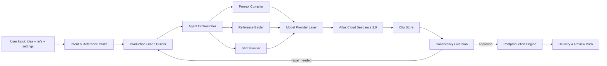

# CineJelly Seedance Ultimate Director - Architecture Spec

## Status

This document is a production architecture specification for the first commercial version of CineJelly Seedance Ultimate Director. It is not a demo plan.

## Sources Read

Current repository:

- `TechRate2/cinejelly-seedance-ultimate-director`: inspected as the current commercial product repository. Documentation now assumes upstream repositories are brought in with Git Subtree snapshots under `external/upstream/`.

Public sources:

- Emily2040/seedance-2.0: https://github.com/Emily2040/seedance-2.0
- YouMind-OpenLab/awesome-seedance-2-prompts: https://github.com/YouMind-OpenLab/awesome-seedance-2-prompts
- HKUDS/ViMax: https://github.com/HKUDS/ViMax
- vericontext/vibeframe: https://github.com/vericontext/vibeframe
- DirectorBench paper: https://arxiv.org/html/2605.30090v1
- HKUDS/VideoAgent: https://github.com/HKUDS/VideoAgent
- OpenMontage: https://github.com/calesthio/OpenMontage
- MoneyPrinterTurbo: https://github.com/harry0703/MoneyPrinterTurbo
- Atlas Cloud Seedance 2.0 model page: https://www.atlascloud.ai/models/seedance2
- Atlas Cloud docs overview: https://www.atlascloud.ai/docs/en
- Atlas Cloud LLM docs: https://www.atlascloud.ai/docs/en/models/llm
- Atlas Cloud CLI docs: https://www.atlascloud.ai/docs/en/cli
- Atlas Cloud Asset Library guide: https://www.atlascloud.ai/blog/guides/atlas-cloud-asset-library-seedance-2-0
- Atlas Cloud all-round Seedance reference guide: https://www.atlascloud.ai/blog/case-studies/generative-ai-model-seedance-2-0-a-guide-to-all-round-reference
- Atlas Cloud character consistency article: https://www.atlascloud.ai/blog/guides/how-character-consistency-in-ai-video-apis-is-revolutionizing-episodic-content

## Source Integration Strategy

CineJelly uses Git Subtree to bring upstream repositories into `external/upstream/` as durable source snapshots. These snapshots are not passive references only; they are the product's local source library for copying, adapting, and integrating useful documentation, structures, prompt patterns, workflow logic, and compatible implementation ideas into CineJelly-owned `docs/`, `data/`, and `src/` surfaces.

Each snapshot must keep its original license and attribution visible. Copying and reuse are allowed when the upstream license permits the intended product use and the copied/adapted element is credited in `docs/CREDITS.md`, `docs/EXTERNAL_SOURCE_SNAPSHOTS.md`, or a focused design note. For license-sensitive sources, the product can still snapshot and learn the structure, but direct implementation reuse must follow the source license obligations or a legal review decision.

Snapshot-derived integration targets:

- From Emily2040/seedance-2.0: the system should be intent-first, should direct the model instead of over-controlling frames, should route vague ideas through a brief/interview path, should separate reference assets by role, should produce production objects before prompts for professional work, should maintain dated model/provider claims, and should include safety, troubleshooting, and delivery/QC lanes.
- From YouMind-OpenLab/awesome-seedance-2-prompts: high-performing Seedance prompts are usually structured as time-bounded multi-shot descriptions with character consistency constraints, camera motion, action beats, lighting, sound, dialogue/lip-sync, and negative constraints such as no text, watermark, subtitle, deformation, or drift.
- From HKUDS/ViMax: long-form automated video benefits from multi-agent decomposition, long script understanding, RAG-assisted segmentation, storyboard design, reference image selection, multi-camera filming simulation, parallel candidate generation, VLM/MLLM consistency selection, and timeline-aware reference reuse.
- From VibeFrame: an agentic video product should use deterministic project artifacts, JSON outputs, dry runs, cost gates, build reports, review reports, and separate lanes for full builds, standalone asset generation, and editing/remix workflows.
- From DirectorBench: long-form quality must be diagnosed across script, visual, audio, cross-modal, and stability dimensions using checkpoint-level reports rather than one aggregate score.
- From HKUDS/VideoAgent: video understanding, editing, and remaking require intent analysis that captures explicit and implicit sub-intents, graph-powered workflow planning, and multimodal retrieval over video content.
- From OpenMontage: production systems should support reference-video analysis, transcript/pacing/keyframe/style extraction, approval gates, cost estimates, provider scoring, real-footage paths when appropriate, and self-review through ffprobe, frame sampling, audio analysis, subtitles, and delivery checks.
- From MoneyPrinterTurbo: one-input video systems benefit from a complete staged pipeline, explicit task progress, optional stop-at stages, audio-only stage boundaries, batch output generation, local-or-remote material sourcing, aspect-aware material selection, subtitle/TTS/BGM stage planning, generated-audio intent capture, generated-audio execution planning, and multiple operator surfaces such as API, CLI, WebUI, Docker, and one-click launchers.
- From Atlas Cloud: Atlas Cloud is the default API gateway for LLM and media models. Its LLM endpoint is OpenAI-compatible at `https://api.atlascloud.ai/v1`; media generations are asynchronous; Seedance 2.0 supports text, image, video, and audio inputs through a Universal Reference style workflow; Atlas exposes Seedance 2.0 and Seedance 2.0 Fast options; Atlas documents 480p, 720p, and 1080p options for Seedance image-to-video examples and a 4 to 15 second clip duration range.

Extension based on these sources:

- CineJelly adds a typed Production Graph, a Consistency Guardian, a Model Provider Abstraction Layer, generated-audio execution planning, a no-spend generated-audio provider contract boundary, governed material sourcing, batch production evidence, and commercial delivery contracts. These are product architecture extensions based on ViMax, VibeFrame, DirectorBench, VideoAgent, OpenMontage, MoneyPrinterTurbo, Emily2040/seedance-2.0, and Atlas Cloud docs.

## Git Subtree And Snapshot Workflow

CineJelly should vendor upstream repositories with Git Subtree using `--squash`:

```bash
git subtree add --prefix=external/upstream/<snapshot-name> <upstream-url> <branch> --squash
git subtree pull --prefix=external/upstream/<snapshot-name> <upstream-url> <branch> --squash
```

The snapshot workflow is:

1. Capture or refresh the upstream repository under `external/upstream/` with Git Subtree.
2. Review the snapshot license, notices, and any nested third-party license files.
3. Identify reusable documents, prompt structures, agent roles, graph patterns, provider workflows, quality gates, schemas, or implementation logic.
4. For behavior-critical logic, create a non-production Reference Implementation using `docs/FAITHFUL_LOGIC_TRANSLATION_PROCESS.md`.
5. Copy or adapt the useful pieces into CineJelly-owned `docs/`, `data/`, and `src/` paths.
6. Record the origin, local snapshot path, and CineJelly-specific extension in the relevant design doc or attribution file.
7. Keep production imports and public packaging based on CineJelly-owned modules. Production code must not import directly from `external/upstream/`.

This lets the product combine the best parts of Emily2040/seedance-2.0, YouMind-OpenLab/awesome-seedance-2-prompts, HKUDS/ViMax, vericontext/vibeframe, HKUDS/VideoAgent, calesthio/OpenMontage, and harry0703/MoneyPrinterTurbo while remaining an autonomous CineJelly commercial system.

When a source pattern moves from `external/` into `src/`, the implementation must be written as CineJelly-owned TypeScript that fits existing provider, graph, agent, and runtime contracts. Engineers should not copy large upstream files wholesale into `src/`; they should extract the useful behavior, redesign it for CineJelly, preserve attribution, and develop it further.

Faithful Logic Translation is required when source fidelity matters for ordering, weighting, edge cases, provider fallback, long-form chunking, candidate selection, or repair strategy. The Reference Implementation captures the original behavior and license boundary; the production module then rewrites that behavior into CineJelly-owned code.

## Product Objective

CineJelly Seedance Ultimate Director converts one user input into a complete high-quality video:

1. User gives an idea plus optional references.
2. The system extracts intent, audience, platform, constraints, and reference roles.
3. The system builds a Production Graph.
4. Agents compile shot contracts and Seedance prompts.
5. Atlas Cloud renders Seedance 2.0 clips with user-selected settings.
6. Consistency Guardian inspects generated clips and repairs only affected graph nodes.
7. Postproduction assembles, smooths, captions/localizes when requested, records supplied-audio and generated-audio planning evidence, polishes, and exports a final deliverable.

The product must support every niche without hardcoded templates. It should use reusable production primitives instead of niche-specific scripts.

## High-Level Architecture



## Production Directory Structure

The production implementation structure is:

- `src/agents`: Director, Intake, Reference Librarian, Shot Planner, Render Producer, Editor, and orchestration agents.
- `src/core`: Production Graph, continuity ledgers, Consistency Guardian, governed material sourcing, generated-audio execution planning, batch output planning, assembly/media-processing contracts, cost ledger, and repair decisions.
- `src/prompt_compiler`: Seedance 2.0 prompt compiler, reference binding, negative constraints, and prompt repair hints.
- `src/providers`: provider-neutral interfaces plus Atlas Cloud default implementation for LLM, Seedance 2.0, async predictions, Asset Library, and the generated-audio provider boundary; Atlas reports no generated-audio capabilities until verified audio model schemas and capability mappings are configured.
- `src/config`: typed runtime settings, flexible Seedance settings, provider model configuration, and secret-safe environment loading.
- `src/utils`: production utility functions such as redaction, retry policy, IDs, timing, media-tool command resolution, and structured error helpers.
- `src/types`: shared type definitions for settings, graph nodes, provider requests, reports, and deliverables.
- `data`: production-approved local knowledge artifacts such as copied prompt-pattern snapshots, bibles, source-derived evaluation rubrics, or curated product knowledge when required.
- `external`: Git subtree snapshots of upstream repositories used for source review, copy/adaptation, and integration planning; production code does not import from this tree, and productized behavior moves into CineJelly-owned `src/`, `data/`, and `docs/`.
- `schemas`: production JSON schemas for graph, prompts, settings, provider requests, and review reports.
- `config`: production configuration templates without secrets.
- `ops`: deployment and runtime operations.
- `assets/reference_inputs`: user/reference media staging boundary.
- `assets/output_deliverables`: local output delivery boundary.

No test, mock, demo, sample, or example folder is part of this structure.

## Core Agents

### 1. Intake Director

Responsibilities:

- Accept one user input and optional reference files/URLs.
- Extract explicit requirements: niche, target platform, duration, audience, product, offer, story, brand rules, language, voice, aspect ratio, quality tier, and budget constraints.
- Extract implicit requirements using VideoAgent-style intent decomposition.
- Normalize optional source-video deconstruction metadata for transcript, scene, keyframe, pacing, style, structural beat, and safety guidance into rights-safe structural guidance.
- When enabled by operator configuration, generate source-video deconstruction automatically from bounded sampled frames of a clean HTTPS `source_video_structure` reference before intake normalization.
- If the input is underspecified, create a minimal clarification plan. For autonomous production, use conservative defaults rather than blocking.

Source basis:

- Emily2040/seedance-2.0 interview and intent-first routing.
- VideoAgent intent analysis across explicit and implicit sub-intents.
- OpenMontage/VideoAgent source-video deconstruction patterns, snapshotted and adapted into CineJelly typed contracts and the opt-in Source Video Auto Analysis Adapter with attribution.

### 2. Reference Librarian

Responsibilities:

- Register and validate reference assets.
- Assign every reference a role: identity, product, environment, motion, camera rhythm, audio tempo, style, endpoint, or source-video structure.
- For Atlas Cloud, route video/audio references through the Asset Library because Atlas documents that video/audio references must be registered before generation.
- Preserve lineage from user upload to graph node and final output.

Source basis:

- Emily2040 reference role separation.
- Atlas Cloud Asset Library register, poll, and asset reference flow.
- Atlas Cloud Reference Cluster and @-tag guidance.

### 3. Story Architect

Responsibilities:

- Convert intent into a story arc and scene plan.
- Avoid fixed niche templates. Use genre grammar, audience intent, and platform constraints to build a custom structure.
- For long-form, split the production into sequences and scenes using RAG memory over the brief, script, and references.

Source basis:

- ViMax long script generation and RAG-based segmentation.
- OpenMontage concept, script, and scene plan flow.
- VibeFrame storyboard-driven source of truth.

### 4. Shot Planner

Responsibilities:

- Produce shot contracts with duration, shot size, camera movement, lens feel, blocking, action, lighting, audio, reference bindings, first/last frame needs, and transition handles.
- Produce deterministic storyboard panels from approved shot contracts before provider render spend.
- Split any output longer than a model clip limit into graph nodes that can be rendered, inspected, repaired, and stitched.

Source basis:

- Emily2040 professional filmmaker scope and shot-list continuity.
- ViMax storyboard and multi-camera filming simulation.
- YouMind prompt corpus patterns with explicit time ranges and camera/action/sound blocks.

### 5. Prompt Compiler

Responsibilities:

- Compile each shot contract into Seedance-ready prompts.
- Keep prompts directorial and compact enough to avoid keyword overcrowding.
- Preserve asset role bindings and consistency constraints.
- Compile negative constraints only when they protect quality or policy.

Source basis:

- Emily2040 prompt, short prompt, antislop, camera, motion, lighting, character, style, VFX, audio, and troubleshooting lanes.
- YouMind prompt corpus patterns.
- Atlas Cloud @-tag and reference binding guidance.

### 6. Render Producer

Responsibilities:

- Select model capability, settings, and provider.
- Submit jobs to Atlas Cloud by default.
- Poll asynchronous predictions.
- Record cost, latency, model ID, request schema version, response metadata, and output URLs.
- Normalize provider HTTP status, timeout, and abort failures into stable provider error codes with redacted details so retry and failure-artifact behavior remains deterministic.

Source basis:

- Atlas Cloud LLM docs, model docs, CLI docs, and async generation docs.
- VibeFrame cost gates, build reports, and JSON automation.

### 7. Consistency Guardian

Responsibilities:

- Preflight prompts and references.
- Inspect test takes and full clips.
- Compare generated clips against identity, environment, product, motion, camera, audio, and transition constraints.
- Decide whether to approve, repair prompt, alter reference binding, rerender, post-fix, or escalate for human review.

Source basis:

- ViMax automated image generation consistency check with MLLM/VLM selection.
- DirectorBench checkpoint-level diagnostics.
- Atlas Cloud four-second test take and reference-weighting guidance.
- OpenMontage self-review practices.

### 8. Editor & Finishing Lead

Responsibilities:

- Assemble clips into a complete timeline.
- Materialize provider output URLs with bounded streaming downloads before FFmpeg processing.
- Apply transitions, handles, supplied-audio alignment, captions, color/polish, upscaling when selected, and delivery validation.
- Record generated-audio intents for narration, BGM, ambience, or SFX as reviewable execution-planning evidence; do not claim generated outputs until a verified provider-backed audio generation stage has produced inspected assets.
- Produce final video plus a review packet summarizing planning, render, cost, QC, delivery evidence, and final file integrity.

Source basis:

- VibeFrame render, inspect, repair, and edit lanes.
- OpenMontage final composition and self-review.
- MoneyPrinterTurbo staged script/material/audio/subtitle/final-video pipeline and batch output handling.
- Emily2040 delivery/QC scope.

## Production Graph

The Production Graph is the system of record. It is the main mechanism for beating one-shot and template-driven video agents.

Node types:

- `Project`: user request, policy, ownership, budget, output settings.
- `AudienceProfile`: platform, language, content intent, brand constraints.
- `ReferenceAsset`: media asset, role, source, validation status, embedding, provider asset ID.
- `StoryArc`: narrative spine and pacing.
- `Sequence`: grouped scenes for long-form structure.
- `Scene`: location, time, characters, continuity anchors.
- `Beat`: story unit with emotional or informational purpose.
- `StoryboardPanel`: reviewable visual panel for a shot before render spend.
- `Shot`: renderable visual contract.
- `ClipRender`: provider job, status, output, cost, metadata.
- `InspectionReport`: scored quality findings.
- `RepairAction`: targeted graph mutation.
- `Deliverable`: final timeline, variants, platform exports, review packet.

Edges:

- `depends_on`: shot order and asset dependency.
- `continues_identity`: identity continuity across scenes.
- `continues_environment`: environment continuity.
- `matches_motion`: motion/camera/audio reference relation.
- `transitions_to`: edit transition dependency.
- `requires_repair`: failed checkpoint to repair action.

## How CineJelly Surpasses TopView Agent V2

The goal is to surpass TopView Agent V2 through architecture, not only prompt wording.

1. Production Graph instead of flat script generation.
2. Reference Binder instead of untyped reference uploads.
3. Consistency Guardian with checkpoint-level repair instead of full rerender loops.
4. Model Provider Abstraction instead of vendor lock-in.
5. Long-form decomposition into scenes, beats, shots, and clips instead of a single long prompt.
6. Atlas Cloud Universal Reference and Asset Library support as a first-class path.
7. Diagnostic evaluation inspired by DirectorBench.
8. VibeFrame/OpenMontage-style cost gates, build reports, review reports, and reproducible project artifacts.
9. VideoAgent/OpenMontage-style reference-video analysis for users who start from a long source video.
10. Production delivery contracts for commercial outputs, including resolution, aspect ratio, audio, captions, and review packet metadata.

## Runtime Flow

1. `createProject`: persist the user request and settings.
2. `ingestReferences`: validate references, classify roles, register required Atlas assets.
3. `sourceVideoAnalysis`: when supplied, validate bounded transcript/scene/keyframe/pacing/style/safety deconstruction; when absent and enabled, attempt opt-in auto-analysis from bounded sampled frames of a clean HTTPS `source_video_structure` reference; match the result to a `source_video_structure` reference label and use it only as original structural guidance.
4. `compileGraph`: build story, scenes, beats, shot contracts, continuity ledgers.
5. `storyboard`: generate reviewable panels from shot contracts, run Guardian storyboard preflight, and store panels/evidence in graph/artifacts.
6. `preflight`: run prompt/reference safety, contradiction, and schema checks.
7. `testTake`: for high-risk shots, render a short test take before full duration.
8. `render`: submit parallel-safe jobs; preserve dependencies for continuity-bound shots.
9. `inspect`: run Consistency Guardian and DirectorBench-style checkpoint scoring.
10. `repair`: rerender only failed nodes or use deterministic postproduction fixes.
11. `postproductionAssets`: classify supplied caption cues and audio tracks into deterministic planning evidence; do not claim provider-backed TTS/BGM generation without a separate module.
12. `assemble`: stitch clips with handles and transitions.
13. `finish`: audio, captions, color/polish, upscale if selected.
14. `deliver`: export final video and review packet.

Assembly materialization:

- Provider output URLs are streamed to local work files instead of buffered fully in memory.
- Remote clip and public API audio track URLs must use HTTPS and must not embed credentials before materialization.
- Each rendered clip download is bounded by deployment configuration so long-form jobs cannot consume unbounded memory or disk.
- Each remote audio track download is separately bounded by deployment configuration so postproduction mix inputs cannot consume unbounded memory or disk.
- FFmpeg and FFprobe are resolved through `CINEJELLY_FFMPEG_PATH` / `CINEJELLY_FFPROBE_PATH` when configured, otherwise through `PATH`; preflight and runtime media engines must use the same resolved commands.
- FFmpeg and FFprobe process stdout/stderr capture is bounded so malformed media or noisy tool failures cannot exhaust API memory.
- Completed downloads are moved into place only after the full file has been received, keeping FFmpeg inputs deterministic.

API execution modes:

- `/health` is public, while `/v1` endpoints require deployment API authentication before provider spend or run metadata access; `Authorization` uses a case-insensitive Bearer scheme or the `X-CineJelly-Api-Key` header. `/v1/preflight` and `/v1/validation-readiness` remain available without a configured deployment token only so fresh deployments can diagnose missing readiness inputs; once `CINEJELLY_API_AUTH_TOKEN` is configured, they use the same guard as other `/v1` endpoints.
- Credit-spending render submission endpoints are rate limited before authentication response handling, request body parsing, runtime creation, job queue occupancy, or provider spend.
- Credit-spending render submission endpoints require an application JSON media type (`application/json` or `application/*+json`) before request body parsing; unsupported media types return 415.
- Credit-spending render submission endpoints enforce a configurable request body byte limit before JSON parsing, job queue admission, runtime creation, or provider spend; oversized bodies return 413.
- Render requests pass admission control before runtime creation, LLM planning, job queue occupancy, or provider spend; admission validates top-level limits plus nested caption, audio mix, frame sampling, semantic visual inspection, and transition option shapes/ranges.
- Optional `sourceVideoAnalysis` payloads are bounded before LLM planning and can include transcript cues, scenes, keyframes, pacing notes, style notes, structural beats, and safety notes linked to a `source_video_structure` reference. The auto-analysis path is disabled by default, never overwrites caller-supplied analysis, and must keep local frame paths and inline frame data out of returned analysis and artifacts.
- Public reference URIs must be credential-free HTTPS URLs or pre-registered `asset://` references; `http://`, embedded credentials, and credential-like query parameters are rejected before runtime/provider spend.
- Public render requests may include audio tracks only from credential-free HTTPS URLs; local audio file sources are reserved for internal engine wiring.
- Atlas Cloud API and Asset Library endpoint overrides must be credential-free HTTPS URLs with no query strings or fragments; runtime configuration and `/v1/preflight` reject unsafe URLs before credentials or provider payloads can be used.
- Runtime numeric environment controls must be plain base-10 integer or decimal strings; the configuration loader and `/v1/preflight` reject partial parses such as unit suffixes before traffic reaches provider spend.
- API startup and preflight enforce the same deployment gates for `PORT` range and explicit boolean API flags, so a deployment cannot appear ready while startup would reject the configuration.
- `npm run preflight` runs the same deployment readiness checks as a CLI gate, emits a redacted preflight report, and exits non-zero on hard failures before operators open customer traffic.
- `npm run validation:readiness` and `GET /v1/validation-readiness` wrap the preflight output into a Phase 6 operator-readiness report with hard blockers, warnings, next actions, and an explicit release blocker until paid Atlas validation and artifact review are complete; the HTTP route returns 503 only when the decision is blocked.
- Every API request creates or accepts a sanitized `X-CineJelly-Request-Id`/`X-Request-Id`; responses include `requestId`, and the normalized request propagates it into LLM/Seedance metadata, render job summaries, Production Graph project metadata, and durable success/failure artifacts.
- `/v1/render` runs the full pipeline synchronously for controlled callers and is protected by a process-level concurrency gate with retry hints after body parsing, admission control, and path normalization but before runtime creation or provider spend.
- `/v1/render-jobs` submits the same normalized request into an in-process queue and returns a pollable job ID for long-form production.
- `/v1/render-jobs` accepts `Idempotency-Key`; the API stores only a digest of the key, replays the retained existing job for the same payload, and returns `409` when the same key is reused for a different payload.
- Async job submission enforces a process-level queued/running capacity limit before job records, runtime objects, or provider calls are created; saturated queues return a 503 pressure signal with `Retry-After` and JSON `retryAfterSeconds` for upstream retry behavior.
- Rate-limited credit-spending requests return 429 with `Retry-After` and JSON `retryAfterSeconds`.
- API rate limiting uses the socket remote address by default; `X-Forwarded-For` is trusted only when `CINEJELLY_TRUST_PROXY_HEADERS=true` is configured behind a trusted reverse proxy that strips and rewrites client IP headers.
- Job list status includes queue telemetry plus compact queued, running, succeeded, failed, or canceled summaries with current-stage progress fields, compact artifact validation status, and detail-availability flags, including `hasError`, but excludes error detail, full validation checks, and the full progress event list.
- Per-job status includes queued, running, succeeded, failed, or canceled state plus retained bounded stage progress events, redacted stack-free error name/message, result, cost ledger, artifact bundle, and artifact validation checks when available.
- Public JSON responses redact secrets, inline `data:` URIs, non-HTTPS URIs, embedded-credential URIs, signed/credential-query URIs, and deployment-local filesystem paths, while preserving deploy-safe URI values such as clean `https://` reference URLs and `asset://` Atlas Asset Library references.
- Public JSON responses include `Cache-Control: no-store` and `X-Content-Type-Options: nosniff` so run metadata, provider errors, queue state, and cost evidence are not cached or content-sniffed by intermediaries.
- `/v1/render-jobs/{jobId}` can be canceled with `DELETE`; cancellation propagates through `AbortSignal` to provider calls, polling, assembly, and postproduction where supported.
- Client disconnects and `SIGINT`/`SIGTERM` shutdowns propagate through request lifecycle `AbortSignal` objects so synchronous render orchestration and active async jobs stop as early as the selected provider path allows after the caller or deployment lifecycle has ended.
- Synchronous render concurrency, queue concurrency, queued/running capacity, and retained history are process-level settings; `/v1/preflight` validates the configured concurrency/capacity and output-directory writability before customer traffic, and multi-process deployments should place a durable queue in front of the same Director Agent contract.

Failure artifact policy:

- If `/v1/render` fails after request normalization, CineJelly still writes redacted failure artifacts.
- Failure artifacts include `failure-report.json`, `cost-ledger.json`, and `manifest.json` so blocked cost gates, render gates, delivery gates, or provider errors remain auditable; failure reports keep stack-free redacted error name/message details rather than source-path-bearing traces.
- Synchronous and async render failure paths capture any provider cost ledger entries recorded before the error, so partial Atlas spend remains auditable.
- Success and failure manifests include per-file SHA-256 hashes for redacted JSON artifacts so review packets, graph snapshots, cost ledgers, and failure reports can be integrity-checked after storage or transfer.
- API artifact bundle responses expose manifest file names, artifact entries, byte sizes, and hashes without returning server-local artifact directories or manifest paths; deeper result payloads also redact local output, work, media sample, and inspection paths before leaving the API boundary.
- API artifact validation responses expose status, manifest file name, check counts, and checks without returning server-local artifact directories or manifest paths; validation is bound to synchronous request-owned or async job-owned artifacts and not to arbitrary client-supplied local paths.
- This is an extension based on VibeFrame/OpenMontage build and review report discipline.

Review packet policy:

- Successful runs emit `review-packet.json`.
- The packet includes a redacted status, premise, flexible settings, storyboard preflight status, graph size, prompt/render counts, selected candidates, provider operation counts, estimated/actual cost when available, delivery gate status, semantic visual inspection status, final output byte size, final output SHA-256, and operator recommendations.
- The packet is a handoff summary, not a substitute for the full graph, prompt, render, and delivery artifacts.

## Non-Negotiable Production Principles

- No hardcoded niche templates.
- No provider-specific logic outside the provider layer.
- No prompt-only state. Every production decision must be represented in the graph.
- No unverified model IDs or pricing claims in runtime logic. Provider schemas must be fetched, configured, or versioned.
- No full-project rerender when a shot-level repair is enough.
- No hidden use of user references. Every generated clip must carry reference lineage.
- No unsafe IP, likeness, brand, voice, or song copying path.
- No silent quality failure. Failed checkpoints must produce actionable reasons.

## First Implementation Boundary

The first commercial implementation should include:

- API endpoint for one-input video project creation.
- Atlas Cloud LLM provider for reasoning and structured planning.
- Atlas Cloud Seedance 2.0 provider for T2V, I2V, and reference-to-video where supported by the selected model schema.
- Asset Library integration for video/audio reference registration.
- Production Graph persistence.
- Prompt Compiler.
- Consistency Guardian preflight and post-render inspection.
- Timeline assembly and export.
- Cost ledger and review packet.

The first implementation should not include:

- Test/mock/demo/example code or files.
- Hardcoded niche campaign templates.
- Unsupported model-provider claims.
- Unattributed or license-unreviewed prompt examples from public corpora.
