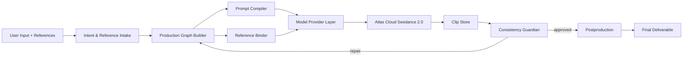

# CineJelly Project Context

## What This Project Is

CineJelly Seedance Ultimate Director is a commercial AI video production system. The product goal is to turn one user input, plus optional references, into a complete polished video using Atlas Cloud as the default provider for both LLM reasoning and Seedance 2.0 rendering.

## Core Product Goal

One input should produce:

1. intent and reference analysis
2. script/story structure
3. storyboard and shot contracts
4. Production Graph
5. Seedance prompt batch
6. rendered clips
7. consistency inspection and repair
8. postproduction assembly
9. final high-quality deliverable

The target long-form range is 2 to 8 minutes with high consistency.

## Non-Negotiable Rules

- Production-grade only.
- No CineJelly-owned test/mock/demo/sample/example files in the production runtime. Upstream snapshots may contain original upstream development files under `external/upstream/`; those files become product material only after an intentional copy/adapt step.
- Never commit `.env`, API keys, tokens, private keys, credentials, or generated customer media.
- Atlas Cloud is the default provider.
- Use a Model Provider Abstraction so future providers such as Kie.ai, fal.ai, Runway, Replicate, or direct Volcengine can be added later.
- Do not hardcode niche templates.
- Copy/adapt public prompt examples into product content only when license, attribution, and product review are satisfied.
- Reuse AGPL code from OpenMontage only when the product accepts AGPL obligations or legal review approves the reuse path.
- Keep `external/upstream/` as Git Subtree source snapshots; productized behavior must move into CineJelly-owned `src/`, `data/`, or `docs/` with attribution.
- Production code must not import directly from `external/upstream/`.
- Code under `src/` must be new or substantially adapted CineJelly implementation, not unchanged large upstream files.
- For behavior-critical source-derived logic, use Faithful Logic Translation before production code: Deep Analysis, Reference Implementation, Fidelity Review, CineJelly Rewriting, Integration, and Validation.

## Architecture In One Screen

## Main Concepts

- `Production Graph`: system of record for project, references, story, sequences, scenes, beats, shots, renders, inspection reports, repairs, and deliverables.
- `Reference Librarian` / `Reference Binder`: validates assets, classifies them as identity, product, environment, motion, camera, audio tempo, style, first frame, last frame, or source-video structure, and preserves graph lineage.
- `Source Video Analyst`: normalizes optional VideoAgent/OpenMontage-style transcript, scene, keyframe, pacing, style, structural beat, and safety deconstruction into bounded guidance for original story planning.
- `Source Video Auto Analyzer`: optional adapter that samples bounded frames from a clean HTTPS source-video reference and asks the configured Atlas LLM for original structural deconstruction before intake normalization.
- `Prompt Compiler`: turns shot contracts into Seedance-ready prompts and provider-neutral render requests.
- `Storyboard Planner`: turns shot contracts into deterministic reviewable storyboard panels before render spend; Guardian validates panel coverage/alignment before provider calls.
- `Consistency Guardian`: checks identity, product, environment, motion, transition, audio, cross-modal sync, and delivery quality.
- `Model Provider Abstraction`: keeps Atlas Cloud-specific request details out of business logic.
- `Request Context`: creates or accepts a sanitized request correlation ID, returns it in API responses, and carries it through render jobs, provider metadata, Production Graph project metadata, and durable artifacts.
- `HTTP Lifecycle`: converts client disconnects and deployment shutdown signals into AbortSignal cancellation for active request-bound render orchestration.
- `Clip Materialization`: streams provider clip URLs into bounded local files before FFmpeg assembly, avoiding full-clip memory buffering during long-form jobs.
- `Media Tool Resolution`: resolves FFmpeg and FFprobe through `CINEJELLY_FFMPEG_PATH` / `CINEJELLY_FFPROBE_PATH` when configured, otherwise through `PATH`, and uses the same commands for preflight and runtime media engines.
- `Local Material Library Adapter`: optionally resolves source-material briefs from an operator-owned JSON catalog using safe `asset://` or credential-free HTTPS URIs before centralized material validation.
- `Remote Stock Material Adapter`: optionally resolves source-material briefs from Pexels, Pixabay, and commercially approved Coverr through key-gated provider searches, attribution metadata, and credential-free HTTPS candidate URIs.
- `Postproduction Asset Planner`: classifies supplied caption cues, supplied audio tracks, and generated-audio intents into deterministic planning evidence before final assembly.
- `AudioProvider Boundary`: defines provider-neutral generated-audio capability/request/result contracts; Atlas currently exposes no generated-audio capabilities and fails safely before network spend until verified audio schemas, model IDs, pricing, and artifact validation exist.
- `Generated Audio Asset Resolution`: maps reviewed generated-audio `asset://` outputs to credential-free HTTPS delivery URLs before mixing, without provider calls, downloads, or generated files.
- `Generated Audio Asset Resolution Catalog`: validates an optional operator-owned JSON catalog for generated-audio `asset://` to HTTPS mappings during preflight without enabling provider-backed audio execution.
- `Stage Progress Telemetry`: reports bounded current-stage events for async render jobs before final artifacts exist.
- `API Artifact Validation Evidence`: validates synchronous render and retained async job artifacts after success/failure artifact writes and exposes release-gate status without server-local paths.
- `Render Request Validation Contract`: validates an operator-owned render request file through CineJelly admission and output-root normalization before readiness-gated paid provider work.
- `Review Packet`: redacted customer/operator handoff artifact summarizing planning, render, cost, delivery, and QC evidence.

## Snapshot-Integrated Design

- Emily2040/seedance-2.0: intent-first Seedance workflow, reference roles, professional shot/QC handoff.
- YouMind-OpenLab/awesome-seedance-2-prompts: prompt structure patterns, reusable prompt anatomy, and attribution-reviewed prompt-pattern snapshots.
- HKUDS/ViMax: multi-agent long-form planning, storyboard, reference selection, consistency validation.
- VibeFrame: deterministic artifacts, dry runs, cost gates, build/review reports, repair loop.
- DirectorBench: checkpoint-level long-form diagnosis across script, visual, audio, cross-modal, stability.
- HKUDS/VideoAgent: video understanding, intent decomposition, graph-powered tool planning.
- OpenMontage: reference-video analysis, approval gates, provider scoring, real-footage path, self-review.
- MoneyPrinterTurbo: staged one-input video generation, material sourcing, batch outputs, subtitles/TTS/BGM, task progress, API/CLI/WebUI operations.
- Atlas Cloud: default API gateway, OpenAI-compatible LLM endpoint, async media generation, Seedance 2.0 Universal Reference, Asset Library.

Local upstream snapshots are stored under `external/upstream/` and governed by `docs/SUBTREE_POLICY.md` plus `docs/EXTERNAL_SOURCE_SNAPSHOTS.md`.

Faithful Logic Translation is the required path for high-fidelity implementation of important upstream behavior. The goal is to preserve useful logic details such as ordering, weighting, edge cases, fallback decisions, and repair strategy while rewriting the production module as CineJelly-owned TypeScript. The Reference Implementation step is a non-production bridge under `docs/`; it must not be imported by runtime code.

## Detailed Docs Map

- `docs/ARCHITECTURE_SPEC.md`: full system architecture and agent responsibilities.
- `docs/CREDITS.md`: attribution, license cautions, and source boundaries.
- `docs/SUBTREE_POLICY.md`: Git Subtree workflow, `--squash` requirement, and copy/adapt rules.
- `docs/EXTERNAL_SOURCE_SNAPSHOTS.md`: subtree inventory, license status, source-fidelity policy, and reuse boundaries.
- `docs/FAITHFUL_LOGIC_TRANSLATION_PROCESS.md`: six-step process for translating source behavior into CineJelly-owned production logic.
- `docs/IMPLEMENTATION_ROADMAP.md`: practical phase-by-phase plan for translating high-value upstream logic into production modules.
- `docs/ROADMAP_FIDELITY_AUDIT_2026-06-14.md`: owner-level audit of current roadmap completion, subtree fidelity, blockers, and next validation steps.
- `docs/PROMPT_COMPILER_DESIGN.md`: adaptive niche prompt compiler.
- `docs/PRODUCTION_GRAPH_AND_LONG_FORM.md`: 2 to 8 minute graph strategy.
- `docs/CONSISTENCY_GUARDIAN_DESIGN.md`: QA, inspection, and repair system.
- `docs/MODEL_PROVIDER_ABSTRACTION.md`: Atlas default and future provider contracts.
- `docs/FLEXIBLE_SEEDANCE_SETTINGS.md`: user settings for tier, resolution, quality, ratio, audio.

## Current Repo State

The repo contains architecture/design documentation, upstream Git Subtree snapshots, and a substantial production TypeScript foundation for the first commercial pipeline. The implementation is CineJelly-owned product code adapted from credited source snapshots where useful; external snapshots are not live dependencies, direct production imports from `external/upstream/` are disallowed, and bundled prompt corpora or upstream implementation logic require the license review path described in `docs/SUBTREE_POLICY.md`.

The current foundation is ready for the next wave of high-fidelity source translation, but it should not be read as full upstream parity. Before changing behavior-critical modules, create or update a Reference Implementation using `docs/FAITHFUL_LOGIC_TRANSLATION_PROCESS.md`, then rewrite the behavior into the appropriate CineJelly layer under `src/`.

Current production folders:

- `src/agents`
- `src/core`
- `src/prompt_compiler`
- `src/providers`
- `src/config`
- `src/utils`
- `src/types`
- `data`
- `external`
- `external/upstream`
- `schemas`
- `config`
- `ops`

Implementation status:

- Treat the bullets below as implementation foundation status, not proof of full upstream parity. A behavior is source-faithful only after its Reference Implementation, CineJelly rewrite, lineage record, and validation checklist are complete.
- `docs/` contains the architecture and design source of truth.
- `src/core/material-sourcing-planner.ts`, `src/core/local-material-library-adapter.ts`, `src/core/remote-stock-material-adapter.ts`, `src/core/material-source-validator.ts`, `src/core/postproduction-asset-planner.ts`, `src/core/generated-audio-execution-planner.ts`, `src/core/generated-audio-provider-execution-runner.ts`, `src/core/generated-audio-output-validator.ts`, `src/core/generated-audio-output-batch-validator.ts`, `src/core/generated-audio-asset-resolver.ts`, `src/core/production-stage-planner.ts`, and `src/types/stage.ts` implement the first MoneyPrinterTurbo/VibeFrame-inspired material sourcing, local catalog fulfillment, opt-in remote stock fulfillment, material candidate validation, postproduction asset planning, generated-audio intent/execution/output validation, provider-neutral generated-audio ready-item execution, generated-audio result-batch reconciliation, optional generated-audio batch artifact evidence, generated-audio asset resolution/catalog validation, and stage lifecycle foundation as CineJelly-owned TypeScript; `src/types/provider.ts`, `src/providers/contracts.ts`, and `src/providers/atlascloud/atlas-cloud-provider.ts` now include a generated-audio provider contract boundary, but live Atlas-backed TTS/BGM/ambience/SFX execution remains pending verified Atlas audio schema, model IDs, pricing, and paid validation.
- `src/core/source-logic-translation-ledger.ts`, `src/core/source-logic-translation-records.ts`, and `src/types/source-translation.ts` provide a lightweight production contract and seeded source-logic records for recording source-derived logic lineage, Reference Implementation paths, license state, preserved behavior, changed behavior, destination modules, and validation status without importing upstream snapshots.
- `src/types/logging.ts` and `src/utils/logger.ts` provide a redacted logging contract and console-backed logger foundation. Future provider, prompt, graph, and guardian work should inject or pass this logger instead of adding direct `console.*` calls.
- `src/providers` implements provider-neutral contracts, provider-neutral capability validation, an Atlas Cloud default provider, robust structured LLM JSON parsing, async prediction polling, Asset Library operations, generated-audio provider-neutral contracts, a safe no-spend Atlas generated-audio boundary that reports no capabilities until verified schema mapping exists, error normalization with redacted non-JSON HTTP diagnostics, Atlas request timeout/abort ProviderError normalization with redacted reason details, bounded Atlas JSON metadata response parsing, configurable Seedance capabilities, nested Atlas prediction output URL extraction, and cost ledger tracking with prediction IDs, asset IDs, provider status, provider-returned usage/cost metadata when available, error code, retryable flag, actual retry counts for retryable Atlas HTTP calls, and graph/model context for prediction polling.
- `src/prompt_compiler` implements the Seedance prompt compiler, provider-capability-aware `PromptBindingPlan`, role-based reference ordering, provider reference filtering, binding conflicts, compression notes, negative constraints, and repair hints.
- `src/core` implements Production Graph building with validated `reference_asset` lineage nodes, source-video analysis lineage on project nodes, storyboard panel and storyboard preflight nodes, Production Graph `reference_selection` nodes for selected/dropped reference evidence, Production Graph `material_sourcing` nodes for rights-aware material briefs, local material catalog fulfillment for operator-owned safe asset URIs, remote stock fulfillment for opt-in approved providers with credential-free candidate URIs, opt-in source-video auto-analysis from bounded sampled frames through the configured Atlas LLM and Source Video Analyst normalization, stage lifecycle planning for plan/storyboard/prompt/source_material/render/inspect/repair/assemble/deliver, material source validation for adapter candidates against known briefs, approved sources, URI safety, rights/attribution, duration, aspect ratio, and resolution, postproduction asset planning for supplied caption cues, supplied audio tracks, and generated-audio intents before assembly, provider-neutral generated-audio ready-item execution when an `AudioProvider` and verified capabilities are present, generated-audio result-batch reconciliation against ready execution plans, generated-audio asset resolution for reviewed `asset://` outputs before mix-track creation, Production Graph run evidence recording for test-take/selected/rejected/repair render candidates, clip inspections, deliverables, configurable render cost gating with quality-mode test-take, candidate, and repair multipliers, smart chunking, dependency-aware render scheduling, shot planning, ViMax-inspired deterministic reference selection scoring fed by bounded camera/composition/character/view/timeline metadata when provided or source-video-derived, deterministic storyboard planning, continuity ledger generation for Character/Style bibles, Consistency Guardian storyboard/preflight/test-take/render inspection including Prompt Binding Plan conflicts and repair provenance, FFmpeg assembly through configured or PATH-resolved media-tool commands, bounded HTTPS streaming materialization of remote provider clips and remote audio tracks, bounded FFmpeg/FFprobe process output capture, smooth transition assembly, selected-resolution and selected-aspect-ratio postproduction scaling, final video byte-size and SHA-256 integrity recording, FFprobe inspection, deterministic delivery gate validation for selected resolution and non-adaptive aspect ratio, frame sampling, postproduction polish, captions, audio mix automation, semantic visual inspection through the configured Atlas LLM provider, review packet generation for commercial handoff including source-video analysis counts, source-lineage records, repair provenance, material validation status, postproduction asset status, generated-audio planned/ready status, generated-audio batch validation status/count handoff when available, and stage lifecycle, deterministic success/failure project artifact persistence including `source-video-analysis.json`, `material-sourcing-plan.json`, `material-source-validation.json`, `postproduction-assets.json`, optional `generated-audio-output-batch-validation.json`, and `stage-lifecycle.json` when present, and post-run/API artifact validation for manifest hashes, required artifacts, domain shapes, material validation reports, postproduction asset plans, optional generated-audio batch evidence including review-packet consistency, generated-audio consistency, and secret/unsafe URI redaction.
- `src/agents` and `src/application` wire intake, Reference Librarian validation for role/kind compatibility plus credential-free HTTPS or `asset://` reference URIs, bounded reference selection metadata preservation, optional source-video auto-analysis before intake when explicitly enabled, Source Video Analyst normalization for bounded transcript/scene/keyframe/pacing/style/safety deconstruction, source-video reference metadata enrichment from normalized scenes/keyframes, normalized story architecture with non-empty scene/beat planning that uses source-video analysis only as original structural guidance, material sourcing plan creation before graph build, optional local material catalog and opt-in remote stock adapter fulfillment before material validation, provider capability gating before Asset Library or render spend, continuity-ledger-backed batch Consistency Guardian preflight gating before render spend, render-time Asset Library reference resolution for video/audio references, high-risk test-take gating before full render, Economy/Standard/High/Ultimate candidate rendering with Guardian-based candidate selection, conservative concurrency for dependency-safe shots, targeted repair-only rerendering before delivery, render gate blocking before assembly, selected-resolution postproduction scaling, delivery gate blocking before response, bounded stage progress telemetry during active async jobs, stage lifecycle generation for completed run evidence, director orchestration, runtime factory, shared render request normalization, no-spend render request validation CLI orchestration, HTTP and CLI deployment preflight that validates secret-safe configuration, CLI and HTTP Phase 6 validation readiness reporting, readiness-gated paid-render validation CLI orchestration, optional local material catalog shape and safe asset URIs, optional generated-audio asset resolution catalog shape and clean asset/HTTPS mappings, optional remote stock provider keys and Coverr commercial approval, optional source-video auto-analysis settings and work-directory readiness, credential-free HTTPS Atlas endpoint overrides, valid API port range, explicit API boolean deployment flags, strict numeric settings, media tools through PATH or configured command paths, job queue settings, source-video analysis limit settings, and writable output storage before customer traffic.
- `src/api/server.ts` exposes public `/health`, diagnostic `/v1/preflight` and `/v1/validation-readiness`, synchronous `/v1/render`, and async `/v1/render-jobs` submit/list/get/cancel endpoints; protected routes require `CINEJELLY_API_AUTH_TOKEN` unless explicitly disabled for a private trusted network and accept a case-insensitive Bearer scheme or `X-CineJelly-Api-Key`, while `/v1/preflight` and `/v1/validation-readiness` remain available without a configured token only to report missing deployment readiness inputs. Credit-spending POST endpoints require `application/json` or `application/*+json` before body parsing, render request bodies are capped by `CINEJELLY_API_MAX_BODY_BYTES` with oversized bodies rejected as `413` before parsing/queue/runtime/provider spend, render POST attempts including unauthenticated attempts pass proxy-safe rate limiting before auth failure responses, accepted render requests pass admission control before runtime creation or provider spend, the rate limiter buckets by socket remote address unless `CINEJELLY_TRUST_PROXY_HEADERS=true` is set behind a trusted header-rewriting reverse proxy, nested source-video/caption/audio mix/frame sampling/semantic visual inspection/transition option objects are validated for shape, enum values, bounded numeric ranges, safe URIs, and source-video reference-label compatibility before runtime/provider spend, public reference URIs and audio track sources must be credential-free HTTPS URLs or `asset://` where applicable, synchronous `/v1/render` has its own in-process concurrency gate acquired after body parsing/admission/path normalization and before runtime/provider spend, async render submissions enforce a queued/running job capacity limit before job records, runtimes, or provider calls are created, `POST /v1/render-jobs` accepts `Idempotency-Key` for retry-safe in-process job replay within retained history and returns 409 when a key is reused for a different payload, rate-limit and queue-saturation responses include `Retry-After` plus JSON `retryAfterSeconds`, `/v1/preflight` validates credential-free HTTPS Atlas endpoint overrides plus strict numeric sync render, async queue, media download, API body-size, trust-proxy, source-video analysis limits, and cost configuration, `/v1/validation-readiness` wraps preflight into the Phase 6 readiness decision and returns 503 only for blocked reports, job listing returns queue telemetry plus compact retained job summaries with current-stage/progress counts, artifact validation status, and detail-availability flags but no error detail, full progress array, or validation check array, per-job polling returns detailed stage progress events, result, stack-free error name/message, cost, artifact payloads, and artifact validation checks when available, API artifact bundle DTOs expose project ID, manifest filename, entries, byte sizes, and SHA-256 hashes without server-local artifact directories or manifest paths, API artifact validation DTOs expose status, manifest filename, counts, and checks without server-local artifact directories or manifest paths, all JSON responses pass through secret redaction plus local filesystem path, inline `data:` URI, non-HTTPS URI, embedded-credential URI, and signed/credential-query URI redaction while preserving clean public `https://` and `asset://` URIs, JSON responses use `Cache-Control: no-store` and `X-Content-Type-Options: nosniff`, every response includes a request correlation ID, normalized requests propagate that ID into job summaries, LLM/Seedance metadata, Production Graph project metadata, and run/failure artifacts, run/failure artifact manifests include per-file SHA-256 hashes for integrity checks, failure reports keep stack-free redacted error name/message details plus source-video analysis counts, client disconnects and deployment shutdown signals propagate into AbortSignal-aware render work, render pipeline failures after request normalization capture partial provider cost ledger entries before writing redacted `failure-report.json` plus `cost-ledger.json` artifacts, output/work/artifact paths are confined to `CINEJELLY_OUTPUT_DIR` or `assets/output_deliverables`, and long-running jobs can be polled or canceled without holding one HTTP request open.
- `src/index.ts` is the stable package integration surface for API, agents, application factories, core engines, providers, prompt compiler, shared types, and utilities; `package.json` declares ESM `main`, `types`, and `exports` pointing at built `dist/index.js`/`dist/index.d.ts` so production consumers do not import fragile internal paths.
- `src/config` loads secret-safe Atlas Cloud runtime configuration, optional local material catalog path, opt-in remote stock provider settings, opt-in source-video auto-analysis settings, credential-free HTTPS Atlas endpoint overrides, strict numeric deployment settings, Atlas JSON response size limits, assembly and audio download limits, and flexible Seedance settings from environment variables before provider request compilation.
- `src/types` defines the provider, production, prompt, graph, guardian, assembly, media, caption, audio, postproduction asset, transition, visual-inspection, stage progress, agent, runtime-preflight, and Phase 6 validation-readiness contracts; `schemas/` documents the operator render request and Phase 6 validation report contracts.
- `docs/OPERATOR_RUNBOOK.md` is the current Phase 6 execution checklist for environment setup, preflight, validation readiness reporting, paid Atlas validation, automated artifact validation, artifact inspection, redaction review, failure handling, and release decision.

Current blockers before real customer rendering:

- Local validation status on 2026-06-13T20:35:59.712Z (2026-06-14 Asia/Saigon): `npm.cmd run typecheck` and `npm.cmd run build` passed. `npm.cmd run validation:paid-render -- --request <temp-request>` built successfully, ran readiness internally, returned `blocked_by_readiness`, and stopped before provider spend with 54 readiness checks: 46 pass, 1 warn, and 7 fail. An earlier local API process on a temporary port also returned `503` from `GET /v1/validation-readiness` with decision `blocked`, 7 fail checks, and 1 warning, confirming the HTTP readiness path exposes the same pre-paid blockers.
- Real Atlas Cloud credentials and verified model IDs must be provided through environment variables: `ATLASCLOUD_API_KEY`, `ATLASCLOUD_LLM_MODEL`, `ATLASCLOUD_SEEDANCE_STANDARD_MODEL`, and `ATLASCLOUD_SEEDANCE_FAST_MODEL`.
- `CINEJELLY_API_AUTH_TOKEN` must be configured before protected API routes are safe for deployment.
- FFmpeg and FFprobe must be available on the deployment host through `PATH` or configured with `CINEJELLY_FFMPEG_PATH` / `CINEJELLY_FFPROBE_PATH` for assembly, inspection, captions, audio mix, postproduction, and frame sampling.
- `ATLASCLOUD_SEEDANCE_CAPABILITIES_JSON` should be configured or reviewed against current Atlas Cloud model capabilities before paid release; preflight currently warns and falls back to documented defaults.
- A real end-to-end Atlas render validation must be run against paid provider credentials before enabling customers.
- Behavior-critical upstream parity still needs per-logic Reference Implementations, source lineage records, and validation before CineJelly should claim high-fidelity translation for each new logic area. Phase 1 Prompt Binding Plan, Phase 2 Guardian Repair Decision Provenance, Phase 3 Reference Selection Scoring plus Reference Metadata Enrichment plus Source Video Reference Metadata Enrichment plus Source Video Auto Analysis Adapter, Phase 4 Provider Polling/Retry/Cost Fidelity, Phase 5 Long-Form Planning/Batch Workflow plus Render Job Stage Progress Telemetry plus API Artifact Validation Evidence plus Material Source Adapter Validation plus Local Material Library Adapter plus Remote Stock Material Adapter plus Postproduction Asset Orchestration plus Generated Audio Intent Planning plus Generated Audio Execution Planner plus Generated Audio Provider Execution Runner plus Generated Audio Output Validation plus Generated Audio Output Batch Validation plus Generated Audio Batch Artifact Evidence including review-packet handoff evidence plus Generated Audio Asset Resolution plus Generated Audio Asset Resolution Catalog plus Generated Audio Provider Execution Contract, Phase 6 Validation Readiness Report plus Phase 6 Render Request Validation Contract plus Phase 6 Paid Render Validation Runner, and Media Tool Binary Resolution foundation now have Reference Implementations, CineJelly rewrites, lineage records, and local typecheck/build validation; real long-form Atlas render validation, live source-video auto-analysis validation with real source videos and the configured multimodal LLM, live FFmpeg/FFprobe validation using the deployment binaries, live remote stock provider validation with real keys, and live Atlas generated-audio execution remain pending.
- The next implementation order is tracked in `docs/IMPLEMENTATION_ROADMAP.md`; use that file instead of treating older implementation lists as release readiness.

## How To Interpret This Context

This file is a compact memory layer for token-efficient work. It helps an agent quickly understand the product direction, repo structure, and source boundaries. It does not replace the detailed specs, and it does not mean CineJelly has already integrated every upstream function.

For accurate work:

1. Read this file first.
2. Read only the detailed spec relevant to the change.
3. Re-open upstream sources in `external/upstream/` when changing provider claims, source-derived behavior, license-sensitive features, or long-form architecture assumptions.

## Source Snapshot And Reuse Boundary

CineJelly should be source-traceable and product-owned. Git Subtree snapshots are raw material for copying, adapting, and integrating the best upstream parts into CineJelly's own Production Graph, Prompt Compiler, Consistency Guardian, provider layer, and long-form workflow.

Source-traceable means:

- design decisions are traceable to credited repos/articles and local subtree snapshots
- copied/adapted patterns, docs, structures, and logic are named and attributed
- behavior-critical translations have a Reference Implementation or source map before production rewriting
- provider claims are checked against current Atlas Cloud docs/schema when they affect runtime behavior
- long-form quality logic combines ideas from ViMax, VibeFrame, DirectorBench, VideoAgent, OpenMontage, Emily2040/seedance-2.0, and Atlas Cloud without pretending unimplemented systems are already fully integrated

Allowed with attribution and license review:

- copying or adapting upstream documentation into `docs/`
- curating prompt-pattern snapshots into `data/`
- adapting schemas, structures, agent roles, and workflow logic into `src/`
- reusing compatible implementation code with license notices
- using AGPL or no-license material only through the applicable legal/permission path

Requires explicit review before release:

- bundled public prompt corpora or exact community prompt text
- direct runtime reuse of OpenMontage AGPL implementation code
- claiming 100% feature parity before implementation and verification
- using upstream names to imply endorsement

Not allowed in production runtime:

- importing directly from `external/upstream/`
- copying large upstream implementation files unchanged into `src/`

If the product needs 100% behavior parity with a source repo, create a dedicated implementation plan that maps each upstream capability to a CineJelly production feature, license status, provider dependency, acceptance criteria, and verification method. Public source visibility is not enough; license status controls commercial reuse.

For priority implementation work, translate source behavior in this order:

1. Model Provider Abstraction edge cases: Atlas request compilation, polling, retry/fallback, error normalization, cancellation, and cost ledger details.
2. Prompt Compiler fidelity: Emily2040 plus YouMind reference roles, prompt ordering, weights, negative constraints, and repair prompts.
3. Production Graph and Shot Planner: ViMax, VibeFrame, and VideoAgent long-form segmentation, dependency ordering, source-video analysis boundaries, and deterministic artifacts.
4. Consistency Guardian: ViMax, VibeFrame, DirectorBench, and OpenMontage-style checkpoints, candidate selection, approval gates, self-review, and repair-only regeneration.
5. Material and batch workflow: MoneyPrinterTurbo staged pipeline, material sourcing, task progress, subtitles/TTS/BGM, and batch output lifecycle.
