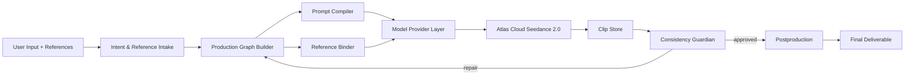

# CineJelly Project Context

## What This Project Is

CineJelly Seedance Ultimate Director is a commercial AI video production system. The product goal is to turn one user input, plus optional references, into a complete polished video using Atlas Cloud as the default provider for both LLM reasoning and Seedance 2.0 rendering.

## Core Product Goal

One input should produce:

1. intent and reference analysis
2. script/story structure
3. storyboard and shot contracts
4. Production Graph
5. Seedance prompt batch
6. rendered clips
7. consistency inspection and repair
8. postproduction assembly
9. final high-quality deliverable

The target long-form range is 2 to 8 minutes with high consistency.

## Non-Negotiable Rules

- Production-grade only.
- No test/mock/demo/sample/example files.
- Never commit `.env`, API keys, tokens, private keys, credentials, or generated customer media.
- Atlas Cloud is the default provider.
- Use a Model Provider Abstraction so future providers such as Kie.ai, fal.ai, Runway, Replicate, or direct Volcengine can be added later.
- Do not hardcode niche templates.
- Do not copy public prompt examples into product content.
- Do not copy AGPL code from OpenMontage into proprietary implementation.

## Architecture In One Screen

## Main Concepts

- `Production Graph`: system of record for project, references, story, sequences, scenes, beats, shots, renders, inspection reports, repairs, and deliverables.
- `Reference Binder`: classifies assets as identity, product, environment, motion, camera, audio tempo, style, first frame, last frame, or source-video structure.
- `Prompt Compiler`: turns shot contracts into Seedance-ready prompts and provider-neutral render requests.
- `Consistency Guardian`: checks identity, product, environment, motion, transition, audio, cross-modal sync, and delivery quality.
- `Model Provider Abstraction`: keeps Atlas Cloud-specific request details out of business logic.

## Source-Inspired Design

- Emily2040/seedance-2.0: intent-first Seedance workflow, reference roles, professional shot/QC handoff.
- YouMind-OpenLab/awesome-seedance-2-prompts: prompt structure patterns only, not copied prompt content.
- HKUDS/ViMax: multi-agent long-form planning, storyboard, reference selection, consistency validation.
- VibeFrame: deterministic artifacts, dry runs, cost gates, build/review reports, repair loop.
- DirectorBench: checkpoint-level long-form diagnosis across script, visual, audio, cross-modal, stability.
- HKUDS/VideoAgent: video understanding, intent decomposition, graph-powered tool planning.
- OpenMontage: reference-video analysis, approval gates, provider scoring, real-footage path, self-review.
- Atlas Cloud: default API gateway, OpenAI-compatible LLM endpoint, async media generation, Seedance 2.0 Universal Reference, Asset Library.

## Detailed Docs Map

- `docs/ARCHITECTURE_SPEC.md`: full system architecture and agent responsibilities.
- `docs/CREDITS.md`: attribution, license cautions, and source boundaries.
- `docs/PROMPT_COMPILER_DESIGN.md`: adaptive niche prompt compiler.
- `docs/PRODUCTION_GRAPH_AND_LONG_FORM.md`: 2 to 8 minute graph strategy.
- `docs/CONSISTENCY_GUARDIAN_DESIGN.md`: QA, inspection, and repair system.
- `docs/MODEL_PROVIDER_ABSTRACTION.md`: Atlas default and future provider contracts.
- `docs/FLEXIBLE_SEEDANCE_SETTINGS.md`: user settings for tier, resolution, quality, ratio, audio.

## Current Repo State

The repo currently contains architecture and design documentation plus production-ready folder boundaries. Source implementation is not yet built.

Current production folders:

- `src/cinejelly/agents`
- `src/cinejelly/api`
- `src/cinejelly/application`
- `src/cinejelly/config`
- `src/cinejelly/domain`
- `src/cinejelly/domain/production_graph`
- `src/cinejelly/domain/continuity`
- `src/cinejelly/providers`
- `src/cinejelly/providers/atlascloud`
- `src/cinejelly/providers/contracts`
- `src/cinejelly/rendering`
- `src/cinejelly/postproduction`
- `src/cinejelly/storage`
- `src/cinejelly/observability`
- `src/cinejelly/workers`
- `schemas`
- `config`
- `ops`

