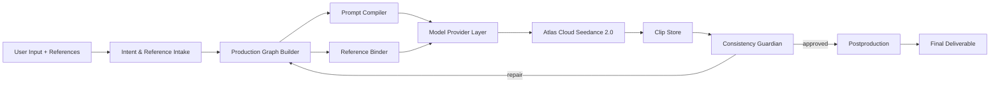

# CineJelly Project Context
> ⚠️ **TÀI LIỆU THIẾT KẾ — KHÔNG PHẢI MÔ TẢ CODE HIỆN TẠI.**
> Cập nhật lần cuối: **2026-07-04**. Từ đó tới nay mã nguồn đã đổi rất nhiều.
> Đọc [`BAN-DO-DU-AN.md`](../BAN-DO-DU-AN.md) để biết dự án HIỆN TẠI ra sao.
> Khi tài liệu này mâu thuẫn với code, **code đúng** — tài liệu là cái sai.

## What This Project Is

CineJelly Seedance Ultimate Director is a commercial AI video production system. The product goal is to turn one user input, plus optional references, into a complete polished video using Atlas Cloud as the default provider for both LLM reasoning and Seedance 2.0 rendering.

## Core Product Goal

One input should produce:

1. intent and reference analysis
2. script/story structure
3. storyboard and shot contracts
4. Production Graph
5. Seedance prompt batch
6. rendered clips
7. consistency inspection and repair
8. postproduction assembly
9. final high-quality deliverable

The target long-form range is 2 to 8 minutes with high consistency.

## Non-Negotiable Rules

- Production-grade only.
- No CineJelly-owned test/mock/demo/sample/example files in the production runtime. Upstream snapshot tests, mocks, demos, examples, generated build folders, temporary files, notebooks, sample media, generated datasets, cache files, binary model weights, and vendored font/music resources are pruned from `external/upstream/`; upstream material becomes product material only after an intentional copy/adapt step.
- Never commit `.env`, API keys, tokens, private keys, credentials, or generated customer media.
- Atlas Cloud is the default provider.
- Use a Model Provider Abstraction so future providers such as Kie.ai, fal.ai, Runway, Replicate, or direct Volcengine can be added later.
- Prefer data-driven niche adaptation (prompt-DNA corpora, scored candidates) over rigid hardcoded per-niche branches.
- Mine `external/upstream/` aggressively: adapt prompt patterns, pipeline logic, and structures into owned `src/`/`data/`/`docs/` with short attribution notes. No reference-implementation or faithful-logic-translation ceremony is required before building.
- Do not ship OpenMontage AGPL source verbatim in the commercial product; re-implement its behavior as owned TypeScript. Permissive-licensed material may be reused with a short notice.
- Do not `import` at runtime from `external/upstream/`; copy/adapt into owned modules so the product stays self-contained.

## Architecture In One Screen

```mermaid
flowchart LR
    A["User Input + References"] --> B["Intent & Reference Intake"]
    B --> C["Production Graph Builder"]
    C --> D["Prompt Compiler"]
    C --> E["Reference Binder"]
    D --> F["Model Provider Layer"]
    E --> F
    F --> G["Atlas Cloud Seedance 2.0"]
    G --> H["Clip Store"]
    H --> I["Consistency Guardian"]
    I -->|repair| C
    I -->|approved| J["Postproduction"]
    J --> K["Final Deliverable"]
```

## Main Concepts

- `Production Graph`: system of record for project, references, story, sequences, scenes, beats, shots, renders, inspection reports, repairs, and deliverables.
- `Reference Librarian` / `Reference Binder`: validates assets, classifies them as identity, product, environment, motion, camera, audio tempo, style, first frame, last frame, or source-video structure, and preserves graph lineage.
- `Source Video Analyst`: normalizes optional VideoAgent/OpenMontage-style transcript, scene, keyframe, pacing, style, structural beat, and safety deconstruction into bounded guidance for original story planning.
- `Audience Niche Intelligence`: shared no-spend Short/Long planner that classifies messy user presentation style, niche, format, funnel stage, trend posture, viewer desire/objection, proof strategy, share trigger, CTA strategy, localization/risk/missing signals, and idea seeds without hardcoding fixed niche templates.
- `Short Creative Pattern Learning`: no-spend Short planner that turns audience/niche intelligence, prompt signals, and redacted reference-video structure into many scored idea candidates, selecting a winning non-clone concept for scene directives and render handoff.
- `Source Video Auto Analyzer`: optional adapter that samples bounded frames from a clean HTTPS source-video reference and asks the configured Atlas LLM for original structural deconstruction before intake normalization.
- `Prompt Compiler`: turns shot contracts into Seedance-ready prompts and provider-neutral render requests, including photoreal realism guardrails and niche/creative-mode prompt DNA when shot metadata carries the short-pipeline keys.
- `Seedance Prompt DNA`: `src/core/seedance-dna.ts` resolves niche-adaptive and creative-mode-adaptive physical direction (distilled from the CC BY 4.0 awesome-seedance-2-prompts patterns, attributed) into the short-pipeline master prompt and the Prompt Compiler; `validation:seedance-dna` proves resolution, fallback, end-to-end firing, and seed/guidance flow with no spend.
- `Duration Scripting`: `src/core/duration-scripting.ts` guarantees full-runtime coverage for any duration — timestamped beat plans that tile the whole clip, video-level arc roles (opening hook / climax / closing resolve / full_video) stamped by the Shot Planner, a prompt-compiler runtime contract ("runs exactly Ns... do not finish early... Total: Ns"), whole-second duration compensation in the Director Agent for crossfade overlap and planning shortfall, per-candidate rendered-duration probing that routes meaningful shortfall into the rerender loop, and a short-side delivery-gate block at >10% undershoot; `validation:duration-scripting` proves beats/arcs/compensation/compiler/probe with no spend.
- `Keyframe-First Layer`: provider-neutral `ImageProvider` contract with Atlas `generateImage` (`/model/generateImage`, gated by `ATLASCLOUD_IMAGE_MODEL`) plus owned `src/core/keyframe-first-planner.ts` — per-shot opening-frame image requests conditioned on identity/product references and niche DNA, result binding that injects each generated keyframe as the shot's primary `first_frame` reference so the compiler flips to image-to-video, and cast portrait generation (`planCastPortraitRequests`/`bindPortraitsToCast`) that creates an identity portrait for cast members without a face image and locks it as their series-wide identity anchor; failures fail open; `validation:keyframe-first` proves planning/binding/mode-flip/portraits with no spend.
- `Subtitle Pipeline Foundations`: provider-neutral `SpeechProvider` contract with Atlas `transcribeAudio` (`/model/transcribeAudio`, gated by `ATLASCLOUD_SPEECH_MODEL`, sync-or-polled payloads, flexible segment mapping, redacted raw) plus owned `src/core/subtitle-caption-builder.ts` — one normalizing pipeline (sort, merge micro-fragments, split overlong lines on word boundaries with proportional timing, clamp flash-frames, enforce non-overlap) fed by two entry points: ASR segments from user audio, and `buildCaptionCuesFromAudioScript` which derives perfectly-synced zero-cost captions from the narration script CineJelly itself plans for TTS; `validation:speech-captions` proves both paths and provider gating with no spend. The env template is now a single Vietnamese-guided operator config file with required/model/feature/advanced sections.
- `Niche Playbook Intelligence (script-time training)`: a systematic mining of the full curated Seedance prompt corpus (131 proven prompts) distilled into `src/core/niche-playbooks.ts` — 13 content-family playbooks (cinematic_film, anime_animation, ugc_pov_authentic, commercial_product, action_vfx_fantasy, comedy_meme, food_asmr, music_dance, sports_fitness, travel_worldtour, transformation_reveal, family_kids, education_explainer) each specifying proven hook formulas, beat template, camera language, audio design, reference strategy, viral triggers, and anti-patterns. The Story Architect injects the matching playbook (routed by niche/creative-mode with Vietnamese keyword fallback) plus `SEEDANCE_MASTERY_DIRECTIVE` (cross-family rules: declared emotional pacing curve, audio as its own layer with lip-sync, explicit identity anchoring, one-job-per-reference with "never render the storyboard sheet", second-range scaffolding, designed final frame) into every scene-planning instruction (~2.2k chars), so scripts are born niche-smart. The short corpus gained 8 entertainment-family entries (anime power-up loop, deadpan static-camera absurdity, mythic scale spectacle, beat-synced performance, seamless transformation morph, beat-cut world tour, wholesome family arc, process ASMR). `validation:niche-playbooks` (15 checks) locks routing, completeness, directive size, architect injection, and corpus retrieval.
- `Pipeline to ~100% (final snapshot-gap closure)`: four upgrades close the named creative gaps from the parity audit. (1) Semantic long-form segmentation (`src/core/semantic-sequence-segmenter.ts`, wired into `long-form-sequence-planner.ts`) — ViMax's retrieval-driven essence: group scenes at narrative boundaries (subject shift, act shift setup->development->proof->resolution, act markers) inside a target duration band, instead of fixed `ceil(duration/45)` windows; deterministic, no-spend, null-safe. (2) SkyCaptioner completeness — `shot-grammar.ts` gains optional `cameraMotion` (11 values) and `subjectExpression` (9 values) axes emitted by the compiler; `planShotFramingSequence` assigns arc-appropriate motion (hook/climax push-in, ending pull-out, wides track). (3) Multi-view character portraits — `planCastPortraitRequests` takes a `views` option (front/three_quarter/side) for turnaround sheets; the front view stays the identity anchor, defaults to front-only (back-compatible). (4) Typography/text scene composition (`src/core/typography-scene-composer.ts`) — VibeFrame's HTML/CSS essence as deterministic, XML-safe SVG scenes (title_card/bullet_list/quote/stat_card/kinetic_text, 4 themes, 3 aspects) with a timed reveal plan, enabling faceless/explainer/caption videos without a paid video render (needs an SVG rasterizer in assembly to render to frames). `validation:pipeline-100` proves all four (24 checks). Remaining honest gaps: live paid-render proof, and non-creative surfaces (Director chat/VideoDB, AGPL-bounded OpenMontage code).
- `Admin Center + Admin-Favorable Refund Policy`: `/operator/topups` (alias `/operator/admin`) is now a full 3-tab operator console (Money / Customers / Settings). The Settings tab edits, live and without a redeploy, EVERYTHING via `src/api/admin-settings-store.ts` (values override .env, a fresh deploy still boots from .env): render pricing (credits/second + per-quality multipliers), the credit-package catalog (add/edit/delete), provider model ids (video/image/llm/speech, re-applied to env on save and at boot), bank-transfer info, studio content (announcement + featured upload:// images shown on the customer studio), and the refund policy. `refundPolicy` defaults to "manual" (admin-favorable): failed/canceled/rejected render charges are NOT auto-refunded — they enter a persisted refund queue (`RefundRequestRecord`, 5th SQL table) for one-tap operator approve/dismiss; switching to "auto" restores automatic refunds. Every settings change is audit-logged. All admin routes are deployment-token-only; customer /me reflects new pricing/packages/announcement immediately; the customer charge and boot reconciliation both read the effective policy. `validation:admin-center` proves settings validation + live customer reflection + refund-queue lifecycle + token-only access (27 checks); the launch rehearsal now proves the manual-refund flow end to end (video fails -> not auto-refunded -> queued -> operator approves -> customer credited).
- `Commercial Completeness (final MVP audit)`: a verified 4-dimension audit (feature completeness, UI flow, admin ops, first-10-customers) closed the remaining launch blockers: paid videos survive restarts (succeeded jobs persist a root-relative `deliverableRelativePath` through job history and stream after restore, owner-scoped), boot reconciliation only refunds UNKNOWN charges younger than 48h (delivered videos that aged out of retention are never silently refunded; job history persists by default with limit 500), and the review gate is operator-only (customer-sent approvals are stripped at submission, customers get 403 on the review route, raw /v1/render[-jobs] are operator-surface 403 for accounts) with a review desk on /operator/topups (approve/reject one tap; reject auto-refunds). Money-path guards: studio sends an Idempotency-Key per submit intent, duplicate top-ups coalesce to one pending request, the desk gains customer lookup + revenue summary, top-ups 503 until the operator fills real bank info, rate limiting is class-split (render strict, account/upload >=30/min for onboarding). Customer UX: password change (self) + admin temp-password reset, paused_for_review keeps polling with honest Vietnamese copy (no double-submit prompt), 402 shows at the render button with a top-up hint, terminal states announce refunds, an always-visible topbar Video button replaces the mobile-hidden sidebar toggle, sessions fall back to in-memory when localStorage is unavailable (Zalo/FB in-app browsers), and operator-only concepts (reviewer fields, USD preflight card) disappear for logged-in customers. The launch rehearsal now runs 40 live checks including a mid-flight SERVER RESTART (no double refunds, balances intact, job history restored, the paid video still downloads and stays owner-scoped).
- `Launch Rehearsal (final gate)`: `validation:launch-rehearsal` boots the real server and walks the exact shipped journeys over HTTP with the UI's own payloads — register/login, session upload, package top-up + operator approval, pipeline session, render submit, up-front charge, the commercial review gate (paused_for_review -> operator approves with ui-contract checkpoints -> queued), provider failure, LIVE automatic refund, full statement, zero-balance 402, cross-tenant isolation, admin adjust, logout (30 checks). It caught two real money bugs the static rounds missed: charges never fired on the review-gated default flow (fixed: `chargeableSubmissionStatus` commits money on queued AND paused_* submissions), and pre-render review rejections skipped settlement (fixed: rejected emits finalization; blocked stays re-reviewable so its charge is kept until a true terminal). `validation:ui-contract-crosscheck` statically proves every JS-touched element id, fetched API path, and upload/modal target on all three shipped pages exists and routes correctly.
- `Money-Path Hardening (final audit round)`: a 6-dimension multi-agent audit surfaced and code-verified real money holes, all closed: EVERY render route now charges customer principals (`planUserRenderCharge` on all 4 routes including direct `/v1/render-jobs` and sync `/v1/render` — previously customers rendered free there); charges apply only to submissions that actually queue (immediately-rejected/paused submissions are never charged); a global `onJobFinalized` seam on the job manager refunds every non-succeeded terminal transition (failed/canceled/rejected/blocked, including review-desk rejections and pre-run cancels); boot-time `reconcileRenderCharges` refunds charges whose jobs vanished in a restart; idempotent replays are tenant-scoped; customer principals cannot pin `metadata.workspaceId` (quota-drain guard); register/login/topups/uploads are rate-limited; upload handles carry 128-bit names; `GET /` lands on the studio.
- `Database Choice`: `CINEJELLY_DATABASE_KIND=json|sqlite|postgres` selects the account-store durability driver (`src/api/account-persistence.ts`): json (default zero-setup), sqlite via built-in node:sqlite (Node 22 — the production image), postgres via operator-installed `pg` with a serialized write queue. In-memory state + write-through keeps all reads synchronous.
- `Operator Money Desk`: `/operator/topups` is a Vietnamese one-screen page for the daily task — see pending bank-transfer top-ups, approve/reject one tap, manual credit adjust — replacing raw curl. `CINEJELLY_TOPUP_BANK_INFO` moved to the [BAT BUOC] section; `npm run backup:data` snapshots the money data with a Vietnamese restore note; `docs/HUONG-DAN-TRIEN-KHAI.vi.md` is the non-coder start-to-finish deploy guide.
- `Customer Accounts + Credit Billing (Topview-style)`: customers register with email + password (scrypt hashes, hashed session tokens, login lockout), top up a credit balance by choosing a package (default: Goi Thu/Pro/Studio; override via `CINEJELLY_CREDIT_PACKAGES_JSON`) with bank-transfer instructions (`CINEJELLY_TOPUP_BANK_INFO`) and operator approval (`/v1/admin/topups`), and never see an API key. Render jobs charge predictable credits up front (`CINEJELLY_CREDITS_PER_RENDER_SECOND` x seconds x quality multiplier) with a clean 402 before any provider spend and an automatic idempotent refund when a job fails or is canceled (jobManager onFinished hook). Session tokens are issued via response header (bodies pass through the secret redactor by design). Jobs, sessions, and uploads are scoped per account (`user:<id>` client filter). The create page ships a mobile-ready login/topup UI with balance + per-video credit estimate; the admin API key field is hidden behind the gear toggle. `validation:account-billing` proves the whole loop (37 checks) with no spend; a payment gateway later replaces only the approval step.
- `Reference Uploads (UI)`: users upload KOL/product/scene/frame images (and source video) straight from the create page — `POST /v1/uploads` (auth-guarded, size-capped via `CINEJELLY_UPLOAD_MAX_BYTES`, extension whitelist) stores files in the confined `<output>/uploads/` directory and returns an opaque `upload://<random>` handle that never exposes server paths. Every layer understands the handle: response redaction treats it as safe, the short-pipeline plan classifies it `upload_handle_retained` + provider-ready, render admission accepts it, and the Atlas provider resolves it back to the stored file and uploads the bytes directly at registration time, so references work with zero public hosting. `validation:upload-route` proves the full loop (auth, rejects, round-trip, traversal, oversize, UI controls) with no spend.
- `Keyframe-First (auto)`: the director loop now runs the keyframe-first stage automatically — when an image model (`ATLASCLOUD_IMAGE_MODEL`) is configured and the selected video model accepts a first-frame anchor, one still keyframe is generated per shot and each bound shot flips to image-to-video. The pre-spend cost gate includes the planned keyframe images (`CINEJELLY_IMAGE_COST_USD`), and the stage fails open per shot (a failed still leaves that shot on its original path). Previously this was API-only and never invoked.
- `Video-Level Consistency Gate`: `ConsistencyGuardian.inspectVideoConsistency` runs once per render batch before spend and catches what per-shot preflight cannot: a character locked to different identity assets across shots (guaranteed face drift), identity locks fed from video instead of a still portrait, missing front-view anchors, characters demanded by continuity in 2+ shots with no identity reference anywhere, and monotone framing across the batch (slideshow risk). Repair-level findings block spend; wired into the director preflight barrier.
- `Duration Rhythm`: `planDurationBeats` paces beats non-uniformly (short-drama tempo): development beats get progressively shorter so cutting accelerates toward the peak, and the proof/payoff beat is held longest. Segments still tile the full runtime exactly for any duration.
- `Script-First Mode`: users can paste a finished script — `SimpleBriefInput.script` wraps it in explicit markers, and the Story Architect detects pasted scripts (marker or heuristic via `looksLikeUserScript`) and switches to a hard verbatim directive: scene order and lines preserved in the original language, only the visual staging is planned around them.
- `Social Publishing Metadata`: every director run returns `socialPublishing` (platform-aware title, description, hashtags, call to action; Vietnamese/English) built deterministically from the premise at zero spend, so a finished deliverable can be posted immediately.
- `Deliberate scope cuts (documented, not silent)`: novel-to-video RAG compression, deterministic HTML/CSS scene composition for typography-heavy videos, and a named multi-model gateway menu (superseded by the provider abstraction) are consciously out of scope for the current product; they are roadmap items, not missing absorptions.
- `Cinematic Framing Variation`: `planShotFramingSequence` in `src/core/shot-grammar.ts` assigns a deliberately varied per-shot framing across a whole video — framing follows the emotional arc (hooks/climaxes push closer), adjacent shots never repeat the same shot size (anti-monotony, the top tell of cheap AI video), and the shot-size palette adapts to creative mode (UGC stays tight and handheld, cinematic roams from long shots to extreme close-ups). The Shot Planner stamps this framing onto each shot (explicit caller grammar still wins) so the existing compiler grammar section emits it as a hard instruction; `validation:shot-framing` proves arc bias, anti-monotony, mode adaptation, end-to-end planner->compiler flow, and explicit-override precedence with no spend.
- `Shot Grammar`: `src/core/shot-grammar.ts` adds a controlled framing vocabulary (shot type / camera angle / camera position enums with physical directives plus arc-role derivation); the prompt compiler emits a "hold exactly" framing lock only when shot metadata carries valid grammar keys, so explicit framing never fights planner camera prose.
- `Simple Brief Resolver`: `src/core/simple-brief-resolver.ts` is the beginner-proof input contract — one idea plus optional face/product/environment/style uploads and platform resolves into full quality-first settings (platform ratio/duration matrix, 1080p, hybrid audio, last-frame chaining) with every default explained in plain language for the UI and `advanced` overrides always winning; `validation:simple-brief` proves defaults/references/overrides/guards with no spend.
- `Series Drama Planner`: `src/core/series-drama-planner.ts` turns one premise plus cast identity references into a deterministic multi-episode short-drama plan — a series bible with cross-episode face/wardrobe/location consistency contracts, a five-phase macro arc, per-episode 3-second cold-open hooks, phase-mapped conflicts and twists, cliffhanger endings on every episode except the resolved finale, and an ending-state to recap-hook chain; `episodeRenderRequestFor` emits normal render requests carrying seriesId/episodeNumber/videoEndingStyle metadata and identity references, and the prompt compiler swaps the settled ending for a cut-before-resolution cliffhanger hold on final shots when `videoEndingStyle=cliffhanger`; `validation:series-drama` proves bible/episodes/chain/requests/compiler with no spend.
- `Candidate Visual Curation`: `src/core/rendered-candidate-visual-inspector.ts` samples frames from each rendered candidate and merges multimodal visual findings into the deterministic render inspection so candidate selection prefers visually clean takes and the repair loop re-renders visually bad shots; opt-in per request via `semanticVisualInspectionOptions` plus a work directory, fail-safe to `warn` on infrastructure errors, and `validation:candidate-visual-curation` proves mapping/merging/fail-safe with no spend.
- `Storyboard Planner`: turns shot contracts into deterministic reviewable storyboard panels before render spend; Guardian validates panel coverage/alignment before provider calls.
- `Consistency Guardian`: checks identity, product, environment, motion, transition, audio, cross-modal sync, and delivery quality.
- `Model Provider Abstraction`: keeps Atlas Cloud-specific request details out of business logic.
- `Request Context`: creates or accepts a sanitized request correlation ID, returns it in API responses, and carries it through render jobs, provider metadata, Production Graph project metadata, and durable artifacts.
- `HTTP Lifecycle`: converts client disconnects and deployment shutdown signals into AbortSignal cancellation for active request-bound render orchestration.
- `Clip Materialization`: streams provider clip URLs into bounded local files before FFmpeg assembly, avoiding full-clip memory buffering during long-form jobs.
- `Media Tool Resolution`: resolves FFmpeg and FFprobe through `CINEJELLY_FFMPEG_PATH` / `CINEJELLY_FFPROBE_PATH` when configured, otherwise through `PATH`, and uses the same commands for preflight and runtime media engines.
- `Local Material Library Adapter`: optionally resolves source-material briefs from an operator-owned JSON catalog using safe `asset://` or credential-free HTTPS URIs before centralized material validation.
- `Remote Stock Material Adapter`: optionally resolves source-material briefs from Pexels, Pixabay, and commercially approved Coverr through key-gated provider searches, attribution metadata, and credential-free HTTPS candidate URIs; the no-spend adapter smoke proves disabled/no-fetch, provider credential boundary, Coverr commercial approval, fail-closed, and MaterialSourceValidator behavior before live provider calls.
- `Postproduction Asset Planner`: classifies supplied caption cues, supplied audio tracks, and generated-audio intents into deterministic planning evidence before final assembly.
- `AudioProvider Boundary`: defines provider-neutral generated-audio capability/request/result contracts; Atlas exposes generated-audio capabilities only when reviewed capability JSON is configured, `generateAudio` execution remains behind explicit spend, schema-review, output-validation, and manual-review gates, audio prediction polling tolerates retryable transient polling failures until the overall timeout, structured terminal failed prediction bodies are not retried indefinitely, and existing prediction IDs can be resume-polled without resubmitting generation.
- `Generated Audio Asset Resolution`: maps reviewed generated-audio `asset://` outputs to credential-free HTTPS delivery URLs before mixing, without provider calls, downloads, or generated files.
- `Generated Audio Asset Resolution Catalog`: validates an optional operator-owned JSON catalog for generated-audio `asset://` to HTTPS mappings during preflight without enabling provider-backed audio execution.
- `Stage Progress Telemetry`: reports bounded current-stage events for async render jobs before final artifacts exist.
- `Render Job History Persistence`: optionally stores compact, redacted async job summaries at `CINEJELLY_API_JOB_HISTORY_PATH`, persists bounded provider checkpoint summaries from cost-ledger entries, restores terminal history after API restart with explicit compact-history markers, and converts stale queued/running snapshots into canceled/audit-required history with provider prediction evidence when available.
- `Render Provider Reconciliation`: queries active checkpoint prediction IDs through the provider abstraction and emits redacted terminal/still-active/query-failure evidence without raw provider payloads; durable queue leasing and automatic distributed resume remain separate unfinished work.
- `Render Provider Handoff`: wraps provider reconciliation in bounded local file leases, a deployment-token-protected lease-service route, or an HTTPS external lease-service adapter so terminal provider work can be closed, still-active work can heartbeat-renew its lease for polling, held-by-other work can defer safely, redacted terminal-close/resume-polling/manual-audit action intents can replay by stable idempotency key, callback execution evidence can persist so repeated executor runs do not duplicate actions, `validation:graph-resume-state` can prove a digest-only Production Graph resume-state capsule plus local enqueue/replay/lease/ack queue lifecycle that survives reload without raw graph state/output URLs/local paths/secrets/raw prediction IDs/raw queue names/raw worker IDs, `validation:graph-resume-queue-service` can prove the deployment-token-protected `/v1/production-graph-resume-queue/*` service contract against a local server and preflight queue path, `validation:provider-graph-resume-worker` can prove the no-spend worker bridge from action-ledger `resume_polling` record to matching digest-only capsule to protected queue enqueue/replay without using it as live evidence, a local two-worker smoke can prove held-by-other plus post-expiry ownership handoff, a production capture runner can exercise the protected lease-service route on a real HTTPS host, `validation:provider-live-action-draft` can generate a non-evidence template/checklist for live callback packets, `validation:provider-graph-resume-draft` can generate a separate non-evidence template/checklist for digest-only graph-resume enqueue payload packets, `validation:provider-live-actions` can validate archived live provider callback evidence with safe placeholder-free identifiers while counting graph-resume enqueue evidence separately only when resume action, graph enqueue kind, and resume-enqueued result are on the same reviewed execution, and `validation:provider-graph-resume` can validate a separate digest-only graph-resume enqueue payload packet bound to that live action evidence; archived production multi-worker ownership, live Atlas provider action execution evidence, live queue enqueue proof, and automatic graph resume remain separate unfinished work.
- `API Artifact Validation Evidence`: validates synchronous render and retained async job artifacts after success/failure artifact writes and exposes release-gate status without server-local paths.
- `Async Pre-Export Review Gate`: lets `/v1/render-jobs` pause after runtime success, artifact writing, and artifact validation so a reviewer can accept or reject artifact-bound media, caption, audio, and claim evidence through `/v1/render-jobs/{jobId}/review`; approved pre-export review releases the retained job result without rerendering or reserving provider spend again.
- `Render Request Validation Contract`: validates an operator-owned render request file through CineJelly admission and output-root normalization before readiness-gated paid provider work.
- `Deployment Readiness Capture`: archives no-spend real-host `/health`, `/v1/preflight`, `/v1/validation-readiness`, and `/v1/render-settings` evidence; localhost captures remain smoke-only and cannot satisfy the business deployment gate.
- `Deployment Container Packaging`: root Docker packaging plus `validation:deployment-package` builds and statically checks the production API container path with FFmpeg/FFprobe, keeps `.env` and generated artifacts out of the image context, and gives operators a repeatable way to place the API behind HTTPS before capturing no-spend deployment evidence.
- `API Client Policy Kit`: no-spend helper that creates digest-only client policy JSON, env snippets, optional ignored raw-key secret files for secure customer onboarding, and a safe env-merge path that preserves existing Atlas keys/tokens.
- `Workspace Project Billing Foundation`: opt-in workspace/project policy gate through `CINEJELLY_WORKSPACES_JSON`, required workspace enforcement, client-to-workspace assignment, project enablement, credit and monthly reserved-cost/request quota checks, deployment-token admin diagnostics, and a safe JSONL workspace usage ledger that records only identifiers and reservation numbers.
- `Agentic Short Pipeline Foundation`: `ShortPipelineConversationEngine`, `ShortPipelineSessionStore`, `ShortPipelinePlanner`, `ProductUrlBriefExtractor`, `ProductUrlResearcher`, `BrandKitEvaluator`, `WorkflowTemplateRegistry`, `ShortPipelineRenderHandoff`, `/short/create`, `/v1/short-pipeline/conversation`, `/v1/short-pipeline/conversation-sessions`, `/v1/short-pipeline/conversation-sessions/{sessionId}/ui-contract`, `/v1/short-pipeline/conversation-sessions/{sessionId}/render-jobs`, `/v1/short-pipeline/plan`, `/v1/short-pipeline/product-url-plan`, `/v1/short-pipeline/render-jobs`, `validation:short-mvp-ui-contract`, `validation:short-pipeline-conversation`, `validation:short-pipeline-session-store`, `validation:short-pipeline-session-render-handoff`, `validation:short-pipeline`, and `validation:product-url-extraction` create no-spend short-form planning evidence from natural-language chat turns, revision requests, approval-intent detection, durable redacted session persistence, a first-party browser create/review shell, safe scene/audio/caption/claim checkpoint controls, a no-spend approval-packet contract, server-side stored-session render handoff, product URL fingerprint, bounded product-page extraction behind explicit live-network confirmation, product facts snapshot, optional template suggestions, and brand-kit policy; templates remain optional accelerators, product URLs and raw transcript are not serialized raw, unsafe product URL query values block before fetch, durable session list/detail/UI-contract/render-handoff reads are client-scoped, forbidden brand claims block planning, scene/audio/caption/claim approval checkpoints are emitted before render, pending stored-session review creates paused jobs, unsafe approved-looking review creates blocked jobs, and accepted review evidence can be handed into the normal async render-job lifecycle only with explicit render confirmation and without bypassing admission, quota, cost, review, idempotency, or artifact gates. `video-db/Director` is now snapshotted and recorded as the Director Agentic Media Reasoning baseline, but live accepted review operation evidence, archived live URL evidence, accepted product fact review, product-media rights review, live short-pipeline paid render evidence, VideoDB-style media library/playback, managed multi-instance storage/backups, and full Director parity remain pending.
- `Short Review Operation Evidence`: no-spend draft handoff, validator, and guard smoke through `validation:short-review-operation-draft`, `validation:short-review-operation`, `validation:short-review-operation-guard`, `schemas/short-review-operation-evidence-draft-report.schema.json`, `schemas/short-review-operation-evidence.schema.json`, `schemas/short-review-operation-validation-report.schema.json`, and `schemas/short-review-operation-evidence-guard-smoke-report.schema.json` give operators a strict ignored packet contract for deployment-scoped accepted scene/audio/caption/claim review operations. The validator requires explicit `--confirm-accepted-review-operation`, rejects unsafe accepted-looking notes and direct template use, keeps `confirmRenderSubmission=false`, and does not replace accepted product URL evidence, media-rights approval, paid render evidence, artifact validation, or customer-traffic readiness.
- `Short Product Rights Evidence`: no-spend draft handoff, validator, and guard smoke through `validation:short-product-rights-draft`, `validation:short-product-rights`, `validation:short-product-rights-guard`, `schemas/short-product-rights-evidence-draft-report.schema.json`, `schemas/short-product-rights-evidence.schema.json`, `schemas/short-product-rights-validation-report.schema.json`, and `schemas/short-product-rights-evidence-guard-smoke-report.schema.json` give operators a strict ignored packet contract for accepted product facts, claim substantiation, product URL extraction hashes, media ownership, commercial-use approval, model-release status, trademark/third-party mark review, attribution digest, session binding, and redaction review. The validator requires explicit `--confirm-accepted-product-rights`, rejects unsafe accepted-looking product/rights notes and direct template use, and keeps review-operation, paid render, artifact validation, manual media review, and customer-traffic approval as separate gates.
- `Business Ops Config Precheck`: validates client-policy quota configuration plus non-secret billing/admin and production-operations attestations, can write incomplete drafts, and can promote completed drafts into ignored `ops/*.json` inputs only after validation, all without network, Atlas, render, or billing-provider calls.
- `Live Readiness Input Validator`: no-spend local gate that checks whether deployment URL/auth, Atlas billing/budget readiness, ops attestations, source-video URL/settings, remote stock approvals, generated-audio capability inputs, and long-form budget are ready before any live network or paid Atlas validation.
- `Business Readiness Validation Plan`: no-spend planning report that reads current evidence, Atlas billing readiness, secret-free env shape, and configured cost assumptions to sequence the remaining evidence gates before paid Atlas spend.
- `Commercial Launch Intake`: no-spend ignored-input validator and raw input schema that gives operators one machine-checkable `ops/commercial-launch-intake.json` contract for clean deployment/source URLs, env var names, commercial offer scope, budget scope, provider choices, and manual-review policy before live or paid evidence runs; passing intake values can feed the no-spend live-input and business-plan reports without exposing secrets, and `validation:report-contracts` validates the raw ignored intake directly when it exists.
- `Commercial Launch Inputs`: no-spend JSON and Markdown packet that turns the current readiness reports into the exact operator-provided URLs, env placeholders, attestation files, approved budget, product-scope decision, live evidence commands, paid validation commands, manual review tasks, and a safe-to-share `operatorHandoffManifest` of ignored operator files, draft/template files, report archives, guarded command order, and expanded required-input validation steps still required before commercial launch.
- `Operator Launch UI Contract`: deployment-token admin API, first-party operator dashboard shell, and smoke gate that compress fixed business-readiness, completion, roadmap, launch-doctor, commercial-inputs, snapshot-parity, report-contract, and ops-config reports into one no-spend dashboard contract for source-report cards, readiness, budget, operator input, product-gap, and prioritized action UI without exposing raw report payloads, local absolute paths, tokens, or customer-release approval.
- `Business Completion Audit`: no-spend JSON and Markdown summary that separates remaining code/schema/command-plan/snapshot-parity blockers from true operator, external-provider, budget, paid-validation, and manual-review blockers while keeping full-parity product-code gaps visible and expanding operator validation steps into phase-level evidence closure commands.
- `Roadmap Closure Audit`: no-spend JSON and Markdown audit that maps roadmap and snapshot "what remains" requirements to current blocker IDs, product-code gaps, evidence reports, local prep commands, direct evidence commands with guard flags, and release gates before any 100% or customer-traffic claim.
- `Commercial Launch Doctor`: no-spend one-command orchestrator that refreshes build, snapshot parity guardrails, source-video and remote-stock adapter smokes, local smoke, provider resume/handoff smoke evidence, provider live-action and graph-resume draft handoffs, release hygiene, Short review-operation/product-rights guards, Short operator draft handoffs, Short accepted-packet validation status, Director-style quality benchmark, Director/generated-audio/long-form review draft handoffs, generated-audio and long-form manual-review readiness, review-evidence guard smoke, accepted review-evidence readiness, launch-intake draft/validation, ops-config operator attestation drafts/validation, business-plan, business-readiness, completion, roadmap closure, commercial offer scope, and report-contract evidence into one operator-facing JSON/Markdown report before any paid or live evidence run.
- `Director-Style Benchmark Harness`: no-spend backend quality benchmark that reads persisted CineJelly render evidence plus optional structured semantic review JSON, optional structured audio review JSON, optional structured ASR/lip-sync runtime review JSON, optional structured governance review JSON, optional generated-audio validation report JSON with artifact SHA binding checks, and optional local rendered media, emits DirectorBench-style script/video/audio/stability/cross-modal scores, confidence, bottlenecks, limitations, JSON schema evidence, redacted FFprobe/sampled-frame/scene-change transition-boundary/audio-waveform/audio-video-duration proxy signals, optional semantic-review/audio-review/runtime-review/governance-review/generated-audio checkpoint summaries, a contract-validated accepted review-evidence readiness report with schema/redaction guard smoke, a contract-validated parity evidence matrix, and append-only JSONL history without copying or executing upstream no-license code.
- `Atlas Billing Readiness`: no-spend Atlas Billing Public API guard that can verify billing-capable key access and budget/balance fit before any additional paid Atlas validation, without calling model endpoints.
- `Report Contract Validation`: no-spend schema-shape gate that validates generated release/business-readiness reports against local JSON schemas and catches drift without changing blocked business status.
- `Snapshot Parity Audit`: no-spend local guardrail that verifies expected subtree snapshots, source-lineage coverage, Reference Implementation anchors, and the no-direct-import boundary before parity claims or launch-doctor handoff.
- `Billing Admin Operations Evidence`: archives no-spend client-policy, usage-ledger, deployment admin endpoint, and non-secret billing/admin attestation evidence; it does not call payment provider APIs or replace external billing systems.
- `Production Operations Evidence`: archives no-spend real-host diagnostic endpoint evidence plus non-secret durable storage, backup, monitoring, incident, support, redaction, and retention attestation evidence.
- `Long-Form Validation Evidence`: archives 2-8 minute request admission, readiness, budget, provider-safe chunking, paid-render, artifact, manual-review readiness, and artifact-bound manual quality/redaction review evidence before business-readiness can count long-form rendering; `validation:long-form-review-draft` creates the no-spend template/checklist for that manual review and `validation:long-form-review-readiness` checks paid-artifact/manual-review readiness without letting either helper count as business evidence.
- `Generated Audio Validation Evidence`: archives Atlas generated-audio capability, spend gate, schema-review, execution, output-batch, ledger, artifact SHA-256/duration capture, manual-review readiness, and manual-review evidence for the business-readiness audit; a separate no-spend polling-resilience smoke proves retryable Atlas audio polling and terminal failed-body handling without counting as live generated-audio quality evidence.
- `Review Packet`: redacted customer/operator handoff artifact summarizing planning, render, cost, delivery, and QC evidence.

## Snapshot-Integrated Design

- Emily2040/seedance-2.0: intent-first Seedance workflow, reference roles, professional shot/QC handoff.
- YouMind-OpenLab/awesome-seedance-2-prompts: prompt structure patterns, reusable prompt anatomy, and attribution-reviewed prompt-pattern snapshots.
- HKUDS/ViMax: multi-agent long-form planning, storyboard, reference selection, consistency validation.
- vericontext/vibeframe: deterministic artifacts, dry runs, cost gates, build/review reports, repair loop.
- jiaminchen-1031/DirectorBench: checkpoint-level long-form diagnosis across script, visual, audio, cross-modal, stability.
- video-db/Director: chat-style media reasoning, dynamic agent/tool orchestration, media content payloads, WebSocket-style progress, and frontend chat/playback workflow patterns.
- HKUDS/VideoAgent: video understanding, intent decomposition, graph-powered tool planning.
- calesthio/OpenMontage: reference-video analysis, approval gates, provider scoring, real-footage path, self-review.
- harry0703/MoneyPrinterTurbo: staged one-input video generation, material sourcing, batch outputs, subtitles/TTS/BGM, task progress, API/CLI/WebUI operations.
- Atlas Cloud: default API gateway, OpenAI-compatible LLM endpoint, async media generation, prediction/result polling compatibility, Seedance 2.0, direct clean references, and media upload.

Local curated upstream source snapshots are stored under `external/upstream/` and governed by `docs/SUBTREE_POLICY.md` plus `docs/EXTERNAL_SOURCE_SNAPSHOTS.md`.

Faithful Logic Translation is the required path for high-fidelity implementation of important upstream behavior. The goal is to preserve useful logic details such as ordering, weighting, edge cases, fallback decisions, and repair strategy while rewriting the production module as CineJelly-owned TypeScript. The Reference Implementation step is a non-production bridge under `docs/`; it must not be imported by runtime code.

## Detailed Docs Map

- `docs/ARCHITECTURE_SPEC.md`: full system architecture and agent responsibilities.
- `docs/CREDITS.md`: attribution, license cautions, and source boundaries.
- `docs/SUBTREE_POLICY.md`: Git Subtree workflow, `--squash` requirement, and copy/adapt rules.
- `docs/EXTERNAL_SOURCE_SNAPSHOTS.md`: subtree inventory, license status, source-fidelity policy, and reuse boundaries.
- `docs/FAITHFUL_LOGIC_TRANSLATION_PROCESS.md`: six-step process for translating source behavior into CineJelly-owned production logic.
- `docs/IMPLEMENTATION_ROADMAP.md`: practical phase-by-phase plan for translating high-value upstream logic into production modules.
- `docs/ROADMAP_FIDELITY_AUDIT_2026-06-14.md`: owner-level audit of current roadmap completion, subtree fidelity, blockers, and next validation steps.
- `docs/SNAPSHOT_FUNCTION_PARITY_AUDIT_2026-06-17.md`: strict current baseline for feature parity percentages against each upstream snapshot, including UI absence, commercial readiness, and GitHub update discipline.
- `docs/BEGINNER_QUICKSTART.md`: shortest setup path for non-specialist operators, including automation boundaries and clean-source checks.
- `docs/RUNNING_AND_MODEL_SETTINGS_GUIDE.md`: practical install, environment, model, API, settings, and no-UI runtime guide.
- `docs/reference-implementations/deployment-container-packaging.md`: repeatable container packaging and static validation contract for API deployment without baked secrets or generated artifacts.
- `docs/PROMPT_COMPILER_DESIGN.md`: adaptive niche prompt compiler.
- `docs/PRODUCTION_GRAPH_AND_LONG_FORM.md`: 2 to 8 minute graph strategy.
- `docs/CONSISTENCY_GUARDIAN_DESIGN.md`: QA, inspection, and repair system.
- `docs/MODEL_PROVIDER_ABSTRACTION.md`: Atlas default and future provider contracts.
- `docs/FLEXIBLE_SEEDANCE_SETTINGS.md`: user settings for tier, resolution, quality, ratio, audio.

## Current Repo State

The repo contains architecture/design documentation, curated upstream source snapshots, and a substantial production TypeScript foundation for the first commercial pipeline. The implementation is CineJelly-owned product code adapted from credited source snapshots where useful; external snapshots are not live dependencies, direct production imports from `external/upstream/` are disallowed, and bundled prompt corpora or upstream implementation logic require the license review path described in `docs/SUBTREE_POLICY.md`.

The current foundation is ready for the next wave of high-fidelity source translation, but it should not be read as full upstream parity. Before changing behavior-critical modules, create or update a Reference Implementation using `docs/FAITHFUL_LOGIC_TRANSLATION_PROCESS.md`, then rewrite the behavior into the appropriate CineJelly layer under `src/`.

Current production folders:

- `src/agents`
- `src/core`
- `src/prompt_compiler`
- `src/providers`
- `src/config`
- `src/utils`
- `src/types`
- `data`
- `external`
- `external/upstream`
- `schemas`
- `config`
- `ops`

Implementation status:

- Treat the bullets below as implementation foundation status, not proof of full upstream parity. A behavior is source-faithful only after its Reference Implementation, CineJelly rewrite, lineage record, and validation checklist are complete.
- `docs/` contains the architecture and design source of truth.
- `src/core/material-sourcing-planner.ts`, `src/core/local-material-library-adapter.ts`, `src/core/remote-stock-material-adapter.ts`, `src/core/material-source-validator.ts`, `src/core/postproduction-asset-planner.ts`, `src/core/generated-audio-execution-planner.ts`, `src/core/generated-audio-provider-execution-runner.ts`, `src/core/generated-audio-output-validator.ts`, `src/core/generated-audio-output-batch-validator.ts`, `src/core/generated-audio-asset-resolver.ts`, `src/core/production-stage-planner.ts`, and `src/types/stage.ts` implement the first MoneyPrinterTurbo/VibeFrame-inspired material sourcing, local catalog fulfillment, opt-in remote stock fulfillment, material candidate validation, postproduction asset planning, generated-audio intent/execution/output validation, provider-neutral generated-audio ready-item execution, generated-audio result-batch reconciliation, optional generated-audio batch artifact evidence, generated-audio asset resolution/catalog validation, and stage lifecycle foundation as CineJelly-owned TypeScript; `tests/run-generated-audio-mapping-smoke.mjs` now proves narration/BGM/ambience/SFX kind identity, provider-preference blocking, duration blocking, safe result-to-track role mapping, and kind-mismatch rejection with no provider calls; `src/types/provider.ts`, `src/providers/contracts.ts`, `src/providers/atlascloud/atlas-cloud-provider.ts`, `scripts/run-atlas-generated-audio-validation.mjs`, `scripts/capture-generated-audio-artifact-evidence.mjs`, and `scripts/validate-generated-audio-manual-review-readiness.mjs` now include generated-audio provider contract, Atlas `generateAudio` submit/poll mapping, business-readiness validation boundaries, paid `eve` output validation evidence, artifact SHA-256/duration capture for manual-review binding, machine-checkable manual-review readiness, and structured manual-review handoff, but manual listening evidence remains pending.
- `src/core/source-logic-translation-ledger.ts`, `src/core/source-logic-translation-records.ts`, and `src/types/source-translation.ts` provide a lightweight production contract and seeded source-logic records for recording source-derived logic lineage, Reference Implementation paths, license state, preserved behavior, changed behavior, destination modules, and validation status without importing upstream snapshots.
- `src/types/logging.ts` and `src/utils/logger.ts` provide a redacted logging contract and console-backed logger foundation. Future provider, prompt, graph, and guardian work should inject or pass this logger instead of adding direct `console.*` calls.
- `src/providers` implements provider-neutral contracts, provider-neutral capability validation, an Atlas Cloud default provider, robust structured LLM JSON parsing, async prediction polling, documented Atlas media upload plus direct clean `https://`/`asset://` reference handling, generated-audio provider-neutral contracts, Atlas `generateAudio` submit/poll execution for verified generated-audio capabilities, retryable generated-audio polling resilience before the overall timeout, resume polling for existing generated-audio prediction IDs, structured terminal failed-body handling, error normalization with redacted non-JSON HTTP diagnostics, Atlas request timeout/abort ProviderError normalization with redacted reason details, bounded Atlas JSON metadata response parsing, configurable Seedance capabilities, nested Atlas prediction output URL extraction, and cost ledger tracking with prediction IDs, media reference IDs/URLs, provider status, provider-returned usage/cost metadata when available, error code, retryable flag, actual retry counts for retryable Atlas HTTP calls, and graph/model context for prediction polling.
- `src/prompt_compiler` implements the Seedance prompt compiler, provider-capability-aware `PromptBindingPlan`, role-based reference ordering, provider reference filtering, authorized source-video provider handoff, binding conflicts, compression notes, negative constraints, and repair hints.
- `src/core` implements Production Graph building with validated `reference_asset` lineage nodes, source-video analysis lineage on project nodes, storyboard panel and storyboard preflight nodes, Production Graph `reference_selection` nodes for selected/dropped reference evidence, Production Graph `material_sourcing` nodes for rights-aware material briefs, local material catalog fulfillment for operator-owned safe asset URIs, remote stock fulfillment for opt-in approved providers with credential-free candidate URIs, opt-in source-video auto-analysis from bounded sampled frames through the configured Atlas LLM and Source Video Analyst normalization, stage lifecycle planning for plan/storyboard/prompt/source_material/render/inspect/repair/assemble/deliver, material source validation for adapter candidates against known briefs, approved sources, URI safety, rights/attribution, duration, aspect ratio, resolution, and URI-free deterministic candidate scoring/evaluation evidence, postproduction asset planning for supplied caption cues, supplied audio tracks, and generated-audio intents before assembly, provider-neutral generated-audio ready-item execution when an `AudioProvider` and verified capabilities are present, generated-audio result-batch reconciliation against ready execution plans, generated-audio asset resolution for reviewed `asset://` outputs before mix-track creation, Production Graph run evidence recording for test-take/selected/rejected/repair render candidates, clip inspections, deliverables, configurable render cost gating with quality-mode test-take, candidate, and repair multipliers, smart chunking, dependency-aware render scheduling, shot planning, ViMax-inspired deterministic reference selection scoring fed by bounded camera/composition/character/view/timeline metadata when provided or source-video-derived, deterministic storyboard planning, continuity ledger generation for Character/Style bibles, Consistency Guardian storyboard/preflight/test-take/render inspection including Prompt Binding Plan conflicts and repair provenance, FFmpeg assembly through configured or PATH-resolved media-tool commands, bounded HTTPS streaming materialization of remote provider clips and remote audio tracks, bounded FFmpeg/FFprobe process output capture, smooth transition assembly, selected-resolution and selected-aspect-ratio postproduction scaling, final video byte-size and SHA-256 integrity recording, FFprobe inspection, deterministic delivery gate validation for selected resolution and non-adaptive aspect ratio, frame sampling, postproduction polish, captions, audio mix automation, semantic visual inspection through the configured Atlas LLM provider, review packet generation for commercial handoff including source-video analysis counts, source-lineage records, repair provenance, material validation status, postproduction asset status, generated-audio planned/ready status, generated-audio batch validation status/count handoff when available, and stage lifecycle, deterministic success/failure project artifact persistence including `source-video-analysis.json`, `material-sourcing-plan.json`, `material-source-validation.json`, `postproduction-assets.json`, optional `generated-audio-output-batch-validation.json`, and `stage-lifecycle.json` when present, and post-run/API artifact validation for manifest hashes, required artifacts, domain shapes, material validation reports, postproduction asset plans, optional generated-audio batch evidence including review-packet consistency, generated-audio consistency, and secret/unsafe URI redaction.
- `src/agents` and `src/application` wire intake, Reference Librarian validation for role/kind compatibility plus credential-free HTTPS or `asset://` reference URIs, bounded reference selection metadata preservation, optional source-video auto-analysis before intake when explicitly enabled, Source Video Analyst normalization for bounded transcript/scene/keyframe/pacing/style/safety deconstruction, source-video reference metadata enrichment from normalized scenes/keyframes, normalized story architecture with non-empty scene/beat planning that uses source-video analysis only as original structural guidance, material sourcing plan creation before graph build, optional local material catalog and opt-in remote stock adapter fulfillment before material validation, provider capability gating before media upload or render spend, continuity-ledger-backed batch Consistency Guardian preflight gating before render spend, render-time direct-reference preservation or media upload for video/audio references, high-risk test-take gating before full render, Economy/Standard/High/Ultimate candidate rendering with Guardian-based candidate selection, conservative concurrency for dependency-safe shots, targeted repair-only rerendering before delivery, render gate blocking before assembly, selected-resolution postproduction scaling, delivery gate blocking before response, bounded stage progress telemetry during active async jobs, stage lifecycle generation for completed run evidence, director orchestration, runtime factory, shared render request normalization, no-spend render request validation CLI orchestration, HTTP and CLI deployment preflight that validates secret-safe configuration, CLI and HTTP Phase 6 validation readiness reporting, no-spend deployment readiness capture from the real API host, readiness-gated paid-render validation CLI orchestration, long-form validation orchestration with request/readiness/budget/chunk gates before paid-render wrapping, source-video auto-analysis live validation orchestration with an explicit provider-spend gate, remote stock provider live validation orchestration with explicit live-network and commercial-terms gates, optional local material catalog shape and safe asset URIs, optional generated-audio asset resolution catalog shape and clean asset/HTTPS mappings, optional remote stock provider keys and Coverr commercial approval, optional source-video auto-analysis settings and work-directory readiness, credential-free HTTPS Atlas endpoint overrides, valid API port range, explicit API boolean deployment flags, strict numeric settings, media tools through PATH or configured command paths, job queue settings, source-video analysis limit settings, and writable output storage before customer traffic.
- `src/api/server.ts` exposes public `/health`, diagnostic `/v1/preflight` and `/v1/validation-readiness`, secret-free `/v1/render-settings`, synchronous `/v1/render`, and async `/v1/render-jobs` submit/list/get/cancel endpoints; protected routes require `CINEJELLY_API_AUTH_TOKEN` unless explicitly disabled for a private trusted network and accept a case-insensitive bearer auth scheme or `X-CineJelly-Api-Key`, while `/v1/preflight` and `/v1/validation-readiness` remain available without a configured token only to report missing deployment readiness inputs. `/v1/render-settings` reports allowed tier/resolution/quality/ratio/audio settings, duration and cost constraints, selected model IDs, and capability configuration status for API clients and future UI controls without exposing API keys, local paths, or artifacts. Credit-spending POST endpoints require `application/json` or `application/*+json` before body parsing, render request bodies are capped by `CINEJELLY_API_MAX_BODY_BYTES` with oversized bodies rejected as `413` before parsing/queue/runtime/provider spend, render POST attempts including unauthenticated attempts pass proxy-safe rate limiting before auth failure responses, accepted render requests pass admission control before runtime creation or provider spend, the rate limiter buckets by socket remote address unless `CINEJELLY_TRUST_PROXY_HEADERS=true` is set behind a trusted header-rewriting reverse proxy, nested source-video/caption/audio mix/frame sampling/semantic visual inspection/transition option objects are validated for shape, enum values, bounded numeric ranges, safe URIs, and source-video reference-label compatibility before runtime/provider spend, public reference URIs and audio track sources must be credential-free HTTPS URLs or `asset://` where applicable, synchronous `/v1/render` has its own in-process concurrency gate acquired after body parsing/admission/path normalization and before runtime/provider spend, async render submissions enforce a queued/running job capacity limit before job records, runtimes, or provider calls are created, `POST /v1/render-jobs` accepts `Idempotency-Key` for retry-safe in-process job replay within retained history and returns 409 when a key is reused for a different payload, rate-limit and queue-saturation responses include `Retry-After` plus JSON `retryAfterSeconds`, `/v1/preflight` validates credential-free HTTPS Atlas endpoint overrides plus strict numeric sync render, async queue, media download, API body-size, trust-proxy, source-video analysis limits, job-history path writability/schema, and cost configuration, `/v1/validation-readiness` wraps preflight into the Phase 6 readiness decision and returns 503 only for blocked reports, job listing returns queue telemetry plus compact retained job summaries with current-stage/progress counts, provider-checkpoint availability, artifact validation status, retention/detail markers, and detail-availability flags but no error detail, full progress array, full checkpoint payload, or validation check array, per-job polling returns detailed stage progress events, result, stack-free error name/message, cost, compact provider checkpoint evidence, artifact payloads, and artifact validation checks when available; jobs restored from `CINEJELLY_API_JOB_HISTORY_PATH` expose compact status/progress/checkpoint evidence only, stale active snapshots become canceled/audit-required, and restored jobs do not pretend full runtime detail is still resident. `RenderProviderReconciler` can query active checkpoint prediction IDs through provider adapters and produce redacted status evidence, and `RenderProviderHandoffCoordinator` can wrap those decisions with local or HTTPS external-lease actions plus retained-worker heartbeat evidence while still refusing to claim deployed durable queue or automatic distributed resume parity. API artifact bundle DTOs expose project ID, manifest filename, entries, byte sizes, and SHA-256 hashes without server-local artifact directories or manifest paths, API artifact validation DTOs expose status, manifest filename, counts, and checks without server-local artifact directories or manifest paths, all JSON responses pass through secret redaction plus local filesystem path, inline `data:` URI, non-HTTPS URI, embedded-credential URI, and signed/credential-query URI redaction while preserving clean public `https://` and `asset://` URIs, JSON responses use `Cache-Control: no-store` and `X-Content-Type-Options: nosniff`, every response includes a request correlation ID, normalized requests propagate that ID into job summaries, LLM/Seedance metadata, Production Graph project metadata, and run/failure artifacts, run/failure artifact manifests include per-file SHA-256 hashes for integrity checks, failure reports keep stack-free redacted error name/message details plus source-video analysis counts, client disconnects and deployment shutdown signals propagate into AbortSignal-aware render work, render pipeline failures after request normalization capture partial provider cost ledger entries before writing redacted `failure-report.json` plus `cost-ledger.json` artifacts, output/work/artifact paths are confined to `CINEJELLY_OUTPUT_DIR` or `assets/output_deliverables`, and long-running jobs can be polled or canceled without holding one HTTP request open.
- `POST /v1/short-pipeline/render-jobs` is the Director-style short workflow bridge for request-time planning: it rebuilds a server-side plan, rejects blocked evidence, maps approved or pending review checkpoints into the existing async render-job lifecycle, requires explicit confirmation before approved review can queue provider spend, and keeps idempotency, quota/billing, admission, redaction, artifact validation, and job polling on the same path as `/v1/render-jobs`. `POST /v1/short-pipeline/conversation-sessions/{sessionId}/render-jobs` is the durable-session bridge for future UI continuity: it reads the stored redacted server-side plan, refuses client-side plan replacement, preserves client scope, creates paused jobs for pending review, blocks unsafe approved-looking review packets, and still requires `confirmRenderSubmission=true` before provider spend can be queued.
- `src/index.ts` is the stable package integration surface for API, agents, application factories, core engines, providers, prompt compiler, shared types, and utilities; `package.json` declares ESM `main`, `types`, and `exports` pointing at built `dist/index.js`/`dist/index.d.ts` so production consumers do not import fragile internal paths.
- `src/config` loads secret-safe Atlas Cloud runtime configuration, optional local material catalog path, opt-in remote stock provider settings, opt-in source-video auto-analysis settings, credential-free HTTPS Atlas endpoint overrides, strict numeric deployment settings, Atlas JSON response size limits, assembly and audio download limits, and flexible Seedance settings from environment variables before provider request compilation.
- `src/types` defines the provider, production, prompt, graph, guardian, assembly, media, caption, audio, postproduction asset, transition, visual-inspection, stage progress, agent, runtime-preflight, and Phase 6 validation-readiness contracts; `schemas/` documents the operator render request, provider reconciliation, provider handoff, and Phase 6 validation report contracts.
- `docs/OPERATOR_RUNBOOK.md` is the current Phase 6 execution checklist for environment setup, preflight, validation readiness reporting, paid Atlas validation, automated artifact validation, artifact inspection, redaction review, failure handling, and release decision.

Current blockers before real customer rendering:

- Local validation status on 2026-06-16T09:14:34.425Z: `node tests/run-local-validation-smoke.mjs` passed the current local machine checks with readiness decision `review_warnings`: 60 checks total, 59 pass, 1 warn, and 0 fail. The only warning is `CINEJELLY_REQUIRE_CLIENT_POLICY_FOR_RENDER=true`, which is intentionally enabled so render submissions require a configured client key and quota policy before provider spend. Atlas keys, Atlas LLM/media base URLs, LLM model ID, Seedance Standard/Fast model IDs, API auth token, output directory, configured FFmpeg/FFprobe executable paths, pinned Seedance capability records, and API client policy preflight are present in the local ignored `.env`/runtime checks.
- Paid Atlas validation status on 2026-06-15T13:33:55.217Z: a short text-to-video run completed with request `req_8262f057-c412-4f84-8bdb-56cefd8757f2`, project `project_f87153061ebea88e`, 58 provider ledger entries, estimated cost gate `$3`, artifact validation `pass`, and a 13.5s H.264 854x480 final MP4. The run intentionally used `audioMode:none`, so no audio stream is expected.
- Release audit status on 2026-06-16T11:55:17.739Z in the clean release-candidate worktree: `release_ready`. Local smoke, paid-render evidence, paid artifact validation, Git metadata, clean tracked worktree, ignored `.env`, ignored output evidence, tracked secret scan, and import-boundary scan pass. This is Phase 6 hygiene evidence only; `canReleaseToCustomerTraffic` stays false in the report and customer release is controlled by `validation:business-readiness`.
- Manual short-validation review status on 2026-06-16T05:31:00Z: pass for Phase 6 smoke evidence. The contact sheet shows consistent workspace/laptop/desk-lamp frames with no obvious corrupt frames, artifact validation still passes after moving a stale failed-run report out of the success artifact package, and reviewed artifact JSON files do not expose obvious API keys, bearer tokens, inline `data:` payloads, or secret-like values.
- Live input readiness status on 2026-06-16: `npm.cmd run validation:live-inputs` is implemented and no-spend/no-network. The current local report is `blocked_by_missing_inputs`; Atlas media/LLM/model inputs, client policy, usage ledger, and generated-audio capability inputs are present, but the report still blocks deployment URL, operator attestations, Atlas billing/budget readiness, source-video URL/enablement, remote stock provider inputs, generated-audio paid validation, and the 120s long-form budget because the current full paid estimate is `$24.000870` against the `$5` ceiling.
- Atlas billing readiness status on 2026-06-16: `npm.cmd run validation:atlas-billing` is implemented as a no-spend Atlas Billing Public API guard and `npm.cmd run validation:business-readiness` now treats its report as a hard pre-paid-spend gate. The live `/public/v1/balance` probe returned HTTP 200 with a USD balance sufficient for the planned validation estimate, but the report remains failing while the approved budget is `$5` and the current business-plan estimate is `$24.000870`. Downstream paid-validation gates also require the billing report to be newer than `CINEJELLY_ATLAS_BILLING_EVIDENCE_MAX_AGE_HOURS`, defaulting to 24 hours.
- Commercial launch intake status on 2026-06-19: `npm.cmd run validation:launch-intake` is implemented and no-spend/no-network. It writes a draft intake plus Markdown fill-out packet and validates the ignored `ops/commercial-launch-intake.json` file when present. The raw intake now has `schemas/commercial-launch-intake.schema.json` plus report-contract semantic validation, so future filled operator packets are checked independently for secret-free clean URLs, env var names, relative `ops/*.json` evidence paths, budget/policy consistency, manual-review requirements, and the API/CLI-only versus full first-party commercial Web UI scope decision. The intake records the commercial offer scope: `api_cli_only` acknowledges that the launch does not rely on a full customer-facing first-party Web UI before customer traffic, while `first_party_web_ui_required` keeps customer traffic blocked until that full UI is finished and validated. `validation:live-inputs`, `validation:business-plan`, and `validation:commercial-inputs` read a passing intake as a secret-free source for missing clean deployment/source URLs, source-video enablement, remote-stock intent, budget ceiling, and product-scope decision while leaving explicit CLI/env values authoritative. The current local report is expected to be `missing_intake` until an operator fills the draft with real non-secret deployment/source/budget/provider/manual-review/scope values.
- Commercial launch input status on 2026-06-19: `npm.cmd run validation:commercial-inputs` is implemented and no-spend/no-network. The current packet is `blocked_by_operator_inputs` and writes both `commercial-launch-inputs-report.json` and `commercial-launch-inputs-checklist.md`; it identifies the missing deployment HTTPS URL, commercial offer scope decision, billing/admin attestation, production operations attestation, live provider action evidence packet, graph-resume enqueue payload evidence packet, approved Atlas validation budget, source-video URL/enablement, and remote-stock provider choice. It now includes a contract-validated `operatorHandoffManifest` that maps the ignored `ops/*` files to fill, generated draft/template files, report archive paths, env placeholders, flattened guarded command order, and expanded `inputValidationRunbook` steps while recording `releaseEvidence=false` and excluding raw secrets/provider payloads/local absolute paths/customer media. The input validation runbook expands generated-audio artifact capture, generated-audio review draft, generated-audio review-existing manual listening, long-form review draft, and long-form paid manual review commands with live-network/provider-spend/manual-review/placeholder flags. It can name the generated-audio smoke as the only currently ready paid Atlas slice when live-inputs confirms the slice-specific billing evidence, while `shouldDeferFullSequenceSpend` and customer traffic release remain false.
- Business completion audit status on 2026-06-19: `npm.cmd run validation:completion-audit` is implemented and no-spend/no-network. It reads the current readiness, launch-intake commercial scope, snapshot parity, report-contract, commercial-input, commercial-launch-doctor, and ops-config reports and writes both `business-completion-audit-report.json` and `business-completion-audit.md`; when launch-doctor invokes it mid-run, it skips the in-progress doctor report to avoid stale previous-run self-reference. The current local summary confirms no known code/schema/command-plan/snapshot-parity/launch-doctor blocker when contracts pass, while remaining launch blockers are external/operator inputs, commercial scope decision, budget approval, paid validation, and manual review. It also emits `commercialOfferScopeSummary`, `snapshotParityCoverageSummary`, `evidenceClosurePlan`, and `productCodeGaps` so first-party Web UI can be reported as pending scope decision, scoped out for API/CLI-only launch, or required before customer traffic; the snapshot parity coverage summary surfaces 9 upstream estimates parsed from the static parity audit, with range 50-95% and average 74%, while keeping `canClaimFullSnapshotParity=false` and `releaseEvidence=false`; the evidence closure plan assigns every blocker to exactly one ordered phase with phase-level required input IDs, env placeholders, operator input files, draft/template files, report archive files, expanded input-validation commands from the safe handoff manifest, command guard flags, local no-spend preparation commands, execution-readiness verdicts, real evidence commands, and paid-dependency counts, while also keeping `releaseEvidence=false`. The post-paid manual-review phase now expands long-form draft/run commands and generated-audio artifact/draft/review-existing commands separately so live-network, provider-spend, manual-review, and placeholder flags stay machine-checkable. Full distributed active provider-work resume beyond checkpoint/reconciliation/handoff heartbeat plus protected lease-service, HTTPS external lease, idempotent action-ledger, digest-only resume-state capsule plus protected graph-resume queue-service lifecycle, graph-resume worker bridge lifecycle, local two-worker handoff, production handoff capture-runner evidence, live provider action draft/checklist handoff, live provider action evidence validation, separate graph-resume enqueue payload evidence validation, full Director chat/UI/media-library parity, and full semantic/audio/ASR/lip-sync/governance DirectorBench-style benchmark evidence gaps remain visible before anyone claims 100% upstream parity. The product-gap fields are conservative: `canAutomateNow` means closable by repo work alone, `localPreparationAvailable` marks local draft/smoke prep that still requires external evidence before the gap is complete, and `scopeDecisionRequired` remains true only while the launch-intake product scope is undecided.
- Snapshot parity audit status on 2026-06-19: `npm.cmd run validation:snapshot-parity` is implemented and no-spend/no-network. The current local guardrail checks 9 expected subtree snapshots, docs inventory/subtree-policy/parity coverage, source-lineage coverage, key Reference Implementation anchors, direct import boundaries across `src/` and `scripts/`, and parseable functional parity estimate rows for every configured snapshot; the generated report now carries machine-readable per-upstream estimates with explicit main gaps while still keeping `canClaimFullSnapshotParity=false` and `releaseEvidence=false`.
- Director-style benchmark status on 2026-06-19: `validation:quality-benchmark` is implemented as a no-spend/no-network backend quality harness with optional local media probe, sampled-frame proxy signals, FFmpeg scene-change transition-boundary pre/post proxy signals, bounded FFmpeg audio waveform/volume proxy signals, FFprobe audio-video duration-sync proxy signals, optional structured semantic-review JSON, optional structured audio-review JSON, optional structured ASR/lip-sync runtime-review JSON, optional structured governance-review JSON, optional generated-audio validation report JSON, optional long-form validation report JSON, and a parity evidence matrix. `validation:quality-review-drafts` prepares artifact-bound semantic/audio/runtime/governance review JSON drafts plus a checklist, but every generated checkpoint remains `needs_review` and the report keeps `canUseDraftsAsAcceptedReviewEvidence=false`. `validation:long-form-review-draft` prepares a separate artifact-fingerprint-bound manual quality/redaction review template for paid long-form outputs, while the long-form runner rejects template-only JSON, missing schema version, incomplete quality checks, unbound confirmation flags, and fingerprint mismatches. `validation:quality-review-evidence` validates the four structured review packets as a separate no-spend readiness gate and only reports accepted review evidence when all packets are present, schema/redaction safe, explicitly accepted, complete for required checkpoint names, and bound to the paid-render project/request/deliverable fingerprint; `validation:quality-review-guard` proves this readiness gate accepts a clean artifact-bound accepted bundle and rejects unsafe accepted-looking review text without echoing raw URL/token content. The current Phase 6 short paid example still produces default `review_required` evidence with overall grade `B`, evidence scope `artifact_contract_plus_media_frames`, and a 12-row parity evidence matrix that remains stricter than the score summary; with the current generated-audio report present it should surface generated-audio provider evidence as partial until manual listening review and artifact SHA binding both pass. It is useful backend evidence but cannot claim full DirectorBench parity, long-form quality, generated-audio quality, accepted semantic/audio/runtime/governance quality from real reviewers, or customer traffic readiness. The current short smoke has no detected scene-change boundaries and no final-video audio at the configured threshold/input, while synthetic validations confirmed the boundary analyzer can produce analyzed boundary evidence when cuts exist, `audio_waveform_signal` evidence can be extracted from local audio media without storing raw audio, `audio_video_sync_signal` evidence can be computed from local stream-duration deltas, both can raise scope to `artifact_contract_plus_media_audio_waveform`, `semantic_review_checkpoint` evidence can raise the report scope to `artifact_contract_plus_media_semantic_review`, `audio_review_checkpoint` evidence can score narration/BGM/audio cross-modal metrics and raise scope to `artifact_contract_plus_media_audio_review` or `artifact_contract_plus_media_semantic_audio_review`, `runtime_review_checkpoint` evidence can score ASR transcript alignment plus lip-sync timing and raise runtime-review scopes, accepted `governance_review` evidence can satisfy the license/runtime permission parity row only when every required governance check and artifact binding are supplied, and accepted generated-audio validation evidence can satisfy the provider-backed audio row only when provider spend, Atlas billing, schema review, output batch, ledger, manual listening, artifact-evidence matching, and SHA-256 gates all pass.
- Generated-audio live validation status on 2026-06-19: a paid Atlas generated-audio run using model `xai/tts-v1`, language `vi`, and documented multilingual voice `eve` completed in about 6 seconds with provider execution `succeeded`, output-batch validation `approved`, and a succeeded `audio.generate` provider ledger entry. Artifact evidence has been captured and the no-spend manual-review readiness report can mark the slice `ready_for_manual_review`; the generated-audio validation report intentionally remains `fail` because manual listening review is absent. Business-readiness must not count this evidence until the operator listens to the output and runs the review-existing-report command with manual review confirmation. A prior language-specific `mai` attempt proved the terminal failed-body path: Atlas returned `"Voice 'mai' not found"`, and the provider now records `GENERATION_FAILED` quickly instead of retrying until timeout.
- Report contract status on 2026-06-19: `node scripts/validate-report-contracts.mjs` passes for current release/business-readiness report contracts, including render provider reconciliation, render provider handoff, render provider external-lease handoff, render provider lease-service smoke, render provider handoff action-ledger smoke, Production Graph resume-state capsule plus local queue lifecycle smoke, protected Production Graph resume queue-service smoke, render provider local multi-worker handoff smoke, optional render provider production handoff capture, optional render provider live action evidence draft/validator reports, optional render provider graph-resume enqueue evidence draft/validator reports, snapshot parity audit with functional-estimate/no-release-claim semantics, evidence-closure plan semantics for completion/doctor reports, roadmap closure direct evidence command guard semantics, material-source scoring smoke semantics, source-video auto-analysis smoke semantics, remote-stock adapter smoke semantics, generated-audio mapping smoke semantics, generated-audio manual-review readiness semantics, long-form manual-review readiness semantics, optional raw commercial launch intake packets when present, optional raw billing/admin and production-operations attestation packets when present, optional raw generated-audio manual review packets when present, optional director-style semantic/audio/runtime/governance review inputs with accepted-packet completeness semantics when present, optional director-style review-draft generator reports when present, optional director-style accepted review-evidence readiness reports when present, optional long-form manual quality review input/draft reports with pass-review reviewer/timestamp semantics when present, director-style benchmark with generated-audio provider-evidence semantics, business-plan paid-slice budget semantics, the generated-audio budget-slice Atlas billing report, commercial launch intake, commercial launch input packet, business completion audit, live-inputs, deployment packaging, billing/admin, production-ops, generated-audio evidence contracts, and the no-spend generated-audio polling-resilience smoke contract.
- Commercial launch doctor status on 2026-06-19: `npm.cmd run validation:launch-doctor` is implemented as the one-command no-spend local operator audit. It refreshes build, deployment package, snapshot parity guardrails plus functional snapshot estimates, material-source scoring smoke, source-video auto-analysis smoke, optional local smoke, provider reconciliation/handoff/external-lease/protected-route/action-ledger/resume-state/multi-worker handoff smoke evidence, provider live-action and graph-resume enqueue draft handoffs, live provider action evidence status, graph-resume enqueue payload evidence status, release-audit, Director-style quality benchmark, Director/generated-audio/long-form review draft handoffs, generated-audio manual-review readiness, long-form manual-review readiness, review-evidence guard smoke, accepted review-evidence readiness, launch-intake draft/validation, ops-config operator attestation drafts/validation, live-inputs, business-plan, commercial-inputs, completion-audit, commercial offer scope, business-readiness, and report-contract evidence, then writes `commercial-launch-doctor-report.json` plus Markdown without calling Atlas model endpoints, stock providers, deployment URLs, or source videos. The refreshed snapshot parity, snapshot parity coverage estimates, material-source scoring, source-video smoke, generated-audio paid validation status, generated-audio artifact-evidence status, generated-audio manual-review readiness status, long-form manual-review readiness status, evidence closure plan, quality benchmark, review-draft, review-evidence guard, review-evidence readiness, provider-handoff smoke, provider draft, ops-config, live action, graph-resume state, graph-resume payload, and commercial offer scope statuses are exposed in the launch-doctor readiness snapshot but remain backend evidence, not customer-traffic approval, full upstream parity, live source-video evidence, generated-audio manual approval, accepted long-form media approval, or distributed resume parity.
- Business-readiness audit: `npm.cmd run validation:business-readiness` is the full commercial-platform gate. It intentionally remains `blocked` until archived evidence exists for real deployment preflight/readiness, a passing `cinejelly.long-form-validation.v1` 2-8 minute paid validation report with artifact and manual-review evidence, a passing `cinejelly.source-video-auto-analysis-validation.v1` live source-video report, a passing `cinejelly.remote-stock-validation.v1` live stock-provider report, passing live Atlas generated-audio validation, billing/admin/quota controls, and production storage/observability/support. Its release summary can surface narrow ready paid slices from `validation:business-plan`, but `shouldDeferFullSequenceSpend=true` and `canReleaseToCustomerTraffic=false` still block the full offer.
- Production operations status: `npm.cmd run validation:production-ops` captures the real host diagnostic endpoints and a non-secret operations attestation. It remains failing until a real HTTPS deployment host, durable storage, backup/restore, monitoring/alerting, incident/support, log-redaction, secret-rotation, and retention controls are documented.
- API client policy/quota status: the codebase now includes SHA-256 client API key digests, pre-provider monthly request/reserved-cost quota reservations, optional JSONL usage ledger, client-scoped async job list/get/cancel, idempotency replay without double reservation, runtime preflight validation, `npm.cmd run validation:client-policy-smoke`, deployment-token-only `/v1/admin/client-policy` diagnostics, and `npm.cmd run validation:billing-admin-ops` for no-spend billing/admin/quota evidence capture. This is necessary customer-access infrastructure but does not replace a real billing provider, invoicing, refunds, tax, or account lifecycle evidence.
- Behavior-critical upstream parity still needs per-logic Reference Implementations, source lineage records, and validation before CineJelly should claim high-fidelity translation for each new logic area. Phase 1 Prompt Binding Plan, Phase 2 Guardian Repair Decision Provenance, Phase 3 Reference Selection Scoring plus Reference Metadata Enrichment plus Source Video Reference Metadata Enrichment plus Source Video Auto Analysis Adapter plus Source Video Auto Analysis Smoke plus Source Video Auto Analysis Validation Runner, Phase 4 Provider Polling/Retry/Cost Fidelity, Phase 5 Long-Form Planning/Batch Workflow plus Long-Form Validation Runner plus Long-Form Manual Quality Review Draft Handoff plus Render Job Stage Progress Telemetry plus Render Job History Persistence plus Render Provider Reconciliation plus Render Provider Handoff plus Protected Lease Service plus Handoff Action Ledger execution replay plus HTTPS External Lease Adapter And Heartbeat plus Production Graph Resume State Local Queue Lifecycle plus Protected Graph Resume Queue Service plus Graph Resume Worker Bridge plus Local Multi-Worker Handoff Validation plus Production Handoff Capture Runner plus Live Provider Action Evidence Draft Handoff plus Live Provider Action Evidence Validation plus Graph-Resume Enqueue Payload Evidence Validation plus Director-Style Benchmark Harness with local media probe/sampled-frame/transition-boundary/audio-waveform/audio-video-duration proxy evidence, structured semantic-review checkpoint ingestion, structured audio-review checkpoint ingestion, structured ASR/lip-sync runtime-review checkpoint ingestion, structured governance-review checkpoint ingestion, artifact-bound review draft generation, accepted review-evidence readiness validation with schema/redaction guard smoke, generated-audio validation report ingestion, and long-form validation report ingestion plus API Artifact Validation Evidence plus Material Source Adapter Validation plus Local Material Library Adapter plus Remote Stock Material Adapter plus Remote Stock Provider Validation Runner plus Postproduction Asset Orchestration plus Generated Audio Intent Planning plus Generated Audio Execution Planner plus Generated Audio Provider Execution Runner plus Generated Audio Output Validation plus Generated Audio Output Batch Validation plus Generated Audio Batch Artifact Evidence including review-packet handoff evidence plus Generated Audio Asset Resolution plus Generated Audio Asset Resolution Catalog plus Generated Audio Provider Execution Contract and structured Generated Audio Manual Review handoff, Phase 6 Validation Readiness Report plus Phase 6 Render Request Validation Contract plus Phase 6 Paid Render Validation Runner, and Media Tool Binary Resolution foundation now have Reference Implementations, CineJelly rewrites, lineage records, and local typecheck/build validation; real long-form Atlas render validation, accepted long-form validation report evidence, accepted semantic/audio/runtime/governance benchmark evidence from real media/operator review, the archived live source-video report from a real clean HTTPS source video, the archived live remote stock report from approved provider keys, accepted manual review for the paid Atlas generated-audio output, full commercial UI beyond the current Short Studio/operator shells, and deployed multi-worker active-job resume/reconciliation/handoff with live Atlas provider action execution plus real graph-resume payload enqueue proof remain pending.
- The next implementation order is tracked in `docs/IMPLEMENTATION_ROADMAP.md`; use that file instead of treating older implementation lists as release readiness.

## How To Interpret This Context

This file is a compact memory layer for token-efficient work. It helps an agent quickly understand the product direction, repo structure, and source boundaries. It does not replace the detailed specs, and it does not mean CineJelly has already integrated every upstream function.

For accurate work:

1. Read this file first.
2. Read only the detailed spec relevant to the change.
3. Re-open upstream sources in `external/upstream/` when changing provider claims, source-derived behavior, license-sensitive features, or long-form architecture assumptions.

## Source Snapshot And Reuse Boundary

CineJelly should be source-traceable and product-owned. Curated upstream source snapshots are raw material for copying, adapting, and integrating the best upstream parts into CineJelly's own Production Graph, Prompt Compiler, Consistency Guardian, provider layer, and long-form workflow.

Source-traceable means:

- design decisions are traceable to credited repos/articles and local subtree snapshots
- copied/adapted patterns, docs, structures, and logic are named and attributed
- behavior-critical translations have a Reference Implementation or source map before production rewriting
- provider claims are checked against current Atlas Cloud docs/schema when they affect runtime behavior
- long-form quality logic combines ideas from ViMax, VibeFrame, DirectorBench, VideoAgent, OpenMontage, Emily2040/seedance-2.0, and Atlas Cloud without pretending unimplemented systems are already fully integrated

Allowed with attribution and license review:

- copying or adapting upstream documentation into `docs/`
- curating prompt-pattern snapshots into `data/`
- adapting schemas, structures, agent roles, and workflow logic into `src/`
- reusing compatible implementation code with license notices
- using AGPL or no-license material only through the applicable legal/permission path

Requires explicit review before release:

- bundled public prompt corpora or exact community prompt text
- direct runtime reuse of OpenMontage AGPL implementation code
- claiming 100% feature parity before implementation and verification
- using upstream names to imply endorsement

Not allowed in production runtime:

- importing directly from `external/upstream/`
- copying large upstream implementation files unchanged into `src/`

If the product needs 100% behavior parity with a source repo, create a dedicated implementation plan that maps each upstream capability to a CineJelly production feature, license status, provider dependency, acceptance criteria, and verification method. Public source visibility is not enough; license status controls commercial reuse.

For priority implementation work, translate source behavior in this order:

1. Model Provider Abstraction edge cases: Atlas request compilation, polling, retry/fallback, error normalization, cancellation, and cost ledger details.
2. Prompt Compiler fidelity: Emily2040 plus YouMind reference roles, prompt ordering, weights, negative constraints, and repair prompts.
3. Production Graph and Shot Planner: ViMax, VibeFrame, and VideoAgent long-form segmentation, dependency ordering, source-video analysis boundaries, and deterministic artifacts.
4. Consistency Guardian: ViMax, VibeFrame, DirectorBench, and OpenMontage-style checkpoints, candidate selection, approval gates, self-review, and repair-only regeneration.
5. Material and batch workflow: MoneyPrinterTurbo staged pipeline, material sourcing, task progress, subtitles/TTS/BGM, and batch output lifecycle.
