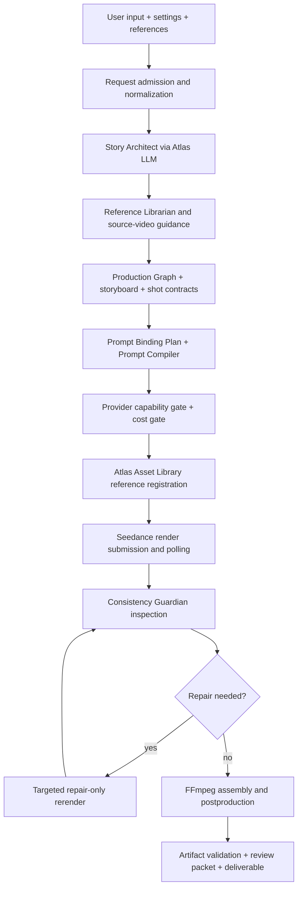

# Running And Model Settings Guide

## Purpose

This guide is the practical setup document for running CineJelly Seedance Ultimate Director after cloning the source. It is written for operators who may not know which keys, models, tools, and settings are required.

Keep this rule first: real secrets belong only in local `.env` files or deployment secret stores. Do not commit `.env`, API keys, tokens, generated media, or customer artifacts.

## Current Runtime Status

The source currently runs as a TypeScript/Node production API and CLI validation toolchain. There is no first-party web UI in this repository yet.

Current control surfaces:

- CLI validation commands in `package.json`
- HTTP API in `src/api/server.ts`
- JSON request contract in `schemas/render-request.schema.json`
- Settings contract in `src/types/settings.ts`
- Operator process in `docs/OPERATOR_RUNBOOK.md`

Future UI work should not invent new settings. It should expose the existing request settings listed in this guide and submit them to `/v1/render` or `/v1/render-jobs`.

## What Must Be Installed

Required:

| Tool | Why it is needed | How to check |
| --- | --- | --- |
| Git | Clone and update the repository. | `git --version` |
| Node.js 20 or newer | Build and run the TypeScript/Node API. | `node --version` |
| npm | Install Node dependencies and run scripts. | `npm --version` |
| FFmpeg | Assemble final video, transitions, captions, audio, and media outputs. | `ffmpeg -version` |
| FFprobe | Inspect rendered clips and final deliverables. | `ffprobe -version` |
| Atlas Cloud account and API key | LLM planning and Seedance video rendering. | `npm.cmd run preflight` |

Optional:

| Tool or service | When needed |
| --- | --- |
| Pexels/Pixabay/Coverr API keys | Only when remote stock material sourcing is enabled. |
| Local material catalog JSON | Only when using operator-owned source material catalogs. |
| Generated-audio asset resolution catalog | Only when mapping reviewed generated-audio `asset://` outputs to clean HTTPS URLs. |

## Install FFmpeg And FFprobe

Windows with winget:

```powershell
winget install --id Gyan.FFmpeg -e --accept-package-agreements --accept-source-agreements
```

After installation, restart the shell. If `where.exe ffmpeg` still does not find the command, set these in `.env` using the actual installed paths:

```env
CINEJELLY_FFMPEG_PATH=C:\path\to\ffmpeg.exe
CINEJELLY_FFPROBE_PATH=C:\path\to\ffprobe.exe
```

macOS with Homebrew:

```bash
brew install ffmpeg
```

Ubuntu/Debian:

```bash
sudo apt-get update
sudo apt-get install -y ffmpeg
```

## Required Environment Variables

Copy the template:

```powershell
Copy-Item .env.production.template .env
```

Then fill `.env` locally. Never commit `.env`.

Required variables:

| Variable | Required | What it does | Where to get it |
| --- | --- | --- | --- |
| `ATLASCLOUD_API_KEY` | Yes | Atlas key for Seedance video rendering and Asset Library operations. It is also used for LLM calls if `ATLASCLOUD_LLM_API_KEY` is absent. | Atlas Cloud dashboard/API keys page. |
| `ATLASCLOUD_LLM_API_KEY` | Optional | Separate Atlas key for OpenAI-compatible LLM calls. | Atlas Cloud dashboard/API keys page, if using a separate LLM key. |
| `ATLASCLOUD_LLM_MODEL` | Yes | LLM model used by Story Architect, structured planning, source-video analysis, and semantic visual inspection. | Atlas Cloud model catalog. |
| `ATLASCLOUD_SEEDANCE_STANDARD_MODEL` | Yes | Higher-quality Seedance model for standard tier jobs. | Atlas Cloud Seedance model page/catalog. |
| `ATLASCLOUD_SEEDANCE_FAST_MODEL` | Yes | Faster/lower-cost Seedance model for fast tier jobs. | Atlas Cloud Seedance model page/catalog. |
| `CINEJELLY_API_AUTH_TOKEN` | Yes for API use | Shared API token for protected `/v1/*` endpoints. This is generated by the operator, not by Atlas. | Generate a strong random token locally or through the deployment secret manager. |

Current known model IDs used by the local setup:

```env
ATLASCLOUD_LLM_MODEL=qwen/qwen3-vl-30b-a3b-thinking
ATLASCLOUD_SEEDANCE_STANDARD_MODEL=bytedance/seedance-2.0/reference-to-video
ATLASCLOUD_SEEDANCE_FAST_MODEL=bytedance/seedance-2.0-fast/reference-to-video
```

These are configuration values, not hardcoded business logic. Before a customer release, verify the exact model IDs and schema in Atlas Cloud because model catalogs can change.

## Optional Environment Variables

Common useful options:

| Variable | Default behavior | When to set |
| --- | --- | --- |
| `PORT` | API listens on `8787`. | Set when another service uses the port. |
| `CINEJELLY_OUTPUT_DIR` | Uses `assets/output_deliverables`. | Set when deployment storage should be elsewhere. |
| `CINEJELLY_FFMPEG_PATH` | Uses `ffmpeg` from `PATH`. | Set when FFmpeg is installed but not on `PATH`. |
| `CINEJELLY_FFPROBE_PATH` | Uses `ffprobe` from `PATH`. | Set when FFprobe is installed but not on `PATH`. |
| `ATLASCLOUD_SEEDANCE_CAPABILITIES_JSON` | Uses documented default capability assumptions and reports a warning. | Set after verifying current Atlas model schema for production. |
| `CINEJELLY_RENDER_COST_USD_PER_SECOND` | Cost gate uses only available configured rates. | Set when enforcing `settings.maxCostUsd`. |
| `CINEJELLY_ASSET_REGISTRATION_COST_USD` | Asset registration cost may be omitted from estimates. | Set when Atlas Asset Library cost must be budgeted. |
| `CINEJELLY_LLM_PLAN_COST_USD` | LLM planning cost may be omitted from estimates. | Set when planning cost must be budgeted. |
| `CINEJELLY_ENABLE_REMOTE_STOCK_MATERIALS` | Remote stock is disabled. | Set to `true` only after provider keys and rights are approved. |
| `PEXELS_API_KEY`, `PIXABAY_API_KEY`, `COVERR_API_KEY` | Not used unless remote stock is enabled. | Set only for approved commercial material sourcing. |
| `CINEJELLY_ENABLE_SOURCE_VIDEO_AUTO_ANALYSIS` | Source-video auto analysis is disabled. | Set to `true` only after FFmpeg and the chosen multimodal LLM are verified. |

## First Run Checklist

1. Install dependencies:

```powershell
npm install
```

2. Create local `.env` from template and fill real values:

```powershell
Copy-Item .env.production.template .env
```

3. Check TypeScript:

```powershell
npm.cmd run typecheck
```

4. Build:

```powershell
npm.cmd run build
```

5. Run preflight:

```powershell
npm.cmd run preflight
```

Interpretation:

- `status: "fail"` means do not run paid rendering yet.
- `status: "warn"` can be acceptable for internal validation if the only warning is missing `ATLASCLOUD_SEEDANCE_CAPABILITIES_JSON`.
- `status: "pass"` is the target for production readiness.

6. Start API:

```powershell
npm.cmd run start
```

7. Check health:

```powershell
Invoke-RestMethod http://localhost:8787/health
```

## API Endpoints

| Endpoint | Method | Purpose |
| --- | --- | --- |
| `/health` | GET | Public health check. |
| `/v1/preflight` | GET | Runtime readiness report. |
| `/v1/validation-readiness` | GET | Phase 6 release-readiness decision. |
| `/v1/render` | POST | Synchronous render. Better for short validation jobs. |
| `/v1/render-jobs` | POST | Async render job submission. Better for long-form work. |
| `/v1/render-jobs` | GET | List retained async jobs. |
| `/v1/render-jobs/<jobId>` | GET | Poll one job. |
| `/v1/render-jobs/<jobId>` | DELETE | Cancel one job. |

Protected `/v1/*` routes require one of:

```http
Authorization: Bearer <CINEJELLY_API_AUTH_TOKEN>
```

or:

```http
X-CineJelly-Api-Key: <CINEJELLY_API_AUTH_TOKEN>
```

## User-Selectable Settings

These are already supported by the API request body under `settings`. A future UI should expose them directly.

| Setting | Options | What it controls |
| --- | --- | --- |
| `tier` | `fast`, `standard` | Chooses fast or standard Seedance model family. |
| `resolution` | `480p`, `720p`, `1080p` | Target render resolution and postproduction validation target. |
| `qualityMode` | `economy`, `standard`, `high`, `ultimate` | Number of candidates, repair budget, and quality/cost behavior. |
| `ratio` | `adaptive`, `21:9`, `16:9`, `4:3`, `1:1`, `3:4`, `9:16` | Aspect-ratio planning and final delivery validation. |
| `durationTargetSeconds` | `1` to `480` | Total target video length. Long videos are split into provider-supported shots/clips. |
| `audioMode` | `none`, `native`, `guided`, `post`, `hybrid` | Audio strategy. Atlas generated-audio remains disabled until schemas and paid validation are verified. |
| `watermark` | `true`, `false` | Provider watermark policy. Commercial output should normally use `false` when supported. |
| `returnLastFrame` | `true`, `false` | Requests last-frame continuity anchors when supported. |
| `maxCostUsd` | non-negative number | Optional cost gate. Requires cost environment rates for meaningful budget enforcement. |

Default settings in `src/types/settings.ts`:

```json
{
  "tier": "standard",
  "resolution": "720p",
  "qualityMode": "standard",
  "ratio": "16:9",
  "durationTargetSeconds": 120,
  "audioMode": "hybrid",
  "watermark": false,
  "returnLastFrame": true
}
```

## Current Model Logic

CineJelly currently uses three configured model IDs:

1. LLM model: `ATLASCLOUD_LLM_MODEL`
   - Used for story planning, structured JSON generation, source-video analysis when enabled, and semantic visual inspection when enabled.
   - Calls can use `ATLASCLOUD_LLM_API_KEY` if configured; otherwise they use `ATLASCLOUD_API_KEY`.

2. Standard Seedance model: `ATLASCLOUD_SEEDANCE_STANDARD_MODEL`
   - Used when `settings.tier` is `standard`.
   - Intended for higher-quality commercial renders.

3. Fast Seedance model: `ATLASCLOUD_SEEDANCE_FAST_MODEL`
   - Used when `settings.tier` is `fast`.
   - Intended for cheaper/faster iteration.

Generated audio:

- The provider-neutral audio boundary exists.
- Atlas generated-audio execution is intentionally no-spend by default.
- Do not expect TTS/BGM/ambience/SFX generation to work until Atlas audio schema, model IDs, pricing, and output validation have a dedicated Reference Implementation and paid validation.

Remote stock:

- Local and remote material sourcing foundations exist.
- Remote stock is disabled unless `CINEJELLY_ENABLE_REMOTE_STOCK_MATERIALS=true` and approved provider keys are configured.

## Production Logic Flow

The current runtime flow is:



## How This Compares To The Snapshot Repos

| Snapshot | What CineJelly uses today |
| --- | --- |
| `Emily2040/seedance-2.0` | Intent-first Seedance workflow, reference roles, prompt handoff, endpoint anchors, QC discipline. |
| `YouMind-OpenLab/awesome-seedance-2-prompts` | Prompt anatomy, timing, camera/motion/audio/negative constraint patterns. Exact prompt corpus reuse still needs attribution review. |
| `HKUDS/ViMax` | Storyboard, long-form segmentation concepts, reference selection scoring, consistency checkpoints. Full RAG/multi-agent parity is not claimed. |
| `vericontext/vibeframe` | Validate-before-spend, cost gates, deterministic artifacts, review reports, repair loop discipline. |
| `HKUDS/VideoAgent` | Source-video analysis boundaries and metadata flow. Full VideoRAG/tool graph is not implemented. |
| `calesthio/OpenMontage` | Approval/self-review/source-media concepts only as AGPL-aware behavior notes. No direct production import. |
| `harry0703/MoneyPrinterTurbo` | One-input pipeline, material sourcing, task progress, batch evidence, subtitles/audio planning. Full WebUI/task persistence is not implemented. |
| `DirectorBench` | Planning/evaluation influence only until license status is clarified. |

## Important Documents

Read in this order:

1. `README.md`
2. `docs/PROJECT_CONTEXT.md`
3. `docs/RUNNING_AND_MODEL_SETTINGS_GUIDE.md`
4. `docs/OPERATOR_RUNBOOK.md`
5. `docs/IMPLEMENTATION_ROADMAP.md`
6. `docs/ROADMAP_FIDELITY_AUDIT_2026-06-14.md`
7. `docs/FAITHFUL_LOGIC_TRANSLATION_PROCESS.md`
8. `docs/FLEXIBLE_SEEDANCE_SETTINGS.md`
9. `docs/MODEL_PROVIDER_ABSTRACTION.md`

## Common Problems

### Preflight says `ATLASCLOUD_API_KEY is missing`

The `.env` file is missing, not loaded, or malformed. Use `.env.production.template` as the shape. Do not save `.env` with unusual encoding or invisible characters before the first variable.

### Preflight says `ffmpeg ENOENT` or `ffprobe ENOENT`

Install FFmpeg/FFprobe or set `CINEJELLY_FFMPEG_PATH` and `CINEJELLY_FFPROBE_PATH` to the executable paths.

### Preflight returns warning about `ATLASCLOUD_SEEDANCE_CAPABILITIES_JSON`

This means CineJelly is using documented default capability assumptions. Internal validation can proceed, but production release should pin verified capabilities from current Atlas schema inspection.

### API returns unauthorized

Pass the configured `CINEJELLY_API_AUTH_TOKEN` through `Authorization: Bearer ...` or `X-CineJelly-Api-Key`.

### Long jobs timeout over HTTP

Use `/v1/render-jobs` instead of synchronous `/v1/render`.

## Current Readiness Rule

If `npm.cmd run preflight` returns:

- `fail`: fix blockers first.
- `warn`: safe for internal validation only when warnings are understood.
- `pass`: ready for paid validation run.

After paid validation, run artifact validation and inspect generated artifacts before claiming customer readiness.
