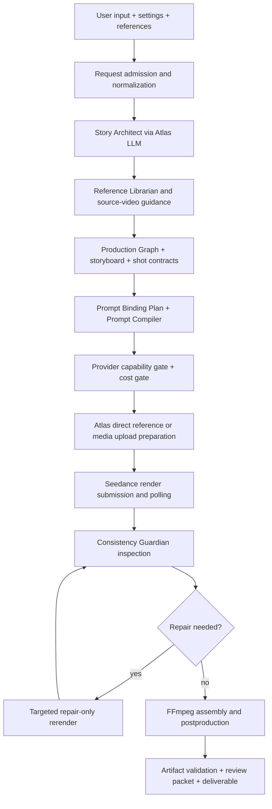

# Running And Model Settings Guide

## Purpose

This guide is the practical setup document for running CineJelly Seedance Ultimate Director after cloning the source. It is written for operators who may not know which keys, models, tools, and settings are required.

Keep this rule first: real secrets belong only in local `.env` files or deployment secret stores. Do not commit `.env`, API keys, tokens, generated media, or customer artifacts.

## Current Runtime Status

The source currently runs as a TypeScript/Node production API and CLI validation toolchain. There is no first-party web UI in this repository yet.

Current control surfaces:

- CLI validation commands in `package.json`
- HTTP API in `src/api/server.ts`
- JSON request contract in `schemas/render-request.schema.json`
- Settings contract in `src/types/settings.ts`
- Operator process in `docs/OPERATOR_RUNBOOK.md`

Future UI work should not invent new settings. It should expose the existing request settings listed in this guide and submit them to `/v1/render` or `/v1/render-jobs`.

## What Must Be Installed

Required:

| Tool | Why it is needed | How to check |
| --- | --- | --- |
| Git | Clone and update the repository. | `git --version` |
| Node.js 20 or newer | Build and run the TypeScript/Node API. | `node --version` |
| npm | Install Node dependencies and run scripts. | `npm --version` |
| FFmpeg | Assemble final video, transitions, captions, audio, and media outputs. | `ffmpeg -version` |
| FFprobe | Inspect rendered clips and final deliverables. | `ffprobe -version` |
| Atlas Cloud account and API key | LLM planning and Seedance video rendering. | `npm.cmd run preflight` |

Optional:

| Tool or service | When needed |
| --- | --- |
| Pexels/Pixabay/Coverr API keys | Only when remote stock material sourcing is enabled. |
| Local material catalog JSON | Only when using operator-owned source material catalogs. |
| Generated-audio asset resolution catalog | Only when mapping reviewed generated-audio `asset://` outputs to clean HTTPS URLs. |

## Install FFmpeg And FFprobe

Windows with winget:

```powershell
winget install --id Gyan.FFmpeg -e --accept-package-agreements --accept-source-agreements
```

After installation, restart the shell. If `where.exe ffmpeg` still does not find the command, set these in `.env` using the actual installed paths:

```env
CINEJELLY_FFMPEG_PATH=C:\path\to\ffmpeg.exe
CINEJELLY_FFPROBE_PATH=C:\path\to\ffprobe.exe
```

macOS with Homebrew:

```bash
brew install ffmpeg
```

Ubuntu/Debian:

```bash
sudo apt-get update
sudo apt-get install -y ffmpeg
```

## Required Environment Variables

Copy the template:

```powershell
Copy-Item .env.production.template .env
```

Then fill `.env` locally. Never commit `.env`.

Required variables:

| Variable | Required | What it does | Where to get it |
| --- | --- | --- | --- |
| `ATLASCLOUD_API_KEY` | Yes | Atlas key for Seedance video rendering and media upload operations. It is also used for LLM calls if `ATLASCLOUD_LLM_API_KEY` is absent. | Atlas Cloud dashboard/API keys page. |
| `ATLASCLOUD_LLM_API_KEY` | Optional | Separate Atlas key for OpenAI-compatible LLM calls. | Atlas Cloud dashboard/API keys page, if using a separate LLM key. |
| `ATLASCLOUD_LLM_BASE_URL` | Optional | Atlas OpenAI-compatible LLM base URL. Defaults to `https://api.atlascloud.ai/v1`. | Atlas docs. |
| `ATLASCLOUD_MEDIA_BASE_URL` or `ATLASCLOUD_BASE_URL` | Optional | Atlas image/video/upload base URL. Defaults to `https://api.atlascloud.ai/api/v1`. | Atlas docs. |
| `ATLASCLOUD_LLM_MODEL` | Yes | LLM model used by Story Architect, structured planning, source-video analysis, and semantic visual inspection. | Atlas Cloud model catalog. |
| `ATLASCLOUD_SEEDANCE_STANDARD_MODEL` | Yes | Higher-quality Seedance model for standard tier jobs. | Atlas Cloud Seedance model page/catalog. |
| `ATLASCLOUD_SEEDANCE_FAST_MODEL` | Yes | Faster/lower-cost Seedance model for fast tier jobs. | Atlas Cloud Seedance model page/catalog. |
| `CINEJELLY_API_AUTH_TOKEN` | Yes for deployment/admin API use | Shared deployment token for protected `/v1/*` endpoints and admin diagnostics. This is generated by the operator, not by Atlas. | Generate a strong random token locally or through the deployment secret manager. |
| `CINEJELLY_API_CLIENTS_JSON` | Optional | Customer/client API key policies using SHA-256 key digests, limits, and enable flags. | Generate customer keys in your admin system, store only SHA-256 digests here. |
| `CINEJELLY_REQUIRE_CLIENT_POLICY_FOR_RENDER` | Optional | When `true`, render submissions must use a configured client key and pass quota policy before provider spend. | Set in deployment environment. |
| `CINEJELLY_CLIENT_USAGE_LEDGER_PATH` | Optional | JSONL quota reservation ledger for client render submissions. | Set to an ignored/persistent writable path. |

Current known model IDs used by the local setup:

```env
ATLASCLOUD_LLM_MODEL=qwen/qwen3-vl-30b-a3b-thinking
ATLASCLOUD_SEEDANCE_STANDARD_MODEL=bytedance/seedance-2.0/reference-to-video
ATLASCLOUD_SEEDANCE_FAST_MODEL=bytedance/seedance-2.0-fast/reference-to-video
```

These are configuration values, not hardcoded business logic. Before a customer release, verify the exact model IDs and schema in Atlas Cloud because model catalogs can change.

## Optional Environment Variables

Common useful options:

| Variable | Default behavior | When to set |
| --- | --- | --- |
| `PORT` | API listens on `8787`. | Set when another service uses the port. |
| `CINEJELLY_OUTPUT_DIR` | Uses `assets/output_deliverables`. | Set when deployment storage should be elsewhere. |
| `CINEJELLY_FFMPEG_PATH` | Uses `ffmpeg` from `PATH`. | Set when FFmpeg is installed but not on `PATH`. |
| `CINEJELLY_FFPROBE_PATH` | Uses `ffprobe` from `PATH`. | Set when FFprobe is installed but not on `PATH`. |
| `ATLASCLOUD_SEEDANCE_CAPABILITIES_JSON` | `setup:local` writes documented capability assumptions for the configured Standard/Fast model IDs. | Verify and update after checking the current Atlas model schema for production. |
| `CINEJELLY_RENDER_COST_USD_PER_SECOND` | Cost gate uses only available configured rates. | Set when enforcing `settings.maxCostUsd`. |
| `CINEJELLY_ASSET_REGISTRATION_COST_USD` | Media upload/reference-preparation cost may be omitted from estimates. | Set only if a provider starts billing upload/reference preparation separately. |
| `CINEJELLY_LLM_PLAN_COST_USD` | LLM planning cost may be omitted from estimates. | Set when planning cost must be budgeted. |
| `CINEJELLY_ENABLE_REMOTE_STOCK_MATERIALS` | Remote stock is disabled. | Set to `true` only after provider keys and rights are approved. |
| `PEXELS_API_KEY`, `PIXABAY_API_KEY`, `COVERR_API_KEY` | Not used unless remote stock is enabled. | Set only for approved commercial material sourcing. |
| `CINEJELLY_ENABLE_SOURCE_VIDEO_AUTO_ANALYSIS` | Source-video auto analysis is disabled. | Set to `true` only after FFmpeg and the chosen multimodal LLM are verified. |
| `CINEJELLY_DEPLOYMENT_BASE_URL` | Not used by runtime. | Set for the no-spend deployment readiness capture command. |
| `CINEJELLY_DEPLOYMENT_API_AUTH_TOKEN` | Not used by runtime. | Set for deployment readiness capture when the real host protects `/v1/*` endpoints. |

## First Run Checklist

1. For a mostly automatic Windows setup, run:

```powershell
npm.cmd run setup:windows
```

This checks Node/npm, installs npm dependencies when missing, attempts FFmpeg installation through `winget`, creates or updates local `.env`, detects FFmpeg/FFprobe paths, and runs preflight.

2. For the simplest cross-platform no-spend readiness check after Node/npm is installed, run:

```powershell
npm.cmd run doctor
```

This creates or updates local `.env`, keeps existing secrets, generates missing local defaults, writes documented Seedance capability assumptions when absent, detects FFmpeg/FFprobe when possible, creates a safe request, runs typecheck/build/readiness/request validation, starts a temporary API when needed, and prints a readiness summary. It does not call Atlas rendering or write render artifacts.

3. For a universal setup-only pass after dependencies/tools are installed, run:

```powershell
npm.cmd run setup:local
```

This creates or updates local `.env`, generates `CINEJELLY_API_AUTH_TOKEN`, keeps existing secrets, fills default model IDs, writes documented Seedance capability assumptions when absent, creates the output directory, and detects FFmpeg/FFprobe when possible.

4. Manual dependency install, if needed:

```powershell
npm install
```

5. Manual `.env` creation, if needed:

```powershell
Copy-Item .env.production.template .env
```

6. Check TypeScript:

```powershell
npm.cmd run typecheck
```

7. Build:

```powershell
npm.cmd run build
```

8. Run preflight:

```powershell
npm.cmd run preflight
```

Interpretation:

- `status: "fail"` means do not run paid rendering yet.
- `status: "warn"` can be acceptable for internal validation if the only warning is missing `ATLASCLOUD_SEEDANCE_CAPABILITIES_JSON`.
- `status: "pass"` is the target for production readiness.

9. Start API:

```powershell
npm.cmd run start
```

10. Check health:

```powershell
Invoke-RestMethod http://localhost:8787/health
```

## Create And Validate A Request File

Use this before any paid provider run:

```powershell
npm.cmd run validation:create-request -- --safe-default
npm.cmd run validation:render-request -- --request "assets/output_deliverables/phase6-validation/request.json"
```

`validation:create-request` writes only a local JSON request under `assets/output_deliverables`, which is ignored by Git. It does not call Atlas, create providers, write render artifacts, or include secrets. Replace `--safe-default` with `--user-input "..."` or `--user-input-file <path>` for an operator-owned brief.

To run the full local no-spend gate in one command without setup:

```powershell
npm.cmd run validation:local-smoke
```

This creates a safe request, runs typecheck/build/readiness/request validation, starts a temporary API when needed, calls `/health`, and calls `/v1/validation-readiness`. It still does not run paid Atlas rendering.
It writes `assets/output_deliverables/phase6-validation/local-smoke-report.json` as local pre-paid evidence. The report is ignored by Git and does not replace paid render validation, artifact validation, or manual media review.

After deploying the API to a real HTTPS host, capture deployment evidence without spending Atlas credits:

```powershell
$env:CINEJELLY_DEPLOYMENT_BASE_URL = "https://<your-cinejelly-host>"
$env:CINEJELLY_DEPLOYMENT_API_AUTH_TOKEN = "<deployment-token>"
npm.cmd run validation:deployment-readiness
```

The command calls only `/health`, `/v1/preflight`, `/v1/validation-readiness`, and `/v1/render-settings`. A localhost run is useful for smoke testing, but it is marked local and does not satisfy the commercial business-readiness deployment gate.

For the billing/admin/quota commercial evidence gate, configure real client policies, require client policy for render, set a persistent usage ledger path, prepare a non-secret billing/admin attestation, and run:

```powershell
npm.cmd run validation:billing-admin-ops -- --base-url "https://<your-cinejelly-host>" --attestation "ops/billing-admin-attestation.json"
```

This command does not call Atlas or payment provider APIs. It checks CineJelly's configured quota controls, writable usage ledger, deployment-token-only `/v1/admin/client-policy`, and the attestation contract documented in `docs/reference-implementations/billing-admin-ops-evidence.md`.

For the production storage/observability/support gate, prepare a non-secret operations attestation and run:

```powershell
npm.cmd run validation:production-ops -- --base-url "https://<your-cinejelly-host>" --attestation "ops/production-operations-attestation.json"
```

This command calls only `/health`, `/v1/preflight`, `/v1/validation-readiness`, and `/v1/render-settings`. It checks the real deployment host plus the operations attestation contract documented in `docs/reference-implementations/production-operations-evidence.md`.

For non-specialist operators, prefer:

```powershell
npm.cmd run doctor
```

`doctor` runs setup first and then runs the same no-spend validation smoke.

To check whether the repo is actually ready for customer release, run:

```powershell
npm.cmd run validation:release-audit
```

This is stricter than `doctor`. It reads local smoke evidence, paid-render evidence, artifact validation summary, git hygiene, ignored secret/output paths, tracked secret scan, and external import boundaries. It does not call Atlas. Before paid validation exists, `blocked` and exit code `1` are expected.

## API Endpoints

| Endpoint | Method | Purpose |
| --- | --- | --- |
| `/health` | GET | Public health check. |
| `/v1/preflight` | GET | Runtime readiness report. |
| `/v1/validation-readiness` | GET | Phase 6 release-readiness decision. |
| `/v1/render-settings` | GET | Secret-free settings/model/capability descriptor for API clients and future UI controls. |
| `/v1/render` | POST | Synchronous render. Better for short validation jobs. |
| `/v1/render-jobs` | POST | Async render job submission. Better for long-form work. |
| `/v1/render-jobs` | GET | List retained async jobs. |
| `/v1/render-jobs/<jobId>` | GET | Poll one job. |
| `/v1/render-jobs/<jobId>` | DELETE | Cancel one job. |
| `/v1/admin/client-policy` | GET | Deployment-token-only client policy and quota diagnostics without raw keys or key digests. |

Protected `/v1/*` routes require one of:

```http
Authorization: Bearer <CINEJELLY_API_AUTH_TOKEN>
```

or:

```http
X-CineJelly-Api-Key: <CINEJELLY_API_AUTH_TOKEN>
```

Customer/client render access can use the same headers with the raw client API key. The server hashes the presented key and compares it to `keySha256` entries in `CINEJELLY_API_CLIENTS_JSON`; raw client keys are not written to policy diagnostics or usage-ledger records. Client keys can list, poll, and cancel only their own async jobs.

## User-Selectable Settings

These are already supported by the API request body under `settings`. A future UI should expose them directly.

API clients can fetch the currently documented option set from:

```http
GET /v1/render-settings
Authorization: Bearer <CINEJELLY_API_AUTH_TOKEN>
```

The response intentionally contains no API keys or local paths. It reports defaults, supported setting values, duration and cost constraints, quality-mode behavior, selected model IDs, Seedance capability configuration source, and whether a first-party UI exists. Today the official control surface is still HTTP API plus CLI; a future UI should read this descriptor instead of duplicating option lists.

| Setting | Options | What it controls |
| --- | --- | --- |
| `tier` | `fast`, `standard` | Chooses fast or standard Seedance model family. |
| `resolution` | `480p`, `720p`, `1080p` | Target render resolution and postproduction validation target. |
| `qualityMode` | `economy`, `standard`, `high`, `ultimate` | Number of candidates, repair budget, and quality/cost behavior. |
| `ratio` | `adaptive`, `21:9`, `16:9`, `4:3`, `1:1`, `3:4`, `9:16` | Aspect-ratio planning and final delivery validation. |
| `durationTargetSeconds` | `1` to `480` | Total target video length. Long videos are split into provider-supported shots/clips. |
| `audioMode` | `none`, `native`, `guided`, `post`, `hybrid` | Audio strategy. Atlas generated-audio remains disabled until schemas and paid validation are verified. |
| `watermark` | `true`, `false` | Provider watermark policy. Commercial output should normally use `false` when supported. |
| `returnLastFrame` | `true`, `false` | Requests last-frame continuity anchors when supported. |
| `maxCostUsd` | non-negative number | Optional cost gate. Requires cost environment rates for meaningful budget enforcement. |

Default settings in `src/types/settings.ts`:

```json
{
  "tier": "standard",
  "resolution": "720p",
  "qualityMode": "standard",
  "ratio": "16:9",
  "durationTargetSeconds": 120,
  "audioMode": "hybrid",
  "watermark": false,
  "returnLastFrame": true
}
```

## Current Model Logic

CineJelly currently uses three configured model IDs:

1. LLM model: `ATLASCLOUD_LLM_MODEL`
   - Used for story planning, structured JSON generation, source-video analysis when enabled, and semantic visual inspection when enabled.
   - Calls can use `ATLASCLOUD_LLM_API_KEY` if configured; otherwise they use `ATLASCLOUD_API_KEY`.

2. Standard Seedance model: `ATLASCLOUD_SEEDANCE_STANDARD_MODEL`
   - Used when `settings.tier` is `standard`.
   - Intended for higher-quality commercial renders.

3. Fast Seedance model: `ATLASCLOUD_SEEDANCE_FAST_MODEL`
   - Used when `settings.tier` is `fast`.
   - Intended for cheaper/faster iteration.

Generated audio:

- The provider-neutral audio boundary exists.
- Atlas generated-audio execution is intentionally no-spend by default.
- Do not expect TTS/BGM/ambience/SFX generation to work until Atlas audio schema, model IDs, pricing, and output validation have a dedicated Reference Implementation and paid validation.

Remote stock:

- Local and remote material sourcing foundations exist.
- Remote stock is disabled unless `CINEJELLY_ENABLE_REMOTE_STOCK_MATERIALS=true` and approved provider keys are configured.

## Production Logic Flow

The current runtime flow is:


```mermaid
flowchart TD
    A["User input + settings + references"] --> B["Request admission and normalization"]
    B --> C["Story Architect via Atlas LLM"]
    C --> D["Reference Librarian and source-video guidance"]
    D --> E["Production Graph + storyboard + shot contracts"]
    E --> F["Prompt Binding Plan + Prompt Compiler"]
    F --> G["Provider capability gate + cost gate"]
    G --> H["Atlas direct reference or media upload preparation"]
    H --> I["Seedance render submission and polling"]
    I --> J["Consistency Guardian inspection"]
    J --> K{"Repair needed?"}
    K -->|yes| L["Targeted repair-only rerender"]
    L --> J
    K -->|no| M["FFmpeg assembly and postproduction"]
    M --> N["Artifact validation + review packet + deliverable"]
```

## How This Compares To The Snapshot Repos

| Snapshot | What CineJelly uses today |
| --- | --- |
| `Emily2040/seedance-2.0` | Intent-first Seedance workflow, reference roles, prompt handoff, endpoint anchors, QC discipline. |
| `YouMind-OpenLab/awesome-seedance-2-prompts` | Prompt anatomy, timing, camera/motion/audio/negative constraint patterns. Exact prompt corpus reuse still needs attribution review. |
| `HKUDS/ViMax` | Storyboard, long-form segmentation concepts, reference selection scoring, consistency checkpoints. Full RAG/multi-agent parity is not claimed. |
| `vericontext/vibeframe` | Validate-before-spend, cost gates, deterministic artifacts, review reports, repair loop discipline. |
| `HKUDS/VideoAgent` | Source-video analysis boundaries and metadata flow. Full VideoRAG/tool graph is not implemented. |
| `calesthio/OpenMontage` | Approval/self-review/source-media concepts only as AGPL-aware behavior notes. No direct production import. |
| `harry0703/MoneyPrinterTurbo` | One-input pipeline, material sourcing, task progress, batch evidence, subtitles/audio planning. Full WebUI/task persistence is not implemented. |
| `DirectorBench` | Planning/evaluation influence only until license status is clarified. |

## Important Documents

Read in this order:

1. `README.md`
2. `docs/PROJECT_CONTEXT.md`
3. `docs/RUNNING_AND_MODEL_SETTINGS_GUIDE.md`
4. `docs/OPERATOR_RUNBOOK.md`
5. `docs/IMPLEMENTATION_ROADMAP.md`
6. `docs/ROADMAP_FIDELITY_AUDIT_2026-06-14.md`
7. `docs/FAITHFUL_LOGIC_TRANSLATION_PROCESS.md`
8. `docs/FLEXIBLE_SEEDANCE_SETTINGS.md`
9. `docs/MODEL_PROVIDER_ABSTRACTION.md`

## Common Problems

### Preflight says `ATLASCLOUD_API_KEY is missing`

The `.env` file is missing, not loaded, or malformed. Use `.env.production.template` as the shape. Do not save `.env` with unusual encoding or invisible characters before the first variable.

### Preflight says `ffmpeg ENOENT` or `ffprobe ENOENT`

Install FFmpeg/FFprobe or set `CINEJELLY_FFMPEG_PATH` and `CINEJELLY_FFPROBE_PATH` to the executable paths.

### Preflight returns warning about `ATLASCLOUD_SEEDANCE_CAPABILITIES_JSON`

Run `npm.cmd run setup:local` or `npm.cmd run doctor` to let CineJelly write documented capability assumptions for the configured Standard/Fast model IDs. Internal validation can proceed after that, but production release should still verify and update the capability JSON from current Atlas schema inspection.

### API returns unauthorized

Pass the configured `CINEJELLY_API_AUTH_TOKEN`, or a configured client API key for customer render routes, through `Authorization: Bearer ...` or `X-CineJelly-Api-Key`.

### Long jobs timeout over HTTP

Use `/v1/render-jobs` instead of synchronous `/v1/render`.

## Current Readiness Rule

If `npm.cmd run preflight` returns:

- `fail`: fix blockers first.
- `warn`: safe for internal validation only when warnings are understood.
- `pass`: ready for paid validation run.

After paid validation, run artifact validation and inspect generated artifacts before claiming customer readiness.
