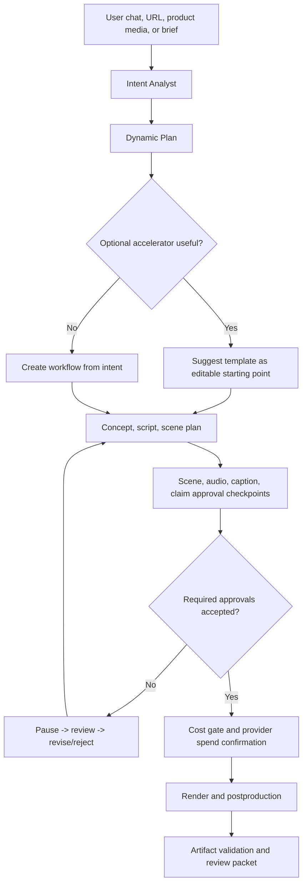

# Short Pipeline Agentic Design
> ⚠️ **TÀI LIỆU THIẾT KẾ — KHÔNG PHẢI MÔ TẢ CODE HIỆN TẠI.**
> Cập nhật lần cuối: **2026-07-02**. Từ đó tới nay mã nguồn đã đổi rất nhiều.
> Đọc [`BAN-DO-DU-AN.md`](../BAN-DO-DU-AN.md) để biết dự án HIỆN TẠI ra sao.
> Khi tài liệu này mâu thuẫn với code, **code đúng** — tài liệu là cái sai.

> ### ⛔ TÍNH NĂNG ĐÃ GỠ — đọc trước phần còn lại
>
> Tài liệu này mô tả **quét trang sản phẩm từ URL** (`ProductUrlResearcher`,
> `POST /v1/short-pipeline/product-url-plan`, `npm run validation:product-url-extraction`) như đang
> chạy. **Không còn nữa.** Chủ dự án gỡ ngày **2026-07-23**: quét trang thương mại điện tử phức tạp,
> dễ vỡ và thường xuyên bị chặn bot.
>
> Hiện tại: đường đó trả **HTTP 410** (`src/api/server.ts`), lệnh npm **không tồn tại**, lược đồ báo
> cáo đã xoá. `ProductUrlResearcher` chỉ còn phục vụ **thông tin sản phẩm do người gọi tự cung cấp**.
> Khách mô tả sản phẩm bằng lời hoặc tải ảnh/video mẫu lên — hai đường đó có cùng sức mạnh lập kế
> hoạch mà không có rủi ro tải trang.
>
> Ghi ở đây vì [`UPSTREAM_CONTEXT_ROUTING.md`](UPSTREAM_CONTEXT_ROUTING.md) chỉ mọi AI làm video ngắn
> đến đúng file này.

## Product Position

CineJelly short video must feel as easy as a top marketing video app, but it must not become a rigid template machine. The short pipeline is a natural-language, agentic workflow for fast commercial video creation with strong review, cost, approval, and evidence gates.

Implementation status as of 2026-06-26: the backend foundation is implemented as `ShortPipelineConversationEngine`, `ShortPipelineSessionStore`, `ShortPipelinePlanner`, `AudienceNicheIntelligencePlanner`, `ShortCreativePatternLearningEngine`, `ShortViralIntelligencePlanner`, `ProductUrlBriefExtractor`, `ProductUrlResearcher`, `BrandKitEvaluator`, `WorkflowTemplateRegistry`, `ShortPipelineRenderHandoff`, API/page endpoints `/short/create`, `POST /v1/short-pipeline/conversation`, `POST /v1/short-pipeline/conversation-sessions`, `GET /v1/short-pipeline/conversation-sessions`, `GET /v1/short-pipeline/conversation-sessions/{sessionId}`, `GET /v1/short-pipeline/conversation-sessions/{sessionId}/ui-contract`, `POST /v1/short-pipeline/conversation-sessions/{sessionId}/render-jobs`, `POST /v1/short-pipeline/plan`, `POST /v1/short-pipeline/product-url-plan`, and `POST /v1/short-pipeline/render-jobs`, `npm run validation:short-mvp-ui-contract`, `npm run validation:short-viral-intelligence`, `npm run validation:short-pipeline-conversation`, `npm run validation:short-pipeline-session-store`, `npm run validation:short-pipeline-session-render-handoff`, `npm run validation:short-pipeline`, `npm run validation:product-url-extraction`, `npm run validation:short-review-operation`, `npm run validation:short-review-operation-guard`, `npm run validation:short-product-rights`, `npm run validation:short-product-rights-guard`, `schemas/short-mvp-ui-contract-smoke-report.schema.json`, `schemas/short-viral-intelligence-smoke-report.schema.json`, `schemas/short-pipeline-conversation-smoke-report.schema.json`, `schemas/short-pipeline-session-store-smoke-report.schema.json`, `schemas/short-pipeline-session-render-handoff-smoke-report.schema.json`, `schemas/short-review-operation-evidence.schema.json`, `schemas/short-review-operation-validation-report.schema.json`, `schemas/short-review-operation-evidence-guard-smoke-report.schema.json`, `schemas/short-product-rights-evidence.schema.json`, `schemas/short-product-rights-validation-report.schema.json`, `schemas/short-product-rights-evidence-guard-smoke-report.schema.json`, `schemas/short-pipeline-smoke-report.schema.json`, and `schemas/product-url-extraction-smoke-report.schema.json`. It is intentionally no-spend until an approved render handoff enters the normal async job path: conversation evidence keeps raw transcript out of public reports, durable session storage now defaults to `CINEJELLY_OUTPUT_DIR/short-pipeline-sessions.json`, durable channel/style memory defaults to `CINEJELLY_OUTPUT_DIR/short-channel-styles.json`, both can be overridden with dedicated env paths, the first-party static create/review shell embeds no credentials and calls protected `/v1` routes only with a client API key supplied in browser memory, session UI contracts expose safe scene/audio/caption/claim checkpoint controls plus a no-spend approval-packet contract, product URL evidence is fingerprinted, Product URL-to-Video extraction requires explicit live-network confirmation and rejects unsafe URL queries before fetch, accepted product-facts/media-rights evidence is validated as a separate no-spend packet, template suggestions remain optional accelerators, brand-kit forbidden claims block planning, shared audience/niche intelligence classifies user presentation style, niche, funnel stage, trend posture, proof strategy, share trigger, CTA strategy, and idea seeds, viral/niche intelligence chooses platform focus, creative mode, concept score, scene directives, reference-video pattern guardrails, and creative-pattern candidate ranking, scene/audio/caption/claim review checkpoints are emitted before render, pending review handoff creates a paused job, session render handoff requires the stored server-side plan plus formal review evidence, and approved review evidence still requires explicit `confirmRenderSubmission=true` before provider spend can be queued. The `video-db/Director` snapshot is now captured as a source baseline, but this does not yet provide an operator-supplied accepted live reviewer operation packet, an operator-supplied accepted live product/rights packet, a live paid short-pipeline render, VideoDB media-library/playback parity, or full Director parity.

Short review operation evidence now has a no-spend local validation contract through `npm run validation:short-review-operation-draft`, `npm run validation:short-review-operation`, and `npm run validation:short-review-operation-guard`, `schemas/short-review-operation-evidence-draft-report.schema.json`, `schemas/short-review-operation-evidence.schema.json`, `schemas/short-review-operation-validation-report.schema.json`, and `schemas/short-review-operation-evidence-guard-smoke-report.schema.json`. This validates an operator-owned ignored packet at `ops/short-review-operation-evidence.json` only when it is deployment-scoped, session-bound, redaction-reviewed, accepted across scene/audio/caption/claim, explicitly confirmed by `--confirm-accepted-review-operation`, and still unable to queue provider spend. The draft helper writes a template/checklist under ignored business-readiness operator drafts and marks direct template use as rejected; it is an evidence intake handoff, not proof that accepted live reviewer operation evidence has already been captured.

Short product-facts and media-rights evidence now has a separate no-spend local validation contract through `npm run validation:short-product-rights-draft`, `npm run validation:short-product-rights`, and `npm run validation:short-product-rights-guard`, `schemas/short-product-rights-evidence-draft-report.schema.json`, `schemas/short-product-rights-evidence.schema.json`, `schemas/short-product-rights-validation-report.schema.json`, and `schemas/short-product-rights-evidence-guard-smoke-report.schema.json`. This validates an operator-owned ignored packet at `ops/short-product-rights-evidence.json` only when product facts, claim substantiation, product snapshot binding, media ownership, commercial-use approval, model-release status, trademark/third-party mark review, attribution digest, redaction review, and URL/report/session hashes all pass under explicit `--confirm-accepted-product-rights`. The draft helper writes a template/checklist under ignored business-readiness operator drafts and direct template use remains rejected. It does not crawl URLs, call providers, queue render jobs, replace scene/audio/caption/claim review, or approve customer traffic.

Commercial launch doctor now refreshes the Short review-operation guard, Short product/rights guard, both non-evidence draft handoffs, and both accepted-packet validations. Missing accepted operator packets remain external evidence blockers instead of hidden code blockers.

This design is separate from the long-form Production Graph. Long-form can keep heavier graph chunking, multi-stage render orchestration, and long artifact evidence. Short-form needs a lighter planning loop:

1. Understand the user's natural-language brief, product URL, product media, or campaign goal.
2. Infer intent, audience, emotion, offer, channel, risk, and evidence needs.
3. Propose concept, script, scene plan, audio/caption/claim checkpoints, and optional accelerators.
4. Pause for human review and edits before provider spend when commercial risk is present.
5. Render only after approval gates pass.
6. Preserve artifacts, cost, redaction, and review evidence.

## Non-Negotiables

- No forced templates. Templates are optional accelerators, not the product's core logic.
- Natural-language chat is first-class. The system should accept vague, emotional, business-oriented, or product-specific input.
- Dynamic planning is required. The agent can suggest a template, ignore templates, combine patterns, or create a fresh workflow.
- Human-in-the-loop checkpoints are required for scene, audio, caption, and claim surfaces before commercial export.
- Cost gates, quota, redaction, artifact hashes, and evidence reports remain mandatory commercial-core controls.
- Short-form should optimize for speed and clarity, but not by bypassing auditability.

## Source Patterns

| Source | Applied Pattern |
| --- | --- |
| `calesthio/OpenMontage` | Agent-first workflow, dynamic pipeline construction, approval gates, media self-review. AGPL code is not copied into runtime. |
| `HKUDS/ViMax` | Multi-agent collaboration, structured decomposition, continuity-aware planning. |
| `HKUDS/VideoAgent` | Natural-language conversational experience and source-video understanding patterns. |
| `video-db/Director` | Director-like media reasoning, agent/tool orchestration, progress updates, typed media content, and chat workflow patterns. Snapshot is captured; current translation is backend planning/review/progress evidence only, not full UI or media-library parity. |
| `vericontext/vibeframe` | Validate-before-spend, deterministic artifacts, review/evidence reports. |
| `YouMind-OpenLab/awesome-seedance-2-prompts` | Prompt anatomy, timing, camera, proof, negative constraint, and anti-slop primitives for scored short idea candidates without bundling exact prompt text. |

## Agent Roles

The short pipeline should use small, composable agents rather than a monolithic "template generator":

- Intent Analyst: extracts business goal, audience, emotion, product, platform, duration, offer, claim risk, and missing inputs.
- Conversation Session Orchestrator: accepts natural-language turns, revision requests, approval intent, and optional-template rejection while keeping raw transcript out of public evidence.
- Product Researcher: extracts product facts from URL/media/operator text without storing secrets or unsafe URLs in public evidence.
- Viral Niche Strategist: consumes shared audience/niche intelligence, then infers TikTok/Douyin-first or cross-platform strategy, niche, buyer intent, creative mode, retention levers, viewer desire, viewer objection, trend posture, proof strategy, and idea seeds.
- Reference Pattern Analyst: turns a rights-cleared sample or operator summary into redacted hook, pacing, camera, caption, audio, retention, and CTA guidance while blocking unsafe sources and clone requests.
- Creative Pattern Learner: generates niche/reference/prompt-aware structural patterns and many idea candidates, scores viral potential, proof feasibility, novelty, renderability, brand safety, and non-clone safety, then selects a winning idea for scene directives and render handoff.
- Concept Director: proposes hooks, angles, pacing, and visual story options.
- Scene Planner: creates a compact scene plan, shot goals, references, and transitions.
- Audio Caption Planner: proposes narration, BGM/ambience/SFX intents, caption style, and accessibility constraints.
- Claim Safety Reviewer: flags performance, medical, financial, legal, competitor, or unsupported claims.
- Review Approval Gate: emits scene/audio/caption/claim approval checkpoints and pauses the job until required decisions are accepted.
- Render Orchestrator: maps approved plan to provider calls and postproduction.
- Evidence Curator: writes safe artifacts, hashes, cost summary, and review packet.

## Lifecycle

## Approval Primitive

The first backend primitive is `ReviewApprovalSystem`. It evaluates checkpoint decisions for:

- `scene`: hook, story, pacing, shot selection, visual direction.
- `audio`: narration, voice, BGM, ambience, SFX, loudness/sync risk.
- `caption`: readability, language, timing, accessibility, platform fit.
- `claim`: commercial claims, compliance, prohibited or unsupported statements.

It returns:

- `approved`: all required checkpoints accepted with reviewer and timestamp.
- `approval_required`: required checkpoint still pending.
- `changes_requested`: a required checkpoint asks for revision.
- `rejected`: a required checkpoint rejects the current job path.
- `blocked`: approval evidence is unsafe or internally inconsistent.

The lifecycle recommendation now maps to async pre-render job behavior: `continue` queues the render, `paused_for_review` and `paused_for_revision` hold the job before provider spend, `rejected` ends the current job path, and `blocked` keeps the job paused until safe corrected review evidence is submitted. The first-party `/short/create` shell can display session UI contracts, scene/audio/caption/claim checkpoints, review/action status, and reviewer/timestamp-bound approval packet drafts; the Short review operation validator can verify an archived accepted reviewer packet without provider calls, but hosted pre-export review controls, captured live reviewer operation evidence, and customer-grade UI QA remain future commercial-scope work.

## Template Registry Principles

The future registry should store accelerators such as TikTok Product Ad, UGC Ad, Explainer, Founder Story, Testimonial, Comparison, and Cinematic Product Reveal. Each template must be:

- Optional.
- Editable through natural language.
- Represented as planning hints, not hardcoded render paths.
- Bound to approval checkpoints before spend/export.
- Compatible with product URL, brand kit, and workspace policies.

The current registry ships deterministic planning hints for TikTok Product Ad, UGC Ad, Explainer, Founder Story, Testimonial / Customer Proof, Comparison, and Cinematic Product Reveal. The planner always marks template use as optional and keeps `dynamicWorkflowRequired=true` so user natural-language edits can override or discard any suggestion.

## Product URL-To-Video Contract

The URL-to-video backend should produce a safe product brief:

- source URL fingerprint, not raw signed URL evidence;
- extracted title, category, product images, benefits, target buyer, and CTA candidates;
- claim inventory with confidence and required substantiation;
- image/media rights status;
- missing fields requiring user confirmation;
- recommended concept paths.

The extractor must not call paid render providers, must not trust product claims blindly, and must feed claim checkpoints into `ReviewApprovalSystem`.

Current implementation: `ProductUrlResearcher` performs bounded HTML extraction only after `confirmLiveNetwork=true`, records safe source URL hashes/host/path hashes, omits raw URLs from public research summaries, and feeds the extracted snapshot through `ProductUrlBriefExtractor` into the planner. `POST /v1/short-pipeline/product-url-plan` returns `422` with safe research evidence when confirmation, URL hygiene, fetch, content type, size, or extraction checks fail. `npm run validation:product-url-extraction` proves the parser, guardrails, redaction, and planner handoff with an injected fake fetch; `npm run validation:short-product-rights` is the separate operator-accepted product-facts/media-rights evidence gate. Neither command is live paid media proof by itself.

## Viral/Niche Intelligence Contract

`ShortViralIntelligencePlanner` is the short-form creative brain. It does not replace review or render gates; it enriches the plan before spend:

- infer platform focus, defaulting to TikTok/Douyin when the brief is broad;
- consume `AudienceNicheIntelligencePlanner` so Short and Long share the same no-spend understanding of user presentation style, niche, format, funnel stage, trend posture, proof strategy, objection, share trigger, CTA strategy, and idea seeds;
- infer creative mode across UGC/review, product ad, demo, testimonial, comparison, education, story, cinematic, and problem-solution shorts;
- identify niche, buyer intent, viewer desire, viewer objection, viral levers, and anti-patterns;
- run `ShortCreativePatternLearningEngine` to generate many structural patterns and idea candidates across niche playbooks, prompt signals, and reference-video rhythm without hardcoding a fixed script;
- select a winning idea using hook, retention, niche fit, proof feasibility, brand safety, novelty, renderability, and non-clone safety scores;
- score candidate concepts for hook strength, retention, niche fit, brand fit, claim safety, and renderability;
- attach per-scene directives for first frame, retention job, camera cue, caption cue, proof cue, CTA cue, viral levers, and quality checks;
- learn reference-video structure only through redacted fingerprints and operator-provided pattern fields;
- block local/private/credential-like reference sources and route clone/99%-copy requests to review-required structure learning.

The render handoff includes this strategy in metadata and prompt text so downstream workers receive more than a generic scene list: they receive the niche, creative mode, trend posture, hook angle, proof strategy, idea seeds, creative-pattern learning ID, selected idea, top idea candidates, winning concept, reference-pattern guardrails, and scene-level quality instructions.

Operator-approved media references can reach render handoff as provider-safe `asset://` IDs or credential-free clean HTTPS provider URIs. The short plan itself keeps clean HTTPS references hashed/redacted; raw clean HTTPS URIs are reconstructed only inside render handoff when the current render request supplies the matching raw media input. Unsafe, private, local, embedded-credential, hash-fragment, or credential-query references remain blocked or planning-only, while source-video references still carry similarity/originality review requirements before spend.

Prompt compilation now carries explicit transition-bridge contracts in addition to continuity and final-frame contracts. Each multi-shot short or long-form shot is told how to start from the previous endpoint, how to prepare the next start state, and which boundary artifacts to avoid: face/product drift, background resets, color jumps, mismatched hand poses, audio-bed drops, and unrelated camera angles.

## Conversation Contract

`POST /v1/short-pipeline/conversation` is the stateless backend surface for future Topview-simple but CineJelly-stricter chat UX. It accepts multi-turn natural-language messages or a shorthand `userPrompt`, analyzes business goal, audience, platform, emotion, requested changes, template preference, and review state, then returns a safe session plus a normal short-pipeline plan. Conversation turns publish only SHA-256 digests and redacted summaries; raw URLs, local paths, and secret-like values are replaced before public evidence and before planning. If a user says the plan is approved, the backend records `approval_intent_detected` but still requires formal scene/audio/caption/claim checkpoint decisions with reviewer and timestamp evidence before render spend.

`POST /v1/short-pipeline/conversation-sessions` adds durable persistence for the same safe session shape. It writes atomically to the configured session store, or to the default `CINEJELLY_OUTPUT_DIR/short-pipeline-sessions.json` store when no override is set, scopes list/detail reads by API client key, and refuses to persist raw transcript text, raw HTTP URLs, local paths, or secret-like values. `GET /v1/short-pipeline/conversation-sessions` returns compact summaries for job-monitor/review UI list views, while `GET /v1/short-pipeline/conversation-sessions/{sessionId}` returns the stored redacted session for review continuation.

`POST /v1/short-pipeline/conversation-sessions/{sessionId}/render-jobs` is the stored-session bridge into the normal async render-job lifecycle. It never accepts a client-supplied replacement plan; the server reads the redacted stored session plan, validates that it remains no-spend/no-network evidence, applies submitted scene/audio/caption/claim review checkpoints, and then uses the same admission, idempotency, quota, billing, review, artifact, and polling path as `/v1/render-jobs`. Pending review creates a paused job, unsafe accepted-looking review creates a blocked job, and fully approved review evidence still needs `confirmRenderSubmission=true` before provider spend can be queued.

## Brand Kit Contract

A brand kit should influence planning and validation without forcing templates. Minimum fields:

- brand name, tone, language, visual style, logo/color references;
- allowed claims and forbidden claims;
- CTA rules;
- voice/audio preferences;
- compliance notes;
- asset approval status.

Brand kit violations should become approval issues, not silent rewrites.

## Acceptance Criteria

- A user can describe a short video naturally without selecting a template.
- Multi-turn chat can revise a short plan, reject templates, or express approval intent without bypassing formal review gates.
- Durable session storage can preserve redacted no-spend planning state across API restarts when explicitly configured.
- A first-party static create/review shell can create no-spend sessions, display stored-session UI contracts, expose safe approval checkpoints, and prepare non-spending approval packet drafts without embedding client keys, local paths, provider credentials, or release evidence.
- Stored sessions can become render jobs only through server-side plan retrieval, formal review checkpoints, explicit spend confirmation, and the normal async job gates.
- A clean product URL can be converted into safe extracted facts and claim checkpoints only after explicit live-network confirmation.
- Short viral/niche intelligence can choose platform strategy, generate and rank many creative idea candidates, score concepts, generate scene directives, and adapt reference-video structure without copying source content.
- The system can suggest a template but can also create a custom workflow.
- Scene/audio/caption/claim checkpoints are explicit before provider spend or export.
- Rejected or unsafe approval evidence blocks the job.
- Archived Short create/review operation evidence can be accepted as no-spend backend evidence only after schema, redaction, session binding, and explicit operator confirmation pass.
- Accepted Short product-facts and media-rights evidence can be accepted as no-spend backend evidence only after schema, redaction, URL/report/session hash binding, claim substantiation, commercial-use approval, and explicit operator confirmation pass.
- Accepted short-pipeline review evidence can be mapped into the async render-job contract without bypassing admission, quota, cost, review, idempotency, or artifact gates.
- Approved checkpoints do not claim full customer readiness by themselves.
- All artifacts remain redacted, deterministic, and evidence-friendly.
