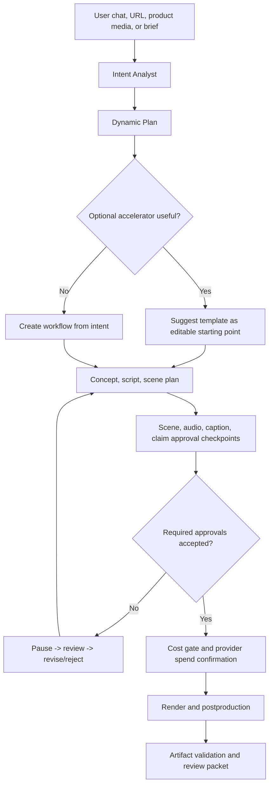

# Short Pipeline Agentic Design

## Product Position

CineJelly short video must feel as easy as a top marketing video app, but it must not become a rigid template machine. The short pipeline is a natural-language, agentic workflow for fast commercial video creation with strong review, cost, approval, and evidence gates.

Implementation status as of 2026-06-19: the first backend foundation is implemented as `ShortPipelinePlanner`, `ProductUrlBriefExtractor`, `BrandKitEvaluator`, `WorkflowTemplateRegistry`, API endpoint `POST /v1/short-pipeline/plan`, `npm run validation:short-pipeline`, and `schemas/short-pipeline-smoke-report.schema.json`. It is intentionally no-spend and no-network: product URL evidence is fingerprinted, template suggestions remain optional accelerators, brand-kit forbidden claims block planning, and scene/audio/caption/claim review checkpoints are emitted before render. The `video-db/Director` snapshot is now captured as a source baseline, but this does not yet fetch live product pages, submit render jobs, provide a first-party chat UI, or prove full Director parity.

This design is separate from the long-form Production Graph. Long-form can keep heavier graph chunking, multi-stage render orchestration, and long artifact evidence. Short-form needs a lighter planning loop:

1. Understand the user's natural-language brief, product URL, product media, or campaign goal.
2. Infer intent, audience, emotion, offer, channel, risk, and evidence needs.
3. Propose concept, script, scene plan, audio/caption/claim checkpoints, and optional accelerators.
4. Pause for human review and edits before provider spend when commercial risk is present.
5. Render only after approval gates pass.
6. Preserve artifacts, cost, redaction, and review evidence.

## Non-Negotiables

- No forced templates. Templates are optional accelerators, not the product's core logic.
- Natural-language chat is first-class. The system should accept vague, emotional, business-oriented, or product-specific input.
- Dynamic planning is required. The agent can suggest a template, ignore templates, combine patterns, or create a fresh workflow.
- Human-in-the-loop checkpoints are required for scene, audio, caption, and claim surfaces before commercial export.
- Cost gates, quota, redaction, artifact hashes, and evidence reports remain mandatory commercial-core controls.
- Short-form should optimize for speed and clarity, but not by bypassing auditability.

## Source Patterns

| Source | Applied Pattern |
| --- | --- |
| `calesthio/OpenMontage` | Agent-first workflow, dynamic pipeline construction, approval gates, media self-review. AGPL code is not copied into runtime. |
| `HKUDS/ViMax` | Multi-agent collaboration, structured decomposition, continuity-aware planning. |
| `HKUDS/VideoAgent` | Natural-language conversational experience and source-video understanding patterns. |
| `video-db/Director` | Director-like media reasoning, agent/tool orchestration, progress updates, typed media content, and chat workflow patterns. Snapshot is captured; current translation is backend planning/review/progress evidence only, not full UI or media-library parity. |
| `vericontext/vibeframe` | Validate-before-spend, deterministic artifacts, review/evidence reports. |

## Agent Roles

The short pipeline should use small, composable agents rather than a monolithic "template generator":

- Intent Analyst: extracts business goal, audience, emotion, product, platform, duration, offer, claim risk, and missing inputs.
- Product Researcher: extracts product facts from URL/media/operator text without storing secrets or unsafe URLs in public evidence.
- Concept Director: proposes hooks, angles, pacing, and visual story options.
- Scene Planner: creates a compact scene plan, shot goals, references, and transitions.
- Audio Caption Planner: proposes narration, BGM/ambience/SFX intents, caption style, and accessibility constraints.
- Claim Safety Reviewer: flags performance, medical, financial, legal, competitor, or unsupported claims.
- Review Approval Gate: emits scene/audio/caption/claim approval checkpoints and pauses the job until required decisions are accepted.
- Render Orchestrator: maps approved plan to provider calls and postproduction.
- Evidence Curator: writes safe artifacts, hashes, cost summary, and review packet.

## Lifecycle

## Approval Primitive

The first backend primitive is `ReviewApprovalSystem`. It evaluates checkpoint decisions for:

- `scene`: hook, story, pacing, shot selection, visual direction.
- `audio`: narration, voice, BGM, ambience, SFX, loudness/sync risk.
- `caption`: readability, language, timing, accessibility, platform fit.
- `claim`: commercial claims, compliance, prohibited or unsupported statements.

It returns:

- `approved`: all required checkpoints accepted with reviewer and timestamp.
- `approval_required`: required checkpoint still pending.
- `changes_requested`: a required checkpoint asks for revision.
- `rejected`: a required checkpoint rejects the current job path.
- `blocked`: approval evidence is unsafe or internally inconsistent.

The lifecycle recommendation now maps to async pre-render job behavior: `continue` queues the render, `paused_for_review` and `paused_for_revision` hold the job before provider spend, `rejected` ends the current job path, and `blocked` keeps the job paused until safe corrected review evidence is submitted. Pre-export review and first-party UI review screens remain future commercial-scope work.

## Template Registry Principles

The future registry should store accelerators such as TikTok Product Ad, UGC Ad, Explainer, Founder Story, Testimonial, Comparison, and Cinematic Product Reveal. Each template must be:

- Optional.
- Editable through natural language.
- Represented as planning hints, not hardcoded render paths.
- Bound to approval checkpoints before spend/export.
- Compatible with product URL, brand kit, and workspace policies.

The current registry ships deterministic planning hints for TikTok Product Ad, UGC Ad, Explainer, Founder Story, Comparison, and Cinematic Product Reveal. The planner always marks template use as optional and keeps `dynamicWorkflowRequired=true` so user natural-language edits can override or discard any suggestion.

## Product URL-To-Video Contract

The URL-to-video backend should produce a safe product brief:

- source URL fingerprint, not raw signed URL evidence;
- extracted title, category, product images, benefits, target buyer, and CTA candidates;
- claim inventory with confidence and required substantiation;
- image/media rights status;
- missing fields requiring user confirmation;
- recommended concept paths.

The extractor must not call paid render providers, must not trust product claims blindly, and must feed claim checkpoints into `ReviewApprovalSystem`.

## Brand Kit Contract

A brand kit should influence planning and validation without forcing templates. Minimum fields:

- brand name, tone, language, visual style, logo/color references;
- allowed claims and forbidden claims;
- CTA rules;
- voice/audio preferences;
- compliance notes;
- asset approval status.

Brand kit violations should become approval issues, not silent rewrites.

## Acceptance Criteria

- A user can describe a short video naturally without selecting a template.
- The system can suggest a template but can also create a custom workflow.
- Scene/audio/caption/claim checkpoints are explicit before provider spend or export.
- Rejected or unsafe approval evidence blocks the job.
- Approved checkpoints do not claim full customer readiness by themselves.
- All artifacts remain redacted, deterministic, and evidence-friendly.
