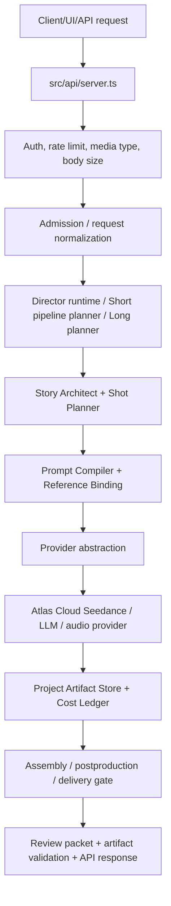

# Cấu Trúc Source, Real Mode Và Bảo Mật Deploy

Tài liệu này là bản đồ thực dụng để dev hiểu nhanh toàn bộ dự án CineJelly Seedance Ultimate Director khi chuẩn bị build UI MVP, mở rộng backend, tích hợp thêm model/API, hoặc deploy thương mại.

Nếu cần bản đọc nhanh trước khi đi sâu, bắt đầu từ `docs/DEVELOPER_OPERATOR_HANDOFF.vi.md`.

Mục tiêu:

- Phân biệt rõ code runtime thật với validation/audit/dev tooling.
- Giữ source sạch, dễ scale, không nhầm test/smoke với production path.
- Chỉ dùng dữ liệu thật qua `.env`, ignored `assets/`, ignored `ops/*.json`, hoặc provider/live evidence được operator duyệt.
- Giữ snapshot upstream như nguồn học/tài liệu, không import trực tiếp vào runtime.

## Kết Luận Ngắn

Runtime thật nằm trong `src/` và build ra `dist/`.

Docker runtime chỉ copy `src` qua build stage rồi copy `dist` sang image chạy thật. Dockerfile không copy `scripts/`, `schemas/`, `docs/`, `external/`, `.env`, `ops/`, hoặc generated `assets/`.

Các file `scripts/run-*-smoke.mjs`, `scripts/audit-*.mjs`, `scripts/validate-*.mjs`, và schema report tương ứng không phải code runtime thừa. Chúng là guardrail để chứng minh backend vẫn đúng trước khi dev push/deploy. Không xóa các file này nếu chưa thay bằng một validation harness tốt hơn.

## Real Mode

Real mode nghĩa là chạy API bằng config thật, auth thật, rate limit thật, model/provider thật, và chỉ dùng evidence thật khi có xác nhận operator.

Chạy local/prod real mode:

```bash
npm run build
npm start
```

Hoặc Docker:

```bash
docker compose up -d --build
```

Không bật các flag này trong production:

```bash
CINEJELLY_DISABLE_API_AUTH=true
CINEJELLY_DISABLE_API_RATE_LIMIT=true
```

Hai flag trên chỉ dùng cho audit local/private một lần. Real mode mặc định của code là auth bật và rate limit bật. Nếu không có deployment token hoặc client policy, protected `/v1` endpoints sẽ trả lỗi thay vì chạy provider.

Real mode cần tối thiểu:

- `ATLASCLOUD_API_KEY`
- `ATLASCLOUD_LLM_API_KEY` hoặc fallback qua `ATLASCLOUD_API_KEY`
- `CINEJELLY_API_AUTH_TOKEN`
- Seedance model IDs và `ATLASCLOUD_SEEDANCE_CAPABILITIES_JSON`
- FFmpeg/FFprobe qua `PATH` hoặc `CINEJELLY_FFMPEG_PATH` / `CINEJELLY_FFPROBE_PATH`
- Durable output storage cho `CINEJELLY_OUTPUT_DIR`

Short Studio tự tạo durable store mặc định dưới `CINEJELLY_OUTPUT_DIR`:

- `short-pipeline-sessions.json` cho session hội thoại/kế hoạch đã redact.
- `short-channel-styles.json` cho style/KOL/channel profile có thể dùng lại.

Chỉ cần đặt `CINEJELLY_SHORT_PIPELINE_SESSION_STORE_PATH` hoặc `CINEJELLY_SHORT_CHANNEL_STYLE_LIBRARY_PATH` nếu muốn tách hai file này sang volume riêng.

## Cấu Hình Một Chỗ

`.env.production.template` là bảng cấu hình deploy duy nhất mà operator cần đọc trước khi chạy thật. File này có đủ các nhóm biến runtime hiện được `src/` đọc: Atlas/model, API auth, rate limit, body size, job queue, workspace billing, timeout/polling, output storage, short session/style store, provider lease/resume queue, request admission limits, cost estimation, source-video analysis, remote stock/material, generated-audio catalog, FFmpeg/FFprobe, và public host.

Các biến nâng cao trong template được để comment để người mới không bị rối. Khi cần scale, chỉ mở đúng nhóm cần chỉnh:

- Tăng tải API: `CINEJELLY_API_*`, `CINEJELLY_RENDER_CONCURRENCY`.
- Giới hạn chi phí/customer: `CINEJELLY_API_CLIENTS_JSON`, `CINEJELLY_WORKSPACES_JSON`, usage ledger paths.
- Tối ưu provider/media: timeout, polling, max clip/audio bytes, source-video analysis, remote stock.
- Deploy thật: `CINEJELLY_PUBLIC_HOST`, durable output volume, auth token, Atlas keys.

`scripts/audit-source-structure.mjs` tự quét tất cả biến môi trường được runtime `src/` đọc và fail nếu biến mới chưa được ghi trong `.env.production.template`. Audit này cũng fail nếu runtime `src/` có marker dang dở `TODO`, `FIXME`, `HACK`, hoặc `XXX`, hoặc nếu code đọc env trực tiếp ngoài các boundary API/application/config/store đã duyệt. `scripts/validate-deployment-package.mjs` cũng dùng cùng nguyên tắc này để chặn gói deploy nếu template thiếu biến runtime. Vì vậy, khi dev thêm model/API/config mới, quy trình đúng là thêm code, thêm biến vào template, cập nhật schema/report nếu audit output thay đổi, rồi chạy `npm run validation:source-structure` và `npm run validation:deployment-package`.

## Bản Đồ Source

| Khu vực | Vai trò | Runtime thật? | Ghi chú |
| --- | --- | --- | --- |
| `src/api/` | HTTP API, auth, rate limit, route render/short/long/job/session/admin | Có | Đây là nơi nối UI/backend/API. |
| `src/application/` | Runtime factory, preflight, request normalization, validation entrypoints | Có | Chạy trước khi provider spend. |
| `src/agents/` | Director, Story Architect, Source Video Analyst, Render Producer | Có | Agent lập kế hoạch và điều phối. |
| `src/core/` | Logic lõi: short/long, graph, prompt packs, review gates, assembly, audio, material, billing, readiness | Có | Nơi nâng cấp backend chính. |
| `src/prompt_compiler/` | Prompt compiler, reference binding, negative constraints, repair hints | Có | Chịu trách nhiệm prompt Seedance/model. |
| `src/providers/` | Provider abstraction và Atlas Cloud adapter | Có | Tích hợp model/API bên ngoài. |
| `src/config/` | Model/runtime settings, Seedance settings, capability policy | Có | Không hardcode secret. |
| `src/types/` | Type contract nội bộ | Có | Đổi API/core thì đổi types tương ứng. |
| `src/utils/` | Redaction, retry, IDs, media tool resolution, helpers | Có | Dùng chung toàn backend. |
| `dist/` | Build output từ TypeScript | Có khi chạy | Không sửa tay. |
| `scripts/` | Validation, audit, evidence runner, operator tools | Không trong runtime image | Giữ để kiểm chứng. |
| `schemas/` | JSON schema cho reports/evidence/API contracts | Không trong runtime image | Dùng bởi validation tools. |
| `docs/` | Kiến trúc, roadmap, runbook, source policy | Không runtime | Dev đọc để hiểu dự án. |
| `external/upstream/` | Snapshot repo/tài liệu public dùng để học/copy-adapt | Không runtime | Production code không import trực tiếp. |
| `deploy/` | Caddy/reverse proxy config | Deploy | Không chứa secret. |
| `assets/reference_inputs/` | Input media staging | Dữ liệu thật, ignored | Không commit. |
| `assets/output_deliverables/` | Output/render/audit/evidence | Dữ liệu thật hoặc evidence local, ignored | Không commit. |
| `ops/*.json` | Attestation/evidence operator điền | Ignored | Không commit. |

## Flow Runtime Chính



Short Studio UI hiện được render từ:

- `src/api/short-pipeline-create-page.ts`

Backend short UI contract chính:

- `src/core/short-mvp-ui-contract.ts`
- `src/core/short-pipeline-conversation.ts`
- `src/core/short-pipeline-planner.ts`
- `src/core/short-pipeline-render-handoff.ts`
- `src/core/short-video-pipe-planner.ts`

## Các Chế Độ Short Chính

| Mode | Backend pipe | Input chính | Output logic |
| --- | --- | --- | --- |
| Smart Short | `normal_short_pipe` | Ý tưởng text, product facts optional | Plan ngắn, prompt tự đủ thông tin, review gate. |
| Product/KOL UGC | `product_kol_reference_pipe` | KOL image, product image, background optional | Reference-to-video với @image role binding. |
| Storyboard Multishot | `storyboard_board_pipe` | Ý tưởng + duration dài hơn hoặc cần nhiều cảnh | Multi-shot, timeline, endpoint, audio intent. |
| Video Remake | `video_remake_pipe` | Source video/summary + KOL/product/background riêng | Học structure/rhythm/camera, thay toàn bộ identity/product/audio/claims. |
| Production Bible | `long_sequence_bible_pipe` | 60-480s hoặc cần consistency dài | Visual bible, sequence boards, last-frame chaining, review gate. |

## Không Xóa Các File Này

Không xóa chỉ vì tên có `smoke`, `audit`, `validation`, hoặc `schema`:

- `scripts/run-backend-system-suite.mjs`
- `tests/run-short-pipeline-smoke.mjs`
- `tests/run-short-pipeline-conversation-smoke.mjs`
- `tests/run-short-mvp-ui-contract-smoke.mjs`
- `tests/run-render-request-contract-smoke.mjs`
- `scripts/audit-source-structure.mjs`
- `scripts/audit-backend-system-readiness.mjs`
- `scripts/validate-report-contracts.mjs`
- `schemas/*-smoke-report.schema.json`

Lý do: chúng không chạy trong production runtime, nhưng chứng minh source không bị lệch contract. Xóa chúng sẽ làm dự án sạch giả, không phải sạch thật.

## File Có Thể Dọn

Có thể dọn nếu xuất hiện:

- `assets/output_deliverables/**` sinh ra từ audit/render local.
- `assets/live-tests/**` hoặc media thử nghiệm local.
- `tmp-*`, console dump, screenshot tạm.
- Build output cũ trong `dist/` nếu sẽ build lại.
- File upstream test/demo/example nếu lọt khỏi `.gitignore` và không được docs/snapshot policy yêu cầu giữ.

Không dọn:

- `docs/`
- `external/upstream/`
- `scripts/`
- `schemas/`
- `README.md`
- `AGENTS.md`
- `.env.production.template`
- `Dockerfile`, `docker-compose.yml`, `deploy/`

## File Dev Thường Cần Sửa

Khi nâng cấp backend:

- Short flow: `src/core/short-*`, `src/types/short-*`, `src/api/server.ts`
- Prompt/model: `src/prompt_compiler/`, `src/config/seedance-settings.ts`, `src/providers/`
- Long flow: `src/core/long-*`, `src/agents/story-architect.ts`, `src/core/production-graph-*`
- API/security: `src/api/`, `src/application/runtime-preflight.ts`
- UI MVP hiện tại: `src/api/short-pipeline-create-page.ts`
- Provider mới: `src/providers/provider-registry.ts`, `src/providers/contracts.ts`, `src/config/runtime-config.ts`, `src/config/seedance-capabilities.ts`, `src/config/seedance-settings.ts`, `src/types/provider.ts`
- Report/evidence: `schemas/`, `scripts/validate-*`, `scripts/audit-*`

## File Không Sửa Tay

- `dist/`: chạy `npm run build` để tạo lại.
- `.env`: chỉ operator/server sửa, không commit.
- `assets/output_deliverables/`: generated evidence/output, không commit.
- `assets/reference_inputs/`: media input thật, không commit.
- `ops/*.json`: operator evidence thật, không commit.
- `node_modules/`: dùng `npm ci`.

## Checklist Trước Khi Push

Nhanh:

```bash
npm run build
npm run validation:source-structure
```

Đầy đủ backend no-spend:

```bash
npm run validation:backend-system-suite
```

Trước deploy Docker:

```bash
npm run validation:deployment-package
```

Sau deploy HTTPS thật:

```bash
npm run validation:deployment-readiness -- --base-url https://your-domain.example
```

## Cách Hiểu Readiness

`backend-system-suite: pass` nghĩa là code/contract local đã qua các cổng kiểm no-spend.

`backend-system-readiness: blocked_by_external_evidence` không phải lỗi source nếu `codeIssueCount=0`. Nó nghĩa là còn thiếu bằng chứng ngoài source, ví dụ:

- Live HTTPS deployment capture.
- Paid/live provider evidence.
- Operator attestation.
- Manual media/audio review.
- Product rights/review evidence.

Các bằng chứng này phải đi qua `.env`, ignored `ops/*.json`, ignored `assets/output_deliverables/`, hoặc command validation thật. Không nhét bằng chứng thật vào source.

## Khi Thêm Model/API Mới

1. Thêm capability/config vào `src/config/`.
2. Thêm provider adapter vào `src/providers/`.
3. Cập nhật type contract trong `src/types/`.
4. Cập nhật admission guard/API parsing nếu request shape đổi.
5. Cập nhật prompt compiler hoặc planner nếu model cần prompt khác.
6. Cập nhật schema/report/validation liên quan.
7. Chạy build, source-structure audit, backend-system suite.

## Nguyên Tắc Snapshot

`external/upstream/` là nguồn học và đối chiếu. Production code không import từ đây.

Quy trình đúng:

1. Đọc snapshot.
2. Ghi nguồn/logic vào docs hoặc source-logic record.
3. Copy/adapt ý tưởng thành CineJelly-owned code trong `src/`.
4. Thêm attribution/credit nếu cần.
5. Thêm validation chứng minh behavior mới.

## Trạng Thái Kỳ Vọng Của Source Sạch

Source sạch không có nghĩa là không có validation scripts.

Source sạch nghĩa là:

- `git status` không có file runtime/artifact lạ.
- Docker runtime không copy secret/output/snapshot/dev tooling.
- `src/` không import trực tiếp `external/upstream`.
- Auth/rate-limit không bị tắt trong real mode.
- Provider/model IDs nằm trong config/env/capability policy.
- Generated media/evidence nằm trong ignored `assets/` hoặc ignored `ops/`.
- Validation suite pass hoặc báo rõ blocker ngoài source.

## Audit Source Sạch Hiện Tại

Kết quả audit ngày 2026-07-02:

- `src/` không có file `smoke`, `mock`, `demo`, `test`, hoặc `fixture`.
- `src/` không có marker `TODO`, `FIXME`, `HACK`, hoặc `XXX`; nếu cần ghi việc còn lại, đưa vào docs/runbook/issue thay vì để trong runtime path.
- Env/runtime config chỉ được đọc ở boundary API/application/config/store đã duyệt; logic lõi `core/`, `agents/`, `providers/`, và `prompt_compiler/` nhận config qua object thay vì tự đọc `.env`.
- `scripts/validate-deployment-package.mjs` chạy actual `npm pack --dry-run --json --silent` khi `dist/` đã build, parse danh sách file thật, và fail nếu package chứa `src/`, `scripts/`, `schemas/`, `docs/`, `external/`, `assets/`, `ops/`, `.env`, Docker/deploy config, source map, hoặc file test/smoke/demo/sample/example.
- `dist/` production không còn file `.map`; `tsconfig.json` đặt `compilerOptions.sourceMap=false`.
- `scripts/audit-source-structure.mjs` và `scripts/validate-deployment-package.mjs` cùng có guard `tsconfig_no_production_source_maps` để chặn việc bật lại source map trong artifact production.
- `scripts/validate-deployment-package.mjs` kiểm tra cả `package.json` lẫn npm package dry-run để package chỉ chứa runtime `dist/`, `README.md`, `package.json`, và `.env.production.template`; entrypoint chỉ trỏ `dist/`, không có lifecycle pack script, và `dist/` không có `.map` nếu đã build. `schemas/` được giữ trong repo làm hợp đồng audit/dev, nhưng không đi vào npm package runtime.
- Các route HTML tĩnh như `/short/create` và `/operator/launch-dashboard` được API gửi kèm `no-store`, `nosniff`, `DENY` frame, `no-referrer`, permissions policy, và CSP chỉ cho tài nguyên cùng origin; hai UI smoke bắt buộc kiểm header này.
- `scripts/audit-source-structure.mjs` kiểm tra `src/api/server.ts` để response egress vẫn tập trung ở `sendJson`/`sendHtml`; route-level JSON headers không được ghi đè security base headers.
- `tests/run-api-response-redaction-smoke.mjs` chạy local HTTP `/health` để kiểm JSON response có security headers và `X-CineJelly-Request-Id`, đồng thời kiểm redaction source-lineage/local-path.
- `scripts/audit-source-structure.mjs` kiểm tra các npm scripts trong `package.json` để file `scripts/*.mjs`, `scripts/*.ps1`, và source tương ứng của `dist/*.js` entrypoint không bị stale hoặc mất file.
- `scripts/validate-deployment-package.mjs` kiểm tra Docker/Compose tạo và mount bền cả `/app/assets/output_deliverables` lẫn `/app/assets/reference_inputs`, để output và input media thật không bị nhét vào image hoặc mất khi container restart.
- `scripts/validate-deployment-package.mjs` cũng chặn `.env.production.template` nếu template chủ động bật tắt auth/rate-limit hoặc bật live source-video/remote-stock gates mặc định.
- Các file `scripts/run-*-smoke.mjs` và `schemas/*-smoke-report.schema.json` được giữ lại như dev/audit guardrail, không phải code runtime. Chúng không được import bởi `src/` và không đi vào Docker runtime.
- `.env.production.template` là nguồn config deploy sạch; `.env`, media thật, output thật và operator evidence phải nằm ngoài git.

Các lệnh đã chứng minh trạng thái này:

```bash
npm run build
npm run validation:source-structure
npm run validation:deployment-package
npm run validation:report-contracts
npm run validation:short-mvp-ui-contract
npm run validation:operator-launch-ui-contract
npm run validation:backend-system-suite
```
