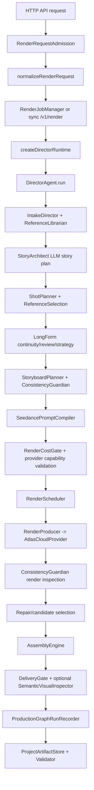
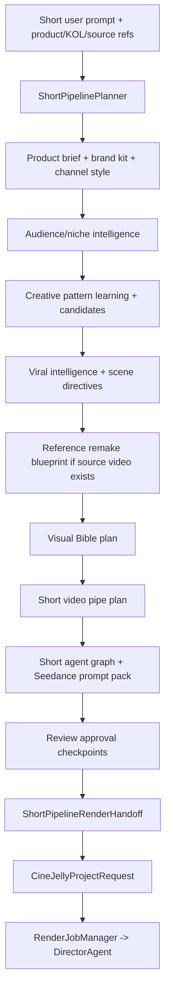

# CineJelly Seedance Ultimate Director - Báo Cáo Kiến Trúc Backend

Ngày lập báo cáo: 2026-06-29
Branch được phân tích: `codex/backend-audit-short-pipes`
Commit được phân tích: `16e11bf`
Phạm vi: backend logic trong `src/api`, `src/application`, `src/agents`, `src/core`, `src/prompt_compiler`, `src/providers`, `src/config`, `src/types`. Báo cáo này không dựa vào README để suy đoán; các nhận xét bên dưới được rút ra từ code runtime và contract TypeScript.

## Tóm Tắt Điều Hành

Backend hiện tại không phải một hàm "prompt vào, video ra" đơn giản. Hệ thống đã được tách thành nhiều tầng: API/admission, short no-spend planning, long/director runtime, production graph, prompt compiler, render orchestration, provider Atlas Cloud, assembly, delivery gate, artifact validation.

Trung tâm của full render là `DirectorAgent`, còn Trung tâm của truy vết là `ProductionGraph`. Short pipeline là một lớp agentic planning riêng, tạo ra plan có review gate và render handoff trước khi đi vào `DirectorAgent`.

Mặc định model/provider mode không bắt user phải chọn text-to-video, image-to-video hay reference-to-video. User chỉ nên chọn cấp chất lượng/tier/cấu hình như `mini | fast | standard`, resolution, audio, duration. Backend tự router mode dựa trên reference, visual bible, video pipe và prompt binding.

Hiện tại backend đã có nền tảng rất mạnh cho:

- short video nhiều niche với pattern learning, candidate scoring, viral/niche intelligence;
- Product/KOL UGC bằng ảnh KOL + ảnh sản phẩm;
- storyboard multishot;
- video remake theo cấu trúc/pacing/camera/acting beat của video tham chiếu, nhưng thay KOL/sản phẩm/background/audio/claims bằng tài sản user;
- long-form 2-10 phút bằng cách chia thành clip 4-15s, continuity bible, last-frame chaining, render schedule và assembly.

Nhưng để gọi là "commercial-grade 100%" theo nghĩa sản xuất bản thật, vẫn cần thêm bằng chứng vận hành thực tế: nhiều render live đã duyệt chất lượng, audio paid/live, manual media review, live deployment, billing/operator approval, và bằng chứng provider resume/handoff trên traffic thật.

---

# PHẦN 1: Tổng Quan Kiến Trúc Backend

## 1.1 Các Layer Chính

### API Layer

File chính: `src/api/server.ts`

Trách nhiệm:

- Nhận HTTP request.
- Auth, rate limit, concurrency, content-type, body size.
- Chia endpoint cho planning, UI contract backend, product-url research, render job, review job, admin diagnostics.
- Không trực tiếp gọi provider Seedance nếu request chưa qua admission, review và billing gates.

Endpoint quan trọng:

- `GET /health`
- `GET /v1/preflight`
- `GET /v1/validation-readiness`
- `GET /v1/render-settings`
- `GET /v1/short-pipeline/video-pipes`
- `POST /v1/short-pipeline/plan`
- `POST /v1/short-pipeline/ui-contract`
- `POST /v1/short-pipeline/product-url-plan`
- `POST /v1/short-pipeline/render-jobs`
- `POST /v1/render-jobs`
- `GET /v1/render-jobs`
- `GET /v1/render-jobs/:id`
- `POST /v1/render-jobs/:id/review`
- `DELETE /v1/render-jobs/:id`
- `POST /v1/render`
- `POST /v1/long-form/director-ui-contract`
- Operator/admin endpoints cho launch, billing, client policy, provider lease và Production Graph resume queue.

### Admission, Security, Billing, Quota Layer

Files chính:

- `src/api/render-request-admission.ts`
- `src/application/render-request-normalizer.ts`
- `src/api/api-auth.ts`
- `src/api/api-rate-limit.ts`
- `src/api/api-concurrency-gate.ts`
- `src/api/api-client-policy.ts`
- `src/api/workspace-billing-policy.ts`

Trách nhiệm:

- Chặn request quá lớn, sai schema, URL không an toàn, reference có token/signature/credential, local path leak.
- Normalize path output/work/artifact vào output root.
- Kiểm tra `settings`, `modelPreferences`, metadata, caption/audio/transition/frame sampling/semantic inspection/source-video analysis.
- Gate chi phí, quota, billing, idempotency.

### Application/Factory Layer

File chính: `src/application/director-factory.ts`

Trách nhiệm:

- Load runtime config từ environment.
- Tạo `AtlasCloudProvider`, `ProviderCostLedger`, `StoryArchitect`, `RenderProducer`, `RenderCostGate`, `SemanticVisualInspector`, `SourceVideoAutoAnalyzer`, material adapters, `AssemblyEngine`.
- Trả về `DirectorRuntime` gồm `DirectorAgent`, ledger và preflight.

### Agent/Application Orchestration Layer

Files chính:

- `src/agents/director-agent.ts`
- `src/agents/intake-director.ts`
- `src/agents/story-architect.ts`
- `src/agents/render-producer.ts`
- `src/agents/source-video-analyst.ts`
- `src/agents/source-video-reference-metadata-enricher.ts`
- `src/agents/reference-librarian.ts`

Trách nhiệm:

- Biến request thành plan sản xuất.
- Gọi LLM để lập story plan.
- Tạo shot contracts, storyboard, prompt, render, inspect, repair, assemble, delivery.
- Nối source-video analysis và references vào prompt/graph.

### Short Agentic Planning Layer

Files chính:

- `src/core/short-pipeline-planner.ts`
- `src/core/short-pipeline-render-handoff.ts`
- `src/core/short-video-pipe-planner.ts`
- `src/core/short-viral-intelligence-planner.ts`
- `src/core/short-creative-pattern-learning.ts`
- `src/core/short-prompt-pattern-corpus.ts`
- `src/core/short-platform-template-corpus.ts`
- `src/core/short-agent-graph-planner.ts`
- `src/core/short-visual-bible-planner.ts`
- `src/core/short-director-planner.ts`
- `src/core/short-commercial-readiness-planner.ts`

Trách nhiệm:

- No-spend planning trước provider spend.
- Hiểu niche, platform, product facts, KOL/product media reference, channel style, brand kit.
- Sinh candidate, scoring, viral strategy, scene directives, visual bible, video pipe, prompt pack, review checkpoints.
- Chuyển plan thành `CineJellyProjectRequest` quá `buildShortPipelineRenderHandoff`.

### Domain/Core Layer

Files chính:

- `src/core/production-graph.ts`
- `src/core/production-graph-builder.ts`
- `src/core/production-graph-run-recorder.ts`
- `src/core/consistency-guardian.ts`
- `src/core/render-scheduler.ts`
- `src/core/long-form-continuity-planner.ts`
- `src/core/long-form-agent-review-planner.ts`
- `src/core/long-form-timeline-planner.ts`
- `src/core/long-form-creative-intelligence-planner.ts`
- `src/core/long-form-readiness-planner.ts`
- `src/core/video-render-strategy-planner.ts`
- `src/core/assembly-engine.ts`
- `src/core/delivery-gate.ts`

Trách nhiệm:

- Quản lý graph, continuity, scheduling, review, timeline, delivery validation.
- Kiểm tra deterministic trước và sau render.
- Tách planning và provider execution.

### Prompt Compiler Layer

Files chính:

- `src/prompt_compiler/prompt-compiler.ts`
- `src/prompt_compiler/reference-binding.ts`
- `src/prompt_compiler/negative-constraints.ts`
- `src/prompt_compiler/repair-hints.ts`

Trách nhiệm:

- Bien `ShotContract` thành prompt Seedance và `VideoGenerationRequest`.
- Sắp xếp, cap và filter references theo vai trò.
- Tự chọn provider mode: `text_to_video`, `image_to_video`, `reference_to_video`, `video_to_video`, `extend`, `edit`.
- Tạo @ handles: `@image1`, `@video1`, `@audio1`.
- Thêm negative prompt, continuity, pacing, final-frame, source-video boundary, repair hints.

### Provider Layer

Files chính:

- `src/providers/contracts.ts`
- `src/providers/atlascloud/atlas-cloud-provider.ts`
- `src/providers/atlascloud/atlas-cloud-http.ts`
- `src/providers/atlascloud/atlas-cloud-mappers.ts`
- `src/providers/capability-validator.ts`
- `src/providers/cost-ledger.ts`

Trách nhiệm:

- Trừu tượng hóa LLM, video provider, asset upload, audio provider.
- Atlas Cloud provider gọi chất/structured LLM, video generation, prediction polling, asset registration, audio generation.
- Map payload Seedance/Atlas, capabilities, usage/cost ledger.

### Infrastructure, Artifact, Resume Layer

Files chính:

- `src/core/project-artifact-store.ts`
- `src/core/project-artifact-validator.ts`
- `src/core/review-packet-builder.ts`
- `src/core/production-graph-resume-state.ts`
- `src/api/render-provider-handoff-lease-service.ts`
- `src/api/production-graph-resume-queue-service.ts`

Trách nhiệm:

- Ghi artifact bundle, review packet, cost ledger, metadata, source-video analysis.
- Validate artifact contract.
- Tạo resume capsule/queue dạng digest, tránh serialize raw URL/local path/secret.
- Operator service cho provider handoff lease và resume queue.

## 1.2 Production Graph Đóng Vai Trò Trung Tâm Như Thế Nào

`ProductionGraph` không phải là "planner" duy nhất. Nó là lớp lineage/truy vết và repair propagation trung tâm của full render.

Lifecycle:

1. `DirectorAgent.run()` intake request.
2. Story/shot/storyboard/material plan được tạo.
3. `ProductionGraphBuilder.build()` Tạo graph trước render.
4. Render/test-take/candidates/repair/deliverable xong thì `ProductionGraphRunRecorder.record()` ghi thêm node kết quả.
5. Artifact store và review packet dùng graph để chứng minh lineage.

Node chính:

- `project`
- `story_arc`
- `sequence`
- `scene`
- `beat`
- `storyboard_panel`
- `shot`
- `reference_asset`
- `reference_selection`
- `material_sourcing`
- `inspection_report`
- `clip_render`
- `repair_action`
- `deliverable`

Edge chính:

- `depends_on`
- `transitions_to`
- `continues_identity`
- `continues_environment`
- `matches_motion`
- `requires_repair`

Repair propagation:

- `ProductionGraph.repairAffectedNodes()` đi BFS quá `depends_on`, `transitions_to`, `requires_repair`.
- Nếu một shot/reference/inspection fail, graph có thể xác định node downstream bị ảnh hưởng.

## 1.3 Các Thành Phần Cốt Lõi

### Production Graph

- Quản lý lineage, node/edge, dependency, transition và repair scope.
- Đảm bảo `depends_on` không Tạo cycle.
- Giữ data cho artifact validation, review packet, resume state.

### Consistency Guardian

File: `src/core/consistency-guardian.ts`

- Kiểm tra storyboard coverage.
- Kiểm tra shot duration 4-15s, subject/action/camera/lighting.
- Kiểm tra references và prompt binding conflicts.
- Kiểm tra prompt density, negative prompt, timeline.
- Kiểm tra provider render status/output URL/latency.
- Trả về status: `pass`, `warn`, `repair`, `rerender`, `block`.

### Prompt Compiler

File: `src/prompt_compiler/prompt-compiler.ts`

- Tạo prompt có cấu trúc: reference prelude, mode contract, continuity, pacing, bridge, boundary, subject/action/camera/lighting/timeline/audio/final frame.
- Hỗ trợ @ reference, first-frame, last-frame, source-video boundary.
- Output gồm `CompiledPrompt`, `VideoGenerationRequest`, negative prompt, references, binding plan, repair hints.

### Render Orchestration

Files:

- `src/api/render-job-manager.ts`
- `src/core/render-scheduler.ts`
- `src/agents/render-producer.ts`
- `src/core/render-cost-gate.ts`

Chức năng:

- Async queue, status polling, cancel, review resume.
- Candidate count theo quality mode.
- Test take nếu quality không phải economy.
- Repair attempts nếu Guardian báo repair/rerender.
- Parallel chỉ khi shot không có dependency/endpoint/source/risk.

### Chaining / Continuation

Files:

- `src/core/endpoint-frame-chain.ts`
- `src/agents/director-agent.ts`

Chức năng:

- Khi strategy yêu cầu/recommend last-frame chaining, shot sau sẽ lấy image sidecar của shot trước làm `first_frame`.
- Nếu required mà provider không trả last frame/image sidecar thì block.
- Prompt được compile lại sau khi inject first-frame reference.

### Source Video Analysis

Files:

- `src/agents/source-video-analyst.ts`
- `src/core/source-video-auto-analyzer.ts`
- `src/agents/source-video-reference-metadata-enricher.ts`

Chức năng:

- Caller có thể gửi sẵn `sourceVideoAnalysis`.
- Opt-in auto-analysis có thể lấy frame sample từ clean HTTPS source video, gửi LLM structured JSON để lấy beat map/pacing/camera/style.
- Enricher gắn metadata source scene/shot/timeline vào references.
- Remake chỉ dùng structure/pacing/camera/acting/audio energy, không copy transcript/face/logo/music/brand marks.

## 1.4 Hỗ Trợ Long-form 2-10 Phút

`settings.durationTargetSeconds` cho phép 15-480s theo `src/config/seedance-settings.ts`. Seedance clip đơn lẻ vẫn bị giới hạn 4-15s, nên long-form được xử lý bằng chunking:

- `StoryArchitect` tạo story plan target duration.
- `ShotPlanner` chia thành shot 4-15s.
- `LongFormSequencePlanner` gồm scenes thành sequence.
- `LongFormContinuityPlanner` Tạo continuity bible.
- `RenderScheduler` quyết định shot nào render parallel/sequential.
- `LongFormTimelinePlanner` Tạo timeline segment.
- `LongFormCreativeIntelligencePlanner` và `LongFormReadinessPlanner` cham coherence/repair queue.
- `AssemblyEngine` ghép clip thành deliverable.

---

# PHẦN 2: End-to-End Backend Pipeline

## Bước 1: API Layer - Nhận Request

### Endpoint tạo video

Có 3 đường chính:

1. Short planning no-spend:
   - `POST /v1/short-pipeline/plan`
   - `POST /v1/short-pipeline/ui-contract`
   - `POST /v1/short-pipeline/product-url-plan`

2. Short render job:
   - `POST /v1/short-pipeline/render-jobs`
   - `POST /v1/short-pipeline/conversation-sessions/:id/render-jobs`

3. General render:
   - `POST /v1/render-jobs` cho async render.
   - `POST /v1/render` cho sync render.

### Request body chính

`CineJellyProjectRequest` có các trường quan trọng:

- `userInput`: ý tưởng/brief.
- `settings`: tier, resolution, qualityMode, ratio, durationTargetSeconds, audioMode, bitrateMode, watermark, returnLastFrame, maxCostUsd.
- `modelPreferences`: optional `seedanceModelId`.
- `references`: PromptReference đã normalize.
- `sourceVideoAnalysis`: optional SourceVideoDeconstruction.
- `captionCues`, `captionOptions`.
- `audioTracks`, `audioMixOptions`.
- `generatedAudioIntents`.
- `frameSamplingOptions`.
- `transitionSettings`.
- `semanticVisualInspectionOptions`.
- `metadata`.
- `outputPath`, `workDirectory`, `artifactDirectory`.

Short pipeline request có thêm:

- `projectId`, `requestId`.
- `userPrompt`.
- `targetPlatform`, `targetDurationSeconds`.
- `product` gồm URL/snapshot.
- `brandKit`.
- `channelStyle`.
- `mediaReferences` gồm KOL/product/background/source_video/audio.
- `visualBible`.
- `referenceVideoLearning`.
- `audio`.

### Validation

Trong `server.ts`:

- `assertJsonContentType()`.
- `readJsonBody()` giới hạn bytes.
- auth/rate limit/chính sách client.

Trong `RenderRequestAdmission.assertAcceptable()`:

- `userInput` bắt buộc và giới hạn length.
- settings validate bằng `normalizeSeedanceSettings()`.
- model ID phải nằm trong allowlist env nếu override.
- references phải có `providerReference`.
- URI phải clean HTTPS hoặc `asset://`.
- chặn local path, localhost/private host, embedded credentials, secret query.
- source video analysis bị bound scenes/transcript/keyframes/notes.
- audio/caption/transition/frame sampling/semantic inspection deu được validate.

Trong `normalizeRenderRequest()`:

- set requestId vào metadata.
- resolve output/work/artifact directory.
- enforce path nằm trong `CINEJELLY_OUTPUT_DIR`.

### Output sau validate

- Short no-spend: `ShortPipelinePlan`.
- Short render: `ShortPipelineRenderHandoff.request` là `CineJellyProjectRequest`.
- General render: normalized `CineJellyProjectRequest`.
- Async render: `RenderJobSummary` và `statusUrl`.

### Evidence / Logging

- API gắn `requestId` vào response headers.
- Render job lưu `stageProgressEvents`, provider checkpoint, cost ledger, artifact validation.
- Short plan có `noSpend`, `networkCallsMade`, `providerCallsMade`, `releaseGateSummary`.

## Bước 2: Input Processing & Normalization

### Xử lý reference images/audio/video

`IntakeDirector` gọi `ReferenceLibrarian.normalize()`:

- Role Hợp lệ: `identity`, `product`, `wardrobe`, `environment`, `motion`, `camera`, `audio_tempo`, `voice`, `style`, `first_frame`, `last_frame`, `source_video_structure`.
- Kind Hợp lệ: `image`, `video`, `audio`, `first_frame`, `last_frame`, `identity`, `product`, `environment`, `motion`, `camera`, `style`.
- Tự infer kind theo URL extension và role.
- Dedupe theo role/label/kind/uri.
- Sắp xếp theo thứ tự role priority.
- Chan unsafe URI.

Short pipeline có `mediaReferencePlanFor()`:

- Nhận raw `ShortMediaReferenceInput`.
- Tạo prompt tag `@image1`, `@video1`, `@audio1`.
- Đổi role UI như `kol`, `creator`, `product`, `background`, `source_video` thành prompt role.
- Danh dấu `includeInProviderHandoff` chỉ khi URI/rights/provider policy sản sang.
- Source video nếu chưa operator-approved/clean HTTPS thì dùng planning-only.

### Source video

Có 3 mức:

1. User chỉ upload/gửi source video:
   - Short planner Tạo `referenceVideoLearningFromSourceMedia()`.
   - Tạo summary: học rhythm, acting beats, camera grammar, retention timing, audio energy, payoff shape.

2. User/caller gửi `sourceVideoAnalysis`:
   - `SourceVideoAnalyst.normalize()` validate và cap dữ liệu.

3. Auto-analysis opt-in:
   - `SourceVideoAutoAnalyzer.prepareRequest()` tìm reference role `source_video_structure`.
   - Chỉ nhận clean HTTPS, không token/localhost.
   - `MediaInspector.sampleFrames()` lấy frames.
   - LLM structured JSON Tạo scenes, keyframes, pacingNotes, styleNotes, structuralBeats, safetyNotes.
   - Normalize lại qua `SourceVideoAnalyst`.

### Output

- `IntakeResult`: userInput, projectId, settings, references, metadata, sourceVideoAnalysis.
- Short: `ShortPipelinePlan.mediaReferencePlan`, `referenceRemakeBlueprint`, `visualBiblePlan`.

### Evidence

- Hash URI thay vì expose raw URL trong nhiều metadata.
- Source pattern origins được gắn trong short plan và corpora.
- Source-video auto-analysis cam leak data URL/local frame path.

## Bước 3: Planning & Storyboard Generation

### Short planning

`ShortPipelinePlanner.buildPlan()` làm các việc sau:

1. Clean prompt.
2. Extract product brief bằng `ProductUrlBriefExtractor`.
3. Evaluate brand kit bằng `BrandKitEvaluator`.
4. Evaluate channel style.
5. Infer intent: platform, duration, goal, audience, offer, aspect ratio.
6. Tạo audio policy Mặc định voiceover/guided.
7. Tạo visual text policy Mặc định no visible text.
8. Tạo media reference plan.
9. Tạo optional workflow template suggestions.
10. Tạo concepts.
11. Tạo preliminary scenes.
12. Chay `ShortViralIntelligencePlanner`.
13. Chay preliminary `ShortAgentGraphPlanner`.
14. Dùng selected candidate để Tạo scenes cuối.
15. Chay viral intelligence lần 2.
16. Tạo `referenceRemakeBlueprint` nếu có source video/reference learning.
17. Tạo `ShortVisualBiblePlan`.
18. Tạo final `ShortAgentGraph`.
19. Tạo `seedanceRouting`.
20. Tạo `ShortDirectorPlan`.
21. Tạo `ShortVideoPipePlan`.
22. Tạo review checkpoints.
23. Tạo commercial readiness.

Short có 5 pipe:

- `smart_short`: ý tưởng ngắn, ít reference.
- `product_kol_ugc`: có KOL/product reference.
- `storyboard_multishot`: cần full beginning/middle/end nhiều clip.
- `video_remake`: có source/trend/reference video.
- `production_bible`: 60-480s hoặc cần character/product/sequence bible.

### General/long planning

`DirectorAgent.run()`:

1. `StoryArchitect.plan()` Gọi LLM structured để Tạo `StoryPlan`.
2. `ContinuityLedgerBuilder.build()`.
3. `ShotPlanner.plan()` Tạo `ShotContract`.
4. `ReferenceSelectionPlanner.planForShots()`.
5. `LongFormContinuityPlanner.build()`.
6. `LongFormAgentReviewPlanner.build()`.
7. `VideoRenderStrategyPlanner.build()`.
8. `StoryboardPlanner.plan()`.
9. `ConsistencyGuardian.inspectStoryboard()`.
10. `StoryboardApprovalGate.evaluate()`.

### Storyboard và Shot Contract

`StoryboardPlanner` Tạo panel từ shot contracts. Guardian yêu cầu:

- mỗi shot có panel;
- không panel dư thừa/duplicate;
- duration khớp shot;
- action/camera/lighting khớp shot;
- references khớp shot;
- transition intent khớp shot.

### Production Graph

`ProductionGraphBuilder.build()` Tạo graph sau khi có intake, storyPlan, shots, storyboard, material sourcing.

Graph gồm project -> story -> sequence -> scene -> beat -> storyboard_panel -> shot. References và material sourcing được nối vào shot.

### Source video enrich storyboard

Source video không được copy trực tiếp vào storyboard. Nó đi qua:

- source analysis;
- reference metadata enricher;
- continuity anchors;
- prompt/source-video boundary;
- remake blueprint;
- render strategy.

## Bước 4: Prompt Compilation

### Input

`SeedancePromptCompiler.compile()` nhận:

- `shot`
- `settings`
- `modelId`
- `provider`
- `providerSupportedReferenceKinds`
- optional max provider references.

### Xử lý chính

1. Chọn references:
   - ưu tiên `shot.referenceSelectionPlan.selectedReferences`;
   - fallback `shot.references`.

2. `buildPromptBindingPlan()`:
   - sort theo role priority;
   - filter duplicate;
   - filter unsupported provider kind;
   - source_video_structure planning-only nếu chưa `selection.authorized === true` hoặc chưa có provider capability;
   - cap Tổng provider refs Mặc định 8;
   - cap family Atlas: image 9, video 3, audio 3;
   - tạo conflicts và roleScopes.

3. Resolve provider mode:
   - không reference -> `text_to_video`.
   - image/identity/product/first_frame/last_frame -> `image_to_video`.
   - video/source_video_structure/motion/camera/audio/style -> `reference_to_video`.

4. Build prompt:
   - provider reference handles;
   - Atlas aliases;
   - provider mode contract;
   - continuity;
   - pacing;
   - motion continuity;
   - inter-shot bridge;
   - boundary choreography;
   - subject/action/camera/lighting/style/timeline/audio/transition;
   - final-frame contract.

5. Build negative prompt:
   - no watermark, no subtitles/captions nếu không request;
   - no fake UI text;
   - no flicker/static product pose;
   - no copied source face/transcript/music/logo/watermark nếu có source video.

### Hỗ trợ @ reference, first_frame, multi-shot, continuation

Có hỗ trợ:

- `@imageN`, `@videoN`, `@audioN`.
- first-frame/last-frame refs.
- source video refs chỉ dùng structure.
- inter-shot bridge.
- final-frame contract.
- last-frame chaining sẽ recompile prompt ở bước render nếu cần.

### Output

`CompiledPrompt` gồm:

- `prompt`
- `negativePrompt`
- `references`
- `bindingPlan`
- `inspectionExpectations`
- `repairHints`
- `videoRequest`

## Bước 5: Render Job Creation & Execution

### Async render job

`RenderJobManager.submit()`:

- Kiểm tra idempotency.
- Evaluate pre-render review approval.
- Nếu cần review thì status `paused_for_review` hoặc `paused_for_revision`.
- Nếu reject thì `rejected`.
- Nếu pass thì `queued`.
- `pumpQueue()` chạy theo maxConcurrent.

`runJob()`:

- Tạo runtime quá `createDirectorRuntime()`.
- Gọi `runtime.director.run()`.
- Ghi artifact bundle.
- Validate artifact.
- Update result/cost/provider checkpoint.

### Candidate generation

Theo `qualityMode`:

- `economy`: 1 candidate, 0 repair, không test take.
- `standard`: 2 candidates, 1 repair, có test take.
- `high`: 3 candidates, 2 repairs, có test take.
- `ultimate`: 4 candidates, 3 repairs, có test take.

`DirectorAgent.renderShot()`:

1. optional test take 4s.
2. Nếu test take repair thì compile repair prompt.
3. render candidates.
4. chọn best candidate theo Guardian status/severity/output/latency/index.
5. repair attempts nếu selected candidate cần repair/rerender.

### Tier/model selection

`resolveSeedanceModelId()`:

- Nếu `modelPreferences.seedanceModelId` có và nằm trong allowlist: dùng model đó.
- Tier `mini`: dùng `ATLASCLOUD_SEEDANCE_MINI_MODEL` nếu có, nếu không tìm capability mini, fallback fast.
- Tier `fast`: dùng fast model.
- Tier `standard`: dùng standard model.

User không cần chọn provider mode. Backend chọn mode theo references/prompt compiler.

### Atlas Cloud / Seedance call

`RenderProducer.render()`:

- validate capability.
- prepare/register video/audio references nếu cần.
- submit qua provider method theo mode.
- wait prediction nếu async.
- block nếu succeeded mà không có output URL.

`AtlasCloudProvider.toAtlasVideoPayload()` Tạo:

- `model`
- `prompt`
- `negative_prompt`
- `duration`
- `fps: 24`
- `resolution`
- `bitrate_mode`
- dimensions/ratio
- `mode`
- `image`, `image_url`
- `last_image`, `image_end`, `last_image_url`, `end_image_url`
- `video`, `video_url`
- `audio`, `audio_url`
- `reference_images` tối đa 9
- `reference_videos` tối đa 3
- `reference_audios` tối đa 3
- `references`
- `generate_audio`
- `watermark`
- `return_last_frame`
- `metadata`

### Evidence

- `ProviderCostLedger` ghi provider operations.
- `RenderJobProviderCheckpoint` ghi operation count, provider, prediction IDs, asset IDs, retry count.
- `ProductionGraphRunRecorder` ghi clip render, inspection, repair, deliverable.

## Bước 6: Inspection & Consistency Check

### Guardian checks

Storyboard:

- coverage;
- unknown shot;
- missing panel;
- duplicate;
- panel count;
- order;
- duration;
- completeness;
- action/camera/lighting alignment;
- reference alignment;
- transition alignment;
- inspection focus.

Preflight:

- duration 4-15s;
- subject/action/camera/lighting non-empty;
- references bắt buộc theo risk;
- binding conflicts;
- continuity ledger;
- prompt density;
- negative prompt density;
- timeline bounds.

Render:

- provider status;
- output presence;
- latency warning.

### Visual inspection thực tế

Có optional `SemanticVisualInspector`:

- Cần `frameSamplingOptions` và `semanticVisualInspectionOptions.enabled`.
- `MediaInspector.sampleFrames()` lấy frames từ deliverable.
- Multimodal LLM inspect theo expectations.

Mặc định deterministic Guardian không "nhìn" video pixel từng frame. Nó check provider response và ffprobe delivery. Visual semantic QA là optional.

### Pass / repair / rerender / block

- `pass`: tiep tuc.
- `warn`: ghi nhận, vẫn tiep tuc.
- `repair`: compile repair prompt nếu ở test-take/candidate stage.
- `rerender`: render lại shot trong repair attempts.
- `block`: dùng pipeline.

### Evidence

- `GuardianReport` có nodeId, stage, status, findings, repairScope, affectedNodeIds, sourceCheckpoints, recommendedNextStep.
- Stage progress ghi status theo stage.

## Bước 7: Repair & Re-render Flow

Khi cần repair:

1. Guardian Tạo finding và repair directive.
2. `DirectorAgent.compileTestTakeRepair()` hoặc `compileRepairAttempt()` nối repair block vào prompt.
3. Chỉ shot dạng fail được rerender.
4. Candidate mới được inspect lại.
5. Best candidate được chọn.
6. `ProductionGraphRunRecorder` ghi repair_action và inspection.

Repair không tự động rebuild toàn bộ story nếu lỗi nằm ở story/graph/storyboard/preflight. Các lỗi planning bị block sớm và yêu cầu regenerate/approve trước provider spend.

## Bước 8: Chaining / Continuation Long-form

### Render schedule

`RenderScheduler` chia batch:

- Parallel nếu shot không có endpoint/source/risk/transition dependency.
- Sequential nếu:
  - có first/last frame;
  - có source_video_structure;
  - có source timeline selection;
  - có continuity endpoint;
  - có risks;
  - transition intent cần bridge;
  - strategy yêu cầu reference lock/source video/sequence bible/last-frame chaining/manual storyboard.

### Last-frame chaining

`prepareChainedRenderItem()`:

1. Nếu plan không cần chaining: dùng prompt đã cómpile.
2. Nếu shot dấu tiên: dùng prompt đã cómpile.
3. Nếu shot sau:
   - lấy `previousRenderedShot`;
   - `selectLastFrameReference()` tìm image sidecar/final frame;
   - inject reference này vào shot mỗi với role `first_frame`;
   - xóa first_frame cũ;
   - set metadata `chainedFromShotId`, `chainReferenceRole`, `chainReferenceUrlSha256`;
   - compile prompt lại;
   - preflight lại.

Nếu chaining required mà không có image sidecar: throw error trước provider spend cho shot sau.

## Bước 9: Assembly & Post-production

### Assembly

File: `src/core/assembly-engine.ts`

Điều kiến:

- Có `outputPath`, `workDirectory`, và renderedShots.

Flow:

1. Kiểm tra ffmpeg/ffprobe.
2. Materialize remote/local clips.
3. Tạo concat list.
4. Nếu nhiều clip và transition enabled: dùng `TransitionEngine`.
5. Nếu không: ffmpeg concat copy.
6. Postproduction polish nếu enabled.
7. Caption burn-in Nếu `captionOptions.enabled && burnIn`.
8. Audio mix nếu có audio tracks.
9. ffprobe final output.
10. sample frames nếu request.
11. tính output byte size và SHA-256.

### Transition

`TransitionEngine`:

- normalize canvas, fps, pixel format;
- dùng `xfade`;
- preserve audio bằng `acrossfade`;
- fill silence nếu clip thiếu audio;
- auto chọn fade/hblur/wipe/slide/... theo transition intent.

### Audio

Audio có 3 nhom:

- provider native/guided trong Seedance payload: `generate_audio`.
- generated audio intents quá Atlas audio provider nếu capability/env sản sang.
- audio tracks user/provided cho `AudioMixEngine`.

Short handoff Mặc định:

- `audioPolicy.mode = voiceover`;
- `renderAudioMode = guided`;
- `generatedAudioIntentEnabled = true`;
- `nativeProviderAudioEnabled = false`;
- caption burn-in Mặc định false.

### Delivery validation

`DeliveryGate.evaluate()`:

- video stream presence;
- resolution height;
- aspect ratio tolerance;
- duration drift warn/block;
- audio presence warning nếu audio mode khác none mà deliverable không có audio.

## Bước 10: Delivery & Artifact Generation

### Final output

`DirectorRunResult` gồm:

- projectId;
- storyPlan;
- storyboard;
- storyboardPreflight;
- productionGraph;
- longFormContinuityPlan;
- longFormAgentReview;
- videoRenderStrategyPlan;
- longFormTimelinePlan;
- longFormCreativeIntelligencePlan;
- longFormReadinessPlan;
- materialSourcingPlan;
- materialSourceValidation;
- postproductionAssetPlan;
- generatedAudioOutputBatchValidation;
- renderSchedulePlan;
- stagePlan;
- costEstimate;
- compiledPrompts;
- renderedShots;
- deliverable;
- deliveryGate;
- semanticVisualInspection.

### Artifacts

`ProjectArtifactStore` ghi:

- director result summary;
- production graph;
- compiled prompts;
- rendered shots;
- cost ledger;
- review packet;
- source-video analysis nếu có;
- delivery metadata;
- validation reports.

`ProjectArtifactValidator` validate artifact contract, graph structure, source-video presence, long-form plans, provider evidence, delivery fields.

### Hash, provenance

- Deliverable có `outputSha256`.
- Source URLs thường được hash/redact trong metadata.
- Resume state chỉ lưu digest, không lưu raw graph/provider payload/output URLs/local paths/secret-like text.

---

# PHẦN 3: Chỉ Tiết Các Thành Phần Cốt Lõi

## 3.1 Production Graph

Files:

- `src/core/production-graph.ts`
- `src/core/production-graph-builder.ts`
- `src/core/production-graph-run-recorder.ts`
- `src/core/production-graph-resume-state.ts`

### Cấu trúc

`ProductionGraph` dùng Map nodes/edges. Mỗi node có `id`, `type`, `data`, `createdAt`, `updatedAt`.

`addNode()` chặn duplicate node ID.
`addEdge()` yêu cầu source/target tồn tại.
`assertAcyclicForDependency()` chặn cycle cho `depends_on`.

### Dependency

Graph Thể hiện:

- project sinh story;
- story sinh sequence;
- sequence sinh scene;
- scene sinh beat;
- beat sinh storyboard/shot;
- reference/material nối vào shot;
- shot nối với shot tiếp theo bằng `transitions_to`.

### Repair propagation

`repairAffectedNodes()` bắt đầu từ node fail và đi qua:

- `depends_on`
- `transitions_to`
- `requires_repair`

Dùng để xác định node nào cần review/rerender/repair.

### Resume state

`production-graph-resume-state.ts` Tạo resume capsule dạng digest:

- hash prediction IDs;
- count provider work;
- không serialize raw graph state;
- không serialize output URLs/local paths/secrets.

Đây là nền tảng an toàn cho resume/handoff, nhưng để thành distributed resume runtime đầy đủ cần evidence vận hành trên deployment.

## 3.2 Consistency Guardian

File: `src/core/consistency-guardian.ts`

Guardian là deterministic QA trước khi dùng semantic/video QA.

Strength:

- Bắt lỗi schema/storyboard/prompt/reference trước provider spend.
- Tạo repair directive rõ ràng.
- Có stage/status/severity.

Limit:

- Render inspection Mặc định chỉ dựa trên provider status/output/latency.
- Không tự động xem toàn bộ video bằng pixel-level nếu không bắt semantic visual inspection và frame sampling.

## 3.3 Prompt Compiler

Files:

- `src/prompt_compiler/prompt-compiler.ts`
- `src/prompt_compiler/reference-binding.ts`

### Reference ordering

Thứ từ role:

1. identity
2. product
3. wardrobe
4. first_frame
5. last_frame
6. environment
7. motion
8. camera
9. audio_tempo
10. voice
11. style
12. source_video_structure

Ý nghĩa:

- KOL/product/endpoint được khóa trước.
- Style/camera/source video chỉ là hướng dẫn sau.

### Provider reference cap

- Tổng default: 8 provider refs.
- Family cap Atlas:
  - image: 9
  - video: 3
  - audio: 3

### Prompt structure

Prompt có các contract:

- Seedance mode contract.
- Reference tag syntax.
- Identity/product/source-video/audio boundaries.
- Continuity.
- Pacing.
- Motion continuity.
- Inter-shot bridge.
- Final-frame contract.

Đây là phần giúp prompt không bị "thiếu mở bài/thân bài/kết bài" cho từng shot.

## 3.4 Render Orchestration

### Job scheduling

`RenderJobManager` là queue in-process:

- queued/running/paused_for_review/paused_for_revision/blocked/succeeded/failed/canceled/rejected.
- idempotency replay.
- review resume.
- provider checkpoint.
- history restore compact.

### Render schedule

`RenderScheduler` chỉ parallel khi an toàn. Nếu long-form/reference/source/video/remake cần continuity thì render sequential.

### Candidate selection

`DirectorAgent.selectBestCandidate()` chọn output dựa trên:

- Guardian status;
- severity;
- output presence;
- latency;
- candidate index.

### Cost gate

`RenderCostGate` ước lượng chi phí trước render dựa trên compiled prompts/settings/test take. Nếu vượt `maxCostUsd` thì block.

## 3.5 Chaining / Continuity Logic

Có 3 cấp continuity:

1. Planning continuity:
   - `ContinuityLedgerBuilder`
   - `LongFormContinuityPlanner`
   - `LongFormReadinessPlanner`

2. Prompt continuity:
   - Prompt compiler thêm prior/next endpoint, screen direction, camera momentum, final frame.

3. Render continuity:
   - last-frame image sidecar của shot trước thành first-frame reference của shot sau.

Với Seedance, đây là cách dùng model 4-15s để tạo video dài hơn mà vẫn có identity/product continuity.

## 3.6 Source Video Analysis

### Source-video trong short

`referenceRemakeBlueprintFor()` Tạo:

- mode: `structure_remake` hoặc `rights_cleared_close_remake`;
- sourceSafetyStatus;
- fidelityTarget;
- lockedElements;
- adherenceTargets;
- sourceBeatMap;
- providerExecutionPlan;
- remakeGuardrails;
- replacementSlots.

Important:

- Nếu user nói copy/clone 100% mà chưa rights-cleared, status sẽ là `review_required`.
- Pipeline chỉ học structure/pacing/camera/acting/audio energy.
- KOL/product/background/audio/script/claims/CTA phải thay bằng input user.

### Source-video trong full DirectorAgent

Source analysis ảnh huong:

- reference selection metadata;
- continuity anchors;
- render strategy;
- scheduler sequential reasons;
- prompt boundary;
- review packet;
- artifact validation.

---

# PHẦN 4: Data Flow & Interaction

## 4.1 Main Full Render Flow

## 4.2 Short Pipeline Flow

## 4.3 Evidence và Lineage

Evidence được duy trì qua:

- `requestId` API context.
- `metadata` trong render request.
- `sourcePatternOrigins` trong short/long planning.
- `ProviderCostLedger`.
- `RenderJobProviderCheckpoint`.
- `GuardianReport`.
- `ProductionGraph`.
- `ProjectArtifactBundle`.
- `ReviewPacketBuilder`.
- `outputSha256`.

## 4.4 Mapping User Input Thực tế

### Ví dụ 1: User nhập ảnh KOL + ảnh serum

1. Short media refs:
   - KOL -> role `identity`, provider kind image.
   - serum -> role `product`, provider kind image.
2. `ShortVideoPipePlanner` chọn `product_kol_ugc`.
3. `ShortVisualBiblePlanner` recommend product/KOL reference pipe, có thể tạo identity_sheet/product_sheet nếu cần.
4. `ShortCreativePatternLearningEngine` retrieve beauty_skincare/UGC/proof diary/sensory closeup/before-after guarded patterns.
5. Scenes có hook, problem, demo/proof, payoff.
6. Handoff prompt nhận mạnh:
   - product geometry;
   - KOL identity;
   - natural UGC performance;
   - no visible text;
   - guided voiceover;
   - claim-safe before/after nếu có.
7. Prompt compiler chọn `image_to_video` hoặc `reference_to_video` tùy refs.
8. Render nhiều candidates theo quality mode.

### Ví dụ 2: User upload video TikTok hay và muốn làm bằng KOL/sản phẩm mình

1. Source video -> `source_video_structure`.
2. Short planner Tạo `referenceVideoLearning`.
3. Viral planner Tạo `referenceVideoPattern`.
4. `referenceRemakeBlueprint` Tạo source beat map.
5. Pipe chọn `video_remake`.
6. Prompt và handoff:
   - bam hook job, pacing, cut density, camera grammar, acting rhythm, payoff timing;
   - thay KOL/product/background/audio/claims/CTA;
   - không copy transcript, music, face, watermark, captions, logos.
7. Source video chỉ provider handoff nếu rights/operator approved và clean HTTPS.

### Ví dụ 3: User muốn video dài 3 phút brand/product story

1. Duration > 60s -> visual bible recommend `production_bible`.
2. Short pipe hoặc general DirectorAgent sẽ chia thành multiple clips 4-15s.
3. Long-form planners Tạo sequence, bridge, timeline, readiness.
4. Scheduler sequential nếu cần last-frame/source/reference lock.
5. AssemblyEngine ghép thành deliverable.

---

# PHẦN 5: Đánh Giá & Nhận Xét

## 5.1 Điểm Mạnh

1. Kiến trúc layer rõ ràng

API, admission, planning, prompt compiler, provider, assembly, artifact validation tách nhau tốt. Điều này giúp scale và test từng phần.

2. Short backend đã agentic hơn template cứng

Short không chỉ có 7 template cố định. Nó có:

- audience/niche intelligence;
- prompt corpus 3817 snapshot declared, runtime patterns và 42 taxonomy families;
- platform template corpus 48 niche families;
- candidate factory;
- critique council;
- repair actions;
- visual bible;
- video pipe planner;
- Seedance prompt pack.

3. Reference discipline khá chặt

KOL/product/first/last frame được ưu tiên hơn style/source video. Source video không được để overwrite identity/product.

4. Long-form foundation tốt

Đã có continuity bible, sequence bridges, render scheduling, timeline, readiness scoring, delivery gate và graph lineage.

5. Atlas Cloud integration có capability validation

Provider payload map rõ, có capabilities, polling fallback, cost ledger, upload/register asset, generated audio capability.

6. Review và no-spend gates nghiêm ngặt

Short plan, pipe catalog, UI contract, viral intelligence, long-director UI contract deu no-spend trước. Provider spend cần approval/cost/billing/admission.

## 5.2 Điểm Yếu / Gap Lớn Khi Scale 5-10 Phút

1. Visual semantic inspection chưa mặc định bắt buộc

Nếu không bắt `semanticVisualInspectionOptions` và `frameSamplingOptions`, hệ thống không tự xem nội dùng video cuối bằng multimodal QA. Guardian deterministic chỉ bắt provider status/output/ffprobe.

2. Source-video auto-analysis còn opt-in

Auto-analysis có sẵn, nhưng default runtime phụ thuộc env. Nó lấy frame và LLM beat-map, chưa thấy audio transcription automatic full trong code được đọc. Nếu user muốn remake sát rhythm/audio, nên có live media QA/audio beat extraction riêng.

3. Long-form 5-10 phút có chi phí và thời gian cao

480s với clip 4-15s có thể tạo 32-120 shots tùy planning. Nếu quality standard/high/ultimate thì candidates/test-takes nhân chi phí lên lớn.

4. Resume/distributed provider handoff là foundation, chưa phải bằng chứng live

Code có resume capsule/queue/lease service, nhưng commercial readiness cần bằng chứng trên deployment/provider interruptions thực te.

5. Audio commercial polish chưa đủ bằng chứng

Generated audio/audio mix có code, nhưng cần live paid generated-audio evidence, voice library/capability config, manual audio review.

6. Product/legal/rights proof vẫn cần human/operator

Pipeline có guardrail, nhưng không tự bien video reference/source public thành rights-cleared. Close remake cần approval.

## 5.3 Nhưng Phần Cần Cải Thiện Để Thành Commercial-grade Long-form Pipeline

Ưu tiên cao:

1. Bắt buộc artifact-bound media QA cho mỗi render thương mại:
   - frame sampling;
   - semantic visual inspection;
   - audio presence/loudness;
   - identity/product drift checklist;
   - manual review packet.

2. Source-video analysis nâng cao:
   - audio tempo/beat extraction;
   - transcript/OCR/caption detection nếu được phép;
   - shot boundary detection;
   - motion/camera map thành shot constraints.

3. Resume live:
   - persist graph/job state đầy đủ hơn;
   - resume failed/interrupted provider predictions;
   - idempotent provider handoff replay.

4. Commercial budget UX/backend:
   - pre-render cost simulation theo candidate/test-take/repair;
   - workspace approval cho maxCostUsd;
   - spend ledger theo client/project.

5. Long-form final QA:
   - full timeline audio continuity;
   - scene-to-scene semantic continuity;
   - pacing review theo 2-10 phút;
   - delivery variants.

## 5.4 Mức Do Hoan Thiện Theo Backend Code Hiện tại

Đánh giá này là theo code architecture và no-spend/backend evidence, không phải bảo đảm commercial traffic 100%.

- API/admission/security/job orchestration: khoảng 90-93%.
- Short no-spend planning + render handoff: khoảng 88-92%.
- Prompt compiler/reference binding/Seedance mode routing: khoảng 90-93%.
- Atlas provider integration: khoảng 85-90% về code contract, cần thêm live provider evidence nhiều niche.
- Production Graph/artifact validation: khoảng 85-90%.
- Long-form planning/continuity/readiness: khoảng 80-86%.
- Assembly/post-production/delivery gate: khoảng 78-84%.
- Semantic visual/media QA commercial: khoảng 70-78% vì optional và cần evidence live/manual.
- Commercial readiness toàn hệ thống: khoảng 65-75% nếu tính cả billing, deployment, provider resume, manual review, paid audio/media evidence.

## 5.5 Kết Luận

Backend hiện tại đã là một agentic production pipeline nghiêm túc, không phải script-to-video template engine đơn giản. Điểm mạnh nhất nằm ở:

- short niche intelligence;
- creative pattern learning;
- reference/video-remake guardrails;
- Seedance prompt compiler;
- long-form continuity/readiness;
- render/job/artifact gates.

Nếu chỉ xét backend code, hệ thống đã sẵn sàng để build UI MVP và chạy render có kiểm soát. Nếu xét mục tiêu "Topview/Higgsfield-level commercial platform", điểm còn thiếu không nằm chủ yếu ở việc code thêm template, mà ở bằng chứng vận hành thực tế: live media QA, paid audio, manual review, deployment, billing, provider resume và nhiều render benchmark theo niche.
