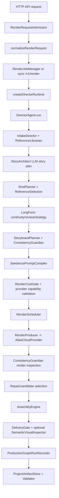
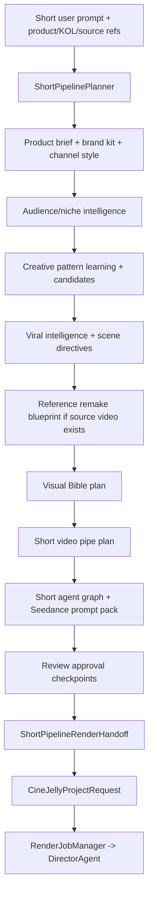

# CineJelly Seedance Ultimate Director - Bao Cao Kien Truc Backend

Ngay lap bao cao: 2026-06-29
Branch duoc phan tich: `codex/backend-audit-short-pipes`
Commit duoc phan tich: `16e11bf`
Pham vi: backend logic trong `src/api`, `src/application`, `src/agents`, `src/core`, `src/prompt_compiler`, `src/providers`, `src/config`, `src/types`. Bao cao nay khong dua vao README de suy doan; cac nhan xet ben duoi duoc rut ra tu code runtime va contract TypeScript.

## Tom Tat Dieu Hanh

Backend hien tai khong phai mot ham "prompt vao, video ra" don gian. He thong da duoc tach thanh nhieu tang: API/admission, short no-spend planning, long/director runtime, production graph, prompt compiler, render orchestration, provider Atlas Cloud, assembly, delivery gate, artifact validation.

Trung tam cua full render la `DirectorAgent`, con trung tam cua truy vet la `ProductionGraph`. Short pipeline la mot lop agentic planning rieng, tao ra plan co review gate va render handoff truoc khi di vao `DirectorAgent`.

Mac dinh model/provider mode khong bat user phai chon text-to-video, image-to-video hay reference-to-video. User chi nen chon cap chat luong/tier/cau hinh nhu `mini | fast | standard`, resolution, audio, duration. Backend tu router mode dua tren reference, visual bible, video pipe va prompt binding.

Hien tai backend da co nen tang rat manh cho:

- short video nhieu niche voi pattern learning, candidate scoring, viral/niche intelligence;
- Product/KOL UGC bang anh KOL + anh san pham;
- storyboard multishot;
- video remake theo cau truc/pacing/camera/acting beat cua video tham chieu, nhung thay KOL/san pham/background/audio/claims bang tai san user;
- long-form 2-10 phut bang cach chia thanh clip 4-15s, continuity bible, last-frame chaining, render schedule va assembly.

Nhung de goi la "commercial-grade 100%" theo nghia san xuat ban that, van can them bang chung van hanh thuc te: nhieu render live da duyet chat luong, audio paid/live, manual media review, live deployment, billing/operator approval, va bang chung provider resume/handoff tren traffic that.

---

# PHAN 1: Tong Quan Kien Truc Backend

## 1.1 Cac Layer Chinh

### API Layer

File chinh: `src/api/server.ts`

Trach nhiem:

- Nhan HTTP request.
- Auth, rate limit, concurrency, content-type, body size.
- Chia endpoint cho planning, UI contract backend, product-url research, render job, review job, admin diagnostics.
- Khong truc tiep goi provider Seedance neu request chua qua admission, review va billing gates.

Endpoint quan trong:

- `GET /health`
- `GET /v1/preflight`
- `GET /v1/validation-readiness`
- `GET /v1/render-settings`
- `GET /v1/short-pipeline/video-pipes`
- `POST /v1/short-pipeline/plan`
- `POST /v1/short-pipeline/ui-contract`
- `POST /v1/short-pipeline/product-url-plan`
- `POST /v1/short-pipeline/render-jobs`
- `POST /v1/render-jobs`
- `GET /v1/render-jobs`
- `GET /v1/render-jobs/:id`
- `POST /v1/render-jobs/:id/review`
- `DELETE /v1/render-jobs/:id`
- `POST /v1/render`
- `POST /v1/long-form/director-ui-contract`
- Operator/admin endpoints cho launch, billing, client policy, provider lease va Production Graph resume queue.

### Admission, Security, Billing, Quota Layer

Files chinh:

- `src/api/render-request-admission.ts`
- `src/application/render-request-normalizer.ts`
- `src/api/api-auth.ts`
- `src/api/api-rate-limit.ts`
- `src/api/api-concurrency-gate.ts`
- `src/api/api-client-policy.ts`
- `src/api/workspace-billing-policy.ts`

Trach nhiem:

- Chan request qua lon, sai schema, URL khong an toan, reference co token/signature/credential, local path leak.
- Normalize path output/work/artifact vao output root.
- Kiem tra `settings`, `modelPreferences`, metadata, caption/audio/transition/frame sampling/semantic inspection/source-video analysis.
- Gate chi phi, quota, billing, idempotency.

### Application/Factory Layer

File chinh: `src/application/director-factory.ts`

Trach nhiem:

- Load runtime config tu environment.
- Tao `AtlasCloudProvider`, `ProviderCostLedger`, `StoryArchitect`, `RenderProducer`, `RenderCostGate`, `SemanticVisualInspector`, `SourceVideoAutoAnalyzer`, material adapters, `AssemblyEngine`.
- Tra ve `DirectorRuntime` gom `DirectorAgent`, ledger va preflight.

### Agent/Application Orchestration Layer

Files chinh:

- `src/agents/director-agent.ts`
- `src/agents/intake-director.ts`
- `src/agents/story-architect.ts`
- `src/agents/render-producer.ts`
- `src/agents/source-video-analyst.ts`
- `src/agents/source-video-reference-metadata-enricher.ts`
- `src/agents/reference-librarian.ts`

Trach nhiem:

- Bien request thanh plan san xuat.
- Goi LLM de lap story plan.
- Tao shot contracts, storyboard, prompt, render, inspect, repair, assemble, delivery.
- Noi source-video analysis va references vao prompt/graph.

### Short Agentic Planning Layer

Files chinh:

- `src/core/short-pipeline-planner.ts`
- `src/core/short-pipeline-render-handoff.ts`
- `src/core/short-video-pipe-planner.ts`
- `src/core/short-viral-intelligence-planner.ts`
- `src/core/short-creative-pattern-learning.ts`
- `src/core/short-prompt-pattern-corpus.ts`
- `src/core/short-platform-template-corpus.ts`
- `src/core/short-agent-graph-planner.ts`
- `src/core/short-visual-bible-planner.ts`
- `src/core/short-director-planner.ts`
- `src/core/short-commercial-readiness-planner.ts`

Trach nhiem:

- No-spend planning truoc provider spend.
- Hieu niche, platform, product facts, KOL/product media reference, channel style, brand kit.
- Sinh candidate, scoring, viral strategy, scene directives, visual bible, video pipe, prompt pack, review checkpoints.
- Chuyen plan thanh `CineJellyProjectRequest` qua `buildShortPipelineRenderHandoff`.

### Domain/Core Layer

Files chinh:

- `src/core/production-graph.ts`
- `src/core/production-graph-builder.ts`
- `src/core/production-graph-run-recorder.ts`
- `src/core/consistency-guardian.ts`
- `src/core/render-scheduler.ts`
- `src/core/long-form-continuity-planner.ts`
- `src/core/long-form-agent-review-planner.ts`
- `src/core/long-form-timeline-planner.ts`
- `src/core/long-form-creative-intelligence-planner.ts`
- `src/core/long-form-readiness-planner.ts`
- `src/core/video-render-strategy-planner.ts`
- `src/core/assembly-engine.ts`
- `src/core/delivery-gate.ts`

Trach nhiem:

- Quan ly graph, continuity, scheduling, review, timeline, delivery validation.
- Kiem tra deterministic truoc va sau render.
- Tach planning va provider execution.

### Prompt Compiler Layer

Files chinh:

- `src/prompt_compiler/prompt-compiler.ts`
- `src/prompt_compiler/reference-binding.ts`
- `src/prompt_compiler/negative-constraints.ts`
- `src/prompt_compiler/repair-hints.ts`

Trach nhiem:

- Bien `ShotContract` thanh prompt Seedance va `VideoGenerationRequest`.
- Sap xep, cap va filter references theo vai tro.
- Tu chon provider mode: `text_to_video`, `image_to_video`, `reference_to_video`, `video_to_video`, `extend`, `edit`.
- Tao @ handles: `@image1`, `@video1`, `@audio1`.
- Them negative prompt, continuity, pacing, final-frame, source-video boundary, repair hints.

### Provider Layer

Files chinh:

- `src/providers/contracts.ts`
- `src/providers/atlascloud/atlas-cloud-provider.ts`
- `src/providers/atlascloud/atlas-cloud-http.ts`
- `src/providers/atlascloud/atlas-cloud-mappers.ts`
- `src/providers/capability-validator.ts`
- `src/providers/cost-ledger.ts`

Trach nhiem:

- Truu tuong hoa LLM, video provider, asset upload, audio provider.
- Atlas Cloud provider goi chat/structured LLM, video generation, prediction polling, asset registration, audio generation.
- Map payload Seedance/Atlas, capabilities, usage/cost ledger.

### Infrastructure, Artifact, Resume Layer

Files chinh:

- `src/core/project-artifact-store.ts`
- `src/core/project-artifact-validator.ts`
- `src/core/review-packet-builder.ts`
- `src/core/production-graph-resume-state.ts`
- `src/api/render-provider-handoff-lease-service.ts`
- `src/api/production-graph-resume-queue-service.ts`

Trach nhiem:

- Ghi artifact bundle, review packet, cost ledger, metadata, source-video analysis.
- Validate artifact contract.
- Tao resume capsule/queue dang digest, tranh serialize raw URL/local path/secret.
- Operator service cho provider handoff lease va resume queue.

## 1.2 Production Graph Dong Vai Tro Trung Tam Nhu The Nao

`ProductionGraph` khong phai la "planner" duy nhat. No la lop lineage/truy vet va repair propagation trung tam cua full render.

Lifecycle:

1. `DirectorAgent.run()` intake request.
2. Story/shot/storyboard/material plan duoc tao.
3. `ProductionGraphBuilder.build()` tao graph truoc render.
4. Render/test-take/candidates/repair/deliverable xong thi `ProductionGraphRunRecorder.record()` ghi them node ket qua.
5. Artifact store va review packet dung graph de chung minh lineage.

Node chinh:

- `project`
- `story_arc`
- `sequence`
- `scene`
- `beat`
- `storyboard_panel`
- `shot`
- `reference_asset`
- `reference_selection`
- `material_sourcing`
- `inspection_report`
- `clip_render`
- `repair_action`
- `deliverable`

Edge chinh:

- `depends_on`
- `transitions_to`
- `continues_identity`
- `continues_environment`
- `matches_motion`
- `requires_repair`

Repair propagation:

- `ProductionGraph.repairAffectedNodes()` di BFS qua `depends_on`, `transitions_to`, `requires_repair`.
- Neu mot shot/reference/inspection fail, graph co the xac dinh node downstream bi anh huong.

## 1.3 Cac Thanh Phan Cot Loi

### Production Graph

- Quan ly lineage, node/edge, dependency, transition va repair scope.
- Dam bao `depends_on` khong tao cycle.
- Giu data cho artifact validation, review packet, resume state.

### Consistency Guardian

File: `src/core/consistency-guardian.ts`

- Kiem tra storyboard coverage.
- Kiem tra shot duration 4-15s, subject/action/camera/lighting.
- Kiem tra references va prompt binding conflicts.
- Kiem tra prompt density, negative prompt, timeline.
- Kiem tra provider render status/output URL/latency.
- Tra ve status: `pass`, `warn`, `repair`, `rerender`, `block`.

### Prompt Compiler

File: `src/prompt_compiler/prompt-compiler.ts`

- Tao prompt co cau truc: reference prelude, mode contract, continuity, pacing, bridge, boundary, subject/action/camera/lighting/timeline/audio/final frame.
- Ho tro @ reference, first-frame, last-frame, source-video boundary.
- Output gom `CompiledPrompt`, `VideoGenerationRequest`, negative prompt, references, binding plan, repair hints.

### Render Orchestration

Files:

- `src/api/render-job-manager.ts`
- `src/core/render-scheduler.ts`
- `src/agents/render-producer.ts`
- `src/core/render-cost-gate.ts`

Chuc nang:

- Async queue, status polling, cancel, review resume.
- Candidate count theo quality mode.
- Test take neu quality khong phai economy.
- Repair attempts neu Guardian bao repair/rerender.
- Parallel chi khi shot khong co dependency/endpoint/source/risk.

### Chaining / Continuation

Files:

- `src/core/endpoint-frame-chain.ts`
- `src/agents/director-agent.ts`

Chuc nang:

- Khi strategy yeu cau/recommend last-frame chaining, shot sau se lay image sidecar cua shot truoc lam `first_frame`.
- Neu required ma provider khong tra last frame/image sidecar thi block.
- Prompt duoc compile lai sau khi inject first-frame reference.

### Source Video Analysis

Files:

- `src/agents/source-video-analyst.ts`
- `src/core/source-video-auto-analyzer.ts`
- `src/agents/source-video-reference-metadata-enricher.ts`

Chuc nang:

- Caller co the gui san `sourceVideoAnalysis`.
- Opt-in auto-analysis co the lay frame sample tu clean HTTPS source video, gui LLM structured JSON de lay beat map/pacing/camera/style.
- Enricher gan metadata source scene/shot/timeline vao references.
- Remake chi dung structure/pacing/camera/acting/audio energy, khong copy transcript/face/logo/music/brand marks.

## 1.4 Ho Tro Long-form 2-10 Phut

`settings.durationTargetSeconds` cho phep 15-480s theo `src/config/seedance-settings.ts`. Seedance clip don le van bi gioi han 4-15s, nen long-form duoc xu ly bang chunking:

- `StoryArchitect` tao story plan target duration.
- `ShotPlanner` chia thanh shot 4-15s.
- `LongFormSequencePlanner` gom scenes thanh sequence.
- `LongFormContinuityPlanner` tao continuity bible.
- `RenderScheduler` quyet dinh shot nao render parallel/sequential.
- `LongFormTimelinePlanner` tao timeline segment.
- `LongFormCreativeIntelligencePlanner` va `LongFormReadinessPlanner` cham coherence/repair queue.
- `AssemblyEngine` ghep clip thanh deliverable.

---

# PHAN 2: End-to-End Backend Pipeline

## Buoc 1: API Layer - Nhan Request

### Endpoint tao video

Co 3 duong chinh:

1. Short planning no-spend:
   - `POST /v1/short-pipeline/plan`
   - `POST /v1/short-pipeline/ui-contract`
   - `POST /v1/short-pipeline/product-url-plan`

2. Short render job:
   - `POST /v1/short-pipeline/render-jobs`
   - `POST /v1/short-pipeline/conversation-sessions/:id/render-jobs`

3. General render:
   - `POST /v1/render-jobs` cho async render.
   - `POST /v1/render` cho sync render.

### Request body chinh

`CineJellyProjectRequest` co cac truong quan trong:

- `userInput`: y tuong/brief.
- `settings`: tier, resolution, qualityMode, ratio, durationTargetSeconds, audioMode, bitrateMode, watermark, returnLastFrame, maxCostUsd.
- `modelPreferences`: optional `seedanceModelId`.
- `references`: PromptReference da normalize.
- `sourceVideoAnalysis`: optional SourceVideoDeconstruction.
- `captionCues`, `captionOptions`.
- `audioTracks`, `audioMixOptions`.
- `generatedAudioIntents`.
- `frameSamplingOptions`.
- `transitionSettings`.
- `semanticVisualInspectionOptions`.
- `metadata`.
- `outputPath`, `workDirectory`, `artifactDirectory`.

Short pipeline request co them:

- `projectId`, `requestId`.
- `userPrompt`.
- `targetPlatform`, `targetDurationSeconds`.
- `product` gom URL/snapshot.
- `brandKit`.
- `channelStyle`.
- `mediaReferences` gom KOL/product/background/source_video/audio.
- `visualBible`.
- `referenceVideoLearning`.
- `audio`.

### Validation

Trong `server.ts`:

- `assertJsonContentType()`.
- `readJsonBody()` gioi han bytes.
- auth/rate limit/chinh sach client.

Trong `RenderRequestAdmission.assertAcceptable()`:

- `userInput` bat buoc va gioi han length.
- settings validate bang `normalizeSeedanceSettings()`.
- model ID phai nam trong allowlist env neu override.
- references phai co `providerReference`.
- URI phai clean HTTPS hoac `asset://`.
- chan local path, localhost/private host, embedded credentials, secret query.
- source video analysis bi bound scenes/transcript/keyframes/notes.
- audio/caption/transition/frame sampling/semantic inspection deu duoc validate.

Trong `normalizeRenderRequest()`:

- set requestId vao metadata.
- resolve output/work/artifact directory.
- enforce path nam trong `CINEJELLY_OUTPUT_DIR`.

### Output sau validate

- Short no-spend: `ShortPipelinePlan`.
- Short render: `ShortPipelineRenderHandoff.request` la `CineJellyProjectRequest`.
- General render: normalized `CineJellyProjectRequest`.
- Async render: `RenderJobSummary` va `statusUrl`.

### Evidence / Logging

- API gan `requestId` vao response headers.
- Render job luu `stageProgressEvents`, provider checkpoint, cost ledger, artifact validation.
- Short plan co `noSpend`, `networkCallsMade`, `providerCallsMade`, `releaseGateSummary`.

## Buoc 2: Input Processing & Normalization

### Xu ly reference images/audio/video

`IntakeDirector` goi `ReferenceLibrarian.normalize()`:

- Role hop le: `identity`, `product`, `wardrobe`, `environment`, `motion`, `camera`, `audio_tempo`, `voice`, `style`, `first_frame`, `last_frame`, `source_video_structure`.
- Kind hop le: `image`, `video`, `audio`, `first_frame`, `last_frame`, `identity`, `product`, `environment`, `motion`, `camera`, `style`.
- Tu infer kind theo URL extension va role.
- Dedupe theo role/label/kind/uri.
- Sap xep theo thu tu role priority.
- Chan unsafe URI.

Short pipeline co `mediaReferencePlanFor()`:

- Nhan raw `ShortMediaReferenceInput`.
- Tao prompt tag `@image1`, `@video1`, `@audio1`.
- Doi role UI nhu `kol`, `creator`, `product`, `background`, `source_video` thanh prompt role.
- Danh dau `includeInProviderHandoff` chi khi URI/rights/provider policy san sang.
- Source video neu chua operator-approved/clean HTTPS thi dung planning-only.

### Source video

Co 3 muc:

1. User chi upload/gui source video:
   - Short planner tao `referenceVideoLearningFromSourceMedia()`.
   - Tao summary: hoc rhythm, acting beats, camera grammar, retention timing, audio energy, payoff shape.

2. User/caller gui `sourceVideoAnalysis`:
   - `SourceVideoAnalyst.normalize()` validate va cap du lieu.

3. Auto-analysis opt-in:
   - `SourceVideoAutoAnalyzer.prepareRequest()` tim reference role `source_video_structure`.
   - Chi nhan clean HTTPS, khong token/localhost.
   - `MediaInspector.sampleFrames()` lay frames.
   - LLM structured JSON tao scenes, keyframes, pacingNotes, styleNotes, structuralBeats, safetyNotes.
   - Normalize lai qua `SourceVideoAnalyst`.

### Output

- `IntakeResult`: userInput, projectId, settings, references, metadata, sourceVideoAnalysis.
- Short: `ShortPipelinePlan.mediaReferencePlan`, `referenceRemakeBlueprint`, `visualBiblePlan`.

### Evidence

- Hash URI thay vi expose raw URL trong nhieu metadata.
- Source pattern origins duoc gan trong short plan va corpora.
- Source-video auto-analysis cam leak data URL/local frame path.

## Buoc 3: Planning & Storyboard Generation

### Short planning

`ShortPipelinePlanner.buildPlan()` lam cac viec sau:

1. Clean prompt.
2. Extract product brief bang `ProductUrlBriefExtractor`.
3. Evaluate brand kit bang `BrandKitEvaluator`.
4. Evaluate channel style.
5. Infer intent: platform, duration, goal, audience, offer, aspect ratio.
6. Tao audio policy mac dinh voiceover/guided.
7. Tao visual text policy mac dinh no visible text.
8. Tao media reference plan.
9. Tao optional workflow template suggestions.
10. Tao concepts.
11. Tao preliminary scenes.
12. Chay `ShortViralIntelligencePlanner`.
13. Chay preliminary `ShortAgentGraphPlanner`.
14. Dung selected candidate de tao scenes cuoi.
15. Chay viral intelligence lan 2.
16. Tao `referenceRemakeBlueprint` neu co source video/reference learning.
17. Tao `ShortVisualBiblePlan`.
18. Tao final `ShortAgentGraph`.
19. Tao `seedanceRouting`.
20. Tao `ShortDirectorPlan`.
21. Tao `ShortVideoPipePlan`.
22. Tao review checkpoints.
23. Tao commercial readiness.

Short co 5 pipe:

- `smart_short`: y tuong ngan, it reference.
- `product_kol_ugc`: co KOL/product reference.
- `storyboard_multishot`: can full beginning/middle/end nhieu clip.
- `video_remake`: co source/trend/reference video.
- `production_bible`: 60-480s hoac can character/product/sequence bible.

### General/long planning

`DirectorAgent.run()`:

1. `StoryArchitect.plan()` goi LLM structured de tao `StoryPlan`.
2. `ContinuityLedgerBuilder.build()`.
3. `ShotPlanner.plan()` tao `ShotContract`.
4. `ReferenceSelectionPlanner.planForShots()`.
5. `LongFormContinuityPlanner.build()`.
6. `LongFormAgentReviewPlanner.build()`.
7. `VideoRenderStrategyPlanner.build()`.
8. `StoryboardPlanner.plan()`.
9. `ConsistencyGuardian.inspectStoryboard()`.
10. `StoryboardApprovalGate.evaluate()`.

### Storyboard va Shot Contract

`StoryboardPlanner` tao panel tu shot contracts. Guardian yeu cau:

- moi shot co panel;
- khong panel du thua/duplicate;
- duration khop shot;
- action/camera/lighting khop shot;
- references khop shot;
- transition intent khop shot.

### Production Graph

`ProductionGraphBuilder.build()` tao graph sau khi co intake, storyPlan, shots, storyboard, material sourcing.

Graph gom project -> story -> sequence -> scene -> beat -> storyboard_panel -> shot. References va material sourcing duoc noi vao shot.

### Source video enrich storyboard

Source video khong duoc copy truc tiep vao storyboard. No di qua:

- source analysis;
- reference metadata enricher;
- continuity anchors;
- prompt/source-video boundary;
- remake blueprint;
- render strategy.

## Buoc 4: Prompt Compilation

### Input

`SeedancePromptCompiler.compile()` nhan:

- `shot`
- `settings`
- `modelId`
- `provider`
- `providerSupportedReferenceKinds`
- optional max provider references.

### Xu ly chinh

1. Chon references:
   - uu tien `shot.referenceSelectionPlan.selectedReferences`;
   - fallback `shot.references`.

2. `buildPromptBindingPlan()`:
   - sort theo role priority;
   - filter duplicate;
   - filter unsupported provider kind;
   - source_video_structure planning-only neu chua `selection.authorized === true` hoac chua co provider capability;
   - cap tong provider refs mac dinh 8;
   - cap family Atlas: image 9, video 3, audio 3;
   - tao conflicts va roleScopes.

3. Resolve provider mode:
   - khong reference -> `text_to_video`.
   - image/identity/product/first_frame/last_frame -> `image_to_video`.
   - video/source_video_structure/motion/camera/audio/style -> `reference_to_video`.

4. Build prompt:
   - provider reference handles;
   - Atlas aliases;
   - provider mode contract;
   - continuity;
   - pacing;
   - motion continuity;
   - inter-shot bridge;
   - boundary choreography;
   - subject/action/camera/lighting/style/timeline/audio/transition;
   - final-frame contract.

5. Build negative prompt:
   - no watermark, no subtitles/captions neu khong request;
   - no fake UI text;
   - no flicker/static product pose;
   - no copied source face/transcript/music/logo/watermark neu co source video.

### Ho tro @ reference, first_frame, multi-shot, continuation

Co ho tro:

- `@imageN`, `@videoN`, `@audioN`.
- first-frame/last-frame refs.
- source video refs chi dung structure.
- inter-shot bridge.
- final-frame contract.
- last-frame chaining se recompile prompt o buoc render neu can.

### Output

`CompiledPrompt` gom:

- `prompt`
- `negativePrompt`
- `references`
- `bindingPlan`
- `inspectionExpectations`
- `repairHints`
- `videoRequest`

## Buoc 5: Render Job Creation & Execution

### Async render job

`RenderJobManager.submit()`:

- Kiem tra idempotency.
- Evaluate pre-render review approval.
- Neu can review thi status `paused_for_review` hoac `paused_for_revision`.
- Neu reject thi `rejected`.
- Neu pass thi `queued`.
- `pumpQueue()` chay theo maxConcurrent.

`runJob()`:

- Tao runtime qua `createDirectorRuntime()`.
- Goi `runtime.director.run()`.
- Ghi artifact bundle.
- Validate artifact.
- Update result/cost/provider checkpoint.

### Candidate generation

Theo `qualityMode`:

- `economy`: 1 candidate, 0 repair, khong test take.
- `standard`: 2 candidates, 1 repair, co test take.
- `high`: 3 candidates, 2 repairs, co test take.
- `ultimate`: 4 candidates, 3 repairs, co test take.

`DirectorAgent.renderShot()`:

1. optional test take 4s.
2. neu test take repair thi compile repair prompt.
3. render candidates.
4. chon best candidate theo Guardian status/severity/output/latency/index.
5. repair attempts neu selected candidate can repair/rerender.

### Tier/model selection

`resolveSeedanceModelId()`:

- Neu `modelPreferences.seedanceModelId` co va nam trong allowlist: dung model do.
- Tier `mini`: dung `ATLASCLOUD_SEEDANCE_MINI_MODEL` neu co, neu khong tim capability mini, fallback fast.
- Tier `fast`: dung fast model.
- Tier `standard`: dung standard model.

User khong can chon provider mode. Backend chon mode theo references/prompt compiler.

### Atlas Cloud / Seedance call

`RenderProducer.render()`:

- validate capability.
- prepare/register video/audio references neu can.
- submit qua provider method theo mode.
- wait prediction neu async.
- block neu succeeded ma khong co output URL.

`AtlasCloudProvider.toAtlasVideoPayload()` tao:

- `model`
- `prompt`
- `negative_prompt`
- `duration`
- `fps: 24`
- `resolution`
- `bitrate_mode`
- dimensions/ratio
- `mode`
- `image`, `image_url`
- `last_image`, `image_end`, `last_image_url`, `end_image_url`
- `video`, `video_url`
- `audio`, `audio_url`
- `reference_images` toi da 9
- `reference_videos` toi da 3
- `reference_audios` toi da 3
- `references`
- `generate_audio`
- `watermark`
- `return_last_frame`
- `metadata`

### Evidence

- `ProviderCostLedger` ghi provider operations.
- `RenderJobProviderCheckpoint` ghi operation count, provider, prediction IDs, asset IDs, retry count.
- `ProductionGraphRunRecorder` ghi clip render, inspection, repair, deliverable.

## Buoc 6: Inspection & Consistency Check

### Guardian checks

Storyboard:

- coverage;
- unknown shot;
- missing panel;
- duplicate;
- panel count;
- order;
- duration;
- completeness;
- action/camera/lighting alignment;
- reference alignment;
- transition alignment;
- inspection focus.

Preflight:

- duration 4-15s;
- subject/action/camera/lighting non-empty;
- references bat buoc theo risk;
- binding conflicts;
- continuity ledger;
- prompt density;
- negative prompt density;
- timeline bounds.

Render:

- provider status;
- output presence;
- latency warning.

### Visual inspection thuc te

Co optional `SemanticVisualInspector`:

- Can `frameSamplingOptions` va `semanticVisualInspectionOptions.enabled`.
- `MediaInspector.sampleFrames()` lay frames tu deliverable.
- Multimodal LLM inspect theo expectations.

Mac dinh deterministic Guardian khong "nhin" video pixel tung frame. No check provider response va ffprobe delivery. Visual semantic QA la optional.

### Pass / repair / rerender / block

- `pass`: tiep tuc.
- `warn`: ghi nhan, van tiep tuc.
- `repair`: compile repair prompt neu o test-take/candidate stage.
- `rerender`: render lai shot trong repair attempts.
- `block`: dung pipeline.

### Evidence

- `GuardianReport` co nodeId, stage, status, findings, repairScope, affectedNodeIds, sourceCheckpoints, recommendedNextStep.
- Stage progress ghi status theo stage.

## Buoc 7: Repair & Re-render Flow

Khi can repair:

1. Guardian tao finding va repair directive.
2. `DirectorAgent.compileTestTakeRepair()` hoac `compileRepairAttempt()` noi repair block vao prompt.
3. Chi shot dang fail duoc rerender.
4. Candidates moi duoc inspect lai.
5. Best candidate duoc chon.
6. `ProductionGraphRunRecorder` ghi repair_action va inspection.

Repair khong tu dong rebuild toan bo story neu loi nam o story/graph/storyboard/preflight. Cac loi planning do bi block som va yeu cau regenerate/approve truoc provider spend.

## Buoc 8: Chaining / Continuation Long-form

### Render schedule

`RenderScheduler` chia batch:

- Parallel neu shot khong co endpoint/source/risk/transition dependency.
- Sequential neu:
  - co first/last frame;
  - co source_video_structure;
  - co source timeline selection;
  - co continuity endpoint;
  - co risks;
  - transition intent can bridge;
  - strategy yeu cau reference lock/source video/sequence bible/last-frame chaining/manual storyboard.

### Last-frame chaining

`prepareChainedRenderItem()`:

1. Neu plan khong can chaining: dung prompt da compile.
2. Neu shot dau tien: dung prompt da compile.
3. Neu shot sau:
   - lay `previousRenderedShot`;
   - `selectLastFrameReference()` tim image sidecar/final frame;
   - inject reference nay vao shot moi voi role `first_frame`;
   - xoa first_frame cu;
   - set metadata `chainedFromShotId`, `chainReferenceRole`, `chainReferenceUrlSha256`;
   - compile prompt lai;
   - preflight lai.

Neu chaining required ma khong co image sidecar: throw error truoc provider spend cho shot sau.

## Buoc 9: Assembly & Post-production

### Assembly

File: `src/core/assembly-engine.ts`

Dieu kien:

- Co `outputPath`, `workDirectory`, va renderedShots.

Flow:

1. Kiem tra ffmpeg/ffprobe.
2. Materialize remote/local clips.
3. Tao concat list.
4. Neu nhieu clip va transition enabled: dung `TransitionEngine`.
5. Neu khong: ffmpeg concat copy.
6. Postproduction polish neu enabled.
7. Caption burn-in neu `captionOptions.enabled && burnIn`.
8. Audio mix neu co audio tracks.
9. ffprobe final output.
10. sample frames neu request.
11. tinh output byte size va SHA-256.

### Transition

`TransitionEngine`:

- normalize canvas, fps, pixel format;
- dung `xfade`;
- preserve audio bang `acrossfade`;
- fill silence neu clip thieu audio;
- auto chon fade/hblur/wipe/slide/... theo transition intent.

### Audio

Audio co 3 nhom:

- provider native/guided trong Seedance payload: `generate_audio`.
- generated audio intents qua Atlas audio provider neu capability/env san sang.
- audio tracks user/provided cho `AudioMixEngine`.

Short handoff mac dinh:

- `audioPolicy.mode = voiceover`;
- `renderAudioMode = guided`;
- `generatedAudioIntentEnabled = true`;
- `nativeProviderAudioEnabled = false`;
- caption burn-in mac dinh false.

### Delivery validation

`DeliveryGate.evaluate()`:

- video stream presence;
- resolution height;
- aspect ratio tolerance;
- duration drift warn/block;
- audio presence warning neu audio mode khac none ma deliverable khong co audio.

## Buoc 10: Delivery & Artifact Generation

### Final output

`DirectorRunResult` gom:

- projectId;
- storyPlan;
- storyboard;
- storyboardPreflight;
- productionGraph;
- longFormContinuityPlan;
- longFormAgentReview;
- videoRenderStrategyPlan;
- longFormTimelinePlan;
- longFormCreativeIntelligencePlan;
- longFormReadinessPlan;
- materialSourcingPlan;
- materialSourceValidation;
- postproductionAssetPlan;
- generatedAudioOutputBatchValidation;
- renderSchedulePlan;
- stagePlan;
- costEstimate;
- compiledPrompts;
- renderedShots;
- deliverable;
- deliveryGate;
- semanticVisualInspection.

### Artifacts

`ProjectArtifactStore` ghi:

- director result summary;
- production graph;
- compiled prompts;
- rendered shots;
- cost ledger;
- review packet;
- source-video analysis neu co;
- delivery metadata;
- validation reports.

`ProjectArtifactValidator` validate artifact contract, graph structure, source-video presence, long-form plans, provider evidence, delivery fields.

### Hash, provenance

- Deliverable co `outputSha256`.
- Source URLs thuong duoc hash/redact trong metadata.
- Resume state chi luu digest, khong luu raw graph/provider payload/output URLs/local paths/secret-like text.

---

# PHAN 3: Chi Tiet Cac Thanh Phan Cot Loi

## 3.1 Production Graph

Files:

- `src/core/production-graph.ts`
- `src/core/production-graph-builder.ts`
- `src/core/production-graph-run-recorder.ts`
- `src/core/production-graph-resume-state.ts`

### Cau truc

`ProductionGraph` dung Map nodes/edges. Moi node co `id`, `type`, `data`, `createdAt`, `updatedAt`.

`addNode()` chan duplicate node ID.
`addEdge()` yeu cau source/target ton tai.
`assertAcyclicForDependency()` chan cycle cho `depends_on`.

### Dependency

Graph the hien:

- project sinh story;
- story sinh sequence;
- sequence sinh scene;
- scene sinh beat;
- beat sinh storyboard/shot;
- reference/material noi vao shot;
- shot noi voi shot tiep theo bang `transitions_to`.

### Repair propagation

`repairAffectedNodes()` bat dau tu node fail va di qua:

- `depends_on`
- `transitions_to`
- `requires_repair`

Dung de xac dinh node nao can review/rerender/repair.

### Resume state

`production-graph-resume-state.ts` tao resume capsule dang digest:

- hash prediction IDs;
- count provider work;
- khong serialize raw graph state;
- khong serialize output URLs/local paths/secrets.

Day la nen tang an toan cho resume/handoff, nhung de thanh distributed resume runtime day du can evidence van hanh tren deployment.

## 3.2 Consistency Guardian

File: `src/core/consistency-guardian.ts`

Guardian la deterministic QA truoc khi dung semantic/video QA.

Strength:

- Bat loi schema/storyboard/prompt/reference truoc provider spend.
- Tao repair directive ro rang.
- Co stage/status/severity.

Limit:

- Render inspection mac dinh chi dua tren provider status/output/latency.
- Khong tu dong xem toan bo video bang pixel-level neu khong bat semantic visual inspection va frame sampling.

## 3.3 Prompt Compiler

Files:

- `src/prompt_compiler/prompt-compiler.ts`
- `src/prompt_compiler/reference-binding.ts`

### Reference ordering

Thu tu role:

1. identity
2. product
3. wardrobe
4. first_frame
5. last_frame
6. environment
7. motion
8. camera
9. audio_tempo
10. voice
11. style
12. source_video_structure

Y nghia:

- KOL/product/endpoint duoc khoa truoc.
- Style/camera/source video chi la huong dan sau.

### Provider reference cap

- Tong default: 8 provider refs.
- Family cap Atlas:
  - image: 9
  - video: 3
  - audio: 3

### Prompt structure

Prompt co cac contract:

- Seedance mode contract.
- Reference tag syntax.
- Identity/product/source-video/audio boundaries.
- Continuity.
- Pacing.
- Motion continuity.
- Inter-shot bridge.
- Final-frame contract.

Day la phan giup prompt khong bi "thieu mo bai/than bai/ket bai" cho tung shot.

## 3.4 Render Orchestration

### Job scheduling

`RenderJobManager` la queue in-process:

- queued/running/paused_for_review/paused_for_revision/blocked/succeeded/failed/canceled/rejected.
- idempotency replay.
- review resume.
- provider checkpoint.
- history restore compact.

### Render schedule

`RenderScheduler` chi parallel khi an toan. Neu long-form/reference/source/video/remake can continuity thi render sequential.

### Candidate selection

`DirectorAgent.selectBestCandidate()` chon output dua tren:

- Guardian status;
- severity;
- output presence;
- latency;
- candidate index.

### Cost gate

`RenderCostGate` uoc luong chi phi truoc render dua tren compiled prompts/settings/test take. Neu vuot `maxCostUsd` thi block.

## 3.5 Chaining / Continuity Logic

Co 3 cap continuity:

1. Planning continuity:
   - `ContinuityLedgerBuilder`
   - `LongFormContinuityPlanner`
   - `LongFormReadinessPlanner`

2. Prompt continuity:
   - Prompt compiler them prior/next endpoint, screen direction, camera momentum, final frame.

3. Render continuity:
   - last-frame image sidecar cua shot truoc thanh first-frame reference cua shot sau.

Voi Seedance, day la cach dung model 4-15s de tao video dai hon ma van co identity/product continuity.

## 3.6 Source Video Analysis

### Source-video trong short

`referenceRemakeBlueprintFor()` tao:

- mode: `structure_remake` hoac `rights_cleared_close_remake`;
- sourceSafetyStatus;
- fidelityTarget;
- lockedElements;
- adherenceTargets;
- sourceBeatMap;
- providerExecutionPlan;
- remakeGuardrails;
- replacementSlots.

Important:

- Neu user noi copy/clone 100% ma chua rights-cleared, status se `review_required`.
- Pipeline chi hoc structure/pacing/camera/acting/audio energy.
- KOL/product/background/audio/script/claims/CTA phai thay bang input user.

### Source-video trong full DirectorAgent

Source analysis anh huong:

- reference selection metadata;
- continuity anchors;
- render strategy;
- scheduler sequential reasons;
- prompt boundary;
- review packet;
- artifact validation.

---

# PHAN 4: Data Flow & Interaction

## 4.1 Main Full Render Flow

## 4.2 Short Pipeline Flow

## 4.3 Evidence va Lineage

Evidence duoc duy tri qua:

- `requestId` API context.
- `metadata` trong render request.
- `sourcePatternOrigins` trong short/long planning.
- `ProviderCostLedger`.
- `RenderJobProviderCheckpoint`.
- `GuardianReport`.
- `ProductionGraph`.
- `ProjectArtifactBundle`.
- `ReviewPacketBuilder`.
- `outputSha256`.

## 4.4 Mapping User Input Thuc Te

### Vi du 1: User nhap anh KOL + anh serum

1. Short media refs:
   - KOL -> role `identity`, provider kind image.
   - serum -> role `product`, provider kind image.
2. `ShortVideoPipePlanner` chon `product_kol_ugc`.
3. `ShortVisualBiblePlanner` recommend product/KOL reference pipe, co the tao identity_sheet/product_sheet neu can.
4. `ShortCreativePatternLearningEngine` retrieve beauty_skincare/UGC/proof diary/sensory closeup/before-after guarded patterns.
5. Scenes co hook, problem, demo/proof, payoff.
6. Handoff prompt nhan manh:
   - product geometry;
   - KOL identity;
   - natural UGC performance;
   - no visible text;
   - guided voiceover;
   - claim-safe before/after neu co.
7. Prompt compiler chon `image_to_video` hoac `reference_to_video` tuy refs.
8. Render nhieu candidates theo quality mode.

### Vi du 2: User upload video TikTok hay va muon lam bang KOL/san pham minh

1. Source video -> `source_video_structure`.
2. Short planner tao `referenceVideoLearning`.
3. Viral planner tao `referenceVideoPattern`.
4. `referenceRemakeBlueprint` tao source beat map.
5. Pipe chon `video_remake`.
6. Prompt va handoff:
   - bam hook job, pacing, cut density, camera grammar, acting rhythm, payoff timing;
   - thay KOL/product/background/audio/claims/CTA;
   - khong copy transcript, music, face, watermark, captions, logos.
7. Source video chi provider handoff neu rights/operator approved va clean HTTPS.

### Vi du 3: User muon video dai 3 phut brand/product story

1. Duration > 60s -> visual bible recommend `production_bible`.
2. Short pipe hoac general DirectorAgent se chia thanh multiple clips 4-15s.
3. Long-form planners tao sequence, bridge, timeline, readiness.
4. Scheduler sequential neu can last-frame/source/reference lock.
5. AssemblyEngine ghep thanh deliverable.

---

# PHAN 5: Danh Gia & Nhan Xet

## 5.1 Diem Manh

1. Kien truc layer ro rang

API, admission, planning, prompt compiler, provider, assembly, artifact validation tach nhau tot. Dieu nay giup scale va test tung phan.

2. Short backend da agentic hon template cung

Short khong chi co 7 template co dinh. No co:

- audience/niche intelligence;
- prompt corpus 3817 snapshot declared, runtime patterns va 42 taxonomy families;
- platform template corpus 48 niche families;
- candidate factory;
- critique council;
- repair actions;
- visual bible;
- video pipe planner;
- Seedance prompt pack.

3. Reference discipline kha chat

KOL/product/first/last frame duoc uu tien hon style/source video. Source video khong duoc de overwrite identity/product.

4. Long-form foundation tot

Da co continuity bible, sequence bridges, render scheduling, timeline, readiness scoring, delivery gate va graph lineage.

5. Atlas Cloud integration co capability validation

Provider payload map ro, co capabilities, polling fallback, cost ledger, upload/register asset, generated audio capability.

6. Review va no-spend gates nghiem ngat

Short plan, pipe catalog, UI contract, viral intelligence, long-director UI contract deu no-spend truoc. Provider spend can approval/cost/billing/admission.

## 5.2 Diem Yeu / Gap Lon Khi Scale 5-10 Phut

1. Visual semantic inspection chua mac dinh bat buoc

Neu khong bat `semanticVisualInspectionOptions` va `frameSamplingOptions`, he thong khong tu xem noi dung video cuoi bang multimodal QA. Guardian deterministic chi bat provider status/output/ffprobe.

2. Source-video auto-analysis con opt-in

Auto-analysis co san, nhung default runtime phu thuoc env. No lay frame va LLM beat-map, chua thay audio transcription automatic full trong code duoc doc. Neu user muon remake sat rhythm/audio, nen co live media QA/audio beat extraction rieng.

3. Long-form 5-10 phut co chi phi va thoi gian cao

480s voi clip 4-15s co the tao 32-120 shots tuy planning. Neu quality standard/high/ultimate thi candidates/test-takes nhan chi phi len lon.

4. Resume/distributed provider handoff la foundation, chua phai bang chung live

Code co resume capsule/queue/lease service, nhung commercial readiness can bang chung tren deployment/provider interruptions thuc te.

5. Audio commercial polish chua du bang chung

Generated audio/audio mix co code, nhung can live paid generated-audio evidence, voice library/capability config, manual audio review.

6. Product/legal/rights proof van can human/operator

Pipeline co guardrail, nhung khong tu bien video reference/source public thanh rights-cleared. Close remake can approval.

## 5.3 Nhung Phan Can Cai Thien De Thanh Commercial-grade Long-form Pipeline

Uu tien cao:

1. Bat buoc artifact-bound media QA cho moi render thuong mai:
   - frame sampling;
   - semantic visual inspection;
   - audio presence/loudness;
   - identity/product drift checklist;
   - manual review packet.

2. Source-video analysis nang cao:
   - audio tempo/beat extraction;
   - transcript/OCR/caption detection neu duoc phep;
   - shot boundary detection;
   - motion/camera map thanh shot constraints.

3. Resume live:
   - persist graph/job state day du hon;
   - resume failed/interrupted provider predictions;
   - idempotent provider handoff replay.

4. Commercial budget UX/backend:
   - pre-render cost simulation theo candidate/test-take/repair;
   - workspace approval cho maxCostUsd;
   - spend ledger theo client/project.

5. Long-form final QA:
   - full timeline audio continuity;
   - scene-to-scene semantic continuity;
   - pacing review theo 2-10 phut;
   - delivery variants.

## 5.4 Muc Do Hoan Thien Theo Backend Code Hien Tai

Danh gia nay la theo code architecture va no-spend/backend evidence, khong phai bao dam commercial traffic 100%.

- API/admission/security/job orchestration: khoang 90-93%.
- Short no-spend planning + render handoff: khoang 88-92%.
- Prompt compiler/reference binding/Seedance mode routing: khoang 90-93%.
- Atlas provider integration: khoang 85-90% ve code contract, can them live provider evidence nhieu niche.
- Production Graph/artifact validation: khoang 85-90%.
- Long-form planning/continuity/readiness: khoang 80-86%.
- Assembly/post-production/delivery gate: khoang 78-84%.
- Semantic visual/media QA commercial: khoang 70-78% vi optional va can evidence live/manual.
- Commercial readiness toan he thong: khoang 65-75% neu tinh ca billing, deployment, provider resume, manual review, paid audio/media evidence.

## 5.5 Ket Luan

Backend hien tai da la mot agentic production pipeline nghiem tuc, khong phai script-to-video template engine don gian. Diem manh nhat nam o:

- short niche intelligence;
- creative pattern learning;
- reference/video-remake guardrails;
- Seedance prompt compiler;
- long-form continuity/readiness;
- render/job/artifact gates.

Neu chi xet backend code, he thong da san sang de build UI MVP va chay render co kiem soat. Neu xet muc tieu "Topview/Higgsfield-level commercial platform", diem con thieu khong nam chu yeu o viec code them template, ma o bang chung van hanh thuc te: live media QA, paid audio, manual review, deployment, billing, provider resume va nhieu render benchmark theo niche.
